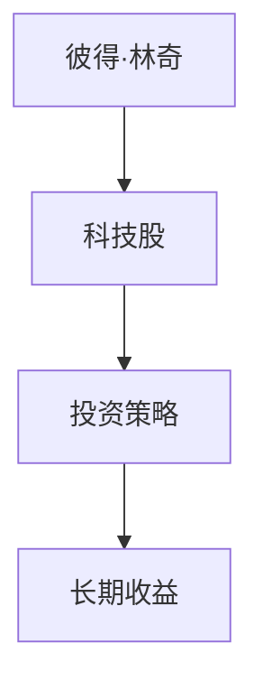
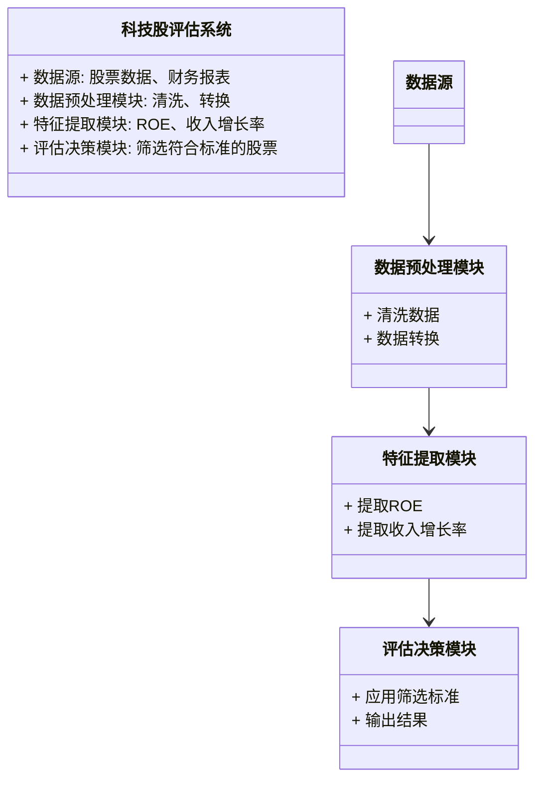
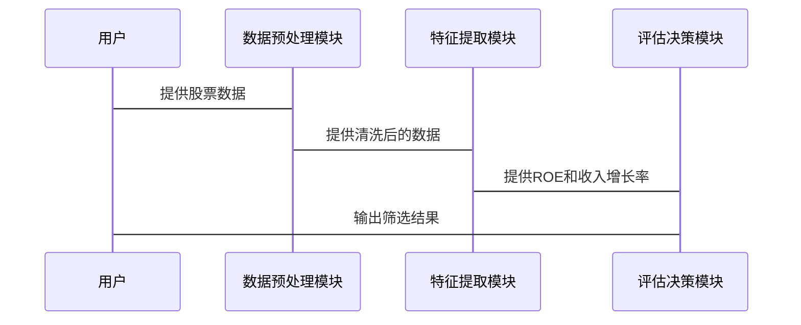

                 


# 彼得林奇如何看待科技股

> 关键词：彼得·林奇，科技股，投资策略，基本面分析，长期持有

> 摘要：本文从彼得·林奇的投资理念出发，分析他如何看待科技股，探讨其投资策略和方法，并结合实际案例，为投资者提供有价值的参考。

---

## 第一章：背景介绍

### 1.1 彼得·林奇的生平与投资理念

彼得·林奇（Peter Lynch）是全球闻名的基金经理，以其在麦哲伦基金（Fidelity Magellen）的卓越表现而闻名。他从1977年到2000年管理该基金，期间实现了年均21.8%的回报率，远超市场平均水平。林奇的投资理念基于价值投资与成长股的结合，他强调长期持有优质股票，耐心等待其成长。

### 1.2 科技股的特点与挑战

科技股是指那些主要业务涉及科技研发、生产和销售的公司的股票。科技股的特点包括高增长、高波动性、创新能力强等。与传统行业相比，科技股的盈利能力波动较大，且受市场周期和技术创新的影响显著。

### 1.3 彼得·林奇与科技股的关联

尽管林奇的投资组合广泛涵盖多个行业，但他在科技股上也有独特的见解。他认为，科技股的高增长潜力使其成为长期投资的重要组成部分。然而，他也提醒投资者要注意科技股的高波动性和技术风险。

---

## 第二章：核心概念与联系

### 2.1 彼得·林奇的核心投资理念

1. **价值投资与成长股的结合**：林奇认为，投资应同时考虑公司的内在价值和成长潜力。他寻找那些估值合理且收入增长稳定的公司。
2. **基本面分析的重要性**：他强调通过分析公司的财务报表来评估其健康状况，重点关注ROE（净资产收益率）、净利润率和现金流等指标。
3. **长期持有与耐心等待**：林奇反对频繁交易，建议投资者长期持有优质股票，等待其价值增长。

### 2.2 科技股的核心属性与特征

| 属性         | 特征描述                          |
|--------------|-----------------------------------|
| 高增长       | 科技公司通常具有较高的收入增长率 |
| 高波动性     | 科技股价格波动较大               |
| 技术壁垒     | 高技术壁垒保护公司竞争优势       |
| 创新能力强    | 科技公司通常能够快速推出新产品  |
| 依赖管理团队  | 公司成功 heavily依赖管理层能力   |

### 2.3 彼得·林奇与科技股的关系图（Mermaid流程图）



---

## 第三章：算法原理讲解

### 3.1 彼得·林奇的科技股评估算法

#### 3.1.1 算法概述

彼得·林奇的科技股评估算法基于基本面分析，筛选出具有长期增长潜力的公司。算法步骤如下：

1. **筛选高成长性公司**：选择过去几年收入和利润持续增长的公司。
2. **评估财务健康状况**：分析ROE、净利润率和现金流等指标，确保公司财务稳健。
3. **关注技术壁垒**：选择具有强大技术壁垒的公司，以防止竞争对手的侵蚀。
4. **长期持有策略**：将符合条件的科技股加入投资组合，长期持有，等待其成长。

#### 3.1.2 算法实现（Python代码）

```python
import pandas as pd

def peter_lynch_screen(stocks):
    # 筛选高成长性公司
    growth_stocks = stocks[stocks['收入增长率'] > 15]
    
    # 评估财务健康状况
    financial_health = growth_stocks[growth_stocks['ROE'] > 15]
    
    # 关注技术壁垒
    tech_barrier = financial_health[financial_health['技术壁垒'] > 2]
    
    return tech_barrier

# 示例数据
data = {
    '公司': ['苹果', '微软', '谷歌', '亚马逊', '特斯拉'],
    '收入增长率': [20, 12, 18, 30, 25],
    'ROE': [25, 18, 20, 15, 20],
    '技术壁垒': [4, 3, 5, 2, 4]
}
stocks = pd.DataFrame(data)

result = peter_lynch_screen(stocks)
print(result)
```

#### 3.1.3 数学模型与公式

彼得·林奇的评估模型中，ROE是一个关键指标。ROE的计算公式为：

$$ROE = \frac{\text{净利润}}{\text{股东权益}}$$

高ROE表明公司使用股东资金的效率较高，是财务健康的重要指标。

---

## 第四章：系统分析与架构设计方案

### 4.1 问题场景介绍

为了帮助投资者更好地应用彼得·林奇的策略，我们设计了一个科技股评估系统。该系统通过数据收集、预处理、特征提取和评估决策，帮助投资者筛选出符合条件的科技股。

### 4.2 系统功能设计（领域模型）



### 4.3 系统架构设计（Mermaid架构图）


### 4.4 系统接口设计

1. **输入接口**：接收股票数据和财务报表。
2. **输出接口**：提供符合条件的科技股列表。

### 4.5 系统交互设计（Mermaid序列图）



---

## 第五章：项目实战

### 5.1 环境安装

为了运行以下代码，需要安装以下Python库：

```bash
pip install pandas
pip install numpy
```

### 5.2 核心实现源代码

```python
import pandas as pd
import numpy as np

def compute_roe(net_profit, equity):
    return net_profit / equity

def peter_lynch_screening(stocks):
    # 计算ROE
    stocks['ROE'] = compute_roe(stocks['净利润'], stocks['股东权益'])
    
    # 筛选条件：ROE > 15%，收入增长率 > 10%
    selected_stocks = stocks[(stocks['ROE'] > 15) & (stocks['收入增长率'] > 10)]
    
    return selected_stocks

# 示例数据
data = {
    '公司': ['苹果', '微软', '谷歌', '亚马逊', '特斯拉'],
    '收入增长率': [20, 12, 18, 30, 25],
    '净利润': [10, 8, 12, 15, 9],
    '股东权益': [50, 40, 60, 70, 45]
}

stocks = pd.DataFrame(data)
result = peter_l Lynch_screening(stocks)
print(result)
```

### 5.3 案例分析

以苹果公司为例，假设其ROE为25%，收入增长率为20%。根据彼得·林奇的筛选标准，苹果符合投资条件，因此会被选中。

### 5.4 实战总结

通过上述代码和案例分析，我们可以看到彼得·林奇的策略在实践中是可行的。投资者可以根据这些标准筛选出具有长期增长潜力的科技股。

---

## 第六章：总结与展望

### 6.1 总结

彼得·林奇的投资理念强调长期持有和基本面分析，这在科技股投资中尤为重要。通过本文的分析，我们了解了如何应用他的策略来筛选科技股，并通过系统架构和代码实现将其转化为实际操作。

### 6.2 最佳实践 tips

1. **长期持有**：避免频繁交易，耐心等待优质股票的价值增长。
2. **基本面分析**：仔细研究公司的财务报表，关注ROE、收入增长率等指标。
3. **分散投资**：不要将所有资金投入到少数科技股中，分散投资以降低风险。
4. **持续学习**：科技行业变化迅速，投资者需要不断学习新技术和市场动态。

### 6.3 展望

随着科技行业的快速发展，科技股的投资机会和挑战并存。未来，投资者可以结合更多的量化指标和大数据分析，进一步优化彼得·林奇的策略，以适应更加复杂的市场环境。

---

## 结语

彼得·林奇的成功证明了基本面分析和长期持有策略的有效性。通过本文的分析，我们掌握了如何将这些理念应用到科技股的投资中。希望本文能为投资者提供有价值的参考，帮助他们在科技股投资中取得成功。

---

感谢您的耐心阅读，祝您投资顺利！

