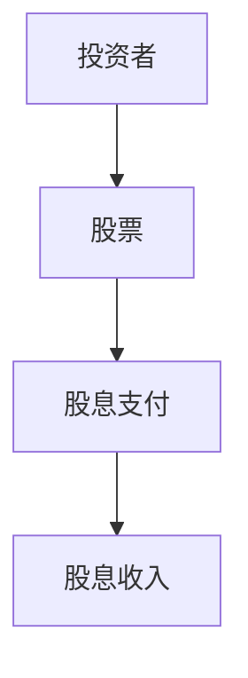
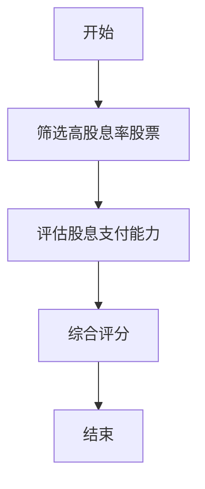

                 

# 彼得·林奇如何看待股息投资

## 关键词：
- 股息投资
- 彼得·林奇
- 股息率
- 股息支付率
- 股票投资

## 摘要：
本文深入探讨了股息投资这一投资策略，特别是分析了著名基金经理彼得·林奇在其投资生涯中如何运用股息投资理念来实现长期收益。文章详细介绍了股息投资的核心概念、数学模型、算法原理以及实际应用，并通过系统架构和项目实战展示了如何基于彼得·林奇的策略构建股息投资组合。此外，文章还提供了最佳实践建议和风险管理策略，帮助投资者更好地理解和应用股息投资。

---

## 第一部分：股息投资与彼得·林奇的投资理念

### 第1章：股息投资的背景与核心概念

#### 1.1 股息投资的基本概念

##### 1.1.1 股息的定义与分类
股息是公司向股东分配的利润部分，通常以每股形式发放。股息可以是现金、股票或其他资产。根据支付方式，股息分为定期股息和特殊股息；根据支付频率，股息分为月度股息、季度股息和年度股息。

##### 1.1.2 股息投资的核心要素
- **股息率**：衡量股票股息与股价的比率，计算公式为：$$\text{股息率} = \frac{\text{每股股息}}{\text{股价}} \times 100\%$$
- **股息支付率**：衡量公司支付股息的能力，计算公式为：$$\text{股息支付率} = \frac{\text{股息总额}}{\text{净利润}} \times 100\%$$
- **股息增长潜力**：公司未来股息增长的可能性，通常与公司盈利能力、行业地位和管理层战略相关。

##### 1.1.3 股息投资与整体投资策略的关系
股息投资是一种长期投资策略，通过投资高股息率的股票，投资者可以获得稳定的现金流，同时在股票价格上涨时获得资本收益。股息投资可以作为整体投资组合的一部分，与其他投资策略（如成长股投资）结合使用。

#### 1.2 彼得·林奇的投资理念

##### 1.2.1 彼得·林奇的个人背景与投资风格
彼得·林奇是美国著名基金经理，曾管理富达麦哲伦基金，创造了年化13.5%的超额回报。他的投资风格以基本面分析、寻找具有稳定增长潜力的公司为主，注重公司财务健康状况和管理层质量。

##### 1.2.2 林奇对股息投资的独特见解
彼得·林奇认为，股息是公司盈利能力的体现，高股息支付率的公司通常具有较强的财务健康状况和稳定的收益能力。他偏好那些股息支付稳定、股息率合理、具有增长潜力的公司。

##### 1.2.3 林奇投资策略的核心原则
- 选择具有稳定股息支付能力的公司。
- 优先考虑那些股息率合理（通常在2%-6%之间）的股票。
- 避免选择股息支付率过高或过低的公司。
- 结合公司基本面分析，寻找具有长期增长潜力的股息股票。

#### 1.3 股息投资的优缺点分析

##### 1.3.1 股息投资的优势
- 稳定的现金流：股息收入可以为投资者提供稳定的现金流。
- 抗跌性：高股息率的股票在市场下跌时通常表现较为抗跌。
- 复合收益：股息再投资可以带来复利效应，长期收益显著。

##### 1.3.2 股息投资的潜在风险
- 股息减少风险：如果公司盈利下降，可能会减少或取消股息。
- 市场风险：股息股票的价格仍会受到市场波动的影响。
- 通胀风险：高通胀环境下，股息的实际购买力可能会下降。

##### 1.3.3 股息投资的适用场景
- 长期投资者：股息投资适合那些追求长期稳定收益的投资者。
- 收入投资者：需要定期现金流的投资者（如退休人士）。
- 抗跌性需求：在市场波动较大的情况下，高股息股票可以提供一定的保护。

---

### 第2章：股息投资的核心概念与联系

#### 2.1 核心概念原理

##### 2.1.1 股息率的计算与意义
股息率是衡量股票吸引力的重要指标，公式为：$$\text{股息率} = \frac{\text{每股股息}}{\text{股价}} \times 100\%$$  
例如，某股票价格为 $50，每股股息为 $2.5，则股息率为 $2.5/50=5\%$。

##### 2.1.2 股息增长的驱动因素
- 公司盈利能力：净利润增长是股息增长的基础。
- 股东权益：公司利润留存用于再投资的能力。
- 行业地位：行业龙头公司通常具有更强的股息增长能力。
- 管理层战略：管理层是否愿意将利润用于股息支付。

##### 2.1.3 股息支付率的分析
股息支付率是衡量公司股息支付能力的重要指标，公式为：$$\text{股息支付率} = \frac{\text{股息总额}}{\text{净利润}} \times 100\%$$  
例如，某公司净利润为 $100，股息总额为 $20，则股息支付率为 $20/100=20\%$。

#### 2.2 核心概念对比表格

##### 表2-1: 股息率与市盈率的对比

| 指标       | 定义                                                                 | 作用                                                                 |
|------------|----------------------------------------------------------------------|----------------------------------------------------------------------|
| 股息率     | 股息与股价的比率                                                     | 衡量股票的收益能力                                                 |
| 市盈率     | 每股股价与每股收益的比率                                             | 衡量股票的估值是否合理                                             |

##### 表2-2: 不同行业股息支付率的差异

| 行业         | 股息支付率（%） | 原因                                       |
|--------------|----------------|--------------------------------------------|
| 银行         | 30-50          | 高收益，稳定的盈利模式                     |
| 公用事业     | 50-70          | 稳定的现金流，行业垄断性                   |
| 消费品制造   | 20-40          | 盈利能力较强，但需要维持一定的研发投入     |
| 技术公司     | 0-10           | 初期研发投入大，利润用于再投资             |

#### 2.3 ER实体关系图

---

### 第3章：股息投资的算法原理

#### 3.1 股息筛选算法

#### 3.2 股票筛选的数学模型

##### 3.2.1 股票筛选条件
1. 股息率在2%-6%之间。
2. 股息支付率在20%-60%之间。
3. 公司过去5年的净利润稳步增长。
4. 行业地位稳固，具有竞争优势。

##### 3.2.2 综合评分模型
综合评分公式：$$\text{综合评分} = 0.4 \times \text{股息率} + 0.3 \times \text{股息支付率} + 0.3 \times \text{盈利增长}$$

#### 3.3 举例说明

假设我们有以下两只股票：

| 股票 | 股价 | 每股股息 | 净利润 | 股息支付率 |
|------|------|----------|--------|------------|
| A    | $50  | $2.5     | $100   | 25%        |
| B    | $40  | $1.6     | $80    | 30%        |

计算综合评分：
- 股票A：$$0.4 \times 5\% + 0.3 \times 25\% + 0.3 \times 10\% = 2\% + 7.5\% + 3\% = 12.5\%$$
- 股票B：$$0.4 \times 4\% + 0.3 \times 30\% + 0.3 \times 8\% = 1.6\% + 9\% + 2.4\% = 13\%$$

根据综合评分，股票B得分更高，更具投资吸引力。

---

## 第四部分：总结与最佳实践

### 第4章：总结与最佳实践

#### 4.1 彼得·林奇股息投资策略的核心总结
彼得·林奇认为，股息投资是一种稳健的投资策略，能够为投资者提供稳定的现金流和长期的资本增值。他强调选择那些股息支付稳定、股息率合理、具有增长潜力的公司。

#### 4.2 最佳投资建议
1. **选择优质公司**：优先选择行业龙头、财务健康、股息支付稳定的公司。
2. **分散投资**：避免过度集中于某一行业或公司，分散投资可以降低风险。
3. **长期持有**：股息投资适合长期投资者，耐心持有优质股票可以获得复利效应。
4. **关注股息增长**：选择那些具有股息增长潜力的公司，以应对通胀和市场波动。

#### 4.3 风险管理与注意事项
1. **定期复评估**：每年至少复评估一次投资组合，确保股息支付稳定、公司基本面良好。
2. **避免过度依赖股息**：股息只是投资的一部分，还需要关注公司的整体表现。
3. **注意市场波动**：股息股票的价格仍会受到市场波动的影响，需做好心理准备。

#### 4.4 拓展阅读
- 《彼得·林奇的投资哲学》
- 《股息投资实战策略》
- 《价值投资：股息与成长的平衡》

---

## 附录：相关工具与资源

### 附录1：股息投资工具推荐
- **股票筛选工具**：Morningstar、FactSet、Yahoo Finance
- **股息计算器**：Dividend.com、DividendInvestor.com
- **投资组合管理工具**：M1 Finance、Betterment、Personal Capital

### 附录2：股息投资相关API
- **Yahoo Finance API**：获取股票股息数据
- **Alpha Vantage API**：获取历史股息数据
- **Polygon API**：获取实时股息信息

---

## 结语

彼得·林奇的股息投资策略为投资者提供了一种稳健的投资方式，通过选择优质股息股票，投资者可以实现稳定的现金流和长期的资本增值。然而，股息投资并非无风险，投资者需要结合市场环境、公司基本面和自身投资目标，制定合理的投资策略。通过本文的分析，希望读者能够更好地理解和应用彼得·林奇的股息投资理念，实现财富的长期增长。

--- 

通过以上结构，您可以逐步展开每一部分的内容，确保逻辑清晰、分析深入、语言专业且易于理解。

