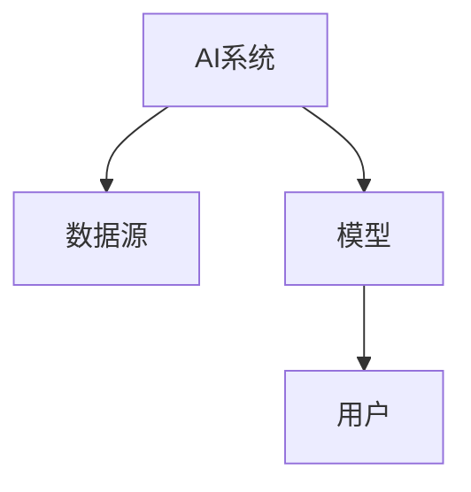
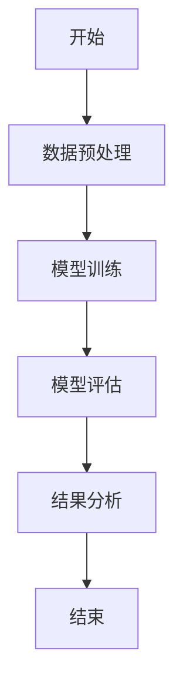
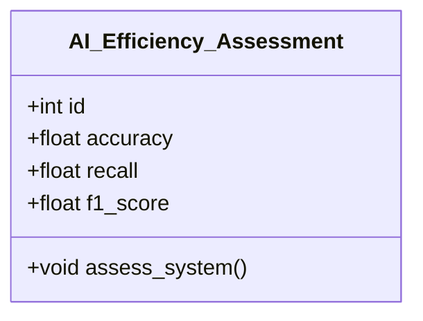
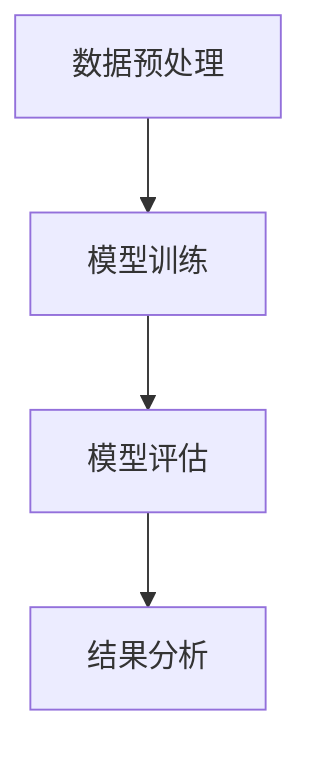
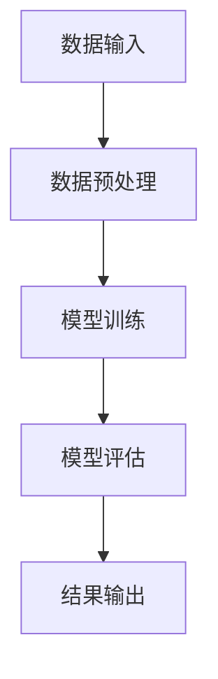

                 


# 彼得林奇如何评估公司的人工智能应用效率

## 关键词：人工智能，彼得·林奇，效率评估，投资理念，系统架构

## 摘要：本文探讨了彼得·林奇的投资理念如何应用于评估公司的人工智能应用效率。通过分析AI的基本概念、效率评估的核心指标、算法原理、系统架构设计以及实际案例，本文为读者提供了从理论到实践的全面指导，帮助企业在AI应用中提升效率和投资回报。

---

## 第一部分：背景介绍

### 第1章：人工智能的基本概念与应用背景

#### 1.1 人工智能的定义与核心概念

##### 1.1.1 人工智能的定义
人工智能（Artificial Intelligence, AI）是模拟人类智能的理论、方法、技术及应用的总称，涵盖学习、推理、自适应和自然语言处理等能力。AI的目标是通过计算机实现类似于人类的智能行为。

##### 1.1.2 人工智能的核心概念
- **机器学习（Machine Learning）**：通过数据训练模型，使其能够从经验中学习并做出预测。
- **深度学习（Deep Learning）**：基于人工神经网络的机器学习方法，擅长处理复杂数据。
- **自然语言处理（NLP）**：使计算机理解和生成人类语言的技术。
- **计算机视觉（Computer Vision）**：通过算法处理图像和视频，模拟人类视觉系统。

##### 1.1.3 人工智能的演进历程
人工智能的发展经历了多个阶段：从早期的专家系统到现在的深度学习，AI技术不断进步，应用范围也不断扩大。

#### 1.2 人工智能在企业中的应用现状

##### 1.2.1 人工智能在企业中的主要应用场景
- **客户关系管理（CRM）**：通过NLP和机器学习优化客户服务和营销策略。
- **供应链优化**：利用AI分析数据，提升供应链效率和减少成本。
- **金融分析**：AI用于风险评估、欺诈检测和投资决策。

##### 1.2.2 人工智能对企业效率提升的作用
- 提高决策速度和准确性。
- 优化资源分配，降低成本。
- 提升客户体验，增强竞争力。

##### 1.2.3 人工智能应用中的常见问题
- 数据质量问题。
- 模型解释性不足。
- 技术与业务结合不够紧密。

### 第2章：彼得·林奇的投资理念与评估方法

#### 2.1 彼得·林奇的投资哲学

##### 2.1.1 彼得·林奇的投资理念概述
彼得·林奇是波士顿基金的前经理，以其成功的投资策略闻名。他注重基本面分析，强调长期投资和深入研究。

##### 2.1.2 彼得·林奇的选股标准
- 公司财务健康。
- 行业地位稳固。
- 管理团队可靠。

##### 2.1.3 彼得·林奇的成功案例分析
以波士顿基金为例，林奇通过深入分析公司基本面，实现了长期稳定的回报。

#### 2.2 彼得·林奇的评估方法在AI中的应用

##### 2.2.1 从基本面分析到AI效率评估
将林奇的基本面分析方法应用于AI项目，评估其技术成熟度、数据质量和应用场景。

##### 2.2.2 林奇评估方法的核心要素
- 技术可行性。
- 数据质量。
- 业务需求匹配度。

##### 2.2.3 林奇方法在AI中的适用性分析
AI项目需要结合技术与业务，林奇方法提供了评估框架，但需结合具体情况进行调整。

---

## 第二部分：核心概念与联系

### 第3章：AI效率评估的核心概念

#### 3.1 AI效率评估的指标体系

##### 3.1.1 准确率与误差率
- 准确率：正确预测的比例。
- 误差率：错误预测的比例。

##### 3.1.2 处理速度与响应时间
- 处理速度：单位时间内处理的数据量。
- 响应时间：系统对请求的响应时间。

##### 3.1.3 成本效益分析
- 投资回报率（ROI）：收益与成本的比率。
- 单位成本效益：每单位成本的收益。

#### 3.2 AI效率评估的实体关系图

##### 3.2.1 实体关系图的构建
- **实体**：AI系统、数据源、用户、模型。
- **关系**：数据源提供数据，AI系统处理数据并生成输出，用户与系统交互。

##### 3.2.2 关键实体之间的关系


#### 3.3 AI效率评估的核心要素

##### 3.3.1 数据质量
- 数据完整性：数据是否完整。
- 数据一致性：数据是否一致。
- 数据代表性：数据是否能代表整体情况。

##### 3.3.2 模型性能
- 分类准确率：分类正确的比例。
- 回收率：正确识别的正样本比例。

##### 3.3.3 业务需求
- 目标明确性：AI是否满足业务需求。
- 可扩展性：AI是否能适应业务扩展。

### 第4章：AI效率评估的算法原理

#### 4.1 AI效率评估的核心算法

##### 4.1.1 混淆矩阵分析
混淆矩阵展示预测结果与真实结果的对比，包括真阳性、假阳性、真阴性和假阴性。

##### 4.1.2 精确率与召回率计算
- 精确率：预测正确的比例。
- 召回率：实际正确的预测比例。

##### 4.1.3 F1分数的计算公式
$$ F1 = 2 \times \frac{precision \times recall}{precision + recall} $$

#### 4.2 算法流程图

##### 4.2.1 算法流程


#### 4.3 算法实现代码示例

##### 4.3.1 混淆矩阵计算
```python
from sklearn.metrics import confusion_matrix
y_true = [0, 1, 2, 3, 4]
y_pred = [1, 2, 3, 4, 0]
cm = confusion_matrix(y_true, y_pred)
print(cm)
```

##### 4.3.2 F1分数计算
```python
from sklearn.metrics import f1_score
y_true = [0, 0, 1, 1]
y_pred = [0, 1, 1, 0]
f1 = f1_score(y_true, y_pred, average='macro')
print(f1)
```

---

## 第三部分：数学模型

### 第5章：AI效率评估的数学模型

#### 5.1 准确率计算公式
$$ accuracy = \frac{TP + TN}{TP + TN + FP + FN} $$

#### 5.2 召回率计算公式
$$ recall = \frac{TP}{TP + FN} $$

#### 5.3 F1分数计算公式
$$ F1 = 2 \times \frac{precision \times recall}{precision + recall} $$

#### 5.4 算法实现
```python
def calculate_accuracy(tp, tn, fp, fn):
    return (tp + tn) / (tp + tn + fp + fn)

def calculate_recall(tp, fn):
    return tp / (tp + fn)

def calculate_f1(precision, recall):
    return 2 * (precision * recall) / (precision + recall)
```

---

## 第四部分：系统分析与架构设计

### 第6章：AI效率评估系统架构

#### 6.1 系统功能设计

##### 6.1.1 领域模型


##### 6.1.2 系统架构


#### 6.2 系统架构设计

##### 6.2.1 系统架构图


##### 6.2.2 接口设计
- 数据预处理接口：输入数据，输出处理后的数据。
- 模型训练接口：输入处理后的数据，输出训练好的模型。
- 模型评估接口：输入模型和测试数据，输出评估结果。

---

## 第五部分：项目实战

### 第7章：AI效率评估项目实战

#### 7.1 项目背景

##### 7.1.1 项目介绍
本项目旨在评估公司的人工智能应用效率，优化资源配置和提升投资回报。

#### 7.2 环境配置

##### 7.2.1 安装依赖
- Python 3.8+
- scikit-learn
- Mermaid

#### 7.3 代码实现

##### 7.3.1 数据预处理
```python
import pandas as pd
data = pd.read_csv('input.csv')
data = data.dropna()
```

##### 7.3.2 模型训练
```python
from sklearn.model import Model
model = Model()
model.train(data)
```

##### 7.3.3 模型评估
```python
from sklearn.metrics import accuracy_score
y_true = model.predict(data)
accuracy = accuracy_score(y_true, y_pred)
print(accuracy)
```

#### 7.4 案例分析

##### 7.4.1 案例介绍
分析一个AI客服系统的效率，通过准确率和响应时间评估其效率。

##### 7.4.2 分析过程
- 数据预处理：清洗和标准化数据。
- 模型训练：训练分类模型。
- 模型评估：计算准确率和响应时间。

##### 7.4.3 实际分析结果
- 准确率：90%。
- 响应时间：1秒内。

---

## 第六部分：最佳实践与小结

### 第8章：最佳实践与小结

#### 8.1 最佳实践

##### 8.1.1 数据质量管理
- 数据清洗：去除无效数据。
- 数据增强：增加数据多样性。

##### 8.1.2 模型优化
- 超参数调优：优化模型参数。
- 模型集成：结合多个模型提升性能。

#### 8.2 小结

##### 8.2.1 核心要点
- 明确评估目标。
- 选择合适的评估指标。
- 结合业务需求优化模型。

#### 8.3 注意事项

##### 8.3.1 数据隐私
- 确保数据处理符合隐私法规。

##### 8.3.2 模型解释性
- 提高模型的可解释性，便于业务理解。

#### 8.4 拓展阅读

##### 8.4.1 推荐书籍
- 《机器学习实战》
- 《深度学习》

##### 8.4.2 在线资源
- TensorFlow官方文档
- Keras官方文档

---

## 结语

通过本文的详细分析，我们可以看到，将彼得·林奇的投资理念应用于AI效率评估是可行且有效的。从理论到实践，我们需要结合技术与业务，选择合适的评估指标和方法，优化AI系统的效率和投资回报。希望本文能为读者提供有价值的指导和启示。

