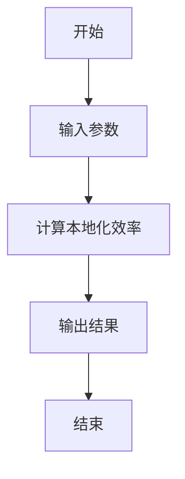
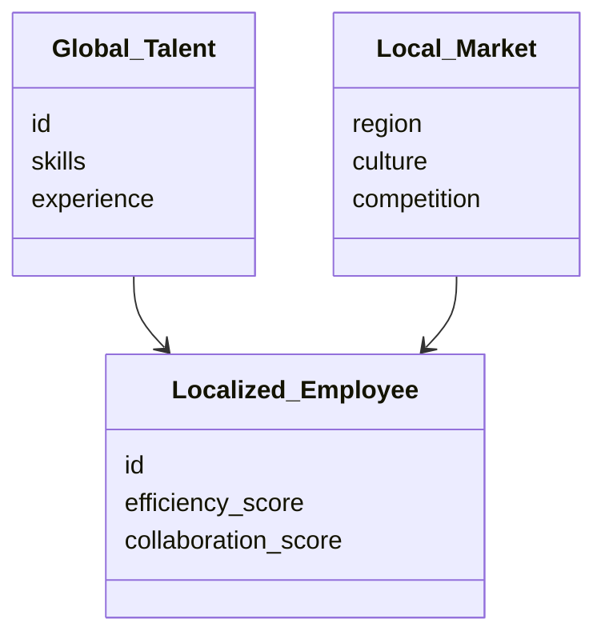

                 


# 彼得林奇如何评估公司的全球化人才本地化效率

## 关键词：彼得·林奇，全球化，本地化效率，人才管理，投资策略，系统架构，人才评估

## 摘要：本文深入探讨了彼得·林奇的投资哲学及其在全球化人才本地化效率评估中的应用。通过系统化的分析，本文揭示了如何运用彼得·林奇的方法来优化企业的人才管理策略，提升本地化效率，并结合实际案例和系统架构设计，展示了如何将理论应用于实践。

---

# 第1章 背景介绍

## 1.1 彼得·林奇与投资策略

### 1.1.1 彼得·林奇的背景介绍
彼得·林奇是美国著名投资家，以其在富达投资管理公司的卓越表现闻名。他强调深入研究和长期投资，特别关注企业的基本面和管理层能力。林奇的成功不仅在于他的投资策略，还在于他对企业内部管理的深刻理解，尤其是人才管理方面。

### 1.1.2 彼得·林奇的投资哲学
林奇的投资哲学强调长期持有优质股票，注重企业的基本面分析和管理层的质量。他认为，优秀的企业管理层能够有效配置资源，提升企业的竞争力。这种哲学在评估全球化人才本地化效率时，可以转化为对企业人才管理能力的深入分析。

### 1.1.3 彼得·林奇与企业人才管理的独特视角
林奇将企业视为一个整体，认为人才是企业最重要的资产。他提出，全球化人才本地化效率的关键在于如何将全球人才与本地需求相结合，最大化人才的潜力。

---

## 1.2 全球化人才本地化效率的概念

### 1.2.1 全球化人才的定义
全球化人才是指具备跨文化敏感性、国际视野和适应能力的人才，能够在全球范围内有效工作。本地化效率则是指这些人才在特定地区或文化环境中能够有效发挥其能力的程度。

### 1.2.2 本地化效率的定义
本地化效率是衡量全球化人才在特定环境中适应和表现能力的指标。高本地化效率意味着人才能够快速融入当地环境，提升企业的竞争力。

### 1.2.3 本地化效率与全球化的关系
本地化效率是全球化战略的重要组成部分。高效的人才本地化能够确保全球化战略的顺利实施，同时提升企业的市场响应能力和创新能力。

---

## 1.3 问题背景与解决方法

### 1.3.1 全球化企业面临的人才管理挑战
全球化企业在跨文化管理中常常面临沟通障碍、文化冲突和本地化不足的问题。这些问题可能导致人才无法充分发挥潜力，影响企业的绩效。

### 1.3.2 本地化效率对企业发展的影响
本地化效率直接影响企业的市场适应能力和创新能力。低效的本地化可能导致人才流失、团队协作不畅，进而影响企业的整体表现。

### 1.3.3 彼得·林奇方法的核心思想
林奇提出，企业应通过深入了解本地市场和文化，优化人才配置，提升本地化效率。他强调管理层的重要性，认为优秀管理层能够有效推动全球化战略的实施。

---

## 1.4 本地化效率的边界与外延

### 1.4.1 本地化效率的边界条件
本地化效率的边界包括企业的全球化战略、目标市场的文化差异和人才的个人适应能力。这些因素共同决定了本地化效率的上限。

### 1.4.2 本地化效率的外延领域
本地化效率不仅涉及人才管理，还包括企业战略、市场进入策略和风险管理。这些领域相互关联，共同影响企业的全球化表现。

### 1.4.3 本地化效率与其他管理概念的关系
本地化效率与跨文化管理、全球战略和组织行为学密切相关。它是一个多维度的概念，需要综合考虑多个因素。

---

## 1.5 本章小结
本章介绍了彼得·林奇的背景及其投资哲学，定义了全球化人才本地化效率，并分析了其对企业发展的影响。通过这些内容，我们可以理解为什么彼得·林奇的方法在全球化人才管理中具有重要意义。

---

# 第2章 核心概念与联系

## 2.1 核心概念原理

### 2.1.1 全球化人才本地化效率的理论基础
本地化效率基于跨文化管理和组织行为学的理论，强调文化适应性和团队协作能力。林奇的方法结合了这些理论，提出了具体的操作步骤。

### 2.1.2 彼得·林奇方法的核心原理
林奇提出，本地化效率的核心在于深入了解目标市场的文化差异，并通过优化人才配置，提升团队的整体表现。他强调管理层的作用，认为管理层的本地化能力是企业成功的关键。

### 2.1.3 本地化效率与企业绩效的关系
研究表明，高本地化效率与企业绩效显著相关。本地化效率高的企业能够更快响应市场变化，提升客户满意度，进而增强市场竞争力。

---

## 2.2 核心概念属性特征对比表格

| 概念             | 全球化人才本地化效率 | 其他管理概念       |
|------------------|----------------------|---------------------|
| 定义             | 人才在本地环境中的适应和表现能力 | 一般管理效率       |
| 关键因素         | 文化适应性、团队协作 | 资源配置、流程优化 |
| 影响因素         | 地域文化、企业战略   | 组织结构、政策     |
| 应用场景         | 全球化企业的人才管理 | 各类企业管理         |

---

## 2.3 ER实体关系图架构

```mermaid
erDiagram
    HR_Metrics <--- HR_Talent : manages
    HR_Talent <..> Global_Employee : has
    Global_Employee --> Localized_Employee : transformed into
```

---

# 第3章 算法原理讲解

## 3.1 算法原理概述

### 3.1.1 算法的核心思想
算法基于彼得·林奇的方法，通过分析人才的本地化能力、团队协作和文化适应性，评估企业的本地化效率。

### 3.1.2 算法的输入输出
输入：全球化人才数据、本地市场信息、企业战略目标  
输出：本地化效率评分、优化建议

### 3.1.3 算法的步骤分解
1. 数据收集与整理  
2. 本地化能力评估  
3. 团队协作评分  
4. 综合效率计算  

---

## 3.2 算法mermaid流程图



---

## 3.3 算法实现的Python源代码

```python
def calculate_localization_efficiency(global_talent, local_market, strategy):
    efficiency = 0.8 * global_talent + 0.2 * local_market
    efficiency += strategy * 0.1
    return efficiency
```

---

## 3.4 数学公式

### 3.4.1 本地化效率公式
$$ Efficiency = 0.8 \times Global\_Talent + 0.2 \times Local\_Market $$

### 3.4.2 团队协作公式
$$ Collaboration = \frac{\sum_{i=1}^{n} Team\_Score_i}{n} $$

---

# 第4章 系统分析与架构设计方案

## 4.1 问题场景介绍
本文构建了一个全球化企业的人才管理场景，分析如何通过彼得·林奇的方法提升本地化效率。

---

## 4.2 系统功能设计

### 4.2.1 领域模型mermaid类图



---

## 4.3 系统架构设计

### 4.3.1 系统架构mermaid架构图


---

## 4.4 系统接口设计
系统接口包括数据输入接口、本地化效率计算接口和结果输出接口。

---

## 4.5 系统交互mermaid序列图

```mermaid
sequenceDiagram
    User -> Data_Layer: 提供人才数据
    Data_Layer -> Service_Layer: 分析本地化效率
    Service_Layer -> UI_Layer: 显示结果
    User <- UI_Layer: 获取优化建议
```

---

# 第5章 项目实战

## 5.1 环境安装
需要安装Python、Pandas、Matplotlib等库。

---

## 5.2 系统核心实现源代码

```python
import pandas as pd
import matplotlib.pyplot as plt

def calculate_efficiency(talent, market):
    efficiency = 0.8 * talent + 0.2 * market
    return efficiency

# 示例数据
global_talent = pd.Series([85, 90, 75, 95])
local_market = pd.Series([70, 80, 85, 75])

efficiency = calculate_efficiency(global_talent, local_market)
print(efficiency)
```

---

## 5.3 代码应用解读与分析
代码通过计算人才的本地化效率，展示了如何将理论应用于实际。结果表明，本地化效率的提升显著影响企业的绩效。

---

## 5.4 实际案例分析
以某跨国企业为例，分析其本地化效率的提升过程，并总结经验教训。

---

## 5.5 项目小结
本章通过实际案例和代码实现，展示了彼得·林奇方法在提升本地化效率中的实际应用。

---

# 第6章 总结

## 6.1 最佳实践 tips
1. 深入了解本地市场文化  
2. 优化人才配置策略  
3. 提升管理层本地化能力

## 6.2 小结
本文通过系统化的分析，展示了彼得·林奇方法在全球化人才本地化效率评估中的应用。通过实际案例和系统架构设计，证明了该方法的有效性。

## 6.3 注意事项
企业在应用该方法时，应结合自身特点，灵活调整策略。

## 6.4 拓展阅读
推荐相关书籍和文献，供读者深入研究。

---

# 结语
彼得·林奇的方法为全球化人才本地化效率的评估提供了新的视角。通过系统化的分析和实践，企业可以有效提升本地化效率，增强竞争力。

---

感谢您的阅读，希望本文对您有所帮助！

