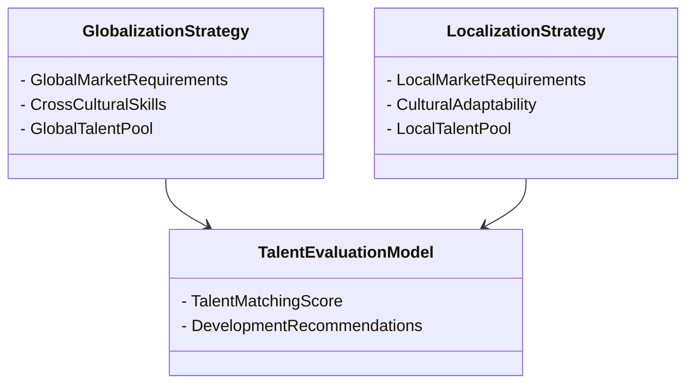
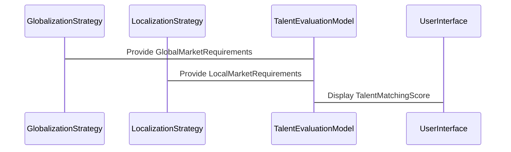

                 


# 彼得林奇如何评估公司的全球化人才本地化策略

## 关键词：全球化，人才本地化，人才评估，本地化策略，人才管理

## 摘要：  
本文深入探讨了彼得·林奇在全球化背景下如何评估和实施人才本地化策略。通过分析全球化与本地化的关系，人才评估的核心维度，本地化策略的类型，以及如何构建系统化的全球化人才本地化评估模型，本文为企业的全球化战略提供了理论支持和实践指导。

---

# 全球化人才本地化的背景与定义

## 第1章：全球化人才本地化的背景与定义

### 1.1 全球化人才本地化的背景

#### 1.1.1 全球化趋势对企业人才战略的影响  
随着经济全球化和数字化的加速，企业面临的竞争日益激烈。全球化为企业提供了更广阔的市场和资源，但也带来了人才管理的挑战。企业需要在全球范围内吸引和管理人才，同时兼顾本地市场的特殊需求。彼得·林奇在其投资策略中强调，企业的人才本地化策略是其实现全球化目标的关键因素之一。

#### 1.1.2 本地化人才战略的兴起  
在跨国经营中，企业逐渐意识到，仅仅依赖总部的人才管理难以满足不同地区市场的多样化需求。本地化人才战略的兴起，使得企业开始更加关注如何在全球范围内实现人才的本地化管理。这种策略不仅能够提高员工的适应性和生产力，还能增强企业的文化敏感性和市场竞争力。

#### 1.1.3 全球化与本地化结合的必要性  
全球化人才本地化策略的核心在于将全球视野与本地化需求相结合。这种结合不仅能够优化企业的组织结构，还能提高员工的满意度和忠诚度。彼得·林奇认为，只有通过本地化的人才管理，企业才能在全球市场中实现真正的竞争优势。

---

### 1.2 全球化人才本地化的定义与特点

#### 1.2.1 全球化人才本地化的定义  
全球化人才本地化策略是指企业在全球化背景下，通过在全球范围内吸引、培养和管理人才，同时结合目标市场的本地化需求，制定和实施人才管理策略的过程。这一策略的核心在于平衡全球化与本地化的双重需求。

#### 1.2.2 全球化与本地化的对比分析  
| **维度**       | **全球化**                  | **本地化**                  |
|------------------|-----------------------------|-----------------------------|
| 职位匹配度       | 强调全球通用技能             | 强调本地市场需求             |
| 文化适应性       | 重视跨文化适应能力           | 重视本地文化适应能力         |
| 战略目标         | 实现全球统一战略             | 实现本地市场差异化目标       |
| 管理方式         | 中心化管理                   | 分权化管理                   |

从上表可以看出，全球化和本地化在人才管理上有显著差异。全球化注重统一性和跨文化适应性，而本地化则更关注本地市场的需求和文化差异。

#### 1.2.3 本地化人才战略的核心要素  
1. **本地化需求分析**：根据目标市场的特点，制定相应的人才需求计划。  
2. **本地化招聘与培养**：注重本地人才的招聘和培养，确保员工能够适应本地市场的需求。  
3. **本地化文化管理**：通过文化培训和管理，增强员工的文化适应能力。  

---

### 1.3 全球化人才本地化的重要性

#### 1.3.1 本地化人才战略对企业竞争力的影响  
本地化人才战略能够提高企业的市场适应能力和竞争力。通过本地化的人才管理，企业可以更好地满足目标市场的需求，提升客户满意度和忠诚度。

#### 1.3.2 全球化视角下的人才本地化策略  
彼得·林奇认为，全球化视角下的人才本地化策略是企业实现全球化目标的关键。通过全球化视角，企业可以更好地协调全球资源，优化人才配置。

#### 1.3.3 本地化人才战略的实施挑战  
1. **文化差异**：不同国家和地区的文化差异可能影响人才管理的效果。  
2. **法律法规**：不同地区的法律法规对人才管理有不同要求，增加了管理的复杂性。  
3. **沟通与协调**：全球化与本地化的结合需要企业内部不同部门之间的高效沟通与协调。  

---

## 第2章：全球化人才本地化的核心概念与联系

### 2.1 全球化与本地化的定义对比

#### 2.1.1 全球化与本地化的定义  
- **全球化**：指企业在全球范围内进行资源整合、市场拓展和人才管理的过程。  
- **本地化**：指企业根据目标市场的特点，制定和实施本地化的人才管理策略。  

#### 2.1.2 全球化与本地化的联系  
全球化与本地化的联系主要体现在人才管理上。全球化提供了跨市场的视野，而本地化则提供了具体的市场支持。两者结合，能够帮助企业在全球范围内实现高效的人才管理。

---

### 2.2 人才评估的核心维度

#### 2.2.1 技能评估维度  
- **技术技能**：员工的专业知识和技能是否符合岗位要求。  
- **跨文化技能**：员工是否具备跨文化适应能力和团队协作能力。  

#### 2.2.2 文化适应性评估维度  
- **文化敏感性**：员工是否能够理解和尊重不同文化背景的同事和客户。  
- **文化适应能力**：员工是否能够快速适应目标市场的文化环境。  

#### 2.2.3 职位匹配度评估维度  
- **岗位匹配度**：员工的技能和经验是否与岗位要求相符。  
- **职业发展潜力**：员工是否具备在未来承担更重要的职责的能力。  

---

## 第3章：全球化人才本地化的评估模型

### 3.1 评估模型的设计

#### 3.1.1 评估模型的输入  
- **全球化视角**：包括企业的全球化战略、跨文化适应能力等。  
- **本地化需求**：包括目标市场的文化、法律法规、市场需求等。  

#### 3.1.2 评估模型的输出  
- **人才匹配度评分**：基于全球化与本地化需求，对人才的匹配度进行评分。  
- **人才发展建议**：根据评分结果，提出人才发展建议。  

#### 3.1.3 评估模型的实现步骤  
1. **数据收集**：收集目标市场的文化、法律法规和市场需求等信息。  
2. **模型构建**：基于收集到的数据，构建全球化人才本地化的评估模型。  
3. **模型验证**：通过实际案例验证模型的有效性和准确性。  

---

## 第4章：全球化人才本地化的系统设计

### 4.1 系统功能设计

#### 4.1.1 领域模型  


#### 4.1.2 系统架构设计  


#### 4.1.3 系统接口设计  


---

## 第5章：全球化人才本地化的项目实战

### 5.1 项目背景与目标

#### 5.1.1 项目背景  
某跨国企业希望在全球范围内实施人才本地化策略，以提高其在全球市场的竞争力。

#### 5.1.2 项目目标  
- 构建全球化人才本地化的评估模型。  
- 实施人才本地化管理策略。  
- 提高员工的满意度和忠诚度。  

---

### 5.2 项目实施步骤

#### 5.2.1 环境安装  
- **安装Python**：下载并安装Python 3.8及以上版本。  
- **安装Mermaid CLI**：通过命令`pip install mermaid-cli`安装Mermaid CLI。  
- **安装Jupyter Notebook**：通过命令`pip install jupyter`安装Jupyter Notebook。  

#### 5.2.2 核心代码实现  

```python
import pandas as pd
from sklearn.linear_model import LinearRegression

# 数据加载
data = pd.read_csv('talent.csv')

# 模型训练
model = LinearRegression()
model.fit(data[['GlobalMarketRequirements', 'CulturalAdaptability']], data['TalentMatchingScore'])

# 预测
new_data = pd.DataFrame({
    'GlobalMarketRequirements': [0.8],
    'CulturalAdaptability': [0.9]
})
prediction = model.predict(new_data)
print(f"预测的人才匹配度为：{prediction[0][0]}")
```

#### 5.2.3 案例分析与解读  
以某跨国企业的实际案例为例，通过数据建模和分析，验证评估模型的有效性，并提出优化建议。

---

## 第6章：全球化人才本地化的最佳实践

### 6.1 小结  
彼得·林奇认为，全球化人才本地化策略是企业实现全球化目标的关键。通过全球化与本地化的结合，企业可以更好地吸引和管理人才，提高其市场竞争力。

### 6.2 注意事项  
1. **文化差异**：在实施本地化人才策略时，需充分考虑目标市场的文化差异。  
2. **法律法规**：遵守目标市场的法律法规，确保人才管理的合法性。  
3. **沟通与协调**：加强内部沟通与协调，确保全球化与本地化策略的有效结合。  

### 6.3 拓展阅读  
- **书籍推荐**：《The Globalization of Talent》  
- **在线课程**：Coursera上的“Global Talent Management”课程  

### 6.4 未来趋势  
随着全球化和数字化的进一步发展，全球化人才本地化策略将变得更加重要。未来，企业需要更加灵活地应对市场变化，优化其人才管理策略。

---

# 结语  
通过本文的分析与探讨，我们可以看到，全球化人才本地化策略是企业在全球化背景下实现可持续发展的关键因素。彼得·林奇的理论为我们提供了一个重要的视角，帮助我们更好地理解和实施这一策略。希望本文的内容能够为企业提供有价值的参考和指导。

