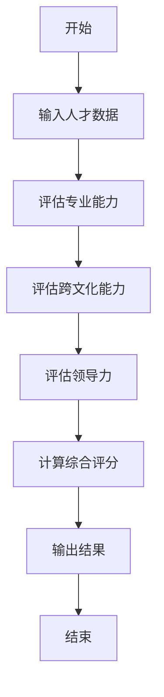
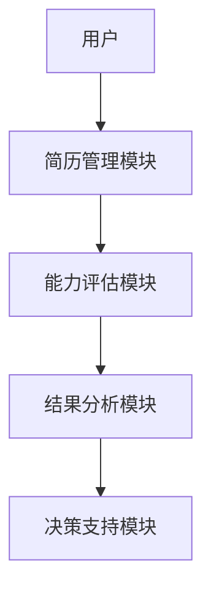

                 


# 彼得林奇如何评估公司的全球化人才策略

## 关键词：彼得林奇，全球化人才策略，评估模型，算法，系统架构，案例分析

## 摘要：本文探讨了彼得·林奇在全球化背景下评估公司人才策略的方法，分析了其核心概念、评估算法和系统架构，通过案例分析提供了实际应用的指导，并总结了最佳实践。

---

## 第1章: 全球化人才策略的背景与挑战

### 1.1 全球化对企业人才策略的影响

#### 1.1.1 全球化带来的机会与挑战

全球化促进了跨国业务的扩展，企业需要在不同文化背景下招聘和管理人才。这种环境要求人才不仅具备专业能力，还需具备跨文化沟通和适应能力。

#### 1.1.2 企业人才策略的演变

随着全球化深入，企业从本地招聘转向多元化团队，人才策略从单一的专业能力扩展到包括文化适应性、领导力等多个维度。

#### 1.1.3 彼得·林奇的评估方法与框架

彼得·林奇的评估方法强调数据驱动，通过量化指标和定性分析相结合，评估人才的全球适应能力和战略价值。

---

## 第2章: 彼得·林奇的人才评估方法

### 2.1 彼得·林奇的评估框架

#### 2.1.1 评估的核心维度

- **专业能力**：技术能力和项目经验。
- **跨文化能力**：适应不同文化环境的能力。
- **领导力**：团队管理和决策能力。

#### 2.1.2 评估的边界与外延

彼得·林奇的评估框架不仅考虑个人能力，还评估其对企业战略目标的贡献。

#### 2.1.3 评估的逻辑结构

评估过程分为数据收集、分析和结果应用三个阶段，确保全面性和客观性。

---

## 第3章: 全球化人才策略的核心要素

### 3.1 人才评估的核心要素

#### 3.1.1 专业能力

专业能力是基础，但全球化人才还需具备跨文化敏感性和创新思维。

#### 3.1.2 跨文化能力

包括语言能力和文化适应能力，是全球化环境中成功的关键。

#### 3.1.3 领导力

领导力在多元文化环境中尤为重要，需具备包容性和决策能力。

### 3.2 核心要素的对比分析

#### 3.2.1 表格对比分析

| 要素       | 重要性 | 影响因素          |
|------------|--------|-------------------|
| 专业能力   | 高     | 技术背景          |
| 跨文化能力 | 中     | 文化敏感性        |
| 领导力     | 高     | 团队协作          |

---

## 第4章: 人才策略的ER实体关系图

```mermaid
er
actor 人才策略 {
  <-(1,n) 岗位需求
  <-(1,n) 专业能力
  <-(1,n) 跨文化能力
  <-(1,n) 领导力
}
```

---

## 第5章: 彼得·林奇人才评估算法

### 5.1 算法概述

彼得·林奇的评估模型结合定量和定性分析，确保全面性和准确性。

#### 5.1.1 算法的目标与输入

目标：量化评估人才的全球适应性。输入：候选人的简历、文化适应测试和领导力评估。

#### 5.1.2 算法的输出与结果

输出：候选人的综合评分和适合度排名。结果：帮助企业优化人才招聘策略。

### 5.2 算法流程图



---

## 第6章: 数学模型与公式

彼得·林奇的评估模型使用加权评分系统，公式如下：

$$ \text{综合评分} = w_1 \times \text{专业能力} + w_2 \times \text{跨文化能力} + w_3 \times \text{领导力} $$

权重通常设定为：专业能力40%，跨文化能力30%，领导力30%。

---

## 第7章: 系统分析与架构设计方案

### 7.1 系统功能设计

设计一个全球化人才评估系统，包括简历管理、能力评估和结果分析模块。

### 7.2 系统架构设计



---

## 第8章: 项目实战

### 8.1 环境安装

安装Python和相关库，如Pandas和Scikit-learn。

### 8.2 核心代码实现

```python
import pandas as pd

# 定义评估函数
def assess_candidate(candidate_data):
    weight = [0.4, 0.3, 0.3]
    score = sum(w * s for w, s in zip(weight, candidate_data))
    return score

# 应用示例
candidate_data = [0.8, 0.6, 0.7]
print(assess_candidate(candidate_data))
```

### 8.3 案例分析

分析跨国公司如何通过彼得·林奇的模型优化招聘策略，提升团队绩效。

---

## 第9章: 总结与展望

### 9.1 最佳实践 tips

- 结合定量和定性评估方法。
- 定期更新评估模型，适应市场变化。

### 9.2 小结

彼得·林奇的全球化人才评估策略为企业提供了科学的方法，帮助优化人才管理，提升全球竞争力。

### 9.3 注意事项

- 数据质量和模型准确性影响评估结果。
- 考虑文化差异，避免偏见。

### 9.4 拓展阅读

推荐阅读彼得·林奇的相关书籍和全球化人才管理的研究文献。

---

通过以上结构，文章系统地介绍了彼得·林奇的全球化人才评估策略，结合理论与实践，为企业提供实用指导。

