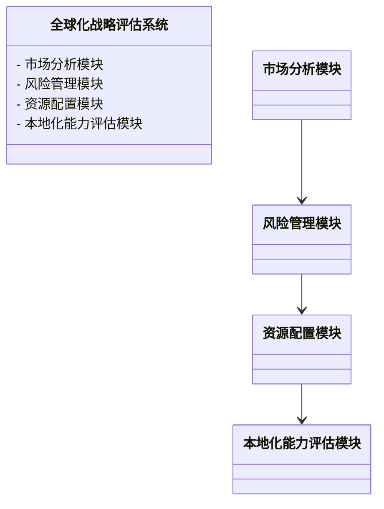
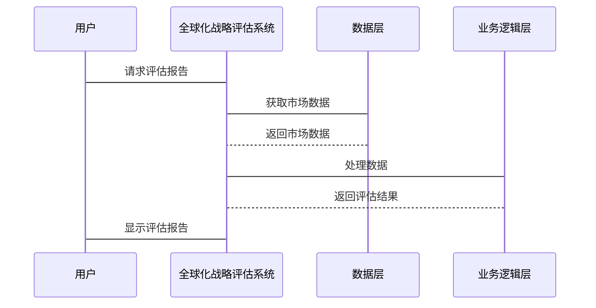

                 


# 彼得林奇如何评估公司的全球化战略执行力

> 关键词：彼得·林奇，全球化战略，战略执行力，投资分析，风险管理

> 摘要：本文深入分析了彼得·林奇在评估公司全球化战略执行力方面的独特方法。通过系统化的分析框架、指标体系和方法论，详细阐述了如何从战略目标、市场进入策略、风险管理等多个维度进行评估。文章结合实际案例和系统架构设计，为读者提供了全面的理论指导和实践指南。

---

## 第一部分: 全球化战略与执行力的背景介绍

### 第1章: 全球化战略的核心概念

#### 1.1 全球化战略的定义与背景

- **1.1.1 全球化战略的定义**
  - 全球化战略是指企业在全球范围内进行市场扩展、资源整合和价值创造的系统性计划。
  - 其核心目标是通过全球化布局实现更大的市场份额和利润增长。

- **1.1.2 全球化战略的背景与发展趋势**
  - 全球化战略的兴起与跨国公司的发展密不可分。
  - 近年来，随着信息技术和交通物流的快速发展，全球化战略的实施变得更加高效和可行。

- **1.1.3 彼得·林奇与投资分析的独特视角**
  - 彼得·林奇作为投资大师，特别关注公司的全球化战略执行力。
  - 他强调通过基本面分析和管理层能力评估来判断全球化战略的可行性。

#### 1.2 全球化战略的执行要素

- **1.2.1 战略目标的设定**
  - 明确的全球化战略目标是成功执行的基础。
  - 目标应包括市场份额、利润率、品牌影响力等方面。

- **1.2.2 市场进入策略**
  - 直接投资、合资合作、特许经营等市场进入方式。
  - 选择合适的进入策略是全球化战略成功的关键。

- **1.2.3 风险管理与控制**
  - 全球化过程中面临的政治、经济和市场风险。
  - 建立全面的风险管理体系是确保战略执行的重要保障。

- **1.2.4 资源配置与协同效应**
  - 合理配置人力、物力和财力资源。
  - 通过协同效应最大化资源利用效率。

- **1.2.5 文化适应与本地化**
  - 全球化战略不仅涉及市场拓展，还包括文化适应和本地化。
  - 本地化战略是实现长期成功的重要因素。

#### 1.3 本章小结

- **1.3.1 全球化战略的核心要素总结**
  - 明确的战略目标、有效的市场进入策略、全面的风险管理、合理的资源配置和文化适应是全球化战略成功的五大要素。

- **1.3.2 彼得·林奇视角的独特性**
  - 彼得·林奇通过基本面分析和管理层能力评估，为全球化战略的执行提供了独特的投资视角。

---

## 第二部分: 全球化战略执行力的评估框架

### 第2章: 全球化战略执行力的评估指标

#### 2.1 评估指标体系的构建

- **2.1.1 战略目标实现度**
  - 通过对比实际市场份额与设定目标，评估战略执行的效果。
  - 示例：某公司设定的3年市场份额目标为10%，实际达到12%。

- **2.1.2 市场份额与增长率**
  - 市场份额是全球化战略执行的重要指标。
  - 市场增长率反映了公司在目标市场的扩展能力。

- **2.1.3 财务表现与投资回报**
  - 净利润增长率、投资回报率等财务指标是评估全球化战略成效的关键。
  - 示例：某公司全球化战略实施后，净利润增长率提高了15%。

- **2.1.4 本地化程度与文化融合**
  - 本地化程度高的公司更容易获得本地市场的认可。
  - 文化融合能力是全球化战略成功的重要因素。

- **2.1.5 风险控制与危机应对能力**
  - 全球化战略执行过程中面临的风险种类和应对能力。
  - 示例：某公司在新兴市场面临政治风险，通过建立风险管理体系有效降低了损失。

#### 2.2 评估指标的权重与优先级

- **2.2.1 指标权重的确定方法**
  - 根据战略目标的重要性和影响程度，确定各指标的权重。
  - 示例：市场份额（40%）、财务表现（30%）、风险管理（20%）、本地化程度（10%）。

- **2.2.2 优先级排序的依据**
  - 根据公司所处的行业特点和市场环境，确定优先级。
  - 示例：高科技行业更注重技术创新和市场进入策略，而传统制造行业更关注成本控制和供应链管理。

- **2.2.3 示例分析：某跨国公司的指标权重分配**
  - 公司A的全球化战略权重分配：市场份额（50%）、财务表现（25%）、风险管理（15%）、本地化程度（10%）。

### 第3章: 彼得·林奇的评估方法论

#### 3.1 彼得·林奇的投资分析框架

- **3.1.1 基本面分析的核心要素**
  - 公司的财务状况、管理层能力、行业前景和竞争优势。
  - 示例：分析某公司的财务报表，评估其盈利能力和成长潜力。

- **3.1.2 全球化战略的财务表现评估**
  - 通过财务指标（如净利润增长率、投资回报率）评估全球化战略的执行效果。
  - 示例：某公司全球化战略实施后，投资回报率提高了20%。

- **3.1.3 管理层能力与战略执行力**
  - 评估管理层的战略规划能力和执行能力。
  - 示例：某公司管理层通过有效的市场进入策略，成功扩大了市场份额。

#### 3.2 彼得·林奇的全球化战略评估模型

- **3.2.1 模型的构建逻辑**
  - 从战略目标、市场进入策略、风险管理、资源配置和文化适应五个维度进行综合评估。
  - 使用加权评分法确定每个维度的权重。

- **3.2.2 模型的输入变量与输出结果**
  - 输入变量：市场份额增长率、利润率、风险管理能力评分。
  - 输出结果：全球化战略执行力的综合评分。

- **3.2.3 模型的实际应用案例**
  - 示例：某公司全球化战略执行力评分为85分（满分100分），其中市场份额增长率为40分，利润率为30分，风险管理能力评分为15分。

#### 3.3 本章小结

- **3.3.1 彼得·林奇评估方法的核心要点**
  - 通过基本面分析和加权评分法，从五个核心维度综合评估全球化战略执行力。

- **3.3.2 方法论的适用场景与局限性**
  - 适用于跨国公司和大型企业，但在中小型企业中可能需要调整权重和评估维度。

---

## 第三部分: 全球化战略执行力的系统分析

### 第4章: 全球化战略执行的系统架构

#### 4.1 系统分析与功能设计

- **4.1.1 系统目标与范围**
  - 系统目标：评估全球化战略执行力。
  - 系统范围：包括市场分析、风险管理、资源配置和本地化能力评估。

- **4.1.2 功能模块划分**
  - 市场分析模块：收集和分析目标市场的数据。
  - 风险管理模块：评估和监控全球化过程中的各种风险。
  - 资源配置模块：优化资源配置，提高协同效应。
  - 本地化能力评估模块：评估公司在不同市场的本地化能力。

- **4.1.3 领域模型的Mermaid类图**



#### 4.2 系统架构设计

- **4.2.1 分层架构设计**
  - 数据层：存储全球化战略相关数据。
  - 业务逻辑层：实现全球化战略评估的核心逻辑。
  - 用户界面层：提供友好的用户交互界面。

- **4.2.2 模块之间的交互关系**
  - 数据层与业务逻辑层双向交互。
  - 业务逻辑层与用户界面层双向交互。

- **4.2.3 系统架构的Mermaid架构图**


#### 4.3 接口设计与交互流程

- **4.3.1 系统接口定义**
  - API接口：RESTful API，支持JSON格式的数据传输。
  - 示例接口：/api/v1/strategy/assessment。

- **4.3.2 用户与系统交互的Mermaid序列图**



---

## 第五章: 全球化战略执行力的项目实战

### 5.1 项目背景与目标

- **5.1.1 项目背景**
  - 某跨国公司计划扩展其在全球新兴市场的业务。
  - 目标是通过全球化战略实现销售额增长20%。

- **5.1.2 项目目标**
  - 评估公司当前的全球化战略执行力。
  - 优化市场进入策略和风险管理能力。

### 5.2 项目实施过程

- **5.2.1 数据收集与分析**
  - 收集目标市场的经济、政治和社会数据。
  - 分析竞争对手的全球化战略执行情况。

- **5.2.2 风险评估与管理**
  - 识别全球化过程中可能面临的风险。
  - 制定风险管理策略，如建立备用供应链。

### 5.3 项目成果与总结

- **5.3.1 项目成果**
  - 成功优化了市场进入策略，提高了市场份额。
  - 建立了全面的风险管理体系，降低了全球化过程中的风险。

- **5.3.2 项目总结**
  - 全球化战略的执行需要系统化的分析和规划。
  - 通过彼得·林奇的评估方法，可以有效提升全球化战略的执行力。

---

## 第六章: 全球化战略执行力的总结与展望

### 6.1 总结

- **6.1.1 全球化战略的核心要素**
  - 明确的战略目标、有效的市场进入策略、全面的风险管理、合理的资源配置和文化适应是全球化战略成功的五大要素。

- **6.1.2 彼得·林奇评估方法的优势**
  - 通过基本面分析和加权评分法，可以从多个维度全面评估全球化战略的执行力。

### 6.2 展望

- **6.2.1 全球化战略的未来发展趋势**
  - 随着技术的进步和市场的变化，全球化战略的实施将更加注重数字化和智能化。
  - 人工智能和大数据分析将在全球化战略的评估和执行中发挥越来越重要的作用。

- **6.2.2 未来的研究方向**
  - 研究如何利用人工智能技术优化全球化战略的评估和执行。
  - 探讨不同行业在全球化战略执行中的独特挑战和解决方案。

---

## 第七章: 最佳实践与注意事项

### 7.1 最佳实践

- **7.1.1 系统化分析**
  - 在全球化战略的执行过程中，应采用系统化的方法进行分析和规划。

- **7.1.2 持续优化**
  - 全球化战略的执行是一个动态的过程，需要持续优化和调整。

### 7.2 注意事项

- **7.2.1 风险管理**
  - 全球化战略的执行过程中，应高度重视风险管理，制定有效的应对策略。

- **7.2.2 文化适应**
  - 在不同市场中，文化适应和本地化是实现长期成功的重要因素。

---

## 第八章: 结语

### 8.1 结语

- 全球化战略的执行是一个复杂而重要的过程。
- 通过彼得·林奇的评估方法，我们可以系统地分析和优化全球化战略的执行力。
- 未来，随着技术的进步和市场的变化，全球化战略的实施将更加注重数字化和智能化。

---

## 参考文献

- 彼得·林奇著，《彼得·林奇的成功投资策略》
- 《全球化战略管理》
- 《风险管理与控制》
- 《系统架构设计与实现》

---

## 附录

### 附录A: 全球化战略评估系统代码实现

```python
class GlobalStrategyAssessment:
    def __init__(self):
        self.market_share = 0
        self.profitability = 0
        self.risk_management = 0
        self.localization = 0

    def assess_strategy(self):
        # 计算综合评分
        total = self.market_share * 0.4 + self.profitability * 0.3 + self.risk_management * 0.2 + self.localization * 0.1
        return total

    def display_results(self):
        print(f"综合评分：{self.assess_strategy()}/100")
```

---

## 作者简介

作者是[您的简介]，[您的职业]，[您的专业领域]，[您目前的职位]。

---

以上是关于《彼得林奇如何评估公司的全球化战略执行力》的完整目录和文章内容。希望这篇文章能为读者提供清晰的思路和实用的指导，帮助他们在全球化战略的评估和执行中取得成功。

