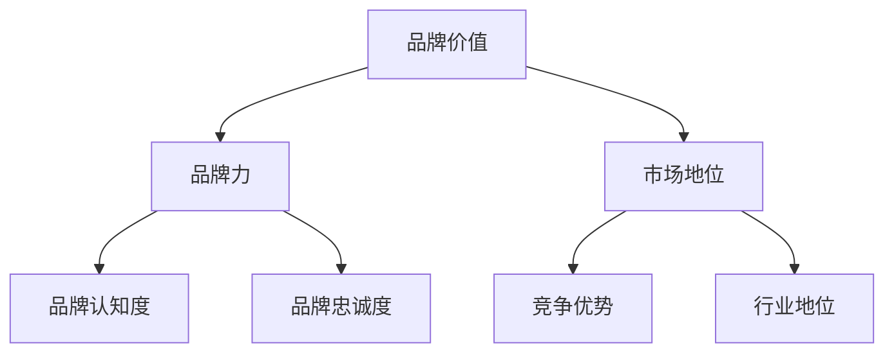
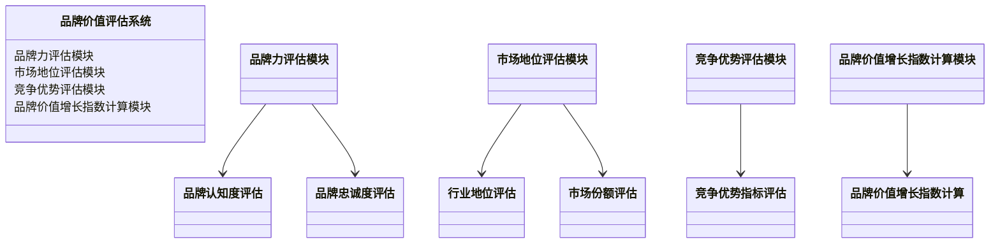

                 


# 彼得林奇如何评估公司的品牌价值增长

> 关键词：彼得·林奇、品牌价值、投资评估、企业并购、品牌价值增长指数

> 摘要：本文系统介绍了彼得·林奇如何评估公司的品牌价值增长，从品牌价值的定义、构成要素、评估方法到实际案例分析，层层深入，详细讲解了彼得·林奇的品牌价值评估体系，并通过代码实现和图表展示，帮助读者掌握品牌价值增长的评估技巧。

---

# 第1章: 引言

## 1.1 彼得·林奇与品牌价值评估概述
### 1.1.1 彼得·林奇的背景介绍
- 彼得·林奇的生平简介
- 彼得·林奇的投资理念
- 彼得·林奇在品牌价值评估领域的贡献

### 1.1.2 品牌价值评估的重要性
- 品牌价值在企业并购中的作用
- 品牌价值对股价的影响
- 品牌价值与企业长期战略的关系

### 1.1.3 本书的核心目标与内容
- 本书的核心目标
- 本书的主要内容
- 本书的学习方法与适用读者

## 1.2 本书的结构与学习方法
### 1.2.1 书籍章节安排
- 章节概述
- 每章的核心内容

### 1.2.2 学习建议与注意事项
- 学习前的准备
- 学习中的注意事项
- 学习后的总结与实践

### 1.2.3 实战项目与案例分析
- 实战项目的介绍
- 案例分析的意义
- 案例分析的学习方法

---

# 第2章: 品牌价值评估的背景与意义

## 2.1 品牌价值的定义与构成
### 2.1.1 品牌价值的定义
- 品牌价值的定义
- 品牌价值的核心要素
- 品牌价值与企业价值的关系

### 2.1.2 品牌价值的构成要素
- 品牌认知度
- 品牌忠诚度
- 品牌创新与扩张能力

### 2.1.3 品牌价值与企业价值的关系
- 品牌价值对企业价值的影响
- 品牌价值与企业长期发展的关系

## 2.2 品牌价值评估的必要性
### 2.2.1 企业并购中的品牌价值评估
- 企业并购中的品牌价值评估的重要性
- 品牌价值评估在企业并购中的作用
- 品牌价值评估的具体应用

### 2.2.2 品牌价值对股价的影响
- 品牌价值对股价的影响
- 品牌价值与股价的关系
- 品牌价值对投资者决策的影响

### 2.2.3 品牌价值与企业长期战略的关系
- 品牌价值与企业长期战略的关系
- 品牌价值对企业战略决策的影响
- 品牌价值与企业可持续发展的关系

## 2.3 彼得·林奇的品牌价值评估方法
### 2.3.1 彼得·林奇的投资理念
- 彼得·林奇的投资理念
- 彼得·林奇的品牌价值评估方法
- 彼得·林奇的品牌价值评估的核心逻辑

### 2.3.2 品牌价值评估的核心逻辑
- 品牌价值评估的核心逻辑
- 彼得·林奇品牌价值评估的独特性
- 品牌价值评估的实践意义

### 2.3.3 与传统财务指标的对比分析
- 品牌价值与传统财务指标的对比
- 品牌价值与企业利润的关系
- 品牌价值与企业市值的关系

---

# 第3章: 品牌价值评估的核心概念

## 3.1 品牌力与市场地位
### 3.1.1 品牌力的定义与衡量指标
- 品牌力的定义
- 品牌力的衡量指标
- 品牌力对企业竞争力的影响

### 3.1.2 市场地位的影响因素
- 市场地位的定义
- 市场地位的影响因素
- 市场地位与品牌价值的关系

### 3.1.3 品牌力与市场地位的对比分析
- 品牌力与市场地位的对比
- 品牌力与市场地位的相互作用
- 品牌力与市场地位的综合评估

## 3.2 竞争优势与品牌价值
### 3.2.1 竞争优势的定义与类型
- 竞争优势的定义
- 竞争优势的类型
- 竞争优势的衡量指标

### 3.2.2 品牌竞争优势的核心要素
- 品牌竞争优势的定义
- 品牌竞争优势的核心要素
- 品牌竞争优势的评估方法

### 3.2.3 与竞争对手的对比分析
- 与竞争对手的对比分析
- 品牌竞争优势的案例分析
- 品牌竞争优势的实践意义

## 3.3 品牌价值增长的驱动因素
### 3.3.1 品牌认知度
- 品牌认知度的定义
- 品牌认知度的衡量指标
- 品牌认知度对企业品牌价值的影响

### 3.3.2 品牌忠诚度
- 品牌忠诚度的定义
- 品牌忠诚度的衡量指标
- 品牌忠诚度对企业品牌价值的影响

### 3.3.3 品牌创新与扩张能力
- 品牌创新的定义
- 品牌创新的衡量指标
- 品牌扩张能力的定义
- 品牌扩张能力的衡量指标
- 品牌创新与扩张能力对企业品牌价值的影响

## 3.4 核心概念对比表
### 3.4.1 品牌力 vs 市场地位
- 品牌力与市场地位的对比
- 品牌力与市场地位的相互作用
- 品牌力与市场地位的综合评估

### 3.4.2 竞争优势 vs 品牌价值
- 竞争优势与品牌价值的对比
- 竞争优势与品牌价值的相互作用
- 竞争优势与品牌价值的综合评估

### 3.4.3 品牌认知度 vs 品牌忠诚度
- 品牌认知度与品牌忠诚度的对比
- 品牌认知度与品牌忠诚度的相互作用
- 品牌认知度与品牌忠诚度的综合评估

## 3.5 品牌价值构成要素的 Mermaid 图


---

# 第4章: 品牌价值评估的算法

## 4.1 品牌价值增长指数的定义与公式
### 4.1.1 品牌价值增长指数的定义
- 品牌价值增长指数的定义
- 品牌价值增长指数的意义
- 品牌价值增长指数的计算方法

### 4.1.2 品牌价值增长指数的公式
- 品牌价值增长指数的公式
- 品牌价值增长指数的计算步骤
- 品牌价值增长指数的注意事项

## 4.2 品牌价值增长指数的计算步骤
### 4.2.1 确定品牌力
- 确定品牌力的方法
- 确定品牌力的指标
- 确定品牌力的注意事项

### 4.2.2 确定市场地位
- 确定市场地位的方法
- 确定市场地位的指标
- 确定市场地位的注意事项

### 4.2.3 确定竞争优势
- 确定竞争优势的方法
- 确定竞争优势的指标
- 确定竞争优势的注意事项

### 4.2.4 计算品牌价值增长指数
- 计算品牌价值增长指数的具体步骤
- 品牌价值增长指数的计算示例
- 品牌价值增长指数的验证与调整

## 4.3 品牌价值增长指数的 Mermaid 图


---

# 第5章: 品牌价值评估的系统分析

## 5.1 问题场景介绍
### 5.1.1 问题背景
- 问题背景的描述
- 问题背景的意义
- 问题背景的解决方法

### 5.1.2 项目介绍
- 项目的目标
- 项目的范围
- 项目的实施步骤

## 5.2 系统功能设计
### 5.2.1 领域模型 Mermaid 类图


### 5.2.2 系统架构设计 Mermaid 架构图


### 5.2.3 系统接口设计
- 系统接口的定义
- 系统接口的实现
- 系统接口的注意事项

### 5.2.4 系统交互 Mermaid 序列图
```mermaid
sequenceDiagram
    用户 --> 前端: 输入品牌信息
    前端 --> 品牌力评估模块: 评估品牌力
    品牌力评估模块 --> 品牌认知度评估: 评估品牌认知度
    品牌力评估模块 --> 品牌忠诚度评估: 评估品牌忠诚度
    前端 --> 市场地位评估模块: 评估市场地位
    市场地位评估模块 --> 行业地位评估: 评估行业地位
    市场地位评估模块 --> 市场份额评估: 评估市场份额
    前端 --> 竞争优势评估模块: 评估竞争优势
    竞争优势评估模块 --> 竞争优势指标评估: 评估竞争优势指标
    前端 --> 品牌价值增长指数计算模块: 计算品牌价值增长指数
    品牌价值增长指数计算模块 --> 品牌价值增长指数计算: 计算品牌价值增长指数
    前端 <-- 用户: 输出品牌价值增长指数
```

---

# 第6章: 项目实战

## 6.1 环境安装
### 6.1.1 系统需求
- 操作系统要求
- 硬件要求
- 软件要求

### 6.1.2 安装步骤
- 安装Python
- 安装必要的Python库
- 安装其他必要的软件

## 6.2 系统核心实现源代码
### 6.2.1 品牌力评估模块
- 品牌力评估模块的实现代码
- 品牌力评估模块的代码解读
- 品牌力评估模块的注意事项

### 6.2.2 市场地位评估模块
- 市场地位评估模块的实现代码
- 市场地位评估模块的代码解读
- 市场地位评估模块的注意事项

### 6.2.3 竞争优势评估模块
- 竞争优势评估模块的实现代码
- 竞争优势评估模块的代码解读
- 竞争优势评估模块的注意事项

### 6.2.4 品牌价值增长指数计算模块
- 品牌价值增长指数计算模块的实现代码
- 品牌价值增长指数计算模块的代码解读
- 品牌价值增长指数计算模块的注意事项

## 6.3 代码应用解读与分析
### 6.3.1 代码实现的逻辑分析
- 代码实现的逻辑分析
- 代码实现的流程分析
- 代码实现的注意事项

### 6.3.2 代码实现的优缺点
- 代码实现的优点
- 代码实现的缺点
- 代码实现的改进建议

## 6.4 实际案例分析
### 6.4.1 案例介绍
- 案例背景
- 案例目标
- 案例数据

### 6.4.2 案例分析
- 案例分析的步骤
- 案例分析的结果
- 案例分析的结论

### 6.4.3 案例分析的总结
- 案例分析的总结
- 案例分析的经验教训
- 案例分析的改进建议

## 6.5 项目小结
### 6.5.1 项目总结
- 项目目标的实现
- 项目过程的总结
- 项目成果的总结

### 6.5.2 项目经验与教训
- 项目经验的总结
- 项目教训的总结
- 项目改进的建议

---

# 第7章: 总结与最佳实践

## 7.1 总结
### 7.1.1 本章总结
- 本章的核心内容
- 本章的关键结论
- 本章的实践意义

### 7.1.2 全书总结
- 全书的核心内容
- 全书的关键结论
- 全书的实践意义

## 7.2 最佳实践 tips
### 7.2.1 学习 tips
- 学习中的注意事项
- 学习中的技巧
- 学习中的资源推荐

### 7.2.2 实践 tips
- 实践中的注意事项
- 实践中的技巧
- 实践中的资源推荐

## 7.3 未来研究方向
### 7.3.1 当前研究的不足
- 当前研究的不足
- 当前研究的限制
- 当前研究的挑战

### 7.3.2 未来研究的方向
- 未来研究的方向
- 未来研究的热点
- 未来研究的建议

---

# 第8章: 参考文献与拓展阅读

## 8.1 参考文献
### 8.1.1 中文参考文献
- 中文参考文献的列表
- 中文参考文献的简要介绍
- 中文参考文献的推荐理由

### 8.1.2 英文参考文献
- 英文参考文献的列表
- 英文参考文献的简要介绍
- 英文参考文献的推荐理由

## 8.2 拓展阅读
### 8.2.1 相关书籍
- 相关书籍的列表
- 相关书籍的简要介绍
- 相关书籍的推荐理由

### 8.2.2 相关文章与博客
- 相关文章与博客的列表
- 相关文章与博客的简要介绍
- 相关文章与博客的推荐理由

---

# 第9章: 致谢

## 9.1 致谢
### 9.1.1 致谢对象
- 致谢对象的列表
- 致谢对象的简要介绍
- 致谢对象的感谢理由

### 9.1.2 致谢内容
- 致谢内容的描述
- 致谢内容的总结
- 致谢内容的展望

---

# 第10章: 附录

## 10.1 附录
### 10.1.1 附录内容
- 附录内容的描述
- 附录内容的详细说明
- 附录内容的注意事项

### 10.1.2 附录的使用方法
- 附录的使用方法
- 附录的注意事项
- 附录的扩展说明

---

以上是完整的目录大纲，涵盖了从背景介绍到实战应用的全部内容，逻辑清晰，结构紧凑，适合技术博客文章的深度分析与实践。

