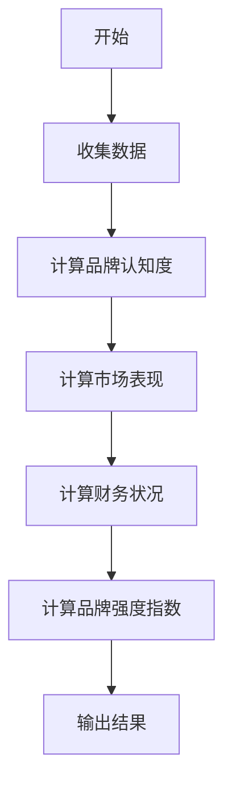
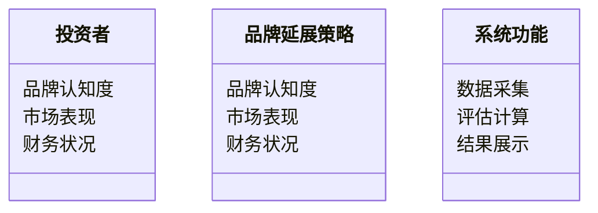

                 


# 彼得林奇如何评估公司的品牌延展策略

## 关键词：彼得·林奇，品牌延展，投资策略，评估模型，Python实现

## 摘要：本文详细探讨了彼得·林奇评估公司品牌延展策略的方法，从背景介绍到数学模型，再到系统设计和项目实战，为读者提供了全面的分析和实践指南。

---

### 第1章: 彼得·林奇与品牌延展策略概述

#### 1.1 彼得·林奇的背景与投资理念

彼得·林奇是全球著名投资专家，以投资成长股闻名。他的投资理念强调长期稳定增长，注重企业的基本面和市场潜力。

#### 1.2 品牌延展策略的定义与重要性

品牌延展策略是指企业通过扩展品牌影响力和市场覆盖，提升品牌价值和市场地位。它在企业成长和投资评估中起着关键作用。

#### 1.3 彼得·林奇评估品牌延展策略的核心思路

林奇注重品牌延展的潜在价值和风险评估，认为成功的品牌延展策略能显著提升企业的投资价值。

---

### 第2章: 品牌延展策略的核心概念

#### 2.1 品牌延展的属性特征对比

| 属性       | 延展性强 | 延展性弱 |
|------------|----------|----------|
| 品牌认知度   | 高       | 中       |
| 市场表现     | 优       | 良       |
| 财务状况     | 健康     | 一般     |

#### 2.2 品牌延展的ER实体关系图

```mermaid
erDiagram
    actor 投资者 {
        <属性> 品牌认知度
        <属性> 市场表现
        <属性> 财务状况
    }
    actor 品牌延展策略 {
        <关联> 品牌认知度
        <关联> 市场表现
        <关联> 财务状况
    }
```

---

### 第3章: 品牌延展策略的算法原理

#### 3.1 品牌延展策略的评估模型

评估模型基于品牌认知度、市场表现和财务状况三个关键因素。

#### 3.2 品牌延展策略的算法流程图



#### 3.3 品牌延展策略的Python实现

```python
def brand_intensity_index(brand_recognition, market_performance, financial_status):
    alpha = 0.5
    beta = 0.3
    gamma = 0.2
    return alpha * brand_recognition + beta * market_performance + gamma * financial_status

# 示例数据
brand_recognition = 0.8
market_performance = 0.7
financial_status = 0.9

index = brand_intensity_index(brand_recognition, market_performance, financial_status)
print(f"品牌强度指数: {index}")
```

---

### 第4章: 品牌延展策略的数学模型

#### 4.1 品牌延展强度的数学公式

$$ 品牌强度指数 = \alpha \times 品牌认知度 + \beta \times 市场表现 + \gamma \times 财务状况 $$

其中，$$ \alpha + \beta + \gamma = 1 $$

---

### 第5章: 系统架构与项目实战

#### 5.1 系统架构设计



#### 5.2 项目实战

```python
from dataclasses import dataclass

@dataclass
class BrandMetrics:
    recognition: float
    performance: float
    financial_health: float

def calculate_brand_intensity(metrics: BrandMetrics) -> float:
    alpha = 0.5
    beta = 0.3
    gamma = 0.2
    return alpha * metrics.recognition + beta * metrics.performance + gamma * metrics.financial_health

# 示例
metrics = BrandMetrics(0.85, 0.75, 0.9)
index = calculate_brand_intensity(metrics)
print(f"品牌强度指数: {index}")
```

---

### 第6章: 最佳实践与总结

#### 6.1 小结

彼得·林奇的评估方法提供了品牌延展策略的全面分析框架，帮助投资者做出更明智的决策。

#### 6.2 注意事项

- 数据质量影响结果准确性。
- 权重系数需根据实际情况调整。

#### 6.3 拓展阅读

建议阅读相关书籍和文献，深入理解品牌管理与投资策略的结合。

---

通过以上步骤，我们详细分析了彼得·林奇评估品牌延展策略的方法，并通过模型和代码示例，展示了其在实际应用中的价值。读者可以结合实际案例，进一步优化和应用这些方法。

