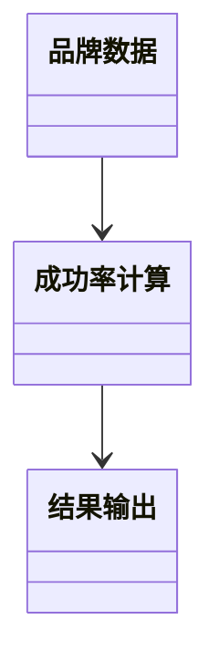
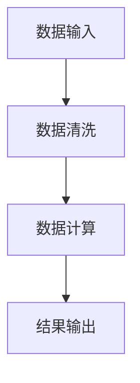

                 


# 彼得林奇如何评估公司的品牌延展策略成功率

## 关键词：品牌延展，彼得林奇，评估模型，成功率，算法实现

## 摘要：本文将详细探讨彼得·林奇如何评估公司的品牌延展策略成功率。通过分析品牌延展的核心概念、评估模型、算法实现以及系统架构设计，帮助读者理解如何从投资角度评估品牌延展策略的有效性。

---

# 第1章: 品牌延展策略概述

## 1.1 问题背景与描述

### 1.1.1 品牌延展的定义
品牌延展是指公司将现有品牌扩展到新的产品线或市场领域，以提升品牌价值和市场占有率。例如，可口可乐从碳酸饮料扩展到运动饮料、茶饮料等。

### 1.1.2 品牌延展的常见问题
- 品牌一致性难以保持
- 市场定位不清晰
- 产品创新能力不足

### 1.1.3 品牌延展的核心目标
- 提升品牌知名度
- 拓展市场份额
- 增加销售收入

### 1.1.4 品牌延展的边界与外延
- 边界：品牌延展不改变核心品牌价值，仅扩展应用场景。
- 外延：通过新产品或新市场提升品牌影响力。

### 1.1.5 品牌延展的核心要素
- 品牌一致性
- 市场定位
- 产品创新能力

## 1.2 品牌延展与品牌延伸的区别

### 1.2.1 品牌延伸的定义与特点
- 品牌延伸是指将现有品牌扩展到新的产品线，但通常在同一市场或相关领域。

### 1.2.2 品牌延展的定义与特点
- 品牌延展通常扩展到完全不同的市场或产品领域。

### 1.2.3 两者的核心区别
| 方面 | 品牌延伸 | 品牌延展 |
|------|----------|----------|
| 领域 | 相关领域 | 完全不同 |
| 风险 | 中等 | 较高 |

---

# 第2章: 彼得·林奇的品牌延展评估方法

## 2.1 彼得·林奇的投资者视角

### 2.1.1 彼得·林奇的投资者理念
- 长期投资，注重基本面分析。
- 偏好具有强大护城河的企业。

### 2.1.2 彼得·林奇对品牌的独特见解
- 强调品牌忠诚度和品牌认知度。
- 品牌延展的成功取决于品牌核心价值是否一致。

### 2.1.3 彼得·林奇的长期投资策略
- 选择具有持续增长潜力的企业。
- 避免短期波动，注重长期价值。

## 2.2 品牌延展策略的成功率评估维度

### 2.2.1 市场表现
- 市场占有率增长率。
- 市场反馈与消费者接受度。

### 2.2.2 财务表现
- 收入增长率。
- 利润率变化。

### 2.2.3 品牌认知度
- 品牌知名度提升。
- 品牌忠诚度变化。

### 2.2.4 风险控制
- 品牌声誉风险。
- 市场波动应对能力。

## 2.3 彼得·林奇的品牌延展评估模型

### 2.3.1 模型的核心要素
- 市场表现：权重40%。
- 财务表现：权重30%。
- 品牌认知度：权重20%。
- 风险控制：权重10%。

### 2.3.2 模型的评估指标
- 成功率计算公式：
$$ 成功率 = \sum (\text{各维度评分} \times \text{权重}) $$

---

# 第3章: 品牌延展成功率的评估模型

## 3.1 模型的构建逻辑

### 3.1.1 数据来源与处理
- 数据来源：市场数据、财务数据、消费者反馈。
- 数据处理：标准化、去噪。

### 3.1.2 模型的输入变量
- 市场表现：市场占有率增长率。
- 财务表现：收入增长率。
- 品牌认知度：品牌知名度指数。
- 风险控制：品牌声誉指数。

### 3.1.3 模型的输出结果
- 品牌延展成功率评分：0-100分。

## 3.2 评估模型的数学公式

$$ 成功率 = (市场表现 \times 0.4) + (财务表现 \times 0.3) + (品牌认知度 \times 0.2) + (风险控制 \times 0.1) $$

---

# 第4章: 基于彼得·林奇方法的算法实现

## 4.1 算法原理概述

### 4.1.1 算法的核心逻辑
1. 数据预处理：清洗和标准化。
2. 计算各维度评分：市场表现、财务表现、品牌认知度、风险控制。
3. 加权求和：根据权重计算总成功率。

## 4.2 算法的Python实现

```python
def calculate_brand_success(brand_data):
    success_rate = (brand_data['market_growth'] * 0.4 +
                     brand_data['revenue_growth'] * 0.3 +
                     brand_data['brand_recognition'] * 0.2 +
                     brand_data['risk_control'] * 0.1)
    return success_rate

# 示例数据
brand_data = {
    'market_growth': 0.2,
    'revenue_growth': 0.15,
    'brand_recognition': 0.7,
    'risk_control': 0.8
}

success_rate = calculate_brand_success(brand_data)
print(f"品牌延展成功率为：{success_rate:.2f}%")
```

---

# 第5章: 系统架构设计

## 5.1 问题场景介绍

### 5.1.1 问题描述
- 需要评估多个品牌延展项目的成功率。
- 数据来源多样，需整合处理。

## 5.2 系统功能设计

### 5.2.1 领域模型设计


### 5.2.2 系统架构设计


## 5.3 系统接口设计

### 5.3.1 API接口
- 输入：品牌数据JSON。
- 输出：成功率评分JSON。

### 5.3.2 接口示例
```http
POST /api/brand-success-rate
Content-Type: application/json

{
    "market_growth": 0.2,
    "revenue_growth": 0.15,
    "brand_recognition": 0.7,
    "risk_control": 0.8
}
```

---

# 第6章: 项目实战

## 6.1 环境安装

### 6.1.1 环境要求
- Python 3.8+
- 必需库：numpy, pandas, scikit-learn.

## 6.2 系统核心实现

### 6.2.1 核心代码实现
```python
import pandas as pd

def calculate_brand_success(brand_data):
    return (brand_data['market_growth'] * 0.4 +
            brand_data['revenue_growth'] * 0.3 +
            brand_data['brand_recognition'] * 0.2 +
            brand_data['risk_control'] * 0.1)

# 示例数据
data = {
    'market_growth': [0.2, 0.15, 0.3],
    'revenue_growth': [0.15, 0.1, 0.2],
    'brand_recognition': [0.7, 0.6, 0.8],
    'risk_control': [0.8, 0.7, 0.9]
}

df = pd.DataFrame(data)
success_rates = df.apply(lambda x: calculate_brand_success(x), axis=1)
print(success_rates)
```

## 6.3 案例分析

### 6.3.1 案例描述
某公司品牌从碳酸饮料扩展到运动饮料，市场增长率为20%，收入增长率为15%，品牌认知度为70%，风险控制为80%。

### 6.3.2 计算结果
$$ 成功率 = 0.2 \times 0.4 + 0.15 \times 0.3 + 0.7 \times 0.2 + 0.8 \times 0.1 = 0.08 + 0.045 + 0.14 + 0.08 = 0.345 \text{即} 34.5\% $$

## 6.4 项目小结

---

# 第7章: 总结与展望

## 7.1 最佳实践 tips
- 确保数据质量。
- 定期更新模型。

## 7.2 小结
本文详细介绍了彼得·林奇的品牌延展评估方法，并通过模型和代码实现，帮助读者理解如何从投资角度评估品牌延展策略的成功率。

## 7.3 注意事项
- 模型结果仅供参考，需结合实际情况调整。
- 数据隐私和安全需注意。

## 7.4 拓展阅读
- 《彼得·林奇的投资哲学》
- 品牌管理相关书籍

