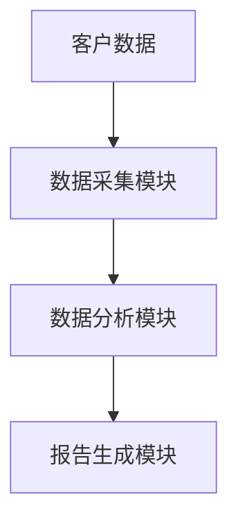

                 


# 彼得林奇如何评估公司的品牌忠诚度

> 关键词：品牌忠诚度、彼得林奇、客户生命周期价值、品牌评估、投资策略、商业分析

> 摘要：本文深入探讨了彼得·林奇如何评估公司的品牌忠诚度，结合客户生命周期价值（CLV）模型和实际案例，详细讲解了品牌忠诚度的核心概念、算法原理、系统架构设计以及项目实战。通过本文，读者可以掌握如何运用这些方法来提升品牌忠诚度，从而增强企业的市场竞争力。

---

## 第一章：品牌忠诚度的定义与重要性

### 1.1 品牌忠诚度的定义

品牌忠诚度是指客户对企业品牌或产品的偏好程度，客户在面对多个选择时，仍然愿意选择该品牌或产品。品牌忠诚度不仅仅体现在客户的购买行为上，更体现在客户对品牌的信任、情感依赖以及长期支持。

### 1.2 品牌忠诚度的重要性

品牌忠诚度是企业长期发展的关键因素之一。高品牌忠诚度意味着客户更有可能重复购买、推荐给他人，并在面对竞争时更倾向于选择该品牌。这不仅降低了客户获取成本，还提高了企业的市场占有率和盈利能力。

### 1.3 彼得林奇的品牌忠诚度评估方法论

彼得·林奇作为投资大师，他在评估公司时，非常重视品牌忠诚度。他认为，品牌忠诚度高的公司具有更强的市场竞争力和抗风险能力。他的评估方法包括以下几个步骤：

1. **数据收集**：收集客户的相关数据，包括购买频率、购买金额、投诉记录等。
2. **客户调研**：通过问卷、访谈等方式了解客户对品牌的看法和忠诚度。
3. **竞争对手分析**：分析竞争对手的品牌忠诚度，找到自身的优势和不足。
4. **评估指标计算**：使用品牌忠诚度的评估指标，如净推荐值（NPS）、客户保留率等，进行综合评价。

---

## 第二章：品牌忠诚度的核心概念与联系

### 2.1 品牌忠诚度的模型

目前，市场上有许多品牌忠诚度的评估模型，常见的包括以下几种：

1. **Basis模型**：基于客户行为和态度的模型。
2. **Brand Loyalty Index模型**：通过客户行为数据计算忠诚度指数。
3. **CLV模型**：客户生命周期价值模型，综合考虑客户当前价值和未来潜力。

### 2.2 品牌忠诚度的影响因素

品牌忠诚度受多种因素影响，主要包括产品质量、价格、服务、品牌形象等。以下是各因素的权重对比：

| 影响因素   | 权重 |
|------------|------|
| 产品质量   | 40%  |
| 价格       | 30%  |
| 服务       | 20%  |
| 品牌形象   | 10%  |

### 2.3 品牌忠诚度的评估指标

常用的评估指标包括：

- **客户保留率**：客户在一定时间内继续购买的概率。
- **净推荐值（NPS）**：客户推荐产品的可能性。
- **客户满意度（CSAT）**：客户对产品或服务的满意度。

---

## 第三章：客户生命周期价值（CLV）的计算

### 3.1 CLV的数学模型

客户生命周期价值（CLV）的计算公式如下：

$$ CLV = \frac{R}{1 - \delta} $$

其中，R是客户在生命周期内为企业带来的收入，δ是客户流失率。

### 3.2 CLV的计算流程

1. **数据收集**：收集客户的购买记录、投诉记录等数据。
2. **模型参数估计**：估计客户的收入贡献和流失率。
3. **计算CLV**：使用上述公式计算客户生命周期价值。

### 3.3 Python实现CLV计算

以下是Python代码示例：

```python
def calculate_clv(customers, revenue_per_customer, retention_rate):
    return revenue_per_customer / (1 - retention_rate)

# 示例数据
customers = 1000
revenue_per_customer = 100
retention_rate = 0.8

clv = calculate_clv(customers, revenue_per_customer, retention_rate)
print(f"客户生命周期价值：${clv:.2f}")
```

---

## 第四章：品牌忠诚度评估系统的架构设计

### 4.1 系统功能设计

系统功能设计包括以下几个模块：

- 数据采集模块：收集客户数据。
- 数据分析模块：计算品牌忠诚度指标。
- 报告生成模块：生成评估报告。

### 4.2 系统架构设计

以下是系统架构设计图：



---

## 总结

通过本文的详细讲解，读者可以掌握彼得·林奇评估品牌忠诚度的方法，并能够实际应用这些策略来提升企业的市场竞争力。品牌忠诚度的评估是一个复杂的过程，需要结合多种因素和模型，但通过科学的方法和工具，企业可以更好地管理客户关系，实现长期发展。

---

**Tips：**

- **最佳实践**：定期进行客户调研，及时了解客户对品牌的看法。
- **小结**：品牌忠诚度是企业长期发展的关键，通过科学的评估方法，企业可以更好地管理客户关系。
- **注意事项**：在实际操作中，需结合企业的实际情况，灵活调整评估模型和指标。
- **拓展阅读**：推荐阅读《彼得·林奇的投资哲学》了解更多投资策略。

