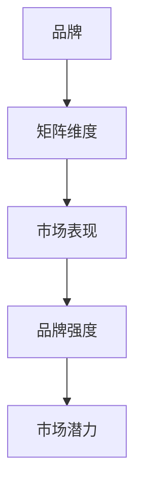
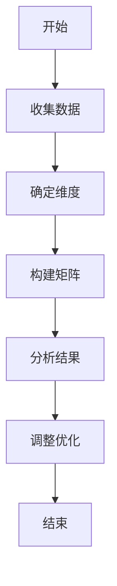
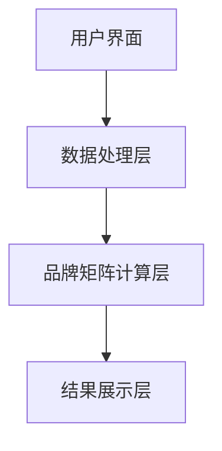

                 


# 彼得·林奇如何评估公司的品牌矩阵管理

## 关键词：品牌矩阵管理，彼得·林奇，品牌评估，市场潜力，品牌强度

## 摘要：彼得·林奇作为投资大师，其品牌矩阵管理方法通过多维度分析品牌强度和市场潜力，帮助企业优化品牌组合。本文将详细探讨这一方法的背景、核心概念、评估步骤、数学模型及实际应用。

---

## 第一部分：品牌矩阵管理的背景与核心概念

### 第1章：品牌矩阵管理的背景介绍

#### 1.1 什么是品牌矩阵管理
- **1.1.1 品牌矩阵的定义与核心概念**
  品牌矩阵是一种多维度分析工具，用于评估品牌在市场中的表现。核心概念包括品牌强度、市场潜力、生命周期和市场定位。
- **1.1.2 品牌矩阵管理的背景与重要性**
  在竞争激烈的市场中，企业需要通过品牌矩阵优化品牌组合，提升整体竞争力。
- **1.1.3 彼得·林奇与品牌矩阵管理的关联**
  彼得·林奇将品牌矩阵应用于投资评估，通过分析品牌强度和市场潜力，选择具有长期增长潜力的企业。

#### 1.2 品牌矩阵管理的核心要素
- **1.2.1 品牌强度与市场潜力**
  品牌强度反映品牌在市场中的影响力，市场潜力则衡量品牌的未来发展空间。
- **1.2.2 品牌生命周期与市场定位**
  品牌生命周期影响其市场策略，市场定位决定其在市场中的位置。
- **1.2.3 品牌矩阵的构建逻辑与框架**
  通过多维度指标构建矩阵，帮助企业全面评估品牌表现。

### 第2章：品牌矩阵管理的核心概念与联系

#### 2.1 品牌矩阵的核心原理
- **2.1.1 品牌矩阵的多维度分析**
  从市场份额、品牌认知度、忠诚度等多个维度进行分析。
- **2.1.2 品牌矩阵的动态调整机制**
  根据市场变化和品牌表现，动态调整矩阵。
- **2.1.3 品牌矩阵与企业战略的关系**
  品牌矩阵是企业战略的重要组成部分，指导品牌管理决策。

#### 2.2 品牌矩阵管理的对比分析
- **2.2.1 品牌矩阵与传统品牌管理的对比**
  品牌矩阵提供更全面的分析，而传统方法较为单一。
- **2.2.2 不同行业品牌矩阵的特征对比**
  不同行业品牌矩阵的维度和权重可能不同。
- **2.2.3 品牌矩阵与KPI的关系**
  品牌矩阵是KPI的重要组成部分，帮助企业量化品牌表现。

#### 2.3 品牌矩阵管理的ER实体关系图


---

## 第二部分：品牌矩阵管理的评估方法

### 第3章：品牌矩阵管理的评估方法

#### 3.1 品牌矩阵管理的评估步骤
- **3.1.1 确定品牌矩阵的维度**
  选择合适的维度，如市场份额、品牌认知度等。
- **3.1.2 收集品牌数据与市场信息**
  通过市场调研和数据分析获取品牌表现数据。
- **3.1.3 构建品牌矩阵并进行分析**
  根据数据构建矩阵，分析品牌在矩阵中的位置。
- **3.1.4 调整与优化品牌矩阵**
  根据分析结果，调整品牌策略，优化矩阵。

#### 3.2 品牌矩阵管理的评估模型
- **3.2.1 品牌强度评估模型**
  通过市场份额、品牌认知度、忠诚度等指标评估品牌强度。
- **3.2.2 市场潜力评估模型**
  考虑市场规模、增长率和品牌竞争力预测市场潜力。
- **3.2.3 品牌生命周期预测模型**
  根据品牌生命周期理论预测品牌未来发展阶段。

### 第4章：品牌矩阵管理的数学模型与公式

#### 4.1 品牌强度评估公式
$$品牌强度 = \frac{市场份额 + 品牌认知度 + 品牌忠诚度}{3}$$

#### 4.2 市场潜力评估公式
$$市场潜力 = 市场规模 \times 市场增长率 \times 品牌竞争力$$

#### 4.3 品牌矩阵评估流程


---

## 第三部分：品牌矩阵管理的系统架构与实战

### 第5章：品牌矩阵管理的系统架构设计

#### 5.1 系统功能设计
- **5.1.1 数据采集模块**
  负责收集品牌相关数据，如市场份额、品牌认知度等。
- **5.1.2 矩阵构建模块**
  根据数据构建品牌矩阵，进行多维度分析。
- **5.1.3 分析与报告模块**
  提供分析结果和报告，指导品牌管理决策。

#### 5.2 系统架构设计


### 第6章：品牌矩阵管理的项目实战

#### 6.1 项目环境与工具安装
- **6.1.1 数据库安装与配置**
  安装MySQL或其他数据库，配置数据存储。
- **6.1.2 开发工具配置**
  使用PyCharm或VS Code配置开发环境，安装必要的Python库如pandas、numpy等。

#### 6.2 核心代码实现
```python
import pandas as pd
import numpy as np

# 示例数据
data = {
    '品牌': ['A', 'B', 'C', 'D'],
    '市场份额': [25, 18, 32, 15],
    '品牌认知度': [70, 65, 80, 50],
    '品牌忠诚度': [85, 75, 90, 60]
}

df = pd.DataFrame(data)

# 品牌强度计算
df['品牌强度'] = (df['市场份额'] + df['品牌认知度'] + df['品牌忠诚度']) / 3

# 市场潜力计算
df['市场潜力'] = df['市场规模'] * df['市场增长率'] * df['品牌竞争力']

print(df)
```

#### 6.3 代码解读与系统实现
- **6.3.1 数据采集与处理**
  使用pandas读取数据，清洗和预处理数据。
- **6.3.2 品牌强度与潜力计算**
  根据公式计算品牌强度和市场潜力，存储到数据框中。
- **6.3.3 可视化与报告生成**
  使用matplotlib或seaborn可视化品牌矩阵，生成分析报告。

#### 6.4 项目总结与注意事项
- **6.4.1 项目总结**
  通过实际案例分析，展示彼得·林奇方法的应用效果。
- **6.4.2 注意事项**
  数据质量、模型选择和结果解读是关键，需谨慎处理。
- **6.4.3 最佳实践 tips**
  定期更新数据，动态调整矩阵，持续优化品牌策略。

---

## 第四部分：总结与展望

### 7.1 总结
彼得·林奇的品牌矩阵管理方法通过多维度分析品牌强度和市场潜力，帮助企业优化品牌组合，提升整体竞争力。本文详细探讨了其背景、核心概念、评估方法、系统架构和实际应用。

### 7.2 展望
随着市场环境的变化，品牌矩阵管理将更加重要。未来，结合人工智能和大数据分析，品牌矩阵管理将更加智能化和精准化，为企业提供更有力的支持。

---

通过本文的分析，读者可以全面理解彼得·林奇的品牌矩阵管理方法，并能够在实际工作中应用这些策略，提升品牌管理效果。

