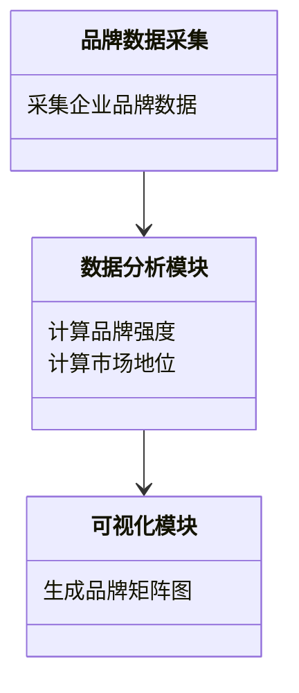
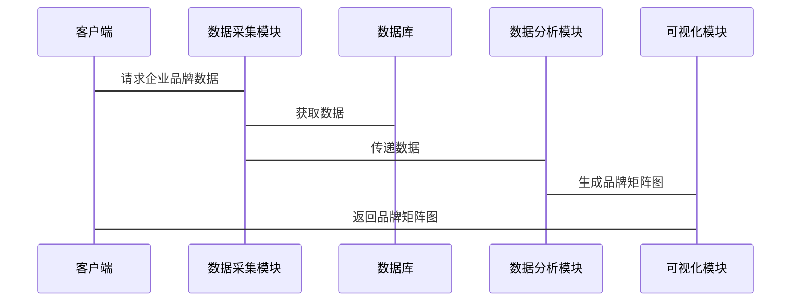

                 


# 彼得林奇如何评估公司的品牌矩阵管理效果

> 关键词：彼得林奇，品牌矩阵，企业价值评估，投资策略，价值投资

> 摘要：本文详细介绍了彼得·林奇如何通过品牌矩阵管理来评估公司的品牌价值和市场表现。文章从品牌矩阵管理的核心概念、评估维度、算法原理、系统分析、项目实战和最佳实践等方面展开，深入分析了品牌矩阵管理在企业价值评估中的重要性，并结合实际案例展示了如何通过品牌矩阵管理优化企业投资决策。

---

## 第一部分: 彼得林奇投资哲学与品牌矩阵管理概述

### 第1章: 彼得林奇投资哲学与品牌矩阵管理概述

#### 1.1 彼得林奇投资哲学的核心理念

##### 1.1.1 价值投资的基本原理
价值投资是一种长期投资策略，强调以低于公平价值的价格买入优质资产。彼得·林奇是这一策略的杰出代表，他认为市场的短期波动为投资者提供了以合理价格买入优秀企业的机会。他的投资哲学强调对企业的深入研究和长期关注。

##### 1.1.2 彼得林奇的投资策略与方法
林奇的投资策略包括：
1. **深入研究企业基本面**：关注财务报表、行业地位和竞争优势。
2. **长期持有优质股票**：避免频繁交易，减少交易成本。
3. **分散投资**：通过投资多个行业和企业降低风险。

##### 1.1.3 品牌矩阵管理的核心概念
品牌矩阵管理是林奇评估企业品牌价值的重要工具。它通过将企业的品牌强度、市场地位和增长潜力等指标进行矩阵化分析，帮助企业识别核心竞争力和潜在风险。

---

#### 1.2 品牌矩阵管理的定义与背景

##### 1.2.1 品牌矩阵管理的定义
品牌矩阵管理是一种通过多维度指标评估企业品牌价值的方法。它将品牌强度、市场地位、增长潜力等指标进行量化分析，并通过矩阵图展示企业的品牌竞争力。

##### 1.2.2 品牌矩阵管理的背景与重要性
在竞争激烈的市场环境中，企业品牌价值是决定企业长期发展的关键因素。品牌矩阵管理通过量化品牌表现，帮助企业制定更科学的投资和运营策略。

##### 1.2.3 品牌矩阵管理与企业价值的关系
品牌矩阵管理通过分析企业的品牌强度和市场地位，评估其潜在价值和竞争优势，从而为投资决策提供支持。

---

#### 1.3 品牌矩阵管理的评估维度

##### 1.3.1 品牌强度与市场地位
品牌强度反映品牌在市场中的影响力，包括市场份额、品牌认知度和客户忠诚度。市场地位则关注企业在行业中的排名和竞争优势。

##### 1.3.2 品牌增长潜力与财务表现
品牌增长潜力取决于市场需求、行业发展趋势和企业的创新能力。财务表现包括收入、利润和现金流等指标，是评估品牌价值的重要依据。

##### 1.3.3 品牌风险与竞争优势
品牌风险包括市场风险、行业风险和运营风险。竞争优势则关注企业在技术、成本和渠道方面的优势。

---

### 第2章: 品牌矩阵管理的核心概念与联系

#### 2.1 品牌矩阵管理的核心要素

##### 2.1.1 品牌强度的评估指标
品牌强度评估指标包括：
- 市场份额
- 品牌认知度
- 客户忠诚度

##### 2.1.2 市场地位的衡量标准
市场地位衡量标准包括：
- 行业排名
- 市场影响力
- 竞争对手分析

##### 2.1.3 品牌增长潜力的预测方法
品牌增长潜力预测方法包括：
- 市场需求分析
- 行业发展趋势
- 企业创新能力

#### 2.2 品牌矩阵管理的原理与模型

##### 2.2.1 品牌矩阵管理的原理
品牌矩阵管理通过多维度指标分析，将企业品牌表现可视化为矩阵图。矩阵图中的每个位置代表企业品牌在不同维度上的表现。

##### 2.2.2 品牌矩阵管理的模型与框架
品牌矩阵管理模型包括：
1. **品牌强度与市场地位矩阵**：评估品牌在市场中的竞争力。
2. **品牌增长潜力与财务表现矩阵**：预测品牌未来的增长潜力。

##### 2.2.3 品牌矩阵管理的数学模型
品牌矩阵管理的数学模型包括：
- 市场份额计算公式：
  $$ \text{市场份额} = \frac{\text{企业销售额}}{\text{行业销售额}} $$
- 品牌强度评分：
  $$ \text{品牌强度} = \text{市场份额} \times \text{品牌认知度} \times \text{客户忠诚度} $$

#### 2.3 品牌矩阵管理与企业价值的关系

##### 2.3.1 品牌价值对企业价值的影响
品牌价值是企业整体价值的重要组成部分。强大的品牌能够提升企业的议价能力和市场地位，从而增加企业价值。

##### 2.3.2 品牌矩阵管理对企业投资决策的作用
通过品牌矩阵管理，投资者可以更准确地评估企业的品牌竞争力，从而做出更科学的投资决策。

##### 2.3.3 品牌矩阵管理的长期与短期效果
品牌矩阵管理不仅有助于长期品牌建设，还能通过短期财务表现评估企业的健康状况。

---

### 第3章: 品牌矩阵管理的系统分析与架构设计

#### 3.1 系统功能设计

##### 3.1.1 系统功能模块
- 数据采集模块：收集企业品牌数据。
- 数据分析模块：计算品牌强度、市场地位等指标。
- 可视化模块：生成品牌矩阵图。

##### 3.1.2 领域模型类图


#### 3.2 系统架构设计

##### 3.2.1 系统架构图
```mermaid
archi
title 品牌矩阵管理系统的架构图
top
    客户端
    --> 公共API
    --> 数据库
    --> 数据分析模块
    --> 可视化模块
```

#### 3.3 接口设计与交互流程

##### 3.3.1 系统接口设计
- 数据采集接口：用于获取企业品牌数据。
- 数据分析接口：用于计算品牌强度和市场地位。
- 可视化接口：用于生成品牌矩阵图。

##### 3.3.2 系统交互流程


---

### 第4章: 品牌矩阵管理的项目实战

#### 4.1 项目环境安装

##### 4.1.1 安装Python环境
```bash
# 安装Python
python --version
```

##### 4.1.2 安装依赖库
```bash
pip install pandas numpy matplotlib
```

#### 4.2 核心算法实现

##### 4.2.1 品牌强度计算
```python
def calculate_brand_strength(enterprise_sales, industry_sales, brand_recognition, customer Loyalty):
    market_share = enterprise_sales / industry_sales
    brand_strength = market_share * brand_recognition * customer_Loyalty
    return brand_strength
```

##### 4.2.2 市场地位计算
```python
def calculate_market_position(industry_rank, market_influence, competitor_analysis):
    market_position = industry_rank + market_influence + competitor_analysis
    return market_position
```

#### 4.3 实际案例分析

##### 4.3.1 案例介绍
分析某行业内的两家竞争对手，评估其品牌矩阵管理效果。

##### 4.3.2 数据分析与结果解读
通过品牌矩阵图展示两家企业的品牌强度和市场地位，分析其优劣势。

---

### 第5章: 品牌矩阵管理的最佳实践

#### 5.1 小结

##### 5.1.1 品牌矩阵管理的核心价值
品牌矩阵管理通过多维度指标分析，帮助企业优化品牌价值和市场表现。

##### 5.1.2 品牌矩阵管理的挑战与解决方案
- 挑战：数据获取困难、模型复杂度高。
- 解决方案：采用大数据技术，优化模型算法。

#### 5.2 注意事项

##### 5.2.1 数据质量的重要性
确保数据来源可靠，避免因数据错误导致评估偏差。

##### 5.2.2 模型的适用性
根据企业实际情况调整模型参数，避免盲目应用。

#### 5.3 拓展阅读

##### 5.3.1 品牌矩阵管理的最新研究
介绍品牌矩阵管理领域的最新研究成果和技术进展。

##### 5.3.2 彼得林奇的投资策略
深入学习彼得·林奇的投资策略，结合品牌矩阵管理优化投资决策。

---

## 第六部分: 结论与展望

### 结论

通过本文的分析，我们可以看出彼得·林奇的品牌矩阵管理在企业价值评估中具有重要的作用。它不仅帮助企业识别品牌价值，还能为投资决策提供科学依据。

### 展望

未来，随着大数据和人工智能技术的发展，品牌矩阵管理将更加智能化和精准化。投资者可以通过更先进的技术手段，进一步优化品牌矩阵管理模型，提升投资决策的准确性。

---

通过以上内容，我们深入探讨了彼得·林奇如何评估公司的品牌矩阵管理效果，并通过实际案例展示了其在投资决策中的应用。希望本文能够为投资者和企业提供有价值的参考和启示。

