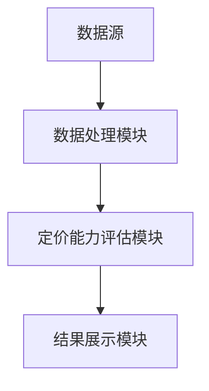

                 

# 彼得林奇如何评估公司的定价能力

> 关键词：定价能力、彼得·林奇、定价模型、成本结构、市场定价权

> 摘要：本文深入分析了彼得·林奇如何评估公司的定价能力，从定价能力的核心概念、数学模型、系统架构到实战案例，详细阐述了定价能力的评估方法及其在企业中的应用。

---

# 第一部分: 定价能力的核心概念与背景

## 第1章: 定价能力的定义与重要性

### 1.1 定价能力的定义与重要性

#### 1.1.1 定价能力的定义
定价能力是指企业在市场上对产品或服务制定价格的能力，这种能力不仅影响企业的利润，还反映了企业在市场中的竞争力和定价策略的有效性。

#### 1.1.2 定价能力在企业中的重要性
定价能力是企业核心竞争力之一，直接影响企业的收入和利润。有效的定价策略可以帮助企业在竞争中占据优势，同时优化成本结构，提升市场定价权。

#### 1.1.3 彼得·林奇对定价能力的关注
作为著名投资专家，彼得·林奇在其投资实践中非常重视公司的定价能力。他认为，一个公司如果能够持续有效地制定价格，往往具有更强的市场竞争力和盈利能力。

---

## 第2章: 彼得·林奇的定价能力评估方法

### 2.1 彼得·林奇的定价能力评估框架

#### 2.1.1 模型的构建逻辑
彼得·林奇的定价能力评估模型基于以下几个核心要素：
1. 市场定价权：企业在市场上是否具有定价权。
2. 成本结构：企业的成本是否可控，是否能够支撑定价。
3. 需求弹性：产品或服务的需求对价格变化的敏感程度。

#### 2.1.2 模型的核心假设
1. 企业的定价能力与其市场地位密切相关。
2. 成本是定价的基础，但市场定价权是定价能力的核心。
3. 需求弹性决定了定价策略的可行性。

#### 2.1.3 模型的适用范围与限制
该模型适用于大多数行业，但在价格弹性极低或完全垄断的市场中可能需要调整。

---

## 第3章: 定价能力的核心要素

### 3.1 市场定价权的衡量

#### 3.1.1 市场定价权的定义
市场定价权是指企业在市场上能够自主决定产品或服务价格的能力，通常反映企业的市场地位和竞争优势。

#### 3.1.2 影响市场定价权的因素
1. 市场集中度：行业集中度越高，领先企业的定价权越强。
2. 产品差异化：独特的产品或服务能够增强企业的定价权。
3. 买家议价能力：买家的议价能力越弱，企业的定价权越强。

### 3.2 成本结构的分析

#### 3.2.1 成本结构的定义
成本结构是指企业在生产或提供产品或服务过程中所涉及的各种成本的构成比例。

#### 3.2.2 成本结构对定价的影响
1. 边际成本：单位产品的增量成本，直接影响定价的下限。
2. 固定成本：需要通过定价覆盖的固定支出。
3. 变动成本：与产量直接相关的成本，影响定价的灵活性。

---

## 第4章: 需求弹性的评估

### 4.1 需求弹性的定义
需求弹性是指价格变化对需求量的影响程度，通常分为需求弹性高和需求弹性低两种类型。

#### 4.1.1 需求弹性高的市场
在需求弹性高的市场中，价格的变化会导致需求量大幅波动，企业需要谨慎制定价格策略。

#### 4.1.2 需求弹性低的市场
在需求弹性低的市场中，价格的变化对需求量的影响较小，企业可以相对灵活地调整价格。

---

## 第5章: 彼得·林奇定价能力评估模型的数学表达

### 5.1 定价能力指数的构建

#### 5.1.1 定价能力指数公式
$$
\text{定价能力指数} = \frac{\text{市场定价权} + \text{成本控制能力} + \text{需求弹性}}{3}
$$

#### 5.1.2 公式解释
1. 市场定价权：反映企业在市场中的定价话语权。
2. 成本控制能力：反映企业在成本管理上的能力。
3. 需求弹性：反映价格变化对需求的影响程度。

### 5.2 成本与价格的关系模型

#### 5.2.1 成本与价格的关系公式
$$
\text{价格} = \text{成本} \times (1 + \text{利润率})
$$

#### 5.2.2 公式解释
1. 成本是定价的基础。
2. 利润率是企业在定价时需要考虑的收益目标。

---

## 第6章: 定价能力评估的系统架构与实现

### 6.1 系统功能设计

#### 6.1.1 数据采集与处理模块
1. 采集市场数据，包括价格、成本、需求量等。
2. 处理数据，提取关键指标。

#### 6.1.2 定价能力评估模块
1. 计算市场定价权。
2. 分析成本结构。
3. 评估需求弹性。
4. 计算定价能力指数。

#### 6.1.3 结果展示与分析模块
1. 展示评估结果。
2. 提供改进建议。

### 6.2 系统架构设计

#### 6.2.1 系统架构图

---

## 第7章: 定价能力评估的实战案例

### 7.1 案例背景与数据准备

#### 7.1.1 案例选择标准
选择一个具有代表性的行业，如高端电子产品行业。

#### 7.1.2 数据准备
收集该行业的市场数据，包括价格、成本、需求量等。

### 7.2 算法实现与结果分析

#### 7.2.1 数据预处理
1. 清洗数据，去除异常值。
2. 数据标准化。

#### 7.2.2 算法实现
1. 计算市场定价权。
2. 分析成本结构。
3. 评估需求弹性。
4. 计算定价能力指数。

### 7.3 实战结果与小结

#### 7.3.1 实战结果
通过模型计算得出，该企业的定价能力指数为0.85，表明其定价能力较强。

#### 7.3.2 小结
通过实战案例，验证了彼得·林奇定价能力评估模型的有效性。

---

## 第8章: 最佳实践与注意事项

### 8.1 小结
彼得·林奇的定价能力评估模型是一个简单而有效的工具，能够帮助企业评估其定价能力。

### 8.2 注意事项
1. 数据质量是模型准确性的重要保障。
2. 模型结果需要结合实际市场情况进行调整。
3. 定期更新数据，以反映市场变化。

### 8.3 拓展阅读
建议进一步学习彼得·林奇的其他投资策略，以及定价能力在不同行业的具体应用。

---

# 结语

通过本文的分析，我们可以看到，彼得·林奇的定价能力评估方法不仅是一种理论工具，更是一种实践指南。企业可以通过这种评估方法，优化其定价策略，提升市场竞争力。

