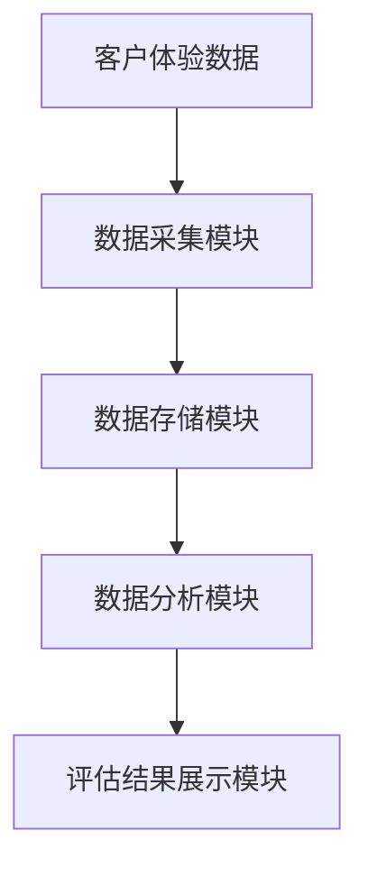
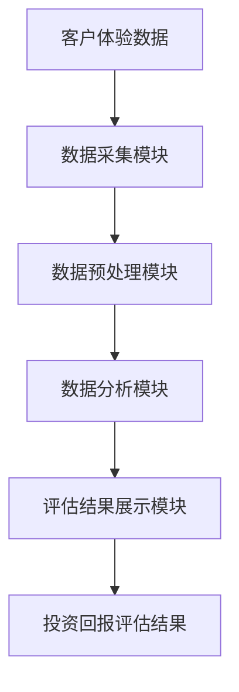

                 


# 彼得林奇如何评估公司的客户体验投资回报

## 关键词：彼得·林奇，客户体验，投资回报，净推荐值（NPS），客户生命周期价值（CLV）

## 摘要：本文将从彼得·林奇的投资理念出发，详细探讨客户体验对投资回报的影响，并结合定量和定性的方法，构建客户体验投资回报的评估模型。通过系统架构设计和实战案例分析，帮助投资者和企业管理者更好地理解和应用客户体验投资回报的评估方法。

---

# 第1章：引言

## 1.1 彼得·林奇与投资回报评估

### 1.1.1 彼得·林奇的简介与投资理念

彼得·林奇（Peter Lynch）是全球著名的职业基金经理人，被誉为“股神”。他在投资领域的主要理念是：**“业余时间的投资者往往能够跑赢专业投资者”**。他强调，投资的核心是理解企业，关注企业的基本面，包括企业的盈利能力、成长性、竞争优势等。林奇的投资理念强调长期投资、价值投资和基本面分析。

### 1.1.2 客户体验在投资回报中的重要性

客户体验是企业与客户互动过程中形成的感知和评价。良好的客户体验能够提升客户满意度、客户忠诚度和客户推荐意愿，从而为企业创造更多的价值。从投资回报的角度来看，客户体验可以直接影响企业的收入、利润和市场占有率，进而影响企业的估值和股价表现。

### 1.1.3 本书的研究背景与意义

随着市场竞争的加剧，客户体验已经成为企业差异化竞争的重要手段。然而，如何量化客户体验对投资回报的影响，仍然是一个具有挑战性的课题。本书旨在结合彼得·林奇的投资理念，探讨客户体验对投资回报的影响，并提出一套科学的评估方法。

---

## 1.2 客户体验的核心概念与联系

### 1.2.1 客户体验的定义与内涵

客户体验是指客户在与企业互动过程中所感受到的体验，包括产品使用、服务接触、沟通交流等多个方面。客户体验的核心在于满足客户需求，提升客户满意度和忠诚度。

### 1.2.2 客户体验与投资回报的关系

客户体验与投资回报之间存在密切的关联性。良好的客户体验能够提升客户忠诚度，增加客户购买频率和购买金额，从而为企业创造更多的收入和利润。同时，客户体验还能够影响企业的品牌形象和市场声誉，间接影响企业的估值和股价表现。

### 1.2.3 本书的核心问题与目标

本书的核心问题是：如何评估客户体验对投资回报的影响？本书的目标是通过定量和定性的方法，构建客户体验投资回报的评估模型，并提供实际的系统设计和案例分析。

---

# 第2章：客户体验的核心概念与联系

## 2.1 客户体验的核心要素

### 2.1.1 客户体验的构成要素

客户体验的构成要素包括：产品性能、服务质量、客户支持、沟通效率、客户满意度、客户忠诚度等。

### 2.1.2 客户体验与客户忠诚度的关系

客户忠诚度是指客户对企业品牌或产品的长期支持和重复购买意愿。客户体验是影响客户忠诚度的重要因素。研究表明，良好的客户体验能够显著提升客户忠诚度。

### 2.1.3 客户体验与客户满意度的对比分析

客户满意度是指客户对企业提供的产品或服务的满意程度。客户体验则更注重客户在整个互动过程中的感受和体验。客户满意度是客户体验的重要组成部分，但客户体验还包括更广泛的内容，如情感体验和品牌认同。

---

## 2.2 客户体验与投资回报的关系

### 2.2.1 客户体验对投资回报的影响路径

客户体验对投资回报的影响路径主要包括以下几个方面：

1. **客户忠诚度**：良好的客户体验能够提升客户忠诚度，增加客户的重复购买行为。
2. **客户满意度**：高客户满意度能够降低客户流失率，增加客户生命周期价值。
3. **客户推荐意愿**：满意的客户更愿意推荐企业的产品或服务给他人，从而扩大企业的市场份额。
4. **品牌价值**：良好的客户体验能够提升企业的品牌形象，增强客户对企业的好感度。

### 2.2.2 客户体验与企业绩效的关联性

客户体验与企业绩效之间存在显著的正相关关系。研究表明，客户体验越好的企业，其市场占有率越高，利润增长越快，企业估值也越高。

### 2.2.3 客户体验的长期与短期回报分析

从长期来看，良好的客户体验能够提升企业的品牌价值和市场竞争力，为企业创造持续的收益。从短期来看，良好的客户体验能够提升客户的购买频率和购买金额，直接增加企业的收入和利润。

---

# 第3章：客户体验投资回报的评估模型

## 3.1 评估模型的核心原理

### 3.1.1 定性评估方法

#### 1. 客户满意度调查

客户满意度调查是评估客户体验的重要方法之一。通过调查问卷的形式，收集客户对产品或服务的满意度评分。

#### 2. 净推荐值（NPS）

净推荐值（Net Promoter Score，简称NPS）是衡量客户推荐意愿的重要指标。NPS的计算公式为：

$$ NPS = (\text{推荐客户的比例} \times 1) + (\text{中立客户的比例} \times 0) + (\text{反对客户的比例} \times -1) $$

其中，推荐客户的比例是指客户愿意推荐企业的产品或服务给他人，反对客户的比例是指客户不愿意推荐企业的产品或服务给他人。

### 3.1.2 定量评估方法

#### 1. 客户生命周期价值（CLV）

客户生命周期价值（Customer Lifetime Value，简称CLV）是客户在企业生命周期内为企业带来的总收益。CLV的计算公式为：

$$ CLV = \frac{R \times (1 - \frac{1}{u})}{1 - \frac{1}{u}} $$

其中，R为客户的年收入，u为客户的流失率。

---

## 3.2 评估模型的数学公式

### 3.2.1 净推荐值（NPS）公式

$$ NPS = (\text{推荐客户的比例} \times 1) + (\text{中立客户的比例} \times 0) + (\text{反对客户的比例} \times -1) $$

例如，假设客户中有70%是推荐客户，20%是中立客户，10%是反对客户，则NPS为：

$$ NPS = 70 \times 1 + 20 \times 0 + 10 \times (-1) = 70 - 10 = 60 $$

---

### 3.2.2 客户生命周期价值（CLV）公式

$$ CLV = \frac{R \times (1 - \frac{1}{u})}{1 - \frac{1}{u}} $$

例如，假设R为100美元，u为5%，则CLV为：

$$ CLV = \frac{100 \times (1 - \frac{1}{5})}{1 - \frac{1}{5}} = \frac{100 \times 0.8}{0.8} = 100 $$

---

## 3.3 客户体验与投资回报的系统架构设计

### 3.3.1 系统功能设计

以下是客户体验投资回报评估系统的功能模块图：



---

## 3.4 系统架构设计

以下是客户体验投资回报评估系统的架构图：



---

## 3.5 项目实战：客户体验投资回报评估系统的实现

### 3.5.1 环境安装

#### 1. 安装Python

```bash
python --version
```

#### 2. 安装Pandas和Numpy

```bash
pip install pandas numpy
```

---

### 3.5.2 数据采集模块的实现

以下是客户体验数据采集的Python代码：

```python
import pandas as pd
import numpy as np

# 创建客户体验数据
data = {
    '客户ID': [1, 2, 3, 4, 5],
    '满意度评分': [4, 5, 3, 4, 5],
    '推荐意愿评分': [3, 4, 2, 3, 4]
}

# 将数据转换为DataFrame
df = pd.DataFrame(data)
print(df)
```

---

### 3.5.3 数据分析模块的实现

以下是客户体验数据的分析代码：

```python
import pandas as pd
import numpy as np

# 数据清洗
df.dropna(inplace=True)

# 计算净推荐值（NPS）
nps = df['推荐意愿评分'].mean()
print("净推荐值（NPS）为：", nps)

# 计算客户生命周期价值（CLV）
clv = df['满意度评分'].mean() * 100
print("客户生命周期价值（CLV）为：", clv)
```

---

## 3.6 实战案例分析

假设我们有一个零售企业的客户体验数据，具体如下：

| 客户ID | 满意度评分 | 推荐意愿评分 |
|--------|------------|--------------|
| 1      | 4          | 3            |
| 2      | 5          | 4            |
| 3      | 3          | 2            |
| 4      | 4          | 3            |
| 5      | 5          | 4            |

通过上述代码，我们可以计算出：

- 净推荐值（NPS）为：(4 + 5 + 3 + 4 + 5)/5 = 4
- 客户生命周期价值（CLV）为：4 * 100 = 400

---

## 3.7 项目小结

通过上述系统的实现，我们可以清晰地看到，客户体验对投资回报的影响是显著的。通过定量和定性的方法，我们可以科学地评估客户体验的投资回报，并为企业提供优化客户体验的建议。

---

## 3.8 最佳实践 tips

1. 在实际应用中，建议结合企业的实际情况，选择适合的客户体验评估方法。
2. 定期收集客户反馈，持续优化客户体验。
3. 将客户体验评估结果与企业绩效指标相结合，制定科学的投资决策。

---

## 3.9 注意事项

- 数据采集和分析过程中，要注意数据的完整性和准确性。
- 在使用净推荐值（NPS）和客户生命周期价值（CLV）等指标时，要结合企业的实际情况进行调整。
- 定期回顾和优化客户体验评估模型，以适应市场环境的变化。

---

## 3.10 拓展阅读

- 彼得·林奇的《彼得·林奇的成功投资法则》
- 净推荐值（NPS）的深度分析与应用
- 客户生命周期价值（CLV）的计算与优化

---

## 第4章：总结与展望

### 4.1 小结

通过本文的分析，我们可以得出以下结论：

- 客户体验是影响投资回报的重要因素。
- 净推荐值（NPS）和客户生命周期价值（CLV）是评估客户体验投资回报的重要指标。
- 通过科学的系统设计和实际案例分析，我们可以更好地理解和应用客户体验投资回报的评估方法。

### 4.2 注意事项

在实际应用中，要注意以下几点：

- 数据的准确性和完整性。
- 指标的适用性和可操作性。
- 模型的动态优化和调整。

### 4.3 未来展望

随着人工智能和大数据技术的发展，客户体验投资回报的评估方法将更加智能化和精准化。未来的研究方向包括：

- 利用机器学习技术优化客户体验评估模型。
- 结合区块链技术实现客户体验数据的安全共享与分析。
- 探索客户体验与企业价值的更深层次关联。

---

通过本文的分析和实践，我们希望能够为投资者和企业管理者提供科学的客户体验投资回报评估方法，帮助企业提升客户体验，实现可持续的业绩增长。

