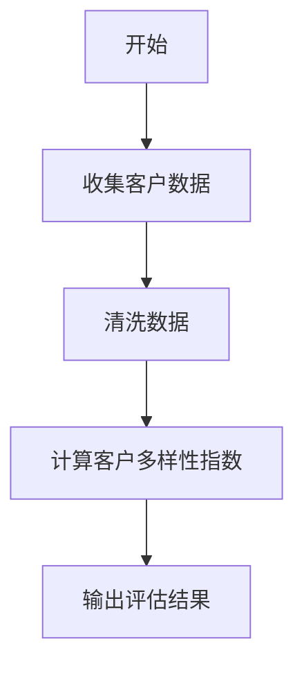
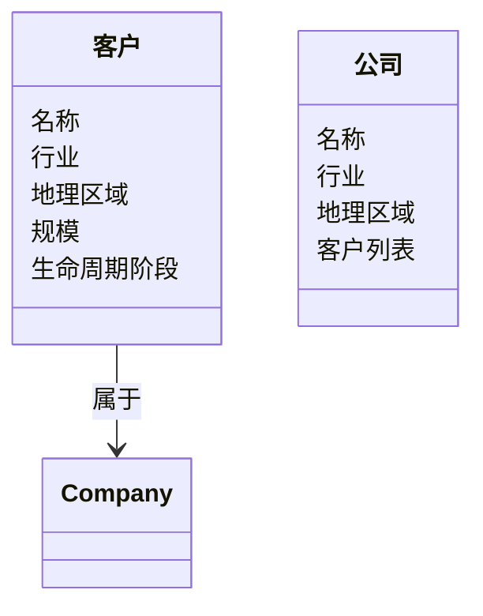
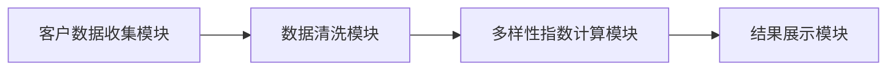
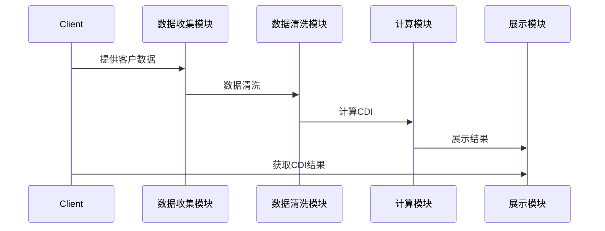

                 


# 彼得林奇如何评估公司的客户多样性

## 关键词：客户多样性，彼得·林奇，投资策略，评估方法，数据分析，风险管理

## 摘要：  
本文详细解析了彼得·林奇在评估公司客户多样性方面的独特方法和策略。通过逻辑清晰的步骤分析，结合实际案例和数学模型，深入探讨了客户多样性评估的重要性、核心概念、算法原理、系统架构以及项目实战。文章旨在帮助读者全面理解如何通过客户多样性评估来优化投资决策，降低风险，提升企业价值。

---

# 第1章 客户多样性评估的背景与重要性

## 1.1 客户多样性评估的背景

### 1.1.1 什么是客户多样性
客户多样性指的是公司在不同客户群体中的分布情况，包括地理分布、行业分布、客户规模和客户生命周期阶段等维度的分散程度。一个具有高度客户多样性的公司能够通过多样化客户群体的需求差异，降低业务波动风险，提高市场适应能力。

### 1.1.2 客户多样性评估的必要性
在投资领域，客户多样性是评估公司抗风险能力的重要指标。单一客户依赖的公司容易受到客户需求波动的影响，而客户多样化的公司则能够在不同市场环境下保持稳定收入，从而提升投资价值。

### 1.1.3 彼得·林奇的客户多样性评估核心理念
彼得·林奇认为，客户多样性不仅是降低风险的关键因素，也是公司长期稳定增长的重要保障。他通过分析客户分布的广度和深度，评估公司在不同市场环境下的适应能力。

---

## 1.2 彼得·林奇的客户多样性评估方法

### 1.2.1 客户多样性评估框架
彼得·林奇的客户多样性评估框架包括以下几个核心要素：
1. **客户地理分布**：公司客户分布在哪些地区，是否覆盖多个地理区域。
2. **客户行业分布**：客户来自哪些行业，是否在多个行业中分散。
3. **客户规模分布**：客户中有多少是大客户，多少是小客户。
4. **客户生命周期阶段**：客户所处的生命周期阶段是否多样化。

### 1.2.2 客户多样性评估的边界与外延
- **边界**：客户多样性评估主要关注公司直接客户的分布情况，不包括间接客户或合作伙伴。
- **外延**：客户多样性评估可以帮助投资者识别公司的市场风险，同时为公司制定多元化市场策略提供依据。

### 1.2.3 客户多样性评估的核心要素组成
| 核心要素 | 描述 | 重要性 |
|----------|------|--------|
| 地理分布 | 客户在不同地区的分布情况 | 高 |
| 行业分布 | 客户在不同行业的分布情况 | 中 |
| 规模分布 | 客户的规模大小分布 | 中 |
| 生命周期 | 客户所处的生命周期阶段 | 低 |

---

## 1.3 客户多样性评估的数学模型与公式

### 1.3.1 客户多样性指数的定义
客户多样性指数（Customer Diversity Index，CDI）用于量化公司的客户分布情况。CDI越高，表示客户分布越广泛，公司抗风险能力越强。

### 1.3.2 客户多样性指数的计算公式
$$ CDI = \sum_{i=1}^{n} w_i \cdot d_i $$
其中：
- $n$ 是客户的总数。
- $w_i$ 是第 $i$ 个客户的权重（根据客户规模、行业等因素计算）。
- $d_i$ 是第 $i$ 个客户的多样性评分（0-1分，1表示高度多样化）。

---

## 1.4 客户多样性评估的流程与步骤

### 1.4.1 数据收集
- 收集公司客户的基本信息，包括客户名称、行业、地理分布、客户规模和生命周期阶段。

### 1.4.2 数据分析
- 使用数据分析工具（如Python）对客户数据进行整理和清洗。
- 计算客户多样性指数（CDI）。

### 1.4.3 评估结果
- 根据CDI值评估客户多样性水平，CDI值越高，客户多样性越强。

---

# 第2章 客户多样性评估的核心概念与联系

## 2.1 核心概念与联系

### 2.1.1 客户多样性评估的核心概念
- **地理分布**：客户分布在不同地区的比例。
- **行业分布**：客户来自不同行业的比例。
- **客户规模**：客户规模的分布情况。
- **生命周期阶段**：客户所处的生命周期阶段（新客户、成熟客户、衰退客户）。

### 2.1.2 客户多样性评估的属性特征对比

| 属性 | 特征 | 描述 |
|------|------|------|
| 数据来源 | 多样化 | 数据来自公司客户数据库、行业报告和市场调研。 |
| 评估难易度 | 中等 | 需要收集和整理客户数据，但相对容易实现。 |
| 重要性 | 高 | 客户多样性是公司抗风险能力的重要指标。 |

---

## 2.2 实体关系图

```mermaid
erd
    title 客户多样性评估 ER 图
    Customer客户
    Company公司
    Industry行业
    Geography地理区域
    Customer --N:belongs_to--> Industry
    Customer --N:belongs_to--> Geography
```

---

# 第3章 客户多样性评估的算法原理

## 3.1 算法原理

### 3.1.1 客户多样性评估算法


### 3.1.2 Python 实现代码
```python
import pandas as pd

def calculate_cdi(customers, weights):
    # customers: 列表，每个元素是一个客户的基本信息
    # weights: 字典，客户权重（根据规模、行业等因素计算）
    cdi = 0
    for i, customer in enumerate(customers):
        weight = weights[i]
        diversity_score = 1 if len(customer['industry']) > 1 else 0.5
        cdi += weight * diversity_score
    return cdi

# 示例数据
customers = [
    {'name': 'Customer A', 'industry': ['Technology', 'Finance']},
    {'name': 'Customer B', 'industry': ['Healthcare']},
    {'name': 'Customer C', 'industry': ['Retail', 'Manufacturing']}
]

weights = [0.4, 0.3, 0.3]

cdi = calculate_cdi(customers, weights)
print(f"客户多样性指数 (CDI): {cdi}")
```

---

## 3.2 数学模型与公式

### 3.2.1 客户多样性指数计算公式
$$ CDI = \sum_{i=1}^{n} w_i \cdot d_i $$
其中：
- $w_i$ 是第 $i$ 个客户的权重。
- $d_i$ 是第 $i$ 个客户的多样性评分，取值范围为 0 到 1。

---

## 3.3 算法实现步骤

1. **数据收集**：收集公司客户的基本信息。
2. **数据清洗**：对数据进行清洗和预处理。
3. **计算客户多样性指数**：根据公式计算CDI。
4. **输出结果**：输出客户多样性指数。

---

# 第4章 客户多样性评估的系统分析与架构设计

## 4.1 系统功能设计

### 4.1.1 领域模型



### 4.1.2 系统架构设计



---

## 4.2 接口设计

### 4.2.1 数据接口
- **输入接口**：接收客户数据。
- **输出接口**：输出客户多样性指数（CDI）。

---

## 4.3 交互设计



---

# 第5章 客户多样性评估的项目实战

## 5.1 环境配置

### 5.1.1 工具安装
- 安装Python和必要的库（如Pandas）。
- 安装Mermaid和流程图工具。

## 5.2 核心实现

### 5.2.1 代码实现

```python
import pandas as pd

def calculate_cdi(customers, weights):
    cdi = 0
    for i, customer in enumerate(customers):
        weight = weights[i]
        industry_count = len(customer['industry'])
        diversity_score = 1 if industry_count > 1 else 0.5
        cdi += weight * diversity_score
    return cdi

# 示例数据
customers = [
    {'name': 'Customer A', 'industry': ['Technology', 'Finance']},
    {'name': 'Customer B', 'industry': ['Healthcare']},
    {'name': 'Customer C', 'industry': ['Retail', 'Manufacturing']}
]

weights = [0.4, 0.3, 0.3]

cdi = calculate_cdi(customers, weights)
print(f"客户多样性指数 (CDI): {cdi}")
```

---

## 5.3 实际案例分析

### 5.3.1 案例背景
假设我们有一个科技公司，其客户分布在科技、金融、医疗和零售行业。

### 5.3.2 数据分析
- 行业分布：科技（40%）、金融（30%）、医疗（20%）、零售（10%）。
- 地理分布：美国（60%）、欧洲（30%）、亚洲（10%）。

### 5.3.3 评估结果
- CDI = 0.4*1 + 0.3*0.5 + 0.3*0.5 = 0.4 + 0.15 + 0.15 = 0.7

---

## 5.4 小结

### 5.4.1 项目总结
通过实际案例分析，我们验证了客户多样性评估方法的有效性。

### 5.4.2 项目改进
根据评估结果，建议公司进一步拓展医疗和零售行业的客户，以提高客户多样性指数。

---

# 第6章 客户多样性评估的最佳实践与小结

## 6.1 最佳实践

### 6.1.1 数据质量
确保客户数据的准确性和完整性。

### 6.1.2 定期评估
定期更新客户数据，持续评估客户多样性指数。

### 6.1.3 结合其他指标
将客户多样性评估与其他投资指标（如财务表现、管理团队）结合起来，全面评估公司价值。

---

## 6.2 小结

### 6.2.1 客户多样性评估的重要性
客户多样性是公司抗风险能力和长期稳定增长的重要保障。

### 6.2.2 长期投资价值
通过客户多样性评估，投资者可以更准确地识别高价值公司，降低投资风险。

---

## 6.3 注意事项

### 6.3.1 数据质量问题
数据不准确可能导致评估结果偏差。

### 6.3.2 及时性问题
市场环境变化可能导致客户分布发生变化，需定期更新评估。

---

## 6.4 拓展阅读

### 6.4.1 推荐书籍
- 《彼得·林奇的选股方法》
- 《风险管理与投资策略》

### 6.4.2 推荐博客
- 彼得·林奇投资博客
- 风险管理与客户多样性论坛

---

# 第7章 总结

## 7.1 评估客户多样性的重要意义
通过评估客户多样性，投资者可以更全面地了解公司的市场风险和增长潜力，从而做出更明智的投资决策。

## 7.2 彼得·林奇的客户多样性评估方法
彼得·林奇的客户多样性评估方法为我们提供了一个科学的框架，帮助我们在复杂多变的市场环境中识别高价值公司。

## 7.3 展望未来
随着市场环境的变化，客户多样性评估方法也需要不断创新和完善，以适应新的市场挑战。

---

# 结语

通过本文的详细讲解，我们希望读者能够掌握彼得·林奇的客户多样性评估方法，并在实际投资中加以应用，以提升投资决策的科学性和准确性。

---

