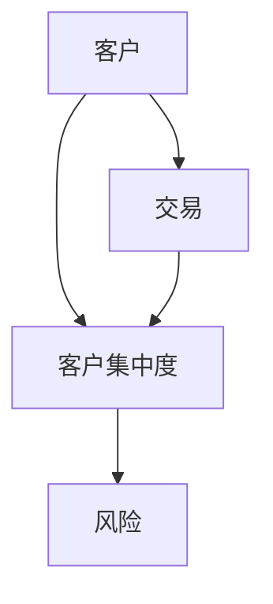
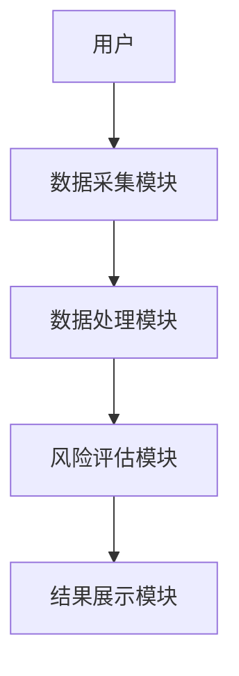
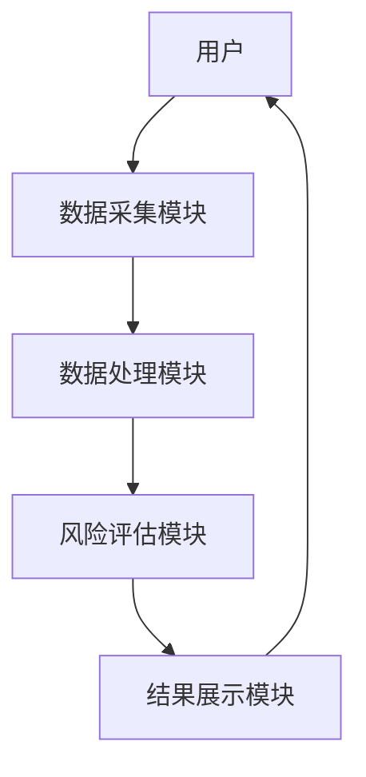

                 


# 彼得林奇如何评估公司的客户集中度风险

## 关键词：客户集中度风险，彼得林奇，风险管理，市场集中度，客户依赖度

## 摘要：客户集中度风险是企业在经营过程中面临的重要风险之一，尤其在客户资源管理方面。本文详细分析了客户集中度风险的定义、核心概念、评估方法和系统架构，并结合实际案例，阐述了如何通过系统化的手段进行客户集中度风险的评估与管理，提供了可操作的解决方案和最佳实践。

---

## 第一部分：客户集中度风险的背景与重要性

### 第1章：客户集中度风险的定义与影响

#### 1.1 客户集中度风险的定义

客户集中度风险是指企业在经营过程中，由于客户资源过于集中于少数几个客户而导致的企业财务风险和市场风险。这种风险可能会影响企业的收入稳定性、市场竞争力和战略决策。

- **客户集中度的内涵**：客户集中度是指企业在一定时期内，收入或交易量集中于少数客户的情况。客户集中度越高，企业对这些客户的依赖性越强，风险也越大。
- **客户集中度风险的表现**：当客户集中度过高时，企业可能面临客户流失、收入波动、议价能力下降等问题。

#### 1.2 客户集中度风险的影响

客户集中度风险对企业的影响可以从多个方面进行分析：

- **对企业财务稳定性的影响**：如果企业收入高度依赖少数客户，一旦这些客户减少订单或终止合作，企业的财务状况可能会受到严重影响。
- **对企业市场竞争力的影响**：客户集中度过高可能导致企业在市场中缺乏灵活性，难以快速适应市场变化。
- **对企业战略决策的影响**：客户集中度过高会限制企业的发展空间，影响企业的战略规划和资源分配。

#### 1.3 客户集中度风险的管理意义

客户集中度风险管理是企业稳健经营的重要组成部分，具有以下意义：

- **风险管理的重要性**：通过有效管理客户集中度风险，企业可以降低财务风险，提高经营稳定性。
- **客户集中度风险管理的目标**：通过分散客户资源、优化客户结构，降低对单一客户或少数客户的依赖。
- **客户集中度风险管理的边界与外延**：客户集中度风险管理不仅包括对现有客户的管理，还包括对潜在客户和市场的开拓。

---

### 第2章：客户集中度风险的核心概念

#### 2.1 客户集中度的指标体系

客户集中度的评估需要借助一系列指标，以下是常用的指标体系：

- **CR4和CR8**：CR4表示前四大客户占总销售额的比例，CR8表示前八大客户占总销售额的比例。这两个指标可以帮助企业衡量客户集中度的高低。
- **赫芬达尔-赫希曼指数（HHI）**：HHI指数是一种衡量市场集中度的指标，HHI越高，市场集中度越高。

#### 2.2 客户集中度的核心要素

客户集中度的核心要素包括：

- **客户分布特征**：客户分布的均匀程度，客户数量与交易金额的关系。
- **客户权重计算**：每个客户的交易金额占总交易金额的比例，用于衡量客户的重要性。
- **客户依赖度评估**：企业对某客户或少数客户的依赖程度。

#### 2.3 客户集中度风险的实体关系图



---

### 第3章：客户集中度风险的评估方法

#### 3.1 客户集中度的计算方法

- **CR4和CR8的计算公式**：
  - CR4 = (前四大客户的收入总和) / 总收入
  - CR8 = (前八大客户的收入总和) / 总收入
- **赫芬达尔-赫希曼指数（HHI）**：
  - HHI = Σ(市场份额i)^2，i从1到n，n为客户的数量。

#### 3.2 客户集中度风险的评估模型

- **风险评估模型的构建**：通过客户集中度指标和客户依赖度评估，构建风险评估模型。
- **模型的输入与输出**：输入包括客户收入数据，输出包括客户集中度风险等级。

#### 3.3 客户集中度风险的算法实现

- **Python代码示例**：
```python
def calculate_customer_concentration(revenue_data):
    import pandas as pd
    df = pd.DataFrame(revenue_data)
    cr4 = df.nlargest(4, 'revenue')['revenue'].sum() / df['revenue'].sum()
    cr8 = df.nlargest(8, 'revenue')['revenue'].sum() / df['revenue'].sum()
    return cr4, cr8
```

---

## 第四部分：客户集中度风险的系统架构与接口设计

### 第4章：客户集中度风险的系统分析

#### 4.1 系统功能设计

- **功能模块**：
  - 数据采集：收集客户交易数据。
  - 数据处理：清洗和整理数据。
  - 风险评估：计算客户集中度指标，评估风险等级。
  - 结果展示：以图表形式展示客户集中度风险。

#### 4.2 系统架构设计



#### 4.3 系统接口设计

- **数据接口**：提供API接口，供其他系统调用客户集中度数据。
- **用户界面**：提供直观的用户界面，供用户查看和分析客户集中度风险。

#### 4.4 系统交互流程



---

## 第五部分：客户集中度风险的项目实战

### 第5章：客户集中度风险的项目分析

#### 5.1 项目背景与目标

- **项目背景**：某制造企业客户集中度较高，希望优化客户结构，降低风险。
- **项目目标**：通过分析客户集中度，制定客户管理策略。

#### 5.2 项目实施步骤

1. 数据采集：收集过去三年的客户交易数据。
2. 数据处理：清洗数据，计算CR4和CR8。
3. 风险评估：评估客户集中度风险等级。
4. 结果展示：生成报告，提出优化建议。

#### 5.3 项目小结

通过项目实施，企业成功降低了客户集中度风险，优化了客户结构，提高了经营稳定性。

---

## 第六部分：客户集中度风险的最佳实践

### 第6章：客户集中度风险的管理策略

#### 6.1 分散客户资源

- 通过开拓新客户、多元化市场，降低对单一客户的依赖。

#### 6.2 优化客户结构

- 建立客户分级管理制度，重点维护高价值客户，逐步减少低价值客户的依赖。

#### 6.3 定期监控与评估

- 定期评估客户集中度，及时调整客户管理策略。

#### 6.4 风险应对措施

- 制定应急预案，应对客户流失或需求下降的情况。

### 第7章：客户集中度风险的案例分析

#### 7.1 案例背景

- 某零售企业客户集中度较高，依赖于几个大客户。

#### 7.2 分析与解决方案

- 通过优化客户结构，分散客户资源，降低客户集中度风险。

#### 7.3 实施效果

- 客户集中度显著下降，企业经营更加稳健。

---

## 结语

通过本文的详细分析，我们可以看到，客户集中度风险是企业经营中不可忽视的重要因素。通过科学的评估方法和有效的管理策略，企业可以降低客户集中度风险，实现稳健发展。

