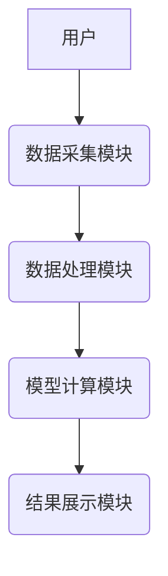

                 


# 彼得林奇如何评估公司的市场适应能力

## 关键词
彼得·林奇, 市场适应能力, 投资评估, 企业战略, 风险管理

## 摘要
本文深入探讨了彼得·林奇评估公司市场适应能力的方法，分析了市场适应能力的核心要素，结合实际案例和评估工具，帮助投资者和企业管理者更好地理解如何在动态市场环境中评估和提升公司的市场适应能力。

---

# 第1章 彼得·林奇的市场适应能力评估基础

## 1.1 市场适应能力的定义与重要性

### 1.1.1 市场适应能力的定义
市场适应能力是指企业在不断变化的市场环境中，能够灵活调整战略、产品和服务，以应对市场趋势、客户需求和技术变革的能力。它体现了企业对市场变化的敏锐洞察力和快速响应能力。

### 1.1.2 市场适应能力的重要性
在快速变化的商业环境中，市场适应能力是企业生存和发展的关键。企业需要能够迅速调整以应对新的挑战和机会，才能在竞争激烈的市场中保持优势。彼得·林奇认为，市场适应能力是衡量一家公司长期发展潜力的重要指标。

### 1.1.3 彼得·林奇对市场适应能力的重视
彼得·林奇在其投资生涯中非常重视企业的市场适应能力。他认为，一个能够快速适应市场变化的企业，不仅能够在市场低迷时生存下来，还能够在市场繁荣时抓住机会实现增长。

---

## 1.2 彼得·林奇的市场适应能力理论

### 1.2.1 彼得·林奇的投资者背景与投资理念
彼得·林奇是美国著名投资家，曾管理富达麦哲伦基金，创造了卓越的投资业绩。他的投资理念以基本面分析为核心，注重企业的财务健康、管理层能力和市场适应能力。

### 1.2.2 市场适应能力在彼得·林奇投资体系中的地位
市场适应能力是彼得·林奇评估企业的重要维度之一。他认为，一个企业能否在市场变化中保持竞争力，取决于其管理层的灵活性、产品创新能力和财务健康状况。

### 1.2.3 市场适应能力的核心要素
市场适应能力的核心要素包括：
1. **管理层能力**：管理层的战略眼光、决策能力和创新能力。
2. **产品竞争力**：产品的市场定位、技术创新和用户体验。
3. **财务健康状况**：企业的盈利能力、现金流和抗风险能力。
4. **行业环境**：行业发展趋势、竞争格局和政策环境。

---

# 第2章 市场适应能力的核心要素分析

## 2.1 公司管理层的分析

### 2.1.1 管理层的背景与能力
管理层的背景和能力是评估市场适应能力的重要因素。彼得·林奇认为，一个优秀的管理层能够带领企业在市场变化中保持方向，并抓住新的机会。

### 2.1.2 管理层的战略决策能力
管理层的战略决策能力体现在其对市场趋势的判断和对企业发展方向的把握上。例如，管理层是否能够及时调整产品策略以应对市场需求的变化。

### 2.1.3 管理层的适应性与灵活性
管理层需要具备快速适应市场变化的能力，能够在市场环境变化时迅速调整战略和资源分配。

---

## 2.2 产品或服务的市场竞争力

### 2.2.1 产品生命周期分析
产品生命周期包括引入期、成长期、成熟期和衰退期。彼得·林奇认为，企业需要关注产品的生命周期阶段，并及时进行产品创新和升级。

### 2.2.2 市场定位与竞争优势
市场定位决定了企业在市场中的位置和竞争优势。彼得·林奇强调，企业需要明确其市场定位，并通过差异化竞争策略来保持优势。

### 2.2.3 产品创新能力与更新速度
彼得·林奇认为，产品创新能力是企业市场适应能力的重要体现。企业需要不断推出新产品或改进现有产品以满足市场需求。

---

## 2.3 财务健康状况与抗风险能力

### 2.3.1 财务报表分析方法
通过分析企业的财务报表（如利润表、资产负债表和现金流量表），可以评估企业的财务健康状况和抗风险能力。

### 2.3.2 盈利能力、偿债能力与运营效率
盈利能力（如净利率和毛利率）和偿债能力（如负债率和流动比率）是评估企业财务健康状况的重要指标。

### 2.3.3 抗风险能力的评估指标
抗风险能力可以通过企业的现金流状况、资本结构和备用流动性来评估。

---

## 2.4 行业环境与竞争格局

### 2.4.1 行业发展趋势与周期性
行业发展趋势和周期性影响企业的市场适应能力。彼得·林奇认为，企业需要关注行业趋势，并在行业周期变化中找到机会。

### 2.4.2 竞争格局与市场份额
竞争格局决定了企业的市场地位和竞争优势。彼得·林奇强调，企业需要了解竞争对手的动向，并制定相应的战略。

### 2.4.3 政策环境与法规影响
政策环境和法规变化也会影响企业的市场适应能力。彼得·林奇认为，企业需要关注政策变化，并及时调整战略以应对新的法规要求。

---

## 2.5 核心要素对比分析表

| 要素                 | 描述                                                                 | 重要性   | 评估方法                              |
|----------------------|----------------------------------------------------------------------|----------|--------------------------------------|
| 管理层               | 管理层的背景、能力和战略决策能力                                   | 高       | 通过财报和公司公告分析                |
| 产品竞争力           | 产品的生命周期、市场定位和创新能力                                 | 中高     | 通过行业报告和产品销量分析            |
| 财务健康状况         | 盈利能力、偿债能力和抗风险能力                                   | 高       | 通过财务报表分析                      |
| 行业环境             | 行业发展趋势、竞争格局和政策法规                                   | 中高     | 通过行业报告和政策分析                |

---

# 第3章 彼得·林奇的市场适应能力评估方法

## 3.1 定性分析与定量分析的结合

### 3.1.1 定性分析
定性分析包括对企业管理层、产品竞争力和行业环境的评估。彼得·林奇认为，定性分析能够帮助投资者更好地理解企业的核心竞争力和市场定位。

### 3.1.2 定量分析
定量分析包括对企业财务状况的评估，如盈利能力、偿债能力和抗风险能力。彼得·林奇认为，定量分析能够帮助投资者更好地量化企业的市场适应能力。

### 3.1.3 定性与定量分析的结合
彼得·林奇强调，市场适应能力的评估需要结合定性分析和定量分析，才能全面评估企业的市场适应能力。

---

## 3.2 彼得·林奇的市场适应能力评估步骤

### 3.2.1 确定评估目标
明确评估目标是评估市场适应能力的第一步。彼得·林奇认为，评估目标应基于投资者的长期投资目标和市场环境。

### 3.2.2 收集相关信息
收集企业的财务数据、行业报告和公司公告等信息是评估市场适应能力的基础。

### 3.2.3 分析核心要素
对企业的管理层能力、产品竞争力、财务健康状况和行业环境进行详细分析。

### 3.2.4 综合评估
综合分析各核心要素，得出企业的市场适应能力评估结果。

### 3.2.5 持续跟踪
市场环境不断变化，彼得·林奇强调，投资者需要持续跟踪企业的市场适应能力，并根据市场变化调整投资策略。

---

## 3.3 实际案例分析

### 3.3.1 案例背景
以某科技公司为例，分析其市场适应能力。

### 3.3.2 定性分析
分析该公司的管理层能力、产品竞争力和行业环境。

### 3.3.3 定量分析
分析该公司的财务状况，包括盈利能力、偿债能力和抗风险能力。

### 3.3.4 综合评估
综合定性分析和定量分析，得出该公司的市场适应能力评估结果。

---

## 3.4 本章小结

---

# 第4章 市场适应能力评估的算法原理

## 4.1 评估算法概述

### 4.1.1 算法目标
通过算法量化企业的市场适应能力。

### 4.1.2 算法输入
企业的财务数据、行业报告和公司公告等。

### 4.1.3 算法输出
企业的市场适应能力评分。

---

## 4.2 市场适应能力评分模型

### 4.2.1 模型结构
市场适应能力评分模型包括管理层能力评分、产品竞争力评分、财务健康状况评分和行业环境评分。

### 4.2.2 模型公式
市场适应能力评分 = (管理层能力评分 × 0.3) + (产品竞争力评分 × 0.3) + (财务健康状况评分 × 0.2) + (行业环境评分 × 0.2)

---

## 4.3 算法实现步骤

### 4.3.1 数据收集
收集企业的财务数据、行业报告和公司公告。

### 4.3.2 数据预处理
对数据进行清洗和标准化处理。

### 4.3.3 模型计算
根据评分公式计算企业的市场适应能力评分。

### 4.3.4 结果分析
分析评分结果，得出企业的市场适应能力评估结论。

---

## 4.4 Python实现代码

```python
import pandas as pd

# 数据加载
data = pd.read_csv('market_adaptability.csv')

# 数据预处理
data.dropna(inplace=True)
data['管理层能力评分'] = data['管理层能力评分'].astype(float)
data['产品竞争力评分'] = data['产品竞争力评分'].astype(float)
data['财务健康状况评分'] = data['财务健康状况评分'].astype(float)
data['行业环境评分'] = data['行业环境评分'].astype(float)

# 计算市场适应能力评分
data['市场适应能力评分'] = (data['管理层能力评分'] * 0.3) + (data['产品竞争力评分'] * 0.3) + (data['财务健康状况评分'] * 0.2) + (data['行业环境评分'] * 0.2)

# 输出结果
print(data.head())
```

---

## 4.5 本章小结

---

# 第5章 市场适应能力评估系统的系统分析与架构设计

## 5.1 系统功能设计

### 5.1.1 功能模块
市场适应能力评估系统包括数据采集、数据处理、模型计算和结果展示四个功能模块。

### 5.1.2 功能流程
数据采集 → 数据处理 → 模型计算 → 结果展示

---

## 5.2 系统架构设计

### 5.2.1 系统架构图
使用Mermaid绘制系统架构图：



---

## 5.3 系统接口设计

### 5.3.1 数据接口
系统需要与数据源（如财务报表和行业报告）进行接口对接。

### 5.3.2 用户接口
系统提供友好的用户界面，方便用户输入数据和查看结果。

---

## 5.4 本章小结

---

# 第6章 项目实战：市场适应能力评估工具开发

## 6.1 环境安装

### 6.1.1 安装Python
安装Python 3.x版本。

### 6.1.2 安装依赖库
安装pandas和numpy库：

```bash
pip install pandas numpy
```

---

## 6.2 代码实现

### 6.2.1 数据加载与预处理
```python
import pandas as pd

data = pd.read_csv('market_adaptability.csv')
data.dropna(inplace=True)
```

### 6.2.2 市场适应能力评分计算
```python
data['市场适应能力评分'] = (data['管理层能力评分'] * 0.3) + (data['产品竞争力评分'] * 0.3) + (data['财务健康状况评分'] * 0.2) + (data['行业环境评分'] * 0.2)
```

### 6.2.3 结果展示
```python
print(data[['公司名称', '市场适应能力评分']].head())
```

---

## 6.3 案例分析

### 6.3.1 数据来源
使用某行业公司的数据进行分析。

### 6.3.2 评分结果
输出公司的市场适应能力评分。

---

## 6.4 本章小结

---

# 第7章 最佳实践与注意事项

## 7.1 关键点总结

### 7.1.1 评估维度
市场适应能力的评估需要综合考虑管理层能力、产品竞争力、财务健康状况和行业环境。

### 7.1.2 数据来源
选择可靠的数据源，确保评估结果的准确性。

### 7.1.3 持续跟踪
市场环境不断变化，需要持续跟踪企业的市场适应能力。

---

## 7.2 小结

### 7.2.1 总结
彼得·林奇的市场适应能力评估方法提供了全面的评估框架，帮助投资者和企业管理者更好地理解和提升企业的市场适应能力。

### 7.2.2 注意事项
在实际应用中，需要结合企业的实际情况和市场环境，灵活调整评估方法和策略。

---

## 7.3 拓展阅读

### 7.3.1 相关书籍
1. 《彼得·林奇的投资智慧》
2. 《投资学基础》

### 7.3.2 相关博客
1. 彼得·林奇投资策略解析
2. 市场适应能力评估工具开发

---

## 7.4 本章小结

---

# 附录

## 附录A: 市场适应能力评分模型公式
$$\text{市场适应能力评分} = (0.3 \times \text{管理层能力评分}) + (0.3 \times \text{产品竞争力评分}) + (0.2 \times \text{财务健康状况评分}) + (0.2 \times \text{行业环境评分})$$

---

## 附录B: 代码实现示例
```python
import pandas as pd

# 数据加载
data = pd.read_csv('market_adaptability.csv')

# 数据预处理
data.dropna(inplace=True)

# 计算市场适应能力评分
data['市场适应能力评分'] = (data['管理层能力评分'] * 0.3) + (data['产品竞争力评分'] * 0.3) + (data['财务健康状况评分'] * 0.2) + (data['行业环境评分'] * 0.2)

# 输出结果
print(data[['公司名称', '市场适应能力评分']].head())
```

---

## 附录C: 系统架构图


---

## 附录D: 参考文献
1. 彼得·林奇. 《彼得·林奇的投资智慧》
2. 投资学基础教材

---

通过以上步骤，我们可以系统地评估企业的市场适应能力，并为企业和投资者提供有价值的参考和指导。

