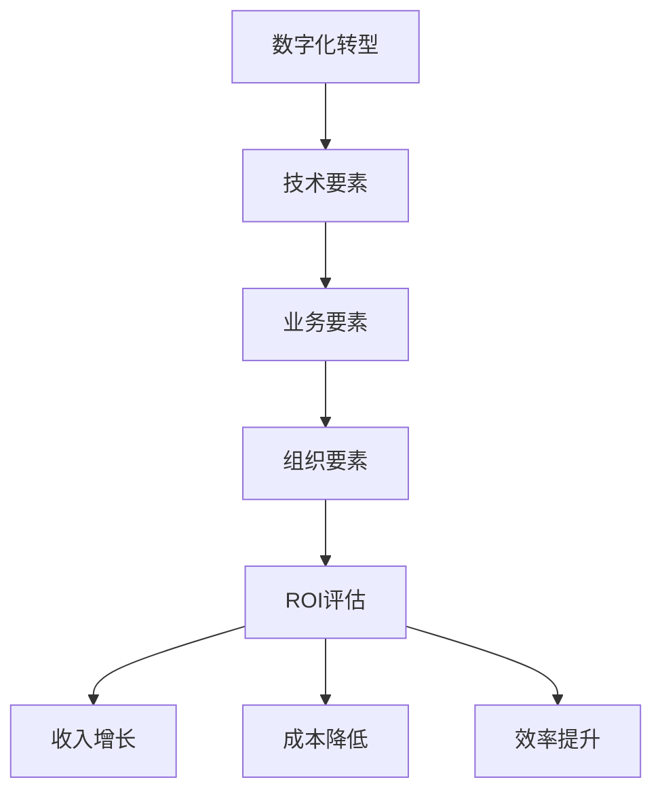
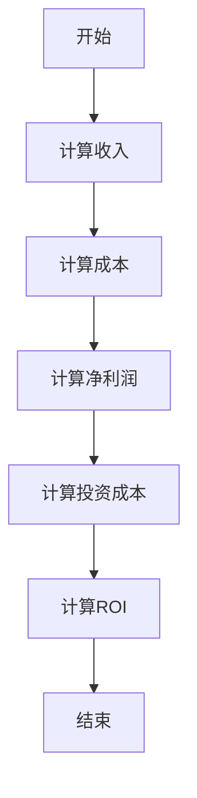
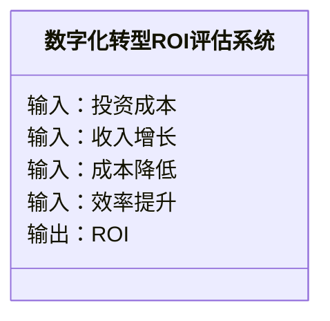
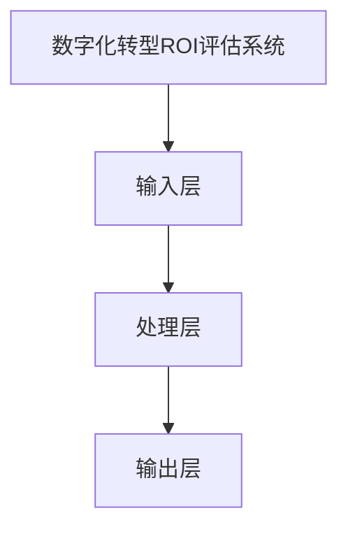
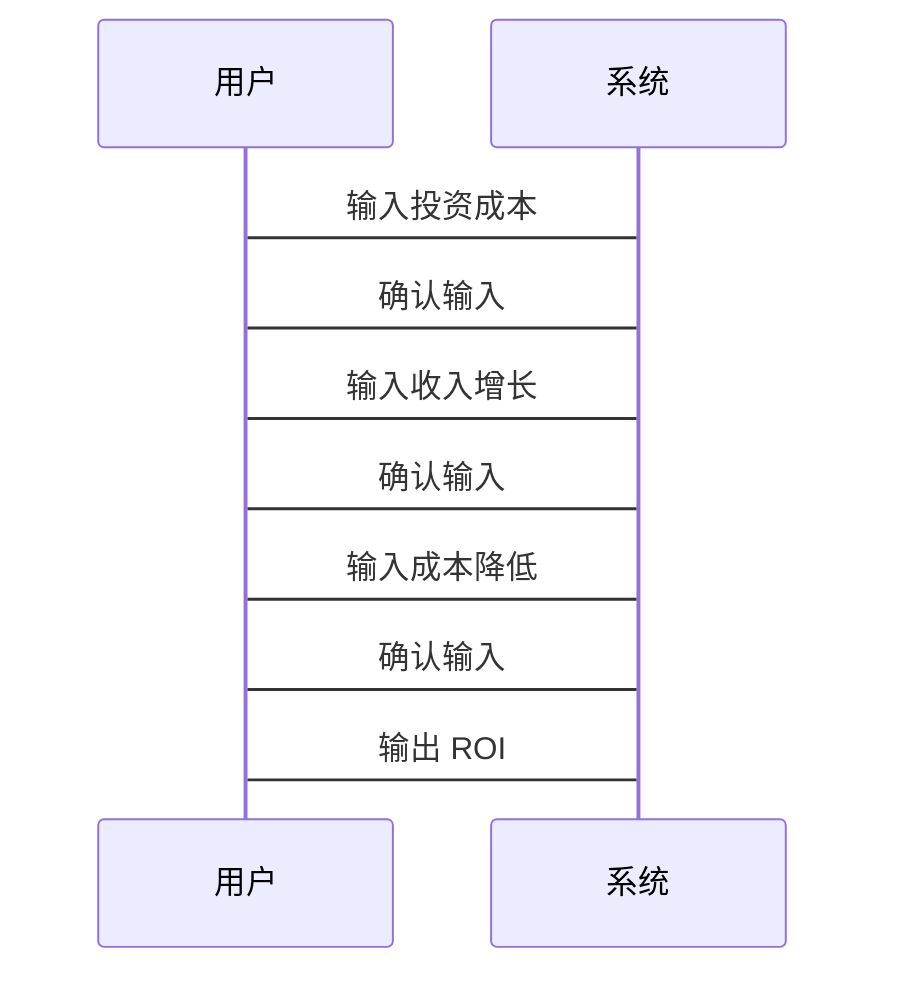

                 


# 彼得林奇如何评估公司的数字化转型ROI

## 关键词：数字化转型、ROI、彼得林奇、投资回报、评估模型

## 摘要：本文从彼得林奇的投资哲学出发，结合数字化转型的核心要素，系统性地阐述了如何评估数字化转型的投资回报率（ROI）。通过分析数字化转型的关键指标、算法原理、系统架构和实际案例，本文为读者提供了一套完整的ROI评估方法论。

---

# 第一部分: 数字化转型与ROI评估背景

# 第1章: 数字化转型与ROI概述

## 1.1 数字化转型的背景与定义

### 1.1.1 数字化转型的背景

随着信息技术的飞速发展，数字化转型已成为企业生存和发展的关键。从工业时代到数字时代，企业的经营方式、商业模式和组织结构都发生了翻天覆地的变化。数字化转型不仅仅是技术的升级，更是对企业全链条的重塑。

### 1.1.2 数字化转型的定义与核心要素

数字化转型（Digital Transformation）是指利用数字技术（如大数据、人工智能、云计算等）对企业的产品、流程、决策和业务模式进行全面改造，以实现业务创新和效率提升。其核心要素包括：

1. **技术驱动**：数字化转型的核心是技术的应用，包括大数据、AI、IoT、区块链等。
2. **业务创新**：通过技术赋能，企业可以创造新的业务模式和价值点。
3. **组织变革**：数字化转型要求企业重新设计组织结构和文化，以适应新的业务需求。

### 1.1.3 数字化转型对企业的影响

数字化转型能够带来多方面的收益，包括：

- 提高业务效率和生产力。
- 优化成本结构，降低运营成本。
- 创造新的收入来源和业务机会。
- 提升客户体验和满意度。

---

## 1.2 ROI（投资回报率）的定义与重要性

### 1.2.1 ROI的定义

投资回报率（ROI，Return on Investment）是衡量投资效益的重要指标，其计算公式为：

$$ ROI = \frac{净利润}{投资成本} \times 100\% $$

其中，净利润 = 收入 - 成本。

### 1.2.2 ROI在企业决策中的作用

ROI是企业在进行投资决策时的重要依据，它能够帮助企业评估某项投资的盈利能力，从而决定是否继续投资或调整策略。在数字化转型中，ROI评估可以帮助企业：

- 确定投资的优先级。
- 量化数字化转型的收益。
- 优化资源配置，降低投资风险。

### 1.2.3 数字化转型与ROI的关系

数字化转型本质上是一种投资行为。通过ROI评估，企业可以量化数字化转型带来的收益，从而验证其投资的合理性。彼得林奇的投资哲学强调长期价值和基本面分析，这种理念同样适用于数字化转型的ROI评估。

---

## 1.3 彼得林奇的投资哲学与方法论

### 1.3.1 彼得林奇的投资理念

彼得林奇是全球著名的职业基金经理人，他的投资哲学强调以下几点：

1. **长期投资**：关注企业的长期价值，而非短期波动。
2. **基本面分析**：通过对企业财务状况、行业地位和管理团队的深入分析，评估其投资价值。
3. **分散投资**：通过分散投资降低风险。

### 1.3.2 彼得林奇的ROI评估方法

彼得林奇的ROI评估方法注重以下几个方面：

1. **现金流分析**：通过现金流预测企业未来的收益。
2. **行业分析**：选择具有成长潜力的行业。
3. **企业估值**：通过市盈率、市净率等指标评估企业的合理估值。

### 1.3.3 彼得林奇方法论在数字化转型中的应用

将彼得林奇的ROI评估方法应用于数字化转型，可以得出以下步骤：

1. **行业分析**：选择具有数字化转型潜力的行业。
2. **企业基本面分析**：评估企业的财务状况和管理能力。
3. **数字化转型 ROI预测**：通过现金流分析和收益预测，量化数字化转型的回报率。

---

## 1.4 本章小结

本章从数字化转型的背景和定义出发，分析了其对企业的影响，并重点介绍了ROI的定义和重要性。最后，结合彼得林奇的投资哲学，提出了数字化转型ROI评估的方法论基础。

---

# 第二部分: 数字化转型ROI评估的核心概念与联系

# 第2章: 核心概念与联系

## 2.1 数字化转型的关键要素

### 2.1.1 技术要素

技术是数字化转型的核心驱动力，包括大数据、人工智能、云计算、物联网等技术的应用。

### 2.1.2 业务要素

数字化转型不仅仅是技术的升级，还包括商业模式的创新和业务流程的重构。

### 2.1.3 组织要素

组织结构和文化的变化是数字化转型成功的关键。企业需要建立灵活、创新的组织架构。

## 2.2 ROI评估的关键指标

### 2.2.1 收入增长

收入增长是衡量数字化转型 ROI 的重要指标。通过技术赋能，企业可以创造新的收入来源。

### 2.2.2 成本降低

数字化转型可以通过自动化和流程优化降低企业成本。

### 2.2.3 效率提升

效率提升是数字化转型的重要目标，包括运营效率、管理效率等。

## 2.3 核心概念与联系的Mermaid流程图



---

## 2.4 本章小结

本章从数字化转型的关键要素出发，分析了其与ROI评估的关系，并通过Mermaid流程图展示了核心概念之间的联系。

---

# 第三部分: 数字化转型ROI评估的算法原理

# 第3章: ROI评估算法原理

## 3.1 ROI计算公式

### 3.1.1 ROI计算公式

$$ ROI = \frac{净利润}{投资成本} \times 100\% $$

### 3.1.2 净利润计算公式

$$ 净利润 = 收入 - 成本 $$

## 3.2 算法流程图



---

## 3.3 ROI评估的数学模型

通过以下数学模型，我们可以量化数字化转型的 ROI：

$$ ROI = \frac{(收入增长 - 成本降低)}{投资成本} \times 100\% $$

其中，收入增长和成本降低可以通过数字化转型的具体项目进行预测。

---

## 3.4 本章小结

本章从数学模型的角度，详细讲解了ROI的计算公式和算法流程，并通过Mermaid流程图展示了算法的执行步骤。

---

# 第四部分: 数字化转型ROI评估的系统分析与架构设计

# 第4章: 系统分析与架构设计

## 4.1 问题场景介绍

数字化转型 ROI 评估系统需要解决以下问题：

1. 如何量化数字化转型带来的收益？
2. 如何预测数字化转型的 ROI？
3. 如何优化企业的数字化转型投资？

## 4.2 系统功能设计

### 4.2.1 领域模型



### 4.2.2 系统架构图



---

## 4.3 系统接口设计

数字化转型 ROI 评估系统的接口设计包括：

1. 输入接口：接收投资成本、收入增长、成本降低等数据。
2. 输出接口：输出 ROI 评估结果。

---

## 4.4 系统交互图



---

## 4.5 本章小结

本章从系统设计的角度，详细介绍了数字化转型 ROI 评估系统的功能设计、架构设计和接口设计，并通过Mermaid图展示了系统的交互过程。

---

# 第五部分: 数字化转型ROI评估的项目实战

# 第5章: 项目实战

## 5.1 项目介绍

本项目旨在通过彼得林奇的 ROI 评估方法，评估某公司的数字化转型项目。以下是具体实施步骤：

### 5.1.1 环境安装

需要安装以下工具：

1. Python 3.x
2. Mermaid工具
3. 数据分析工具（如Excel或Python的Pandas库）

### 5.1.2 核心代码实现

以下是Python代码实现：

```python
def calculate ROI(investment_cost, net_profit):
    return (net_profit / investment_cost) * 100

# 示例数据
investment_cost = 1000000
net_profit = 200000
roi = calculate ROI(investment_cost, net_profit)
print(f"ROI: {roi}%")
```

### 5.1.3 代码应用解读与分析

上述代码通过简单的函数调用，计算了数字化转型项目的 ROI。净利

