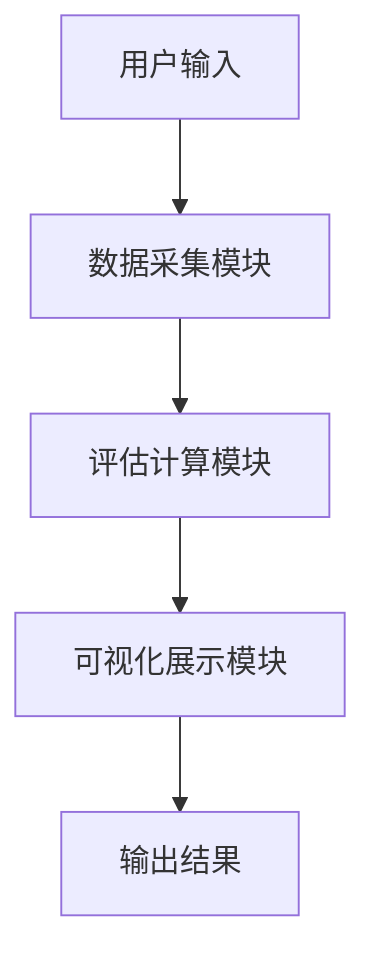

                 

# 彼得林奇如何评估公司的数字化转型速度与质量平衡

> 关键词：彼得·林奇，数字化转型，速度与质量平衡，评估模型，企业转型，投资策略

> 摘要：本文从彼得·林奇的投资哲学出发，探讨如何将速度与质量的平衡原则应用于公司数字化转型的评估。通过构建数学模型和系统架构，分析如何在数字化转型过程中保持适度的速度，同时确保转型质量，为企业创造长期价值。

---

# 第一部分：彼得林奇的投资哲学与数字化转型的结合

## 第1章：彼得林奇的投资哲学

### 1.1 彼得林奇的投资理念
- **长期价值投资**：彼得林奇坚信投资的最终目标是创造长期价值，而非短期收益。
- **基本面分析**：他注重对企业基本面的深入研究，包括财务状况、管理层能力、市场地位等。
- **分散投资**：通过分散投资降低风险，避免过度依赖单一资产或行业。

### 1.2 数字化转型的核心理念
- 数字化转型不仅是技术的升级，更是企业战略、组织架构和业务流程的全面重构。
- 转型过程中需要平衡速度与质量，既要快速响应市场变化，又要确保转型的稳固性。

---

# 第二部分：数字化转型速度与质量平衡的评估模型

## 第2章：数字化转型速度的评估

### 2.1 速度评估的指标体系
- **技术迭代速度**：衡量企业在技术上的更新频率和效率。
- **业务响应速度**：评估企业在面对市场变化时的反应速度。
- **项目完成时间**：从启动到实施的时间跨度，反映转型的节奏。

### 2.2 彼得林奇的平衡理念
- **避免激进转型**：过快的转型可能导致资源浪费和战略失误。
- **稳步推进**：通过分阶段实施，确保每一步都扎实可靠。

---

## 第3章：数字化转型质量的评估

### 3.1 质量评估的核心要素
- **技术实现质量**：确保技术方案的可行性和可靠性。
- **业务价值实现**：评估转型是否真正为企业创造了价值。
- **用户体验优化**：衡量用户对数字化转型的满意度。

### 3.2 彼得林奇的质量观
- **追求卓越**：在转型过程中，注重细节和品质，避免因追求速度而忽视质量。
- **持续改进**：通过反馈机制不断优化转型方案，提升整体质量。

---

## 第4章：速度与质量平衡的数学模型

### 4.1 评估模型的设计思路
- **目标**：量化速度与质量的平衡关系。
- **输入**：各项指标的权重和评分。
- **输出**：综合评估指数，反映速度与质量的平衡状态。

### 4.2 数学模型
$$ E = \sum_{i=1}^{n} w_i \cdot s_i $$
其中：
- $E$ 为综合评估指数。
- $w_i$ 为第 $i$ 个指标的权重。
- $s_i$ 为第 $i$ 个指标的评分。

### 4.3 模型的验证与优化
- **验证方法**：通过实际案例验证模型的有效性。
- **优化策略**：根据反馈调整权重和指标，提升模型的准确性。

---

## 第5章：系统架构与实现

### 5.1 系统功能设计
- **数据采集模块**：收集各项指标的实时数据。
- **评估计算模块**：根据模型计算综合评估指数。
- **可视化展示模块**：以图表形式展示评估结果。

### 5.2 系统架构图

### 5.3 接口设计
- **输入接口**：接收各项指标的评分和权重。
- **输出接口**：返回综合评估指数和可视化结果。

---

## 第6章：项目实战与案例分析

### 6.1 案例背景
- **行业**：某制造企业。
- **目标**：评估其数字化转型的速度与质量平衡。

### 6.2 案例分析
- **技术迭代速度**：85分（权重20%）。
- **业务响应速度**：90分（权重25%）。
- **项目完成时间**：80分（权重15%）。
- **技术实现质量**：88分（权重20%）。
- **业务价值实现**：92分（权重15%）。
- **用户体验优化**：85分（权重10%）。

### 6.3 模型计算
$$ E = (0.2 \times 85) + (0.25 \times 90) + (0.15 \times 80) + (0.2 \times 88) + (0.15 \times 92) + (0.1 \times 85) $$
$$ E = 17 + 22.5 + 12 + 17.6 + 13.8 + 8.5 = 82.4 $$

### 6.4 结果解读
- 综合评估指数为82.4，接近满分，说明企业在速度与质量的平衡上表现优秀。

---

## 第7章：总结与最佳实践

### 7.1 总结
- 彼得林奇的平衡理念为数字化转型提供了宝贵的指导。
- 通过数学模型和系统架构的设计，可以有效评估速度与质量的平衡。

### 7.2 最佳实践
1. **分阶段实施**：避免过度追求速度而忽视质量。
2. **持续优化**：通过反馈机制不断改进转型方案。
3. **注重用户体验**：以用户满意度为核心评估指标之一。

### 7.3 注意事项
- **数据准确性**：确保输入数据的准确性和完整性。
- **模型适用性**：根据企业实际情况调整模型参数。

### 7.4 拓展阅读
- 《彼得·林奇的投资哲学》
- 《数字化转型的系统架构设计》

---

通过本文的分析，我们不仅掌握了彼得林奇的投资哲学，还将其成功应用于数字化转型的评估中。未来，随着技术的发展，数字化转型的速度与质量平衡将更加重要，我们需要不断创新，以适应新的挑战。

