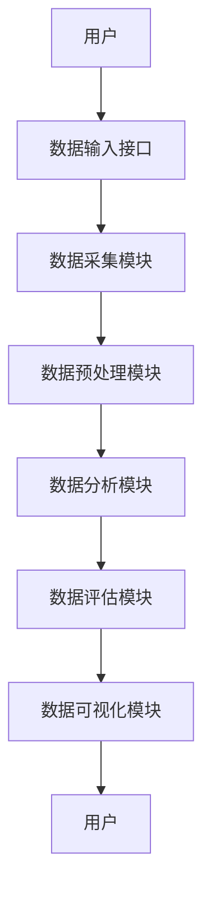

                 


# 彼得·林奇如何评估公司的数据变现能力

## 关键词：
- 彼得·林奇
- 数据变现能力
- 投资决策
- 数据驱动
- 评估模型
- 人工智能
- 数学建模

## 摘要：
本文详细探讨了彼得·林奇如何通过数据驱动的方法评估公司的数据变现能力。从数据资产的定义、分类到数据变现的商业模式，再到数据变现能力的评估指标和框架模型，本文逐步分析了彼得·林奇的投资哲学在数据时代的应用。通过数学建模和算法实现，提出了数据变现能力指数模型，并结合实际案例，展示了如何通过系统架构设计和项目实战来提升企业的数据变现能力。本文最后总结了数据变现能力评估的关键点，并提出了未来发展的建议。

---

# 第一部分：数据变现能力评估的背景与重要性

## 第1章：数据变现能力评估的背景与意义

### 1.1 数据驱动经济的兴起

#### 1.1.1 数据在现代经济中的地位
数据已成为21世纪最重要的资产之一。随着信息技术的快速发展，数据的产生、存储和处理能力呈指数级增长，数据的价值也在不断提升。数据不仅能够帮助企业优化运营、提高效率，还能为企业创造新的收入来源。

#### 1.1.2 数据变现的定义与内涵
数据变现是指通过数据的采集、处理、分析和应用，将其转化为经济价值的过程。数据变现的核心在于将数据转化为可量化的资产，并通过商业模式实现价值的最大化。

#### 1.1.3 数据变现能力评估的必要性
数据变现能力评估是企业战略决策的重要组成部分。通过对数据资产的质量、变现效率和可持续性进行评估，可以帮助企业在数据驱动的经济中占据竞争优势。

### 1.2 彼得·林奇的投资哲学与数据驱动决策

#### 1.2.1 彼得·林奇的投资理念概述
彼得·林奇是美国著名的职业棒球运动员和投资专家，以其对数据分析的高度重视而闻名。他认为，数据是投资决策的核心依据，通过对数据的深入分析，可以发现市场的潜在机会和风险。

#### 1.2.2 数据在彼得·林奇投资决策中的作用
彼得·林奇在投资决策中，通过分析大量的市场数据、行业趋势和企业财务数据，识别出具有投资价值的企业。他的投资哲学强调数据的全面性、准确性和及时性。

#### 1.2.3 数据驱动决策的现代发展
随着大数据技术的发展，数据驱动决策已经从传统的统计分析扩展到机器学习、人工智能等领域。彼得·林奇的投资哲学为现代数据驱动决策提供了重要的理论基础。

### 1.3 数据变现能力评估的核心价值

#### 1.3.1 数据资产的经济价值
数据资产的经济价值体现在其对企业的运营效率和盈利能力的提升。通过数据变现，企业可以将数据转化为新的收入来源。

#### 1.3.2 数据变现能力对企业的战略意义
数据变现能力是企业在数字化转型中的核心竞争力。通过数据变现能力评估，企业可以识别数据资产的潜力，并制定有效的数据驱动战略。

#### 1.3.3 数据变现能力评估的行业应用
数据变现能力评估在金融、科技、零售等多个行业中有广泛的应用。通过对数据资产的评估，企业可以优化数据管理，提升数据利用效率。

### 1.4 本章小结
本章从数据驱动经济的兴起、彼得·林奇的投资哲学以及数据变现能力评估的核心价值三个方面，探讨了数据变现能力评估的重要性和必要性。数据作为21世纪最重要的资产，其变现能力评估已成为企业战略决策的关键部分。

---

## 第2章：数据变现能力评估的核心概念与框架

### 2.1 数据资产的定义与分类

#### 2.1.1 数据资产的定义
数据资产是指企业拥有或控制的，能够为企业创造经济价值的数据资源。数据资产可以是结构化数据、非结构化数据或其他形式的数据。

#### 2.1.2 数据资产的分类与特征
数据资产可以分为以下几类：
- **结构化数据**：如数据库中的表格数据。
- **非结构化数据**：如文本、图像、视频等。
- **半结构化数据**：如JSON、XML等格式的数据。

数据资产的特征包括：
- **多样性**：数据来源和形式多样化。
- **动态性**：数据实时更新，具有动态性。
- **价值性**：数据具有可量化的经济价值。

#### 2.1.3 数据资产的生命周期管理
数据资产的生命周期包括数据采集、存储、处理、分析和应用等阶段。企业需要通过有效的生命周期管理，提升数据资产的利用效率。

### 2.2 数据变现的商业模式

#### 2.2.1 数据变现的主要模式
数据变现的主要模式包括：
- **数据销售**：将数据出售给第三方。
- **数据产品**：基于数据开发数据驱动的产品或服务。
- **数据广告**：利用数据进行精准营销。

#### 2.2.2 数据变现的关键要素
数据变现的关键要素包括：
- **数据质量**：数据的准确性和完整性。
- **数据安全**：数据的安全性是数据变现的前提。
- **数据利用效率**：数据的处理和应用效率。

#### 2.2.3 数据变现的行业差异性
不同行业的数据变现模式和策略存在差异。例如，金融行业注重数据的精准分析，而零售行业则更关注数据的实时应用。

### 2.3 数据变现能力评估的指标体系

#### 2.3.1 数据资产的质量评估指标
数据资产的质量评估指标包括：
- **数据完整性**：数据的完整性。
- **数据准确性**：数据的准确性。
- **数据一致性**：数据的一致性。

#### 2.3.2 数据变现的效率评估指标
数据变现的效率评估指标包括：
- **数据处理速度**：数据处理的效率。
- **数据转化率**：数据转化为收入的效率。
- **数据利用率**：数据的使用效率。

#### 2.3.3 数据变现的可持续性评估指标
数据变现的可持续性评估指标包括：
- **数据资源的可持续性**：数据资源的持续性。
- **数据安全的可持续性**：数据安全的持续性。
- **数据收益的可持续性**：数据收益的持续性。

### 2.4 数据变现能力评估的框架模型

#### 2.4.1 数据变现能力评估的基本框架
数据变现能力评估的基本框架包括以下几个步骤：
1. **数据采集**：采集相关数据。
2. **数据处理**：对数据进行清洗和预处理。
3. **数据分析**：对数据进行分析和建模。
4. **数据评估**：基于分析结果，评估数据变现能力。

#### 2.4.2 数据变现能力评估的流程与步骤
数据变现能力评估的流程包括：
1. **明确评估目标**：确定评估的具体目标。
2. **数据采集与准备**：采集相关数据并进行预处理。
3. **数据分析与建模**：对数据进行分析和建模。
4. **评估结果输出**：输出评估结果并进行解读。

#### 2.4.3 数据变现能力评估的实施要点
数据变现能力评估的实施要点包括：
- **数据质量控制**：确保数据的准确性和完整性。
- **数据安全保护**：确保数据的安全性。
- **数据应用优化**：优化数据的应用效率。

### 2.5 本章小结
本章从数据资产的定义与分类、数据变现的商业模式以及数据变现能力评估的指标体系和框架模型四个方面，详细探讨了数据变现能力评估的核心概念和框架。数据资产的质量、变现效率和可持续性是数据变现能力评估的关键要素。

---

## 第3章：数据变现能力评估的算法原理与数学模型

### 3.1 数据变现能力评估的算法概述

#### 3.1.1 数据变现能力评估的主要算法
数据变现能力评估的主要算法包括：
- **线性回归**：用于预测数据变现能力。
- **决策树**：用于分类和回归分析。
- **随机森林**：用于数据分类和回归。

#### 3.1.2 算法选择的依据与原则
算法选择的依据包括：
- **数据类型**：数据的类型和特征。
- **数据规模**：数据的大小和复杂度。
- **评估目标**：评估的具体目标和需求。

#### 3.1.3 算法的优缺点分析
- **线性回归**：优点是简单易懂，计算速度快；缺点是假设线性关系，可能无法捕捉复杂关系。
- **决策树**：优点是易于解释，适合处理非线性关系；缺点是容易过拟合。
- **随机森林**：优点是鲁棒性强，适合处理高维数据；缺点是计算复杂度较高。

### 3.2 数据变现能力评估的数学模型

#### 3.2.1 数据资产价值评估模型
数据资产价值评估模型可以表示为：
$$ \text{数据资产价值} = \sum_{i=1}^{n} w_i x_i $$
其中，$w_i$ 是第 $i$ 个指标的权重，$x_i$ 是第 $i$ 个指标的得分。

#### 3.2.2 数据变现效率评估模型
数据变现效率评估模型可以表示为：
$$ \text{数据变现效率} = \frac{\text{数据转化率} \times \text{数据利用率}}{\text{数据处理时间}} $$

#### 3.2.3 数据变现可持续性评估模型
数据变现可持续性评估模型可以表示为：
$$ \text{数据变现可持续性} = \frac{\text{数据资源可持续性} + \text{数据安全可持续性}}{2} $$

### 3.3 数据变现能力指数模型

#### 3.3.1 模型的构建与设计
数据变现能力指数模型的构建步骤如下：
1. **数据采集与预处理**：采集相关数据并进行清洗和预处理。
2. **特征选择与权重分配**：选择关键特征并分配权重。
3. **模型训练与优化**：基于数据训练模型并优化参数。
4. **模型评估与验证**：对模型进行评估和验证。

#### 3.3.2 模型的输入变量与输出变量
- **输入变量**：数据资产的质量、数据变现的效率和可持续性。
- **输出变量**：数据变现能力指数。

#### 3.3.3 模型的数学表达式
数据变现能力指数模型的数学表达式为：
$$ \text{数据变现能力指数} = \sum_{i=1}^{n} w_i x_i $$

### 3.4 算法实现与优化

#### 3.4.1 算法的实现步骤
1. **数据采集与预处理**：使用Python的Pandas库进行数据清洗和预处理。
2. **特征选择与权重分配**：使用特征选择算法选择关键特征。
3. **模型训练与优化**：使用机器学习算法训练模型并优化参数。
4. **模型评估与验证**：使用交叉验证评估模型性能。

#### 3.4.2 算法的优化与改进
- **特征工程**：通过特征工程优化数据。
- **超参数调优**：通过网格搜索或随机搜索优化模型参数。
- **模型集成**：通过集成学习提升模型性能。

#### 3.4.3 算法的适用场景与局限性
- **适用场景**：适用于数据量较大且特征较多的场景。
- **局限性**：模型的解释性可能较差，且计算复杂度较高。

### 3.5 本章小结
本章从数据变现能力评估的算法概述、数学模型以及算法实现与优化三个方面，详细探讨了数据变现能力评估的算法原理和数学模型。数据变现能力指数模型为企业的数据变现能力评估提供了理论依据和实践指导。

---

## 第4章：数据变现能力评估的系统架构与设计方案

### 4.1 系统架构设计

#### 4.1.1 系统功能模块划分
数据变现能力评估系统主要包括以下几个功能模块：
- **数据采集模块**：负责数据的采集和预处理。
- **数据分析模块**：负责数据的分析和建模。
- **数据评估模块**：负责数据的评估和输出结果。
- **数据可视化模块**：负责结果的可视化展示。

#### 4.1.2 系统架构的层次结构
系统架构的层次结构包括：
- **数据采集层**：负责数据的采集和预处理。
- **数据处理层**：负责数据的分析和建模。
- **数据评估层**：负责数据的评估和输出结果。
- **数据展示层**：负责结果的可视化展示。

#### 4.1.3 系统架构的实现方式
系统架构的实现方式包括：
- **分布式架构**：适用于数据量较大的场景。
- **集中式架构**：适用于数据量较小的场景。

### 4.2 系统功能设计

#### 4.2.1 数据采集模块
数据采集模块的功能包括：
- **数据源管理**：管理数据的来源。
- **数据采集**：从数据源中采集数据。
- **数据预处理**：对数据进行清洗和转换。

#### 4.2.2 数据分析模块
数据分析模块的功能包括：
- **特征选择**：选择关键特征。
- **模型训练**：训练数据变现能力指数模型。
- **模型评估**：评估模型的性能。

#### 4.2.3 数据评估模块
数据评估模块的功能包括：
- **数据评估**：基于模型输出数据变现能力指数。
- **结果解读**：对评估结果进行解读和分析。

#### 4.2.4 数据可视化模块
数据可视化模块的功能包括：
- **结果展示**：将评估结果以图表形式展示。
- **交互分析**：支持用户与图表的交互分析。

### 4.3 系统接口设计

#### 4.3.1 系统输入接口
系统输入接口包括：
- **数据输入接口**：接收数据输入。
- **参数输入接口**：接收模型参数。

#### 4.3.2 系统输出接口
系统输出接口包括：
- **结果输出接口**：输出数据变现能力评估结果。
- **日志输出接口**：输出系统运行日志。

#### 4.3.3 系统内部接口
系统内部接口包括：
- **模块间通信接口**：模块之间的通信接口。
- **数据传递接口**：数据在模块间传递的接口。

### 4.4 系统交互设计

#### 4.4.1 系统交互流程
系统交互流程包括：
1. **用户输入数据**：用户通过输入接口输入数据。
2. **数据处理**：系统对数据进行预处理和分析。
3. **模型训练**：系统训练数据变现能力指数模型。
4. **结果输出**：系统输出评估结果并进行可视化展示。

#### 4.4.2 系统交互流程图


### 4.5 本章小结
本章从系统架构设计、功能设计、接口设计和交互设计四个方面，详细探讨了数据变现能力评估系统的架构与设计方案。通过系统化的架构设计，可以有效提升数据变现能力评估的效率和准确性。

---

## 第5章：数据变现能力评估的项目实战

### 5.1 项目背景与目标

#### 5.1.1 项目背景
本项目旨在通过数据变现能力指数模型，评估某企业的数据变现能力。通过实际案例分析，验证模型的有效性和实用性。

#### 5.1.2 项目目标
- **模型实现**：实现数据变现能力指数模型。
- **数据评估**：基于模型评估企业的数据变现能力。
- **结果分析**：对评估结果进行深入分析和解读。

### 5.2 项目环境与工具

#### 5.2.1 环境配置
- **操作系统**：Windows 10 或更高版本。
- **编程语言**：Python 3.8 或更高版本。
- **数据处理工具**：Pandas、NumPy。
- **机器学习库**：Scikit-learn、XGBoost。
- **数据可视化工具**：Matplotlib、Seaborn。

#### 5.2.2 工具安装与配置
1. **安装Python**：从官网下载并安装Python。
2. **安装依赖库**：使用pip安装Pandas、NumPy、Scikit-learn、XGBoost、Matplotlib、Seaborn。
3. **配置环境变量**：将Python和Python脚本的路径添加到环境变量中。

### 5.3 系统核心实现源代码

#### 5.3.1 数据采集与预处理
```python
import pandas as pd

# 数据采集
data = pd.read_csv('data.csv')

# 数据预处理
data.dropna(inplace=True)
data = pd.get_dummies(data)
```

#### 5.3.2 特征选择与模型训练
```python
from sklearn.feature_selection import SelectKBest
from sklearn.model_selection import train_test_split
from sklearn.ensemble import RandomForestRegressor
from sklearn.metrics import mean_squared_error

# 特征选择
selector = SelectKBest(k=10)
selector.fit(data, target)
selected_data = selector.transform(data)

# 数据分割
X_train, X_test, y_train, y_test = train_test_split(selected_data, target, test_size=0.2, random_state=42)

# 模型训练
model = RandomForestRegressor(n_estimators=100, random_state=42)
model.fit(X_train, y_train)

# 模型评估
y_pred = model.predict(X_test)
mse = mean_squared_error(y_test, y_pred)
print(f"均方误差：{mse}")
```

#### 5.3.3 模型优化与结果输出
```python
from sklearn.model_selection import GridSearchCV

# 超参数调优
param_grid = {
    'n_estimators': [100, 200, 300],
    'max_depth': [None, 10, 20],
    'min_samples_split': [2, 5, 10]
}

grid_search = GridSearchCV(estimator=model, param_grid=param_grid, cv=5, scoring='neg_mean_squared_error')
grid_search.fit(X_train, y_train)

# 输出最优参数
best_params = grid_search.best_params_
print(f"最优参数：{best_params}")

# 优化后的模型评估
best_model = grid_search.best_estimator_
y_pred = best_model.predict(X_test)
mse = mean_squared_error(y_test, y_pred)
print(f"优化后均方误差：{mse}")
```

### 5.4 项目小结

#### 5.4.1 项目总结
本项目通过实际案例分析，验证了数据变现能力指数模型的有效性和实用性。通过对企业的数据资产进行评估，帮助企业识别数据变现的潜力和瓶颈。

#### 5.4.2 项目启示
数据变现能力评估是企业在数字化转型中的重要任务。通过数据驱动的决策，企业可以提升数据的利用效率，创造更大的经济价值。

### 5.5 本章小结
本章通过一个实际案例，详细探讨了数据变现能力评估项目的实施过程。从环境配置到代码实现，从模型训练到结果分析，全面展示了数据变现能力评估的实践应用。

---

## 第6章：数据变现能力评估的最佳实践与注意事项

### 6.1 数据变现能力评估的最佳实践

#### 6.1.1 数据质量管理
数据质量管理是数据变现能力评估的基础。企业需要通过数据清洗、数据标准化等手段，确保数据的准确性和完整性。

#### 6.1.2 数据安全保护
数据安全是数据变现的前提。企业需要通过数据加密、访问控制等手段，确保数据的安全性。

#### 6.1.3 数据利用效率优化
数据利用效率的优化是提升数据变现能力的关键。企业可以通过数据挖掘、机器学习等技术，提升数据的处理和应用效率。

### 6.2 数据变现能力评估的注意事项

#### 6.2.1 数据隐私保护
数据隐私保护是数据变现中的重要问题。企业需要遵守相关法律法规，保护用户隐私和数据安全。

#### 6.2.2 数据模型的适用性
数据模型的适用性需要根据企业的具体情况而定。企业需要根据自身需求选择合适的模型和算法。

#### 6.2.3 数据团队的建设
数据团队的建设是数据变现能力评估的重要保障。企业需要培养专业的数据团队，提升数据处理和分析能力。

### 6.3 数据变现能力评估的未来发展趋势

#### 6.3.1 数据驱动决策的智能化
随着人工智能和机器学习技术的发展，数据驱动决策将更加智能化和自动化。

#### 6.3.2 数据资产的金融化
数据资产的金融化是未来的重要趋势。数据资产将逐步成为企业的核心资产，并通过金融化手段实现价值。

#### 6.3.3 数据共享与合作
数据共享与合作是提升数据资产价值的重要途径。企业可以通过数据共享和合作，实现数据的更大价值。

### 6.4 本章小结
本章从数据质量管理、数据安全保护、数据利用效率优化等方面，提出了数据变现能力评估的最佳实践。同时，也指出了数据隐私保护、数据模型适用性等需要注意的问题，并展望了数据变现能力评估的未来发展趋势。

---

## 第7章：总结与展望

### 7.1 本文总结
本文从数据驱动经济的兴起、数据变现能力评估的核心概念、算法原理、系统架构设计、项目实战以及最佳实践等方面，全面探讨了彼得·林奇如何评估公司的数据变现能力。通过理论分析和实际案例，验证了数据变现能力评估的重要性和可行性。

### 7.2 未来展望
未来，随着大数据技术的不断发展，数据变现能力评估将更加智能化和自动化。企业需要通过数据驱动的决策，提升数据的利用效率，创造更大的经济价值。同时，数据隐私保护和数据安全将成为数据变现能力评估的重要问题，需要企业和社会共同努力，制定更加完善的法律法规和标准。

### 7.3 思考与建议
企业应高度重视数据资产的管理与利用，通过数据驱动的决策，提升企业的核心竞争力。同时，企业需要加强数据团队的建设，提升数据处理和分析能力，为数据变现能力评估提供有力支持。

### 7.4 本章小结
本文总结了数据变现能力评估的核心内容和未来发展趋势，提出了企业在未来应注重数据隐私保护、数据模型的适用性以及数据团队的建设等关键点。

---

## 参考文献

（此处列出相关的参考文献，包括书籍、学术论文、技术报告等）

---

## 附录

（此处列出相关的代码、数据、工具或其他补充材料）

---

# 结束语

通过本文的探讨，我们深入了解了彼得·林奇如何评估公司的数据变现能力。数据作为21世纪最重要的资产，其变现能力评估是企业战略决策的关键部分。未来，随着大数据技术的不断发展，数据变现能力评估将更加智能化和自动化。企业需要通过数据驱动的决策，提升数据的利用效率，创造更大的经济价值。同时，我们也期待更多的研究和实践，推动数据驱动决策的进一步发展。

---

# THE END

