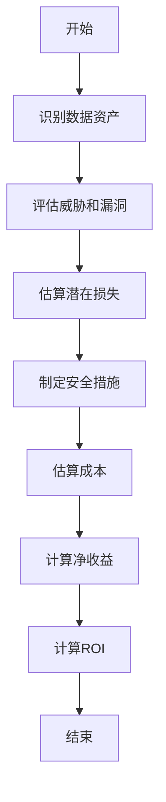
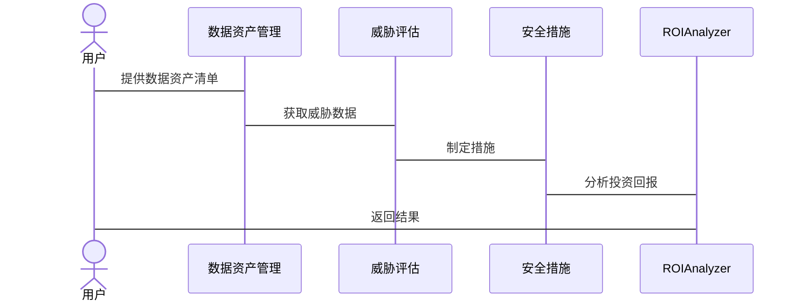

                 


# 彼得林奇如何评估公司的数据安全投资回报

> 关键词：数据安全、投资回报、彼得·林奇、风险评估、企业战略

> 摘要：本文详细探讨了彼得·林奇的投资理念如何应用于数据安全领域的投资回报评估。通过背景分析、核心概念、评估方法、系统设计和项目实战，提供了全面的策略和实践指南，帮助企业有效评估和优化数据安全投资。

---

## 第一部分：数据安全投资回报评估的背景与核心概念

### 第1章：数据安全投资回报评估的背景与问题

#### 1.1 数据安全的重要性与挑战

数据已成为企业的核心资产，其安全性和完整性对企业生存至关重要。随着数字化转型的加速，数据泄露、网络攻击等安全威胁频发，企业必须投入大量资源保护数据。然而，数据安全投资的回报难以量化，导致企业在决策时面临挑战。

#### 1.2 彼得·林奇投资理念与数据安全的结合

彼得·林奇是著名投资专家，其理念强调基本面分析和长期价值。将此理念应用于数据安全，需评估每项投资如何降低风险、保障资产，并为企业创造长期价值。数据安全投资回报的评估需要考虑风险降低带来的间接收益和直接成本节省。

#### 1.3 数据安全投资回报评估的边界与外延

数据安全投资涉及技术、流程、人员等多个方面。评估边界应涵盖从威胁检测到响应的所有环节。外延则包括数据安全对业务连续性、声誉的影响，以及合规要求的满足情况。

#### 1.4 核心概念与联系

数据安全投资回报（ROI）=（安全收益 - 投资成本）/ 投资成本 × 100%。收益包括避免的数据泄露损失、合规节省等。安全收益可分直接（如成本节省）和间接（如声誉提升）两类。

**ER实体关系图（Mermaid）：**

```mermaid
erDiagram
    actor 顾客
    actor 黑客
    actor 企业
    actor 监管机构
    database 数据资产
    boundary 数据安全措施
    database 投资回报
    顾客 --> 数据资产: 访问
    黑客 --> 数据资产: 攻击
    企业 --> 数据资产: 所有
    数据安全措施 --> 数据资产: 保护
    数据安全措施 --> 投资回报: 产生
    监管机构 --> 企业: 监督
```

---

## 第二部分：数据安全投资回报评估的核心原理

### 第2章：数据安全投资回报的评估原理

#### 2.1 数据安全投资回报的评估框架

框架包括威胁评估、安全措施成本、收益预测、风险降低和投资回收期分析。每个步骤需详细量化。

#### 2.2 数据安全投资回报的数学模型与公式

- 投资回报率（ROI）=（净收益 / 投资成本）× 100%
- 净收益 = 收益 - 成本
- 投资回收期（Payback Period）= 投资成本 / 年收益

**示例：**

假设企业投资100万美元于数据安全措施，预计每年节省50万美元的潜在损失。

- ROI = (50万 / 100万) × 100% = 50%
- Payback Period = 100万 / 50万 = 2年

#### 2.3 数据安全投资回报的算法原理

**流程图（Mermaid）：**



**Python代码实现：**

```python
def calculate_roi(investment, net_gain):
    return (net_gain / investment) * 100

investment = 1000000  # 投资成本（美元）
net_gain = 500000     # 净收益（美元）

roi = calculate_roi(investment, net_gain)
print(f"ROI: {roi}%")
```

---

## 第三部分：数据安全投资回报评估的系统分析与架构设计

### 第3章：数据安全投资回报评估的系统分析

#### 3.1 项目介绍

目标：建立数据安全投资回报评估系统。范围：涵盖数据资产识别、威胁评估、措施制定和效果分析。

#### 3.2 系统架构设计

**架构图（Mermaid）：**


#### 3.3 接口与交互设计

**交互图（Mermaid）：**



---

## 第四部分：数据安全投资回报评估的项目实战

### 第4章：数据安全投资回报评估的项目实战

#### 4.1 环境安装与工具准备

- 工具：Python、Pandas、Matplotlib、数据库（MySQL）
- 安装：pip install pandas matplotlib pymysql

#### 4.2 核心实现源代码

```python
import pandas as pd
import pymysql

def fetch_data():
    # 连接数据库
    conn = pymysql.connect(host='localhost', user='root', password='password', db='data_security')
    df = pd.read_sql("SELECT * FROM security_investments", conn)
    conn.close()
    return df

def calculate_roi_analysis(df):
    # 计算ROI
    df['ROI'] = (df['Net_Gain'] / df['Investment']) * 100
    return df

if __name__ == "__main__":
    data = fetch_data()
    result = calculate_roi_analysis(data)
    print(result.head())
```

#### 4.3 案例分析

假设企业投资100万美元于数据加密措施，每年避免50万美元的潜在损失。计算ROI为50%，投资回收期2年。

---

## 第五部分：总结与展望

### 5.1 总结

本文详细探讨了彼得·林奇的投资理念在数据安全领域的应用，通过理论分析、算法设计和案例实战，展示了如何有效评估数据安全投资回报。

### 5.2 最佳实践与建议

- 定期评估数据安全措施的ROI
- 考虑间接收益，如声誉提升
- 使用自动化工具优化评估流程

### 5.3 展望

随着技术进步，数据安全投资回报评估将更加精准和动态。未来可能引入AI和机器学习模型，提高预测准确性。

---

## 关于作者

[此处可以放置作者简介和联系方式]

---

## 致谢

感谢读者的支持与关注，欢迎留言交流。

