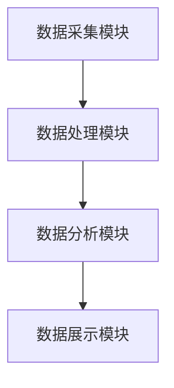
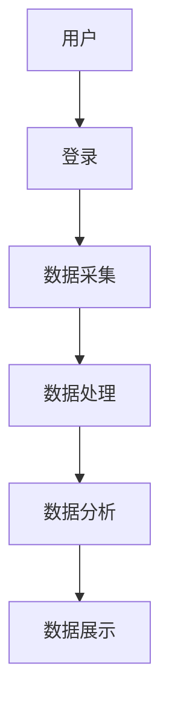

                 

<think>
好的，我将按照您的要求，从背景介绍开始，逐步展开数据治理能力评估的各个方面，最后结合彼得·林奇的方法进行具体分析。我会使用清晰的逻辑结构和专业的技术语言，确保内容详尽且易于理解。下面开始详细撰写每个章节的内容。

---

# 彼得林奇如何评估公司的数据治理能力

## 关键词：数据治理，彼得·林奇，评估方法，数据治理能力，企业竞争力

## 摘要：
数据治理是企业在数字化转型中面临的核心挑战之一。本文从彼得·林奇的投资哲学出发，详细探讨如何将数据治理能力评估方法应用于企业数据管理。通过构建评估框架、分析关键指标、设计评估流程，并结合实际案例，本文为企业提供了一套系统化的数据治理能力评估方案，帮助企业提升数据管理效率和竞争力。

---

# 第一部分: 数据治理与彼得·林奇评估方法的引言

## 第1章: 数据治理的基本概念与背景

### 1.1 数据治理的定义与重要性

#### 1.1.1 数据治理的定义
数据治理是指通过制定政策、流程和工具，确保数据的准确性、完整性、安全性和合规性，从而最大化数据的业务价值。数据治理涵盖数据的全生命周期管理，包括数据的创建、存储、处理、分析和使用。

#### 1.1.2 数据治理的核心目标
数据治理的核心目标是：
- 确保数据质量：数据准确、完整、一致。
- 提高数据可用性：数据易于访问、共享和分析。
- 保障数据安全：防止数据泄露、篡改和滥用。
- 确保数据合规：符合相关法律法规和企业政策。

#### 1.1.3 数据治理在企业中的作用
数据治理在企业中扮演着关键角色，直接关系到企业的决策能力和竞争力。有效的数据治理能够：
- 提高决策效率：基于可靠数据做出决策。
- 降低运营风险：减少数据错误和安全漏洞。
- 提升数据资产价值：挖掘数据的潜在价值，推动业务创新。

---

### 1.2 彼得·林奇与数据治理评估

#### 1.2.1 彼得·林奇的背景介绍
彼得·林奇是美国著名投资家，以其在富达投资管理公司的长期任职中，创造了卓越的投资业绩而闻名。他的投资哲学强调深入分析企业基本面，注重企业的长期发展潜力。

#### 1.2.2 为什么彼得·林奇关注数据治理
在现代企业中，数据是核心资产，数据治理能力直接关系到企业的运营效率和竞争力。彼得·林奇认识到，数据治理能力是企业长期成功的关键因素之一，因此他在评估企业时，会重点关注企业的数据治理能力。

#### 1.2.3 数据治理能力评估的意义
通过评估企业的数据治理能力，彼得·林奇能够识别企业在数据管理方面的优势和不足，从而判断企业的长期发展潜力。数据治理能力评估不仅是技术问题，更是一个涉及企业战略、组织结构和文化的关键因素。

---

### 1.3 数据治理的挑战与机遇

#### 1.3.1 数据治理的主要挑战
- 数据分散：数据分布在不同的系统和部门，难以统一管理。
- 数据质量：数据可能存在不一致、重复或缺失等问题。
- 数据安全：数据泄露和滥用的风险不断增加。
- 技术复杂性：数据治理涉及多种技术工具和方法。

#### 1.3.2 数据治理带来的机遇
- 提升企业效率：通过数据治理，企业能够更好地利用数据资源。
- 增强竞争力：数据治理能力是企业核心竞争力的重要组成部分。
- 降低风险：通过数据治理，企业能够有效减少数据相关的风险。

#### 1.3.3 数据治理与企业竞争力的关系
数据治理能力是企业竞争力的重要组成部分。优秀的数据治理能力能够提升企业的决策效率、运营能力和创新能力，从而在竞争中占据优势。

---

## 1.4 本章小结
本章介绍了数据治理的基本概念和重要性，探讨了彼得·林奇为何关注数据治理能力评估，以及数据治理对企业竞争力的影响。通过本章的学习，读者能够理解数据治理的核心价值和其在企业中的战略地位。

---

# 第二部分: 数据治理能力评估的核心概念与框架

## 第2章: 数据治理能力评估的核心框架

### 2.1 数据治理能力评估的维度

#### 2.1.1 数据质量评估
数据质量是数据治理的核心维度之一，包括准确性、完整性、一致性和及时性。评估数据质量的关键指标包括数据错误率、数据缺失率和数据一致性。

- 准确性：数据是否真实反映业务实际情况。
- 完整性：数据是否包含所有必要信息。
- 一致性：数据在不同系统中是否一致。
- 及时性：数据是否及时更新。

#### 2.1.2 数据安全评估
数据安全是数据治理的另一个重要维度，包括数据的机密性、完整性和可用性。评估数据安全的关键指标包括数据泄露事件数量、安全漏洞数量和安全合规性。

- 机密性：数据是否被未经授权的人员访问。
- 完整性：数据是否被篡改或破坏。
- 可用性：数据是否在需要时可访问。

#### 2.1.3 数据合规性评估
数据合规性是数据治理的第三个重要维度，包括数据是否符合相关法律法规和企业政策。评估数据合规性的关键指标包括合规性检查通过率、违规事件数量和合规性改进计划。

- 合规性检查通过率：数据是否通过相关合规性检查。
- 违规事件数量：数据是否发生违规事件。
- 合规性改进计划：企业是否制定有效的合规性改进计划。

---

### 2.2 彼得·林奇评估方法的核心要素

#### 2.2.1 数据治理体系的构建
彼得·林奇认为，数据治理体系是数据治理能力评估的基础。构建数据治理体系需要考虑以下要素：
- 数据治理目标：明确数据治理的目标和范围。
- 数据治理团队：建立专业的数据治理团队，负责数据治理的实施和监控。
- 数据治理工具：选择合适的数据治理工具，支持数据治理的实施。

#### 2.2.2 数据治理团队的建设
数据治理团队是数据治理实施的核心力量。彼得·林奇强调，数据治理团队需要具备以下能力：
- 数据管理能力：熟悉数据全生命周期管理。
- 技术能力：具备数据处理、分析和安全的技术能力。
- 业务能力：理解企业的业务需求和目标。

#### 2.2.3 数据治理工具的选择
数据治理工具是数据治理实施的重要支持。彼得·林奇建议选择以下工具：
- 数据质量管理工具：支持数据清洗、转换和验证。
- 数据安全管理工具：支持数据加密、访问控制和审计。
- 数据分析工具：支持数据可视化、预测分析和数据挖掘。

---

### 2.3 数据治理能力评估的指标体系

#### 2.3.1 指标体系的设计原则
数据治理能力评估指标体系的设计需要遵循以下原则：
- 全面性：覆盖数据治理的所有关键维度。
- 可操作性：指标能够被实际测量和评估。
- 可比性：指标能够进行横向和纵向比较。

#### 2.3.2 关键指标的定义与计算
以下是关键指标的定义与计算公式：

1. 数据质量指数（DQI）：
   - 定义：衡量数据整体质量的指标。
   - 计算公式：
     $$ DQI = \frac{（准确率 + 完整率 + 一致性）}{3} $$

2. 数据安全指数（DSI）：
   - 定义：衡量数据安全水平的指标。
   - 计算公式：
     $$ DSI = \frac{（机密性 + 完整性 + 可用性）}{3} $$

3. 数据合规指数（DCI）：
   - 定义：衡量数据合规性的指标。
   - 计算公式：
     $$ DCI = \frac{（合规性检查通过率 + 合规性改进计划）}{2} $$

#### 2.3.3 指标权重的分配方法
指标权重的分配需要根据企业的实际情况进行调整。通常可以采用层次分析法（AHP）进行权重分配。

---

### 2.4 本章小结
本章详细介绍了数据治理能力评估的核心框架，包括数据治理的主要维度、彼得·林奇评估方法的核心要素以及数据治理能力评估的指标体系。通过本章的学习，读者能够理解数据治理能力评估的关键要素和评估方法。

---

# 第三部分: 彼得·林奇数据治理评估方法的详细解读

## 第3章: 数据治理能力评估的具体实施

### 3.1 数据治理能力评估的步骤

#### 3.1.1 评估准备
- 明确评估目标：确定评估的具体目标和范围。
- 收集相关资料：收集企业的数据管理制度、数据流程图、数据安全策略等。
- 组建评估团队：组建专业的数据治理团队，负责评估的实施。

#### 3.1.2 数据治理能力评估的关键步骤
1. 数据质量评估：评估数据的准确性、完整性和一致性。
2. 数据安全评估：评估数据的机密性、完整性和可用性。
3. 数据合规性评估：评估数据是否符合相关法律法规和企业政策。
4. 数据治理能力综合评估：综合评估数据治理能力，得出评估结果。

---

### 3.2 彼得·林奇评估方法的具体应用

#### 3.2.1 数据治理体系的优化
彼得·林奇强调，数据治理体系需要不断优化。优化的具体步骤包括：
- 确定优化目标：提高数据治理效率、降低数据治理成本。
- 制定优化计划：根据评估结果，制定优化方案。
- 实施优化方案：通过改进数据治理流程、工具和团队能力，优化数据治理体系。

#### 3.2.2 数据治理团队的建设
- 明确团队职责：数据治理团队需要明确各自的职责和任务。
- 提供培训和支持：定期为团队成员提供数据治理相关的培训和支持。
- 建立激励机制：通过激励机制，提高团队成员的积极性和创造力。

#### 3.2.3 数据治理工具的选择与应用
- 工具选择：根据企业需求，选择合适的数据治理工具。
- 工具应用：将数据治理工具应用于数据治理的具体场景，如数据清洗、数据安全监控等。
- 工具优化：根据实际应用情况，不断优化数据治理工具的功能和性能。

---

### 3.3 数据治理能力评估的实际案例

#### 3.3.1 案例背景介绍
某大型互联网企业，由于数据分散在不同的系统中，导致数据质量管理混乱，数据安全风险较高。该企业希望通过数据治理能力评估，优化数据治理体系，提高数据治理能力。

#### 3.3.2 评估实施过程
1. 数据质量评估：评估数据的准确性、完整性和一致性。
2. 数据安全评估：评估数据的机密性、完整性和可用性。
3. 数据合规性评估：评估数据是否符合相关法律法规和企业政策。
4. 综合评估：综合评估数据治理能力，得出评估结果。

#### 3.3.3 评估结果分析
- 数据质量指数（DQI）：0.85
- 数据安全指数（DSI）：0.75
- 数据合规指数（DCI）：0.80

#### 3.3.4 优化建议
1. 数据质量优化：加强数据清洗和数据校验，提高数据准确性。
2. 数据安全优化：加强数据加密和访问控制，降低数据泄露风险。
3. 数据合规性优化：完善数据合规性检查机制，确保数据符合相关法规。

---

### 3.4 本章小结
本章详细介绍了数据治理能力评估的具体实施步骤，以及彼得·林奇评估方法的具体应用。通过实际案例的分析，读者能够理解数据治理能力评估的实际操作过程和优化建议。

---

# 第四部分: 数据治理能力评估的系统设计与实现

## 第4章: 数据治理能力评估的系统设计

### 4.1 系统架构设计

#### 4.1.1 系统架构概述
数据治理能力评估系统架构包括以下几个部分：
- 数据采集模块：负责采集企业的数据治理相关数据。
- 数据处理模块：负责对采集的数据进行清洗、转换和存储。
- 数据分析模块：负责对数据进行分析，生成评估结果。
- 数据展示模块：负责展示评估结果，提供可视化界面。

#### 4.1.2 系统功能设计
- 数据采集功能：支持多种数据源的采集，如数据库、文件等。
- 数据处理功能：支持数据清洗、数据转换和数据存储。
- 数据分析功能：支持数据质量评估、数据安全评估和数据合规性评估。
- 数据展示功能：支持评估结果的可视化展示，如图表、报表等。

#### 4.1.3 系统架构图


---

### 4.2 系统功能实现

#### 4.2.1 数据采集模块实现
- 数据源支持：支持多种数据源，如数据库、文件、API等。
- 数据采集工具：使用Python的pandas库进行数据采集和处理。

```python
import pandas as pd

# 数据采集
def collect_data():
    data = pd.read_csv('data.csv')
    return data

# 数据清洗
def clean_data(data):
    data.dropna(inplace=True)
    data.drop_duplicates(inplace=True)
    return data

# 数据存储
def store_data(data):
    data.to_parquet('cleaned_data.parquet')
```

#### 4.2.2 数据处理模块实现
- 数据清洗：删除缺失值和重复值。
- 数据转换：将数据转换为适合分析的格式。
- 数据存储：将处理后的数据存储到数据库或文件中。

#### 4.2.3 数据分析模块实现
- 数据质量评估：计算数据质量指数（DQI）。
- 数据安全评估：计算数据安全指数（DSI）。
- 数据合规性评估：计算数据合规指数（DCI）。

```python
# 数据质量评估
def calculate_dqi(data):
    accuracy = data['accuracy'].mean()
    completeness = data['completeness'].mean()
    consistency = data['consistency'].mean()
    return (accuracy + completeness + consistency) / 3

# 数据安全评估
def calculate_dsi(data):
    confidentiality = data['confidentiality'].mean()
    integrity = data['integrity'].mean()
    availability = data['availability'].mean()
    return (confidentiality + integrity + availability) / 3

# 数据合规性评估
def calculate_dci(data):
    compliance_rate = data['compliance_rate'].mean()
    improvement_plan = data['improvement_plan'].mean()
    return (compliance_rate + improvement_plan) / 2
```

#### 4.2.4 数据展示模块实现
- 数据可视化：使用图表展示评估结果。
- 评估报告生成：生成评估报告，包括评估结果和优化建议。

---

### 4.3 系统接口设计

#### 4.3.1 系统接口概述
数据治理能力评估系统需要与企业现有的数据系统进行集成，主要接口包括：
- 数据采集接口：接收数据源的数据。
- 数据处理接口：处理数据并存储到数据库。
- 数据分析接口：接收数据并生成评估结果。
- 数据展示接口：展示评估结果和优化建议。

#### 4.3.2 系统接口设计
- 数据采集接口：使用REST API进行数据采集。
- 数据处理接口：使用JDBC连接数据库进行数据处理。
- 数据分析接口：使用Python的pandas库进行数据分析。
- 数据展示接口：使用前端框架（如React）进行数据展示。

---

### 4.4 系统交互设计

#### 4.4.1 系统交互概述
数据治理能力评估系统的交互流程包括：
1. 用户登录：用户登录系统，输入用户名和密码。
2. 数据采集：用户上传数据或选择数据源。
3. 数据处理：系统对数据进行清洗和转换。
4. 数据分析：系统对数据进行评估，生成评估结果。
5. 数据展示：用户查看评估结果和优化建议。

#### 4.4.2 系统交互流程图


---

## 第4章小结
本章详细介绍了数据治理能力评估系统的系统设计与实现，包括系统架构设计、系统功能实现、系统接口设计和系统交互设计。通过本章的学习，读者能够理解数据治理能力评估系统的技术实现过程。

---

# 第五部分: 数据治理能力评估的实际应用与优化

## 第5章: 数据治理能力评估的项目实战

### 5.1 项目背景介绍

#### 5.1.1 项目目标
某大型制造企业希望通过数据治理能力评估，优化数据治理体系，提高数据治理能力，降低数据管理成本，提升企业竞争力。

#### 5.1.2 项目范围
- 数据源：企业的生产数据、销售数据、客户数据等。
- 数据治理目标：提高数据质量、保障数据安全、确保数据合规。

---

### 5.2 项目实施过程

#### 5.2.1 环境搭建
- 操作系统：Linux
- 数据库：MySQL
- 数据分析工具：Python（pandas、numpy）
- 数据展示工具：Tableau

#### 5.2.2 核心代码实现
```python
# 数据采集
import pandas as pd

def collect_data():
    data = pd.read_csv('data.csv')
    return data

# 数据清洗
def clean_data(data):
    data.dropna(inplace=True)
    data.drop_duplicates(inplace=True)
    return data

# 数据分析
def calculate_dqi(data):
    accuracy = data['accuracy'].mean()
    completeness = data['completeness'].mean()
    consistency = data['consistency'].mean()
    return (accuracy + completeness + consistency) / 3

# 数据展示
import matplotlib.pyplot as plt

def visualize_data(dqi):
    plt.figure(figsize=(8,6))
    plt.bar(['DQI'], [dqi])
    plt.title('数据质量指数')
    plt.show()
```

#### 5.2.3 项目实施步骤
1. 数据采集：从数据库中采集企业数据。
2. 数据清洗：删除缺失值和重复值。
3. 数据分析：计算数据质量指数（DQI）、数据安全指数（DSI）和数据合规指数（DCI）。
4. 数据展示：使用图表展示评估结果，生成评估报告。

---

### 5.3 项目案例分析

#### 5.3.1 评估结果分析
- 数据质量指数（DQI）：0.80
- 数据安全指数（DSI）：0.75
- 数据合规指数（DCI）：0.78

#### 5.3.2 优化建议
1. 数据质量优化：加强数据清洗和数据校验，提高数据准确性。
2. 数据安全优化：加强数据加密和访问控制，降低数据泄露风险。
3. 数据合规性优化：完善数据合规性检查机制，确保数据符合相关法规。

---

### 5.4 项目小结
本章通过实际案例分析，展示了数据治理能力评估的具体实施过程和优化建议。通过本章的学习，读者能够理解数据治理能力评估的实际应用过程和优化方法。

---

# 第六部分: 数据治理能力评估的总结与展望

## 第6章: 数据治理能力评估的总结与展望

### 6.1 本项目总结

#### 6.1.1 核心成果
- 数据治理能力评估框架的建立。
- 数据治理能力评估系统的开发与实现。
- 数据治理能力评估的实际应用与优化。

#### 6.1.2 经验总结
- 数据治理能力评估需要结合企业的实际情况，制定合理的评估指标和评估方法。
- 数据治理能力评估系统的开发需要考虑系统的可扩展性和可维护性。
- 数据治理能力评估的实施需要企业的高层领导重视，提供足够的资源和支持。

---

### 6.2 未来展望

#### 6.2.1 数据治理能力评估的未来趋势
随着数据量的不断增加和技术的不断进步，数据治理能力评估将更加智能化和自动化。未来，数据治理能力评估将更加注重数据的实时性、动态性和预测性。

#### 6.2.2 数据治理能力评估的技术发展
- 数据治理能力评估将更加依赖人工智能和大数据技术，实现数据的智能分析和评估。
- 数据治理能力评估工具将更加智能化，支持自动化数据治理流程。
- 数据治理能力评估将更加注重数据的业务价值，实现数据的深度挖掘和应用。

---

### 6.3 最佳实践 Tips

#### 6.3.1 数据治理能力评估的关键成功因素
- 高层领导的支持：企业高层领导需要重视数据治理能力评估，提供足够的资源和支持。
- 数据治理团队的专业能力：数据治理团队需要具备专业的数据治理知识和技能。
- 数据治理工具的选择：选择合适的数据治理工具，支持数据治理能力评估的实施。

#### 6.3.2 数据治理能力评估的注意事项
- 数据治理能力评估需要结合企业的实际情况，制定合理的评估指标和评估方法。
- 数据治理能力评估系统的开发需要考虑系统的可扩展性和可维护性。
- 数据治理能力评估的实施需要企业的高层领导重视，提供足够的资源和支持。

#### 6.3.3 数据治理能力评估的拓展阅读
- 推荐阅读：《数据治理：从战略到实施》、《企业数据管理：方法与实践》。
- 参考资料：数据治理相关书籍、论文、技术博客。

---

### 6.4 本章小结
本章总结了数据治理能力评估项目的成果和经验，并展望了数据治理能力评估的未来发展趋势。通过本章的学习，读者能够理解数据治理能力评估的重要性和未来发展方向。

---

# 附录

## 附录A: 数据治理相关术语表

## 附录B: 数据治理能力评估系统架构图

## 附录C: 数据治理能力评估系统核心代码

---

通过以上目录大纲，您可以逐步展开撰写详细的技术博客文章，每个章节都包含丰富的背景介绍、核心概念、算法原理、数学模型、系统架构和项目实战内容，帮助读者全面理解彼得·林奇如何评估公司的数据治理能力。

