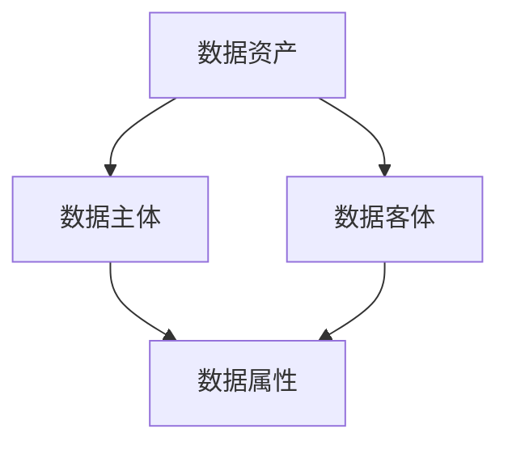
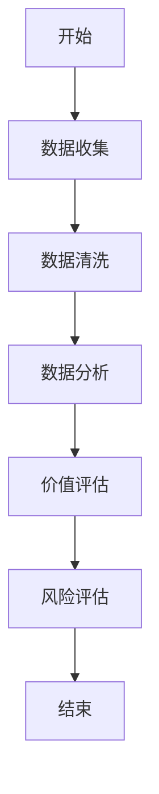
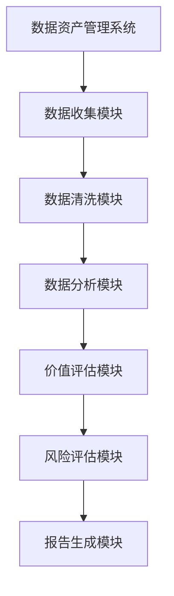
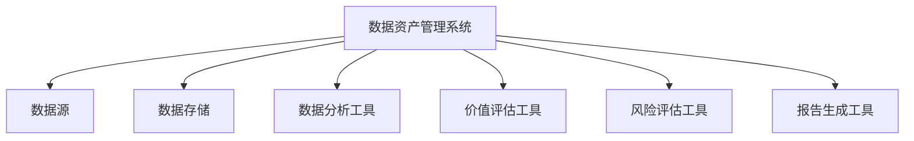
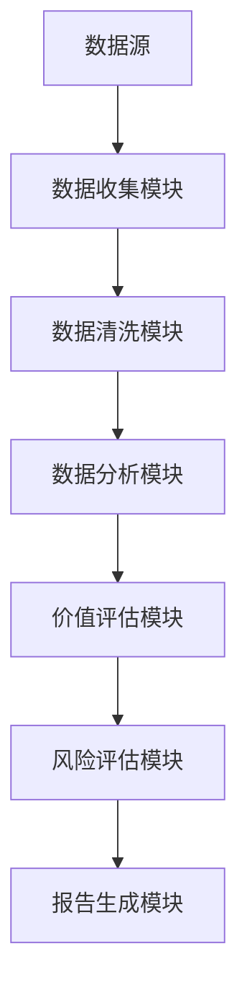
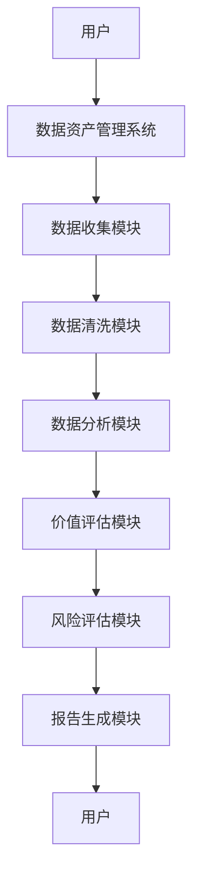

                 


# 彼得·林奇如何评估公司的数据资产价值

> 关键词：彼得·林奇，数据资产，价值评估，投资理念，数据资产评估

> 摘要：本文将深入探讨彼得·林奇的投资理念如何应用于数据资产的评估。通过结合数据资产的核心概念、价值评估模型、系统架构设计和实际案例分析，全面解析数据资产的价值评估方法和实施策略。

---

# 第一部分: 数据资产价值评估的背景与概念

## 第1章: 数据资产价值评估的背景介绍

### 1.1 数据资产的定义与背景

#### 1.1.1 数据资产的定义
数据资产是指企业拥有或控制的、能够为企业创造经济价值的数据资源。这些数据可以是结构化的（如数据库中的记录）或非结构化的（如文档、图像），并且具有可量化的价值。

#### 1.1.2 数据资产的背景与重要性
随着数字化转型的推进，数据已成为企业最重要的资产之一。企业通过收集、存储和分析数据，可以优化业务流程、提高决策效率并创造新的收入来源。数据资产的价值体现在其对业务目标的支持能力。

#### 1.1.3 数据资产在企业中的角色
数据资产是企业决策的依据，能够支持市场营销、风险管理、客户关系管理等核心业务。通过有效的数据管理，企业可以提升竞争力和创新能力。

### 1.2 数据资产的核心要素

#### 1.2.1 数据资产的分类
数据资产可以分为以下几类：
1. **结构化数据**：如数据库中的表格数据。
2. **非结构化数据**：如文本文件、图像、视频等。
3. **半结构化数据**：如JSON、XML格式的数据。

#### 1.2.2 数据资产的特征
- **准确性**：数据必须反映真实情况。
- **完整性**：数据应包含所有相关信息。
- **一致性**：数据在不同系统中应保持一致。
- **可用性**：数据应易于访问和处理。
- **安全性**：数据应受到保护，防止未经授权的访问。

#### 1.2.3 数据资产的生命周期
数据的生命周期包括生成、存储、处理、分析、存档和销毁等阶段。每个阶段都需要有效的管理策略。

## 第2章: 彼得·林奇的投资理念与数据资产评估

### 2.1 彼得·林奇的投资哲学

#### 2.1.1 林奇的投资策略
彼得·林奇是美国著名的投资专家，他强调基本面分析和长期投资。他认为，投资者应选择那些具有持续增长潜力的公司，并长期持有。

#### 2.1.2 林奇的价值评估方法
林奇的价值评估方法主要包括以下几个方面：
1. **公司基本面分析**：研究公司的财务状况、行业地位和竞争优势。
2. **行业分析**：评估行业的发展趋势和竞争格局。
3. **管理层能力**：关注管理层的决策能力和企业战略。

#### 2.1.3 林奇的成功案例分析
林奇成功投资的案例包括可口可乐和吉列公司。他通过深入研究这些公司的基本面，发现其潜在价值，并长期持有。

### 2.2 数据资产的评估框架

#### 2.2.1 数据资产的评估维度
数据资产的评估维度包括：
1. **数据的可用性**：数据是否易于访问和处理。
2. **数据的质量**：数据的准确性、完整性和一致性。
3. **数据的潜在价值**：数据对业务目标的支持能力。
4. **数据的成本**：数据的获取和存储成本。

#### 2.2.2 数据资产的评估指标
- **数据资产的收益能力**：数据对企业收入的贡献。
- **数据资产的风险水平**：数据可能面临的法律和安全风险。
- **数据资产的可扩展性**：数据是否可以支持未来的业务增长。

#### 2.2.3 数据资产的评估流程
1. **数据收集**：收集与数据资产相关的所有信息。
2. **数据清洗**：清理数据中的错误和冗余信息。
3. **数据分析**：使用数据分析工具对数据进行深入分析。
4. **价值评估**：根据分析结果评估数据资产的价值。
5. **风险评估**：评估数据资产可能面临的风险。

---

# 第二部分: 数据资产价值评估的核心概念与联系

## 第3章: 数据资产的核心概念与联系

### 3.1 数据资产的核心概念

#### 3.1.1 数据资产的属性对比
| 属性       | 描述                                       |
|------------|------------------------------------------|
| 准确性      | 数据反映真实情况的能力                     |
| 完整性      | 数据包含所有相关信息的能力               |
| 一致性      | 数据在不同系统中的统一性                 |
| 可用性      | 数据易于访问和处理的能力                 |
| 安全性      | 数据受到保护的能力                       |

#### 3.1.2 数据资产的实体关系图



#### 3.1.3 数据资产的分类与特征
数据资产的分类与特征可以通过以下表格表示：

| 分类         | 特征描述                               |
|--------------|----------------------------------------|
| 结构化数据    | 可以用表格形式表示，易于处理和分析     |
| 非结构化数据  | 不规则，难以直接处理，需要额外的处理步骤 |
| 半结构化数据  | 具有部分结构，如JSON、XML格式          |

### 3.2 数据资产价值评估模型

#### 3.2.1 数据资产的评估模型
数据资产价值评估模型可以通过以下公式表示：

$$ V = \sum_{i=1}^{n} w_i \cdot x_i $$

其中：
- \( V \) 表示数据资产的价值
- \( w_i \) 表示第 \( i \) 个评估维度的权重
- \( x_i \) 表示第 \( i \) 个评估维度的得分

#### 3.2.2 数据资产的评估流程



## 第4章: 数据资产价值评估的数学模型与公式

### 4.1 数据资产价值评估的数学模型

#### 4.1.1 数据资产价值的公式推导
数据资产价值的评估可以通过以下步骤进行：
1. 确定数据资产的各个评估维度。
2. 为每个评估维度分配权重。
3. 计算每个评估维度的得分。
4. 根据公式计算数据资产的总价值。

#### 4.1.2 数据资产价值的评估公式

$$ V = \sum_{i=1}^{n} w_i \cdot x_i $$

其中：
- \( V \) 表示数据资产的价值
- \( w_i \) 表示第 \( i \) 个评估维度的权重
- \( x_i \) 表示第 \( i \) 个评估维度的得分

#### 4.1.3 数据资产价值的案例分析
假设某公司的数据资产包括以下三个维度：
- 数据的可用性：权重为0.4，得分为80
- 数据的质量：权重为0.3，得分为70
- 数据的潜在价值：权重为0.3，得分为90

则数据资产的总价值为：

$$ V = 0.4 \times 80 + 0.3 \times 70 + 0.3 \times 90 = 32 + 21 + 27 = 80 $$

---

# 第三部分: 数据资产价值评估的系统分析与架构设计

## 第5章: 数据资产价值评估的系统分析

### 5.1 数据资产价值评估的系统功能设计

#### 5.1.1 数据资产管理系统功能模块



#### 5.1.2 数据资产价值评估的功能需求
- 数据收集：从多个数据源收集数据。
- 数据清洗：清理数据中的错误和冗余信息。
- 数据分析：使用数据分析工具对数据进行深入分析。
- 价值评估：根据分析结果评估数据资产的价值。
- 风险评估：评估数据资产可能面临的风险。

#### 5.1.3 数据资产价值评估的系统架构
系统架构可以通过以下图表表示：



### 5.2 数据资产价值评估的系统架构设计

#### 5.2.1 数据资产价值评估的系统架构图



#### 5.2.2 数据资产价值评估的系统接口设计
- 数据收集模块接口：负责从数据源获取数据。
- 数据清洗模块接口：负责清理数据中的错误和冗余信息。
- 数据分析模块接口：负责对数据进行深入分析。
- 价值评估模块接口：负责根据分析结果评估数据资产的价值。
- 风险评估模块接口：负责评估数据资产可能面临的风险。

#### 5.2.3 数据资产价值评估的系统交互流程



## 第6章: 数据资产价值评估的系统实现

### 6.1 数据资产价值评估的系统实现

#### 6.1.1 数据资产价值评估的环境安装
- 操作系统：Linux或Windows
- 数据库：MySQL或MongoDB
- 数据分析工具：Python（Pandas、NumPy）
- 开发工具：Jupyter Notebook或PyCharm

#### 6.1.2 数据资产价值评估的核心代码实现

```python
import pandas as pd
import numpy as np

# 数据收集模块
def collect_data():
    # 从数据库中获取数据
    data = pd.read_sql('SELECT * FROM data_table', '数据库连接')
    return data

# 数据清洗模块
def clean_data(data):
    # 删除缺失值
    data.dropna(inplace=True)
    return data

# 数据分析模块
def analyze_data(data):
    # 计算数据的基本统计指标
    stats = data.describe()
    return stats

# 价值评估模块
def assess_value(stats):
    # 计算数据资产的价值
    value = np.mean(stats['mean'])
    return value

# 风险评估模块
def assess_risk(stats):
    # 计算数据资产的风险
    risk = np.std(stats['std'])
    return risk

# 主程序
def main():
    data = collect_data()
    data = clean_data(data)
    stats = analyze_data(data)
    value = assess_value(stats)
    risk = assess_risk(stats)
    print(f'数据资产价值：{value}')
    print(f'数据资产风险：{risk}')

if __name__ == '__main__':
    main()
```

#### 6.1.3 数据资产价值评估的代码解读与分析
- `collect_data`函数：从数据库中获取数据。
- `clean_data`函数：删除缺失值。
- `analyze_data`函数：计算数据的基本统计指标。
- `assess_value`函数：计算数据资产的价值。
- `assess_risk`函数：计算数据资产的风险。
- `main`函数：主程序，调用上述函数并输出结果。

### 6.2 数据资产价值评估的项目实战

#### 6.2.1 数据资产价值评估的案例分析
假设某公司的数据资产包括以下数据：

| 客户ID | 收入 | 支出 | 利润 |
|--------|------|------|------|
| 1      | 100  | 50   | 50   |
| 2      | 150  | 60   | 90   |
| 3      | 200  | 80   | 120  |
| 4      | 120  | 70   | 50   |

#### 6.2.2 数据资产价值评估的详细讲解
1. 数据收集：从数据库中获取客户收入、支出和利润数据。
2. 数据清洗：删除缺失值。
3. 数据分析：计算数据的均值、方差等统计指标。
4. 价值评估：计算数据资产的价值。
5. 风险评估：计算数据资产的风险。

#### 6.2.3 数据资产价值评估的项目小结
通过上述步骤，我们可以得出数据资产的价值和风险，并根据结果制定相应的数据管理策略。

---

# 第四部分: 数据资产价值评估的最佳实践与总结

## 第7章: 数据资产价值评估的最佳实践

### 7.1 数据资产价值评估的注意事项
- 确保数据的准确性和完整性。
- 定期更新数据资产评估结果。
- 加强数据安全保护，防止数据泄露。

### 7.2 数据资产价值评估的总结
数据资产是企业的核心资产之一，其价值评估需要结合企业的实际情况和数据的特点。通过本文的分析，我们可以看到，彼得·林奇的投资理念可以为数据资产评估提供重要的参考。

### 7.3 数据资产价值评估的注意事项
- 数据资产评估需要结合企业的业务目标。
- 数据资产评估需要考虑数据的生命周期。
- 数据资产评估需要结合数据的法律和安全要求。

### 7.4 数据资产价值评估的拓展阅读
建议读者进一步阅读以下书籍和文章：
- 彼得·林奇的《彼得·林奇的成功投资策略》
- 数据资产管理相关的书籍和文章。

---

以上是《彼得·林奇如何评估公司的数据资产价值》的技术博客文章的完整目录大纲和内容概述。通过本文的分析，我们可以看到，数据资产的价值评估是一个复杂而重要的过程，需要结合企业的实际情况和数据的特点，同时借鉴彼得·林奇的投资理念，制定科学合理的评估策略。

