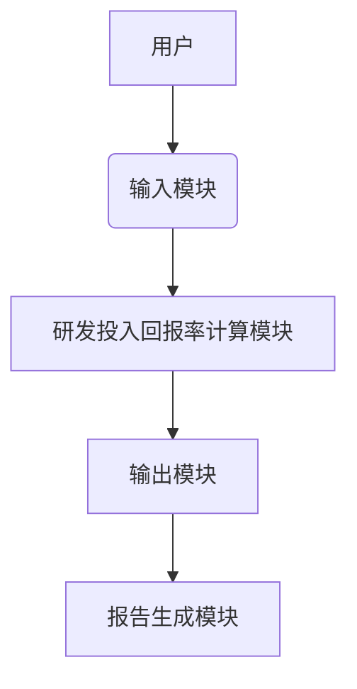

                 


# 彼得林奇如何评估公司的研发投入回报率

## 关键词：彼得林奇、研发投入回报率、净现值法、内部收益率、投资评估

## 摘要：本文详细探讨了彼得·林奇如何评估公司的研发投入回报率，从核心概念、数学模型到实际应用，逐步分析了如何通过净现值法、内部收益率等方法来衡量研发投入的价值，并结合系统架构设计和项目实战，提供了全面的评估框架和实践指南。

---

# 第一部分: 背景介绍与核心概念

---

## 第1章: 研发投入回报率的重要性

### 1.1 什么是研发投入回报率

#### 1.1.1 研发投入回报率的定义

研发投入回报率是指企业在研发项目上投入的资金与其带来的收益之间的比率。它是衡量企业研发投入是否有效的关键指标。

#### 1.1.2 研发投入回报率的核心要素

- **研发投入金额**：企业在研发项目上的资金投入。
- **研发成果**：研发项目带来的实际收益或潜在价值。
- **时间周期**：从投入资金到产生收益的时间跨度。
- **回报率计算**：通过数学模型和公式计算出的回报比率。

#### 1.1.3 研发投入回报率的计算公式

研发投入回报率（ROI）的通用计算公式为：

$$ ROI = \frac{\text{净收益}}{\text{研发投入}} $$

其中，净收益为研发项目带来的收益减去初始投入。

---

### 1.2 彼得·林奇的投资哲学

#### 1.2.1 彼得·林奇的背景与投资理念

彼得·林奇是美国著名投资专家，以其在共同基金领域的卓越表现而闻名。他强调长期投资和深入研究公司的基本面，注重企业的盈利能力和成长潜力。

#### 1.2.2 彼得·林奇对研发投入回报率的关注

林奇认为，研发投入是企业长期增长的重要驱动力，但关键在于投入的资金是否能够带来足够的回报。他主张通过评估研发投入回报率来判断企业的投资价值。

#### 1.2.3 彼得·林奇的投资策略与公司研发投入的关系

林奇的投资策略强调对公司的基本面进行深入分析，包括财务数据、管理层能力和市场地位。他特别关注那些能够持续创新、提高研发效率的企业。

---

### 1.3 研发投入回报率的评估意义

#### 1.3.1 研发投入回报率对企业价值的影响

研发投入回报率高的企业通常具有更强的市场竞争力和盈利能力，这会直接反映在其股票价值上。

#### 1.3.2 研发投入回报率对投资者决策的作用

投资者通过分析研发投入回报率，可以判断企业的投资价值和成长潜力，从而做出更明智的投资决策。

#### 1.3.3 研发投入回报率与公司长期发展的关系

长期来看，高研发投入回报率能够推动企业的技术进步和产品创新，从而增强企业的核心竞争力。

---

## 第2章: 研发投入回报率的评估框架

### 2.1 研发投入回报率的评估维度

#### 2.1.1 研发投入的来源与分配

企业研发投入通常来自自有资金或外部融资，需要合理分配到不同的研发项目中。

#### 2.1.2 研发成果的衡量标准

研发成果可以通过专利数量、新产品销售额、技术领先性等指标来衡量。

#### 2.1.3 研发投入与收益的时间差

研发投入需要一定时间才能转化为实际收益，时间差会影响回报率的计算。

---

### 2.2 研发投入回报率的核心模型

#### 2.2.1 净现值法（Net Present Value, NPV）

净现值法通过将未来现金流按贴现率折算到现在，计算其净现值。如果NPV为正，则项目值得投资。

#### 2.2.2 内部收益率法（Internal Rate of Return, IRR）

内部收益率是使净现值为零的折现率，反映了项目的收益能力。

#### 2.2.3 投资回收期法（Payback Period）

投资回收期是指项目回收初始投资所需的时间，通常用于评估项目的风险。

---

### 2.3 研发投入回报率与企业价值的关系

#### 2.3.1 企业价值公式

企业价值通常包括未来现金流的现值，而研发投入回报率直接影响这些现金流的大小。

#### 2.3.2 研发投入回报率对企业价值的影响

高研发投入回报率能够提升企业未来现金流的现值，从而增加企业价值。

#### 2.3.3 企业价值与研发投入回报率的对比分析

通过对比不同企业的研发投入回报率和企业价值，可以发现回报率高的企业通常具有更高的市场价值。

---

## 第3章: 研发投入回报率的数学模型

### 3.1 净现值法（NPV）

#### 3.1.1 NPV公式

$$ NPV = \sum_{t=0}^{n} \frac{CF_t}{(1 + r)^t} $$

其中，\( CF_t \) 是第t年的现金流，\( r \) 是贴现率。

#### 3.1.2 NPV的计算步骤

1. 确定未来现金流。
2. 选择合适的贴现率。
3. 计算各期现金流的现值。
4. 求和得到净现值。

#### 3.1.3 NPV的优缺点分析

- 优点：考虑了时间价值，计算全面。
- 缺点：依赖贴现率的准确性。

---

### 3.2 内部收益率法（IRR）

#### 3.2.1 IRR公式

$$ IRR = r \text{ 使得 } \sum_{t=0}^{n} \frac{CF_t}{(1 + r)^t} = 0 $$

#### 3.2.2 IRR的计算步骤

1. 确定未来现金流。
2. 通过试算法或迭代法求解使NPV为零的贴现率。

#### 3.2.3 IRR的优缺点分析

- 优点：易于理解，可以直接反映项目收益能力。
- 缺点：可能有多个解，计算复杂。

---

## 第4章: 系统分析与架构设计

### 4.1 研发投入回报率评估系统的功能设计

#### 4.1.1 领域模型


### 4.2 系统架构设计



### 4.3 接口设计与交互流程


---

## 第5章: 项目实战

### 5.1 环境安装与配置

安装Python和相关库（如numpy、pandas）。

### 5.2 核心代码实现

```python
import numpy as np

def calculate_npv(cash_flows, discount_rate):
    return np.npv(discount_rate, *cash_flows)

def calculate_irr(cash_flows):
    return np.irr(cash_flows)

# 示例数据
cash_flows = [-100, 40, 40, 40]
discount_rate = 0.1

npv = calculate_npv(cash_flows, discount_rate)
irr = calculate_irr(cash_flows)

print(f"净现值: {npv:.2f}")
print(f"内部收益率: {irr:.2%}")
```

---

## 第6章: 最佳实践与小结

### 6.1 最佳实践

- 确保数据的准确性和完整性。
- 合理选择贴现率和计算方法。
- 结合行业特点进行调整。

### 6.2 小结

通过本文的分析，我们了解了彼得·林奇如何评估研发投入回报率，并掌握了净现值法和内部收益率法的应用。

### 6.3 注意事项

- 投资者应结合其他财务指标综合评估。
- 模型假设可能与实际情况存在偏差。

### 6.4 拓展阅读

建议进一步阅读《彼得·林奇的投资哲学》和相关投资评估方法。

---

# 结语

本文通过理论分析和实际案例，详细探讨了彼得·林奇如何评估公司的研发投入回报率，并为读者提供了系统的评估框架和实用的工具。希望本文能够帮助投资者和企业更好地理解和应用这一重要概念。

