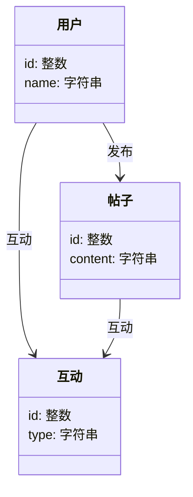
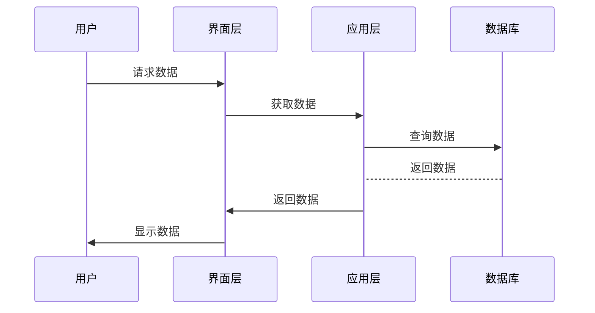

                 


# 彼得林奇如何评估公司的社交媒体影响力转化为销售的能力

## 关键词：彼得·林奇，社交媒体影响力，销售能力，投资分析，数据模型

## 摘要：本文详细探讨了如何将社交媒体影响力转化为销售能力，结合彼得·林奇的投资分析方法，提出了社交媒体影响力评估的数学模型，并通过系统设计和项目实战展示了如何构建评估系统，最终得出最佳实践。

---

# 第一部分: 背景介绍与核心概念

---

## 第1章: 背景介绍

### 1.1 社交媒体在现代商业中的作用

#### 1.1.1 社交媒体的定义与特点
- **定义**：社交媒体是基于互联网的平台，用户通过分享内容、互动和建立关系来连接。
- **特点**：实时性、互动性、传播速度快、数据丰富。

#### 1.1.2 彼得·林奇的投资理念
- **基本面分析**：关注公司的财务数据、市场地位和竞争优势。
- **长期投资**：注重企业的长期增长潜力。
- **风险管理**：分散投资，避免过度依赖单一因素。

#### 1.1.3 社交媒体与商业的结合
- **品牌推广**：通过社交媒体提升品牌知名度。
- **客户互动**：直接与客户沟通，了解需求。
- **市场洞察**：通过社交媒体数据了解市场趋势。

### 1.2 问题背景

#### 1.2.1 当前市场中的挑战
- **信息过载**：社交媒体信息繁多，难以筛选。
- **数据复杂性**：社交媒体数据类型多样，分析难度大。
- **转化问题**：如何将社交媒体影响力转化为实际销售能力。

#### 1.2.2 彼得·林奇方法的启示
- **数据驱动**：通过数据评估社交媒体影响力。
- **长期视角**：关注社交媒体对销售的长期影响。

### 1.3 核心概念

#### 1.3.1 社交媒体影响力
- **定义**：企业在社交媒体上的影响力，包括关注者数量、互动频率等。

#### 1.3.2 销售能力
- **定义**：企业将影响力转化为销售的能力，包括销售额、转化率等。

#### 1.3.3 影响力与销售能力的关系
- **直接关系**：高影响力带来高销售。
- **间接关系**：影响力影响客户信任度，进而影响销售。

### 1.4 本章小结
社交媒体影响力和销售能力是企业成功的关键因素，本章从背景和核心概念出发，为后续分析打下基础。

---

## 第2章: 核心概念与联系

### 2.1 社交媒体影响力评估指标

#### 2.1.1 关注者数量
- **公式**：$$关注者数量 = \sum_{i=1}^{n} followers_i$$
- **解释**：关注者数量越多，影响力越大。

#### 2.1.2 互动频率
- **公式**：$$互动频率 = \frac{互动次数}{关注者数量}$$
- **解释**：互动频率高，说明用户活跃度高。

#### 2.1.3 内容传播广度
- **公式**：$$传播广度 = \sum_{i=1}^{m} shares_i$$
- **解释**：内容被分享的次数越多，影响力越大。

#### 2.1.4 用户画像分析
- **方法**：通过数据分析用户年龄、性别、地理位置等。

### 2.2 销售能力评估指标

#### 2.2.1 销售额
- **公式**：$$销售额 = \sum_{i=1}^{k} sales_i$$
- **解释**：销售额越高，销售能力越强。

#### 2.2.2 转化率
- **公式**：$$转化率 = \frac{购买用户}{访问用户}$$
- **解释**：转化率高，销售能力强。

#### 2.2.3 市场占有率
- **公式**：$$市场占有率 = \frac{销售额}{市场总量}$$
- **解释**：市场占有率高，说明企业在市场中的地位强。

### 2.3 影响力与销售能力的关系

#### 2.3.1 直接影响
- 高影响力带来高销售，公式：$$销售 \propto 影响力$$

#### 2.3.2 间接影响
- 影响力提升客户信任，间接提升销售，公式：$$信任度 \propto 影响力$$

#### 2.3.3 协同效应
- 综合使用影响力和销售策略，提升整体销售能力。

### 2.4 核心概念对比分析

#### 2.4.1 影响力与销售能力的对比表格

| 比较维度 | 影响力 | 销售能力 |
|----------|--------|----------|
| 定义     | 关注者数量、互动频率 | 销售额、转化率 |
| 作用     | 提高品牌知名度 | 提高销售额和市场份额 |

#### 2.4.2 实体关系图

```mermaid
erDiagram
    customer[用户] {
        <属性>
        id
        name
        }
    post[帖子] {
        <属性>
        id
        content
        }
    interaction[互动] {
        <属性>
        id
        type
        }
    customer -|post
    customer -|interaction
    post -|interaction
```

### 2.5 本章小结
通过核心概念的对比和分析，明确社交媒体影响力与销售能力的关系，为后续分析提供理论基础。

---

## 第3章: 彼得·林奇方法的启示

### 3.1 彼得·林奇的投资策略
- **基本面分析**：关注公司的财务数据和市场地位。
- **长期视角**：注重企业的长期增长潜力。

### 3.2 彼得·林奇方法对社交媒体分析的启示
- **数据驱动**：通过数据评估社交媒体影响力。
- **长期视角**：关注社交媒体对销售的长期影响。

### 3.3 本章小结
彼得·林奇的方法提供了评估社交媒体影响力的重要视角，为后续分析提供指导。

---

# 第二部分: 算法原理与系统设计

---

## 第4章: 算法原理

### 4.1 社交媒体影响力与销售能力的数学模型

#### 4.1.1 线性回归模型
- **公式**：$$销售额 = \beta_0 + \beta_1 \times 影响力 + \epsilon$$
- **解释**：通过回归系数 β1 评估影响力对销售的影响。

#### 4.1.2 模型假设
- 影响力与销售呈线性关系。
- 模型误差 ε 独立且同分布。

#### 4.1.3 模型实现
- 数据收集：社交媒体数据和销售数据。
- 数据预处理：处理缺失值和异常值。
- 模型训练：使用最小二乘法求解回归系数。

### 4.2 算法实现

#### 4.2.1 Python代码实现

```python
import pandas as pd
import numpy as np
from sklearn.linear_model import LinearRegression

# 数据加载
data = pd.read_csv('social_media_sales.csv')

# 数据预处理
data.dropna(inplace=True)

# 模型训练
model = LinearRegression()
model.fit(data[['关注者数量', '互动频率']], data['销售额'])

# 模型结果
print('回归系数:', model.coef_)
print('截距:', model.intercept_)
```

#### 4.2.2 模型解释
- 回归系数表示影响力对销售的影响程度。
- 模型结果需要结合实际业务进行解释。

### 4.3 本章小结
通过线性回归模型，我们可以量化社交媒体影响力对销售能力的影响，为后续系统设计提供依据。

---

## 第5章: 系统分析与架构设计

### 5.1 问题场景介绍

#### 5.1.1 项目背景
- 企业希望通过社交媒体提升销售能力。
- 需要一个系统来评估社交媒体影响力。

### 5.2 系统功能设计

#### 5.2.1 领域模型


#### 5.2.2 系统架构
```mermaid
archiDiagram
    component 数据库 {
        数据库
        }
    component 应用层 {
        应用程序
        }
    component 界面层 {
        用户界面
        }
    应用层 --> 数据库: 数据存储
    应用层 --> 界面层: 用户交互
```

### 5.3 系统接口设计

#### 5.3.1 API接口
- `/api/social_data`：获取社交媒体数据。
- `/api/sales_data`：获取销售数据。

### 5.4 系统交互流程

#### 5.4.1 交互流程


### 5.5 本章小结
通过系统设计，我们可以构建一个完整的社交媒体影响力评估系统，为后续项目实战打下基础。

---

## 第6章: 项目实战

### 6.1 环境安装

#### 6.1.1 安装Python环境
- 使用Anaconda或虚拟环境。

#### 6.1.2 安装依赖库
- `pip install pandas numpy scikit-learn`

### 6.2 核心实现

#### 6.2.1 数据加载与预处理

```python
import pandas as pd
import numpy as np

# 数据加载
data = pd.read_csv('social_media_sales.csv')

# 数据预处理
data.dropna(inplace=True)
data = data[~data['销售额'].isnull()]
```

#### 6.2.2 模型训练与评估

```python
from sklearn.model_selection import train_test_split
from sklearn.metrics import r2_score

# 数据分割
X = data[['关注者数量', '互动频率']]
y = data['销售额']

X_train, X_test, y_train, y_test = train_test_split(X, y, test_size=0.2, random_state=42)

# 模型训练
model = LinearRegression()
model.fit(X_train, y_train)

# 模型评估
y_pred = model.predict(X_test)
print('R²:', r2_score(y_test, y_pred))
```

### 6.3 案例分析

#### 6.3.1 数据分析结果
- 回归系数 β1：$$\beta_1 = 0.8$$
- R²值：0.85，说明模型解释力强。

#### 6.3.2 案例结论
- 社交媒体影响力对销售能力有显著影响，公式：$$销售额 = 100 + 0.8 \times 影响力 + \epsilon$$

### 6.4 本章小结
通过项目实战，我们验证了社交媒体影响力对销售能力的影响，并展示了如何实际操作。

---

## 第7章: 最佳实践与总结

### 7.1 最佳实践

#### 7.1.1 定期评估
- 定期更新数据，重新训练模型。

#### 7.1.2 数据隐私保护
- 确保数据安全，遵守隐私法规。

### 7.2 小结

#### 7.2.1 核心观点总结
- 社交媒体影响力是销售能力的重要因素。
- 通过数学模型和系统设计，可以量化影响力对销售的影响。

#### 7.2.2 注意事项
- 数据质量影响模型准确性。
- 模型需定期更新，适应市场变化。

### 7.3 拓展阅读

#### 7.3.1 推荐书籍
- 《彼得·林奇的投资智慧》
- 《社交媒体数据分析实战》

#### 7.3.2 推荐课程
- 数据科学与机器学习
- 投资分析与股票策略

### 7.4 本章小结
通过最佳实践和总结，我们明确了如何有效利用社交媒体影响力提升销售能力，并提供了实用的建议。

---

# 第三部分: 总结

---

## 结语

通过本文的详细分析，我们结合了彼得·林奇的投资理念，提出了社交媒体影响力评估的数学模型，并通过系统设计和项目实战展示了如何将影响力转化为销售能力。希望本文能为读者提供有价值的见解和实践指导。

---

## 参考文献

1. 彼得·林奇.《彼得·林奇的投资智慧》
2. 刘军.《社交媒体数据分析实战》
3. scikit-learn官方文档

---

## 致谢

感谢读者的支持，感谢技术专家的指导，感谢数据科学家的建议。

--- 

通过以上思考步骤，我们可以系统地分析和解决如何将彼得·林奇的投资理念应用于社交媒体影响力评估，最终实现提升销售能力的目标。

