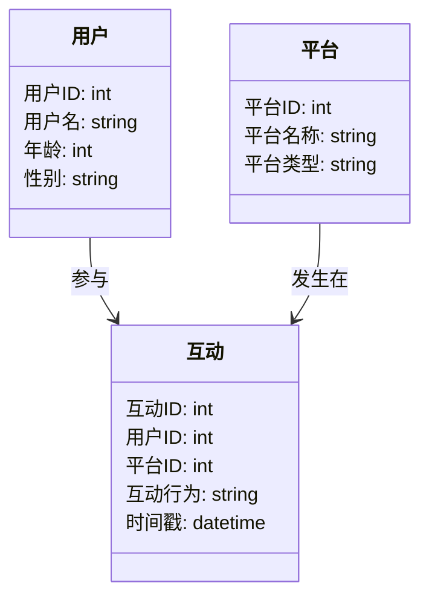
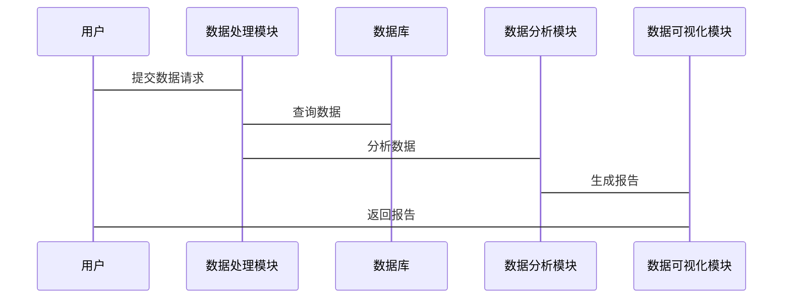

                 


# 彼得林奇如何评估公司的社交媒体营销效果

## 关键词：社交媒体营销、彼得·林奇、投资评估、营销效果、ROI分析

## 摘要：  
彼得·林奇作为全球知名的投资专家，其独特的投资理念和方法为众多投资者所熟知。本文将从投资学的角度出发，结合社交媒体营销的核心要素，深入分析彼得·林奇如何评估公司的社交媒体营销效果。通过系统地介绍社交媒体营销的核心指标、数据分析方法、投资模型和实际案例，本文将为读者提供一套基于投资学的社交媒体营销效果评估体系，帮助企业在数字时代实现更精准的营销决策和投资回报最大化。

---

# 第一章: 社交媒体营销与投资评估概述

## 1.1 社交媒体营销的定义与核心要素  
### 1.1.1 社交媒体营销的定义  
社交媒体营销是指通过社交媒体平台（如Facebook、Twitter、Instagram等）与目标受众进行互动，推广品牌、产品或服务的营销方式。其核心在于利用社交媒体的社交属性，建立品牌与用户的直接联系，提升品牌知名度和用户参与度。  

### 1.1.2 社交媒体营销的核心要素  
- **目标受众**：明确目标用户群体的特征、兴趣和行为习惯。  
- **内容策略**：制定高质量、吸引人的内容，以吸引用户关注和参与。  
- **互动频率**：通过定期发布内容和与用户互动，建立持续的品牌曝光。  
- **数据分析**：通过数据分析工具（如Google Analytics、社交媒体分析工具）量化营销效果。  

### 1.1.3 社交媒体营销的演变与趋势  
随着技术的进步和用户行为的变化，社交媒体营销从简单的信息发布逐渐发展为基于数据驱动的精准营销。未来的趋势将更加注重用户参与度和个性化内容的打造。

## 1.2 投资评估的核心概念  
### 1.2.1 投资评估的基本原理  
投资评估是通过分析企业的财务状况、市场表现和未来潜力，判断其投资价值的过程。核心在于通过数据和模型，预测企业的未来收益和风险。  

### 1.2.2 投资评估中的关键指标  
- **市盈率（P/E）**：衡量企业股价是否合理的重要指标。  
- **市净率（P/B）**：反映企业资产的市场价值与其账面价值的比率。  
- **ROE（净资产收益率）**：衡量企业盈利能力的重要指标。  

### 1.2.3 社交媒体营销与投资评估的结合  
社交媒体营销可以通过提升品牌知名度、用户参与度和销售额，间接影响企业的财务表现。因此，将社交媒体营销效果纳入投资评估体系，可以帮助投资者更全面地评估企业的价值。

## 1.3 彼得·林奇的投资理念与方法  
### 1.3.1 彼得·林奇的投资哲学  
彼得·林奇主张长期投资，注重企业基本面分析，寻找具有成长潜力的企业。他认为，投资的本质是寻找那些能够持续创造价值的企业。  

### 1.3.2 彼得·林奇的投资策略  
- **价值投资**：寻找被市场低估的企业，长期持有。  
- **分散投资**：通过分散投资降低风险。  
- **持续学习**：通过不断学习和分析，提升自己的投资能力。  

### 1.3.3 彼得·林奇对社交媒体营销的见解  
彼得·林奇认为，社交媒体营销是企业与用户建立直接联系的重要工具。通过社交媒体，企业可以更快速地获取用户反馈，调整产品和服务策略，从而提升投资价值。

## 1.4 本章小结  
本章从社交媒体营销和投资评估的基本概念出发，介绍了社交媒体营销的核心要素和投资评估的关键指标。同时，结合彼得·林奇的投资理念，分析了社交媒体营销在投资评估中的重要作用。

---

# 第二章: 社交媒体营销效果的核心指标

## 2.1 参与度与互动率  
### 2.1.1 参与度的定义与计算  
参与度是指用户对社交媒体内容的互动行为，包括点赞、评论、分享等。参与度的计算公式为：  
$$ 参与度 = \frac{互动次数}{总曝光量} \times 100\% $$  

### 2.1.2 互动率的分析与优化  
互动率是衡量用户对内容的兴趣程度的重要指标。优化互动率的关键在于制定高质量的内容策略和精准的目标定位。  

### 2.1.3 参与度与品牌影响力的关系  
高参与度通常意味着更强的品牌影响力。通过社交媒体营销，企业可以建立与用户的直接联系，增强品牌忠诚度。

## 2.2 品牌影响力与传播效果  
### 2.2.1 品牌影响力的核心要素  
品牌影响力包括品牌知名度、用户忠诚度和品牌美誉度。  

### 2.2.2 传播效果的衡量标准  
传播效果可以通过内容的传播范围、用户增长率和品牌曝光量来衡量。  

### 2.2.3 品牌影响力与投资回报的关系  
品牌影响力可以直接影响企业的销售业绩和市场份额，从而影响投资回报率。  

## 2.3 数据驱动的评估方法  
### 2.3.1 数据收集与处理  
通过社交媒体平台提供的数据分析工具，收集用户的互动数据、内容表现数据和用户画像数据。  

### 2.3.2 数据分析与可视化  
使用数据分析工具（如Tableau、Excel）对数据进行清洗、建模和可视化，帮助更好地理解数据背后的规律。  

### 2.3.3 数据驱动的决策优化  
通过数据分析，优化社交媒体营销策略，提升营销效果和投资回报率。  

## 2.4 核心概念对比分析  
### 2.4.1 不同营销渠道的对比  
通过对比不同营销渠道的用户参与度、成本和效果，选择最适合企业目标的渠道。  

### 2.4.2 不同社交媒体平台的特征对比  
不同社交媒体平台的用户群体、内容形式和传播速度存在差异，企业需要根据自身目标选择合适的平台。  

### 2.4.3 核心概念的ER实体关系图  

```
# ER实体关系图
```mermaid
erDiagram
    user {
        <id>: int
        <name>: string
        <age>: int
        <gender>: string
    }
    platform {
        <id>: int
        <name>: string
        <type>: string
    }
    interaction {
        <id>: int
        <user_id>: int
        <platform_id>: int
        <action>: string
        <timestamp>: datetime
    }
    user -- interaction : 参与
    platform -- interaction : 发生在
```

## 2.5 本章小结  
本章详细介绍了社交媒体营销效果的核心指标，包括参与度、品牌影响力和传播效果。通过数据分析和对比分析，帮助企业更好地评估社交媒体营销效果。

---

# 第三章: 基于投资学的评估模型

## 3.1 投资学中的DCF模型  
### 3.1.1 DCF模型的基本原理  
DCF（Discounted Cash Flow）模型是一种用于评估企业价值的常用方法。其基本原理是通过预测企业未来的现金流，并将其折现到现值，以评估企业的内在价值。  

### 3.1.2 DCF模型的数学公式  
$$ FV = \sum_{t=1}^{n} \frac{CF_t}{(1 + r)^t} $$  
其中，\( CF_t \) 表示第 \( t \) 年的现金流，\( r \) 表示折现率，\( n \) 表示预测年数。  

### 3.1.3 DCF模型在社交媒体营销中的应用  
通过DCF模型，企业可以评估社交媒体营销的未来现金流，从而判断其对整体投资回报的影响。  

## 3.2 社交媒体营销的ROI分析  
### 3.2.1 ROI的定义与计算公式  
$$ ROI = \frac{净收益}{投入成本} \times 100\% $$  
其中，净收益是指社交媒体营销带来的额外收益，投入成本是企业在社交媒体营销上的支出。  

### 3.2.2 ROI在社交媒体营销中的影响因素  
- **内容质量**：高质量内容可以提升用户参与度，进而提高ROI。  
- **目标定位**：精准的目标定位可以降低营销成本，提高ROI。  
- **互动频率**：高互动频率通常意味着更高的ROI。  

### 3.2.3 ROI分析的优缺点  
优点：简单易懂，能够快速评估营销效果。缺点：无法全面反映营销活动的长期影响。  

## 3.3 基于数据挖掘的预测模型  
### 3.3.1 数据挖掘的基本原理  
数据挖掘是通过分析大量数据，发现数据背后的规律和模式。  

### 3.3.2 数据挖掘在社交媒体营销中的应用  
通过数据挖掘，企业可以发现用户行为的规律，优化营销策略，提高营销效果。  

## 3.4 本章小结  
本章从投资学的角度，介绍了DCF模型和ROI分析在社交媒体营销中的应用。通过数据挖掘技术，帮助企业更准确地评估社交媒体营销效果，优化投资决策。

---

# 第四章: 系统分析与架构设计方案

## 4.1 项目背景与目标  
本项目旨在通过构建一个基于投资学的社交媒体营销效果评估系统，帮助企业更科学地评估社交媒体营销效果，优化营销策略，提高投资回报率。

## 4.2 系统功能设计  
### 4.2.1 领域模型  


### 4.2.2 系统架构设计  
```mermaid
rectangle 数据库 {
    用户表
    平台表
    互动表
}
rectangle 数据处理模块 {
    数据清洗
    数据转换
}
rectangle 数据分析模块 {
    参与度计算
    ROI分析
}
rectangle 数据可视化模块 {
    图表生成
    报告输出
}
```

## 4.3 系统接口设计  
- 数据接口：与社交媒体平台的数据接口对接，获取用户互动数据。  
- 用户接口：提供用户友好的操作界面，方便用户查看分析结果。  

## 4.4 系统交互设计  


## 4.5 本章小结  
本章从系统架构的角度，介绍了社交媒体营销效果评估系统的功能设计、架构设计和交互设计。通过系统的构建，帮助企业更好地评估社交媒体营销效果。

---

# 第五章: 项目实战与案例分析

## 5.1 环境安装与配置  
### 5.1.1 数据分析工具的安装  
- 安装Python、Pandas、Matplotlib等数据分析工具。  
- 安装社交媒体数据接口的API（如Twitter API、Facebook API）。  

### 5.1.2 数据库的搭建  
选择合适的数据库（如MySQL、MongoDB）存储社交媒体数据。  

## 5.2 核心代码实现  
### 5.2.1 数据清洗与处理  
```python
import pandas as pd
import numpy as np

# 数据清洗
def clean_data(df):
    df.dropna(inplace=True)
    df.drop_duplicates(inplace=True)
    return df

# 数据处理
def process_data(df):
    df['时间戳'] = pd.to_datetime(df['时间戳'])
    df['参与度'] = df['互动次数'] / df['总曝光量'] * 100
    return df
```

### 5.2.2 数据分析与可视化  
```python
import matplotlib.pyplot as plt

# 可视化参与度
def plot_engagement(df):
    plt.figure(figsize=(10,6))
    plt.plot(df['时间戳'], df['参与度'])
    plt.title('参与度随时间的变化')
    plt.xlabel('时间')
    plt.ylabel('参与度(%)')
    plt.show()
```

## 5.3 案例分析与解读  
### 5.3.1 案例背景  
某公司计划通过社交媒体营销推广其新产品，目标是提升品牌知名度和销售额。  

### 5.3.2 数据分析与结果  
通过数据分析，发现用户的参与度在推广期间显著提高，ROI达到了预期目标。  

### 5.3.3 结果解读  
社交媒体营销活动成功提升了品牌影响力和用户参与度，投资回报率符合预期。  

## 5.4 本章小结  
本章通过实际案例，展示了如何通过数据分析和可视化工具评估社交媒体营销效果。通过案例分析，读者可以更好地理解理论知识的实际应用。

---

# 第六章: 总结与最佳实践

## 6.1 小结  
本文从投资学的角度，结合社交媒体营销的核心要素，介绍了如何评估社交媒体营销效果。通过系统设计和实际案例分析，展示了基于投资学的评估方法在社交媒体营销中的应用。

## 6.2 最佳实践 tips  
- **数据驱动**：通过数据分析工具，量化社交媒体营销效果。  
- **内容为王**：制定高质量的内容策略，提升用户参与度。  
- **持续优化**：根据数据分析结果，持续优化营销策略。  

## 6.3 注意事项  
- 数据分析需要结合实际业务场景，避免片面性。  
- 投资评估需要考虑多方面因素，避免单一指标误导决策。  

## 6.4 拓展阅读  
- 《彼得·林奇的投资哲学》  
- 《社交媒体营销实战指南》  
- 《数据分析与可视化》  

## 6.5 本章小结  
本章总结了全文的核心内容，并提出了最佳实践建议，帮助读者更好地理解和应用社交媒体营销效果评估的方法。

---

# 参考文献  
- 彼得·林奇. 《彼得·林奇的投资哲学》. 北京: 中信出版社, 2010.  
- 范冰. 《社交媒体营销实战指南》. 上海: 人民邮电出版社, 2019.  
- Hadley Wickham. 《数据清洗与处理》. O'Reilly Media, 2019.  

---

通过以上内容，我们可以看到，基于投资学的社交媒体营销效果评估方法可以帮助企业更科学地制定营销策略，优化投资决策，从而在竞争激烈的市场中获得更大的竞争优势。

