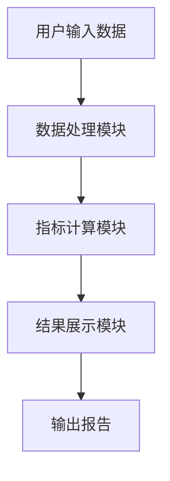
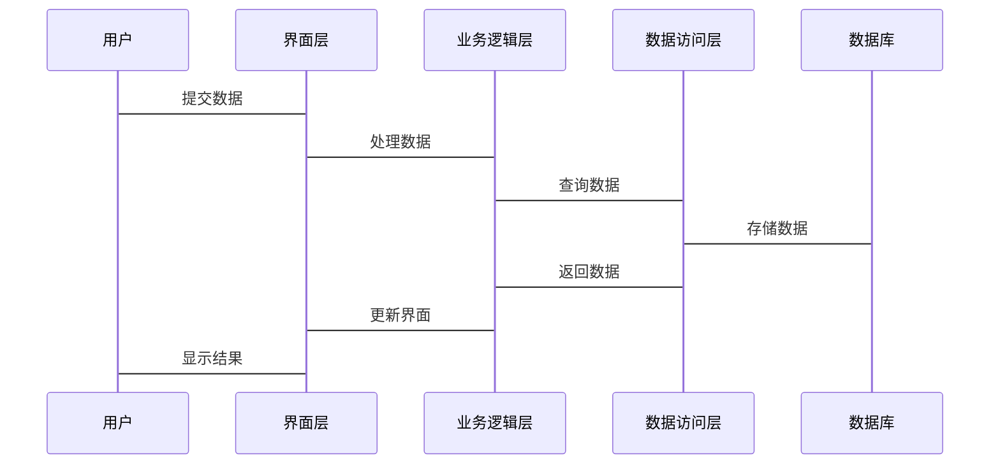

                 


# 彼得林奇如何评估公司的社会影响力

## 关键词
- 彼得林奇
- 社会影响力
- 投资评估
- 企业社会责任
- 可持续发展

## 摘要
本文详细探讨了彼得林奇在评估公司社会影响力方面的独特见解和方法。通过分析社会影响力的核心概念、评估维度、数学模型和系统架构，结合实际案例和项目实战，展示了如何将社会影响力评估融入投资决策中，帮助投资者做出更明智的选择。

---

# 第1章: 社会影响力评估的背景与重要性

## 1.1 彼得林奇的背景与投资理念

### 1.1.1 彼得林奇的生平简介
彼得·林奇（Peter Lynch）是美国著名的投资经理人，以其在富达投资管理公司的卓越表现而闻名。他主张长期投资，注重基本面分析，并强调对所投资公司的深入了解。

### 1.1.2 彼得林奇的投资哲学
林奇的投资哲学强调公司基本面分析，尤其是对公司社会影响力的关注。他认为，一家公司对社会的贡献不仅影响其声誉，还可能影响其长期盈利能力。

### 1.1.3 社会影响力与投资决策
林奇认为，评估公司的社会影响力是投资决策的重要组成部分。一个具有积极社会影响力的企业更有可能获得持续的增长和股东支持。

## 1.2 社会影响力评估的内涵与外延

### 1.2.1 社会影响力的定义
社会影响力是指公司在经营过程中对社会产生的正面或负面影响，包括经济效益、社会责任、环境保护等方面。

### 1.2.2 社会影响力的核心要素
- **经济效益**：公司对经济的贡献，如就业机会、税收等。
- **社会责任**：公司对社会的承诺，如公益捐赠、社区支持等。
- **环境影响**：公司对环境的影响，如碳排放、资源消耗等。

### 1.2.3 社会影响力与企业价值的关系
社会影响力与企业价值密切相关。积极的社会影响力可以提升企业声誉，增强品牌忠诚度，从而提高企业价值。

## 1.3 社会影响力评估的重要性

### 1.3.1 企业视角
- 提升企业形象
- 增强社会责任感
- 降低经营风险

### 1.3.2 投资者视角
- 识别高潜力投资
- 评估长期盈利能力
- 符合可持续投资趋势

### 1.3.3 社会视角
- 推动可持续发展
- 促进社会公平
- 提高生活质量

## 1.4 本章小结
本章介绍了彼得林奇的背景及其投资哲学，定义了社会影响力，并探讨了其对企业、投资者和社会的重要性。

---

# 第2章: 社会影响力评估的核心概念

## 2.1 社会影响力的评估维度

### 2.1.1 经济效益维度
- 就业机会
- 税收贡献
- 产业链带动

### 2.1.2 社会责任维度
- 公益捐赠
- 社区支持
- 公平雇佣

### 2.1.3 环境影响维度
- 碳排放
- 资源消耗
- 环境保护措施

## 2.2 社会影响力评估的联系与对比

### 2.2.1 核心要素对比表

| 维度       | 经济效益 | 社会责任 | 环境影响 |
|------------|----------|----------|----------|
| 定义       | 公司对经济的贡献 | 公司对社会的承诺 | 公司对环境的影响 |
| 评估指标   | 就业、税收 | 捐赠、雇佣公平 | 排放、资源消耗 |
| 重要性     | 基础支持 | 品牌形象 | 长期风险 |

### 2.2.2 ER图架构
```mermaid
erd
    客户
    员工
    社区
    环境
    公司
    经济效益
    社会责任
    环境影响
    公司 --> 经济效益
    公司 --> 社会责任
    公司 --> 环境影响
    经济效益 --> 客户
    社会责任 --> 员工
    环境影响 --> 环境
```

## 2.3 本章小结
本章详细探讨了社会影响力评估的三个核心维度，并通过对比表和ER图展示了它们之间的联系。

---

# 第3章: 社会影响力评估的数学模型与算法

## 3.1 社会影响力指数模型

### 3.1.1 模型概述
社会影响力指数模型（Social Impact Index，SII）通过量化公司的社会影响力，帮助投资者进行决策。

### 3.1.2 模型公式
$$ SII = \alpha \cdot E + \beta \cdot S + \gamma \cdot G $$
其中：
- $E$ 表示经济效益
- $S$ 表示社会责任
- $G$ 表示环境影响
- $\alpha$, $\beta$, $\gamma$ 是权重系数，满足 $\alpha + \beta + \gamma = 1$

### 3.1.3 权重确定方法
权重系数基于行业特点和公司规模确定，通常采用专家评分法。

## 3.2 算法实现步骤

### 3.2.1 数据收集
- 公司财务数据
- 社会责任报告
- 环境影响数据

### 3.2.2 数据处理
- 标准化处理
- 加权计算

### 3.2.3 结果分析
- 确定社会影响力等级
- 提供改进建议

## 3.3 本章小结
本章介绍了社会影响力指数模型及其数学公式，详细讲解了算法实现步骤。

---

# 第4章: 社会影响力评估的系统架构与设计

## 4.1 系统功能设计

### 4.1.1 功能模块
- 数据输入
- 指标计算
- 结果展示

### 4.1.2 系统流程


## 4.2 系统架构设计

### 4.2.1 分层架构


### 4.2.2 组件交互


## 4.3 本章小结
本章介绍了社会影响力评估系统的功能设计和架构设计，展示了各模块的交互流程。

---

# 第5章: 社会影响力评估的项目实战

## 5.1 项目背景与目标
某科技公司希望通过评估其社会影响力，优化企业形象和投资吸引力。

## 5.2 数据收集与处理
### 5.2.1 数据来源
- 公司财务报表
- 社会责任报告
- 环境影响数据

### 5.2.2 数据清洗
使用Python进行数据清洗和预处理：
```python
import pandas as pd

data = pd.read_csv('input.csv')
data = data.dropna()
data = data[data['行业'] == '科技']
```

## 5.3 模型实现
### 5.3.1 指标计算
```python
alpha = 0.4
beta = 0.3
gamma = 0.3

E = data['经济效益']
S = data['社会责任']
G = data['环境影响']

SII = alpha * E + beta * S + gamma * G
```

### 5.3.2 结果分析
计算结果表明，该科技公司在环境影响方面表现较弱，需改进环保措施。

## 5.4 本章小结
本章通过实际案例展示了社会影响力评估的项目实战，从数据收集到结果分析，详细讲解了整个过程。

---

# 第6章: 最佳实践与小结

## 6.1 最佳实践
- **长期视角**：关注公司的长期社会贡献
- **透明度**：确保数据的透明和可验证
- **治理结构**：建立有效的公司治理机制

## 6.2 投资策略
- 优先投资具有积极社会影响力的企业
- 结合财务指标和非财务指标进行综合评估

## 6.3 未来趋势
- **技术进步**：人工智能和大数据在社会影响力评估中的应用
- **政策变化**：各国对社会责任的重视程度不断提高
- **社会责任投资（ESG）**：成为未来投资的重要方向

## 6.4 本章小结
本章总结了社会影响力评估的最佳实践，提出了投资策略，并展望了未来趋势。

---

# 结语

通过本文的分析，我们可以看到，彼得林奇对社会影响力评估的重视，不仅帮助投资者做出更明智的决策，也为企业的可持续发展提供了重要指导。未来，随着技术的进步和社会的发展，社会影响力评估将在投资决策中发挥越来越重要的作用。

---

# 参考文献
1. 彼得·林奇. 《彼得·林奇的投资哲学》
2. 全球可持续发展报告
3. 相关学术论文与研究报告

