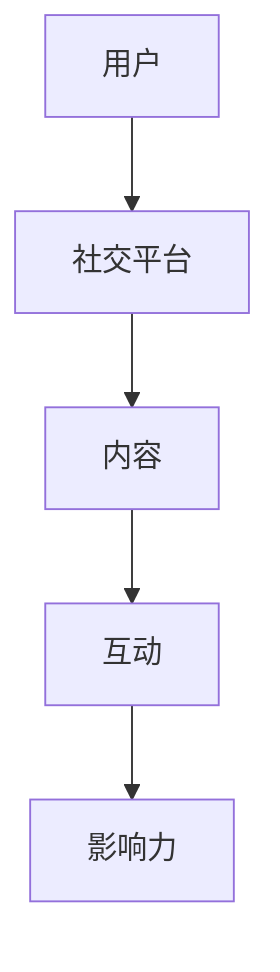
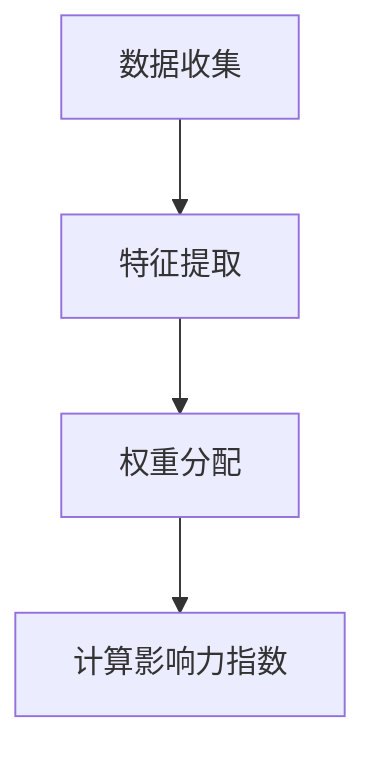
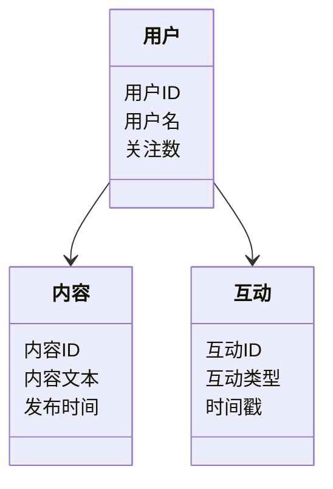
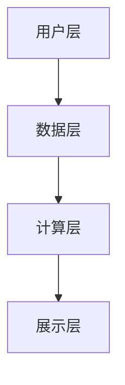

                 

<think>
好的，我将按照您的要求逐步构建一篇详细的博客文章，内容涵盖彼得·林奇如何评估公司的社会网络影响力，结构包括背景介绍、核心概念、算法原理、系统架构、项目实战、最佳实践等部分。文章将使用清晰的逻辑和专业的技术语言，配以必要的图表和代码示例。

---

# 彼得林奇如何评估公司的社会网络影响力

> 关键词：彼得·林奇，社会网络影响力，公司评估，投资分析，数据驱动

> 摘要：本文通过分析彼得·林奇的投资哲学，探讨如何利用社会网络影响力这一新兴指标来评估公司价值。文章从背景介绍、核心概念、算法原理、系统架构到实际案例，详细阐述了如何将社交数据与传统财务指标结合，为投资者提供更全面的决策依据。

---

## 第1章: 背景介绍

### 1.1 社会网络影响力的基本概念
#### 1.1.1 什么是社会网络影响力
社会网络影响力是指公司在社交平台上的用户数量、内容传播能力、互动频率以及用户忠诚度的综合指标。这些指标能够反映公司在社交媒体上的品牌影响力和市场地位。

#### 1.1.2 社会网络影响力在投资中的作用
在传统投资分析中，投资者主要关注财务指标如收入、利润和市盈率等。然而，随着社交媒体的普及，社交数据成为评估公司价值的重要补充。社交数据能够揭示用户对公司产品和服务的口碑传播能力，从而影响公司的市场扩展潜力。

#### 1.1.3 彼得·林奇的公司分析方法
彼得·林奇以其对公司基本面的深入分析闻名。他强调通过研究公司的财务报表、行业地位和管理团队来评估其投资价值。然而，在当今的数字时代，仅仅关注财务数据是不够的，还需要考虑公司在社交媒体上的影响力。

---

### 1.2 彼得·林奇与社会网络影响力
#### 1.2.1 彼得·林奇的投资哲学
彼得·林奇认为，投资者应该关注公司所在行业的竞争环境、产品的市场需求以及公司的盈利能力。然而，他并未忽视公司在市场中的影响力，这为我们将社交数据引入公司评估提供了思路。

#### 1.2.2 社会网络影响力与公司价值的关系
公司的社交影响力可以直接反映其市场覆盖能力。例如，一家公司在社交媒体上的高互动率可能意味着其产品具有较高的市场接受度，从而增强投资者的信心。

#### 1.2.3 从传统财务指标到社交数据的延伸
传统财务指标主要衡量公司的盈利能力，而社交数据则提供了用户对公司产品和服务的反馈。通过结合这两者，投资者可以更全面地评估公司的价值。

---

### 1.3 社会网络影响力的核心要素
#### 1.3.1 用户数量与活跃度
用户数量和活跃度是衡量社交影响力的基本指标。例如，一家公司在 Twitter 上有百万粉丝，且每天的互动量很高，说明其品牌影响力较强。

#### 1.3.2 内容传播力与互动频率
内容的传播速度和互动频率是衡量社交影响力的重要指标。例如，一篇帖子的转发量和评论量可以反映内容的吸引力。

#### 1.3.3 品牌影响力与用户忠诚度
品牌影响力反映了公司在市场上的认知度，而用户忠诚度则通过用户的行为数据（如重复互动）来体现。

---

## 第2章: 社会网络影响力的核心概念与联系

### 2.1 核心概念的原理
#### 2.1.1 社会网络影响力的基本属性
社交影响力具有实时性、互动性和传播性等基本属性。这些属性使得社交数据能够动态反映公司的市场表现。

#### 2.1.2 影响力的量化方法
影响力可以通过粉丝数量、互动频率、内容传播速度等指标量化。例如，可以使用以下公式计算影响力指数：
$$
影响力指数 = \frac{粉丝数量 + 互动次数}{时间范围}
$$

#### 2.1.3 影响力的传播机制
影响力传播机制包括口碑传播、情感传播和信息传播。例如，用户的正面评价会吸引更多人关注该公司。

---

### 2.2 核心概念对比分析
#### 2.2.1 社交影响力与传统财务指标的对比
| 指标类型 | 社交影响力 | 传统财务指标 |
|----------|------------|--------------|
| 数据来源 | 社交平台 | 财务报表 |
| 数据类型 | 用户行为数据 | 数值型数据 |
| 数据用途 | 品牌价值评估 | 盈利能力评估 |

#### 2.2.2 不同社交平台的影响力差异
不同社交平台的用户群体和使用习惯不同，因此影响力在不同平台上的表现也不同。例如，Twitter 更适合实时动态，而 LinkedIn 更适合职业网络。

#### 2.2.3 用户行为数据与公司价值的关系
用户行为数据（如点击率、转化率）可以反映用户对公司产品的兴趣和购买意愿，从而间接影响公司的收入。

---

### 2.3 ER实体关系图


---

## 第3章: 算法原理

### 3.1 数据收集与特征提取
#### 3.1.1 数据收集方法
从 Twitter、LinkedIn 等平台获取用户数据，包括用户信息、内容数据和互动数据。

#### 3.1.2 特征提取
提取关键特征，如粉丝数量、互动次数、内容情感倾向等。

```python
# 示例代码：从Twitter获取数据
import tweepy

auth = tweepy.OAuthHandler(consumer_key, consumer_secret)
auth.set_access_token(access_token, access_token_secret)
api = tweepy.API(auth)

tweets = api.search(q="example", count=100)
```

---

### 3.2 影响力指数计算
#### 3.2.1 加权计算
根据特征的重要性进行加权计算，例如：
$$
影响力指数 = w_1 \times 粉丝数量 + w_2 \times 互动次数
$$

#### 3.2.2 算法流程


---

## 第4章: 系统架构设计

### 4.1 系统功能设计
#### 4.1.1 领域模型


#### 4.1.2 系统架构


---

## 第5章: 项目实战

### 5.1 环境安装
安装必要的库，如 `tweepy`、`pandas`、`numpy` 等。

### 5.2 核心实现
#### 5.2.1 数据收集
```python
import tweepy

# 示例代码：从Twitter获取数据
tweets = api.search(q="example", count=100)
```

#### 5.2.2 特征提取与计算
```python
# 示例代码：计算影响力指数
粉丝数量 = len(followers)
互动次数 = sum(likes)
影响力指数 = 0.5 * 粉丝数量 + 0.5 * 互动次数
```

#### 5.2.3 结果分析
根据影响力指数对目标公司进行排名和分析。

---

## 第6章: 最佳实践

### 6.1 总结与启示
社交影响力是评估公司价值的重要补充，结合传统财务指标可以提供更全面的分析。

### 6.2 投资建议
投资者应关注社交数据的变化，尤其是在新兴行业和科技公司中，社交影响力可能成为决定性因素。

### 6.3 注意事项
社交数据可能存在噪声，需结合其他指标进行综合分析。

### 6.4 扩展阅读
推荐书籍：《社交网络分析》、《数据驱动的投资决策》

---

## 第7章: 小结

本文通过分析彼得·林奇的投资哲学，探讨了如何利用社会网络影响力评估公司价值。从背景介绍到系统设计，再到项目实战，全面阐述了社交数据在投资分析中的应用。通过本文的学习，投资者可以更好地利用社交数据做出更明智的投资决策。

--- 

希望这篇文章能满足您的需求！如果需要进一步调整或补充，请随时告诉我。

