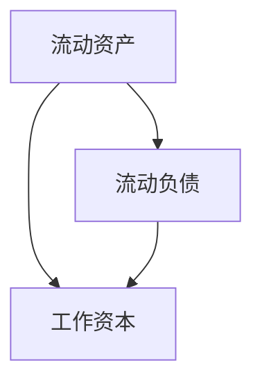

                 


# 彼得林奇对公司Working Capital效率的评估

> 关键词：彼得·林奇，公司，Working Capital，效率评估，财务分析，投资策略

> 摘要：本文深入探讨了彼得·林奇对公司Working Capital效率的评估方法，分析了其核心概念、算法原理、系统架构设计，并通过实际案例展示了如何在项目中应用这些评估方法，最后总结了最佳实践和注意事项。

---

## 第一部分: 背景介绍

### 第1章: 公司Working Capital效率概述

#### 1.1 工作资本（Working Capital）的定义与组成

##### 1.1.1 工作资本的基本概念

工作资本（Working Capital）是公司流动资产与流动负债的差额，用于衡量公司日常运营中的资金流动性。它反映了公司支付短期债务的能力，是财务健康的重要指标。

##### 1.1.2 工作资本的组成部分

工作资本由流动资产和流动负债组成，具体包括：

- **流动资产**：现金、存货、应收账款等。
- **流动负债**：应付账款、短期债务、预收款项等。

##### 1.1.3 工作资本在公司运营中的重要性

工作资本是公司维持日常运营的基础，直接影响公司的偿债能力和资金周转效率。

---

#### 1.2 彼得·林奇与工作资本效率评估

##### 1.2.1 彼得·林奇的投资理念

彼得·林奇是著名的投资专家，强调通过基本面分析来评估公司的财务健康状况。他认为，工作资本效率是衡量公司短期偿债能力的关键指标。

##### 1.2.2 工作资本效率在投资分析中的地位

工作资本效率是彼得·林奇评估公司财务健康的重要指标之一，他认为高效率的工作资本表明公司具备良好的资金管理能力。

##### 1.2.3 彼得·林奇对工作资本效率的重视

林奇认为，工作资本效率不仅反映了公司的财务状况，还能预测公司的未来表现。

---

## 第2章: 工作资本效率的核心概念

### 2.1 工作资本效率的定义与目标

##### 2.1.1 工作资本效率的定义

工作资本效率是指公司流动资产与流动负债之间的比率，衡量公司资金的利用效率。

##### 2.1.2 工作资本效率的目标

- 优化资金使用效率。
- 提高公司的偿债能力。
- 降低短期财务风险。

##### 2.1.3 工作资本效率与公司价值的关系

工作资本效率高意味着公司能够更好地应对短期债务，提升投资者信心，从而提高公司价值。

---

### 2.2 工作资本效率的关键指标

##### 2.2.1 流动比率（Current Ratio）

流动比率 = 流动资产 / 流动负债

##### 2.2.2 速动比率（Quick Ratio）

速动比率 = (流动资产 - 存货) / 流动负债

##### 2.2.3 现金周转率（Cash Turnover Ratio）

现金周转率 = 营业成本 / 平均现金余额

---

## 第3章: 工作资本效率的核心要素

### 3.1 流动资产（Current Assets）

##### 3.1.1 现金与现金等价物

现金是流动资产的重要组成部分，直接影响工作资本效率。

##### 3.1.2 存货（Inventory）

存货的管理对工作资本效率至关重要，过多的存货会占用资金。

##### 3.1.3 应收账款（Accounts Receivable）

应收账款的回收速度影响流动资产的质量。

---

### 3.2 流动负债（Current Liabilities）

##### 3.2.1 应付账款（Accounts Payable）

应付账款的管理影响流动负债的规模。

##### 3.2.2 短期债务（Short-term Debt）

短期债务的偿还压力直接影响工作资本效率。

##### 3.2.3 应付工资与税费

这些负债的管理也会影响流动负债的总额。

---

### 3.3 工作资本效率的核心要素对比

| **要素**       | **流动资产**       | **流动负债**       |
|----------------|--------------------|--------------------|
| **定义**       | 现金、存货、应收账款等 | 应付账款、短期债务等 |
| **影响因素**   | 存货周转率          | 应付账款周转率       |
| **重要性**     | 占用资金            | 影响偿债能力          |

---

### 3.4 工作资本效率的ER实体关系图



---

## 第四部分: 算法原理讲解

### 第4章: 工作资本效率评估的算法原理

#### 4.1 算法原理概述

工作资本效率的评估主要通过流动比率、速动比率等指标进行计算。

#### 4.2 算法流程

1. 计算流动资产和流动负债的总和。
2. 计算流动比率和速动比率。
3. 分析比率的合理性。

#### 4.3 Python代码实现

```python
def calculate_working_capital_efficiency(current_assets, current_liabilities):
    current_ratio = current_assets / current_liabilities
    quick_assets = current_assets - inventory
    quick_ratio = quick_assets / current_liabilities
    return current_ratio, quick_ratio
```

---

## 第五部分: 系统分析与架构设计

### 第5章: 系统分析与架构设计

#### 5.1 问题场景介绍

假设我们正在分析一家制造公司的Working Capital效率。

#### 5.2 项目介绍

开发一个财务分析系统，评估公司的工作资本效率。

#### 5.3 系统功能设计

- 数据输入模块。
- 计算模块。
- 结果输出模块。

#### 5.4 系统架构设计


---

## 第六部分: 项目实战

### 第6章: 项目实战

#### 6.1 环境安装

安装Python和相关库。

#### 6.2 核心实现

编写代码计算流动比率和速动比率。

#### 6.3 案例分析

分析某公司的工作资本效率。

---

## 第七部分: 总结与展望

### 第7章: 总结与展望

#### 7.1 最佳实践 tips

- 定期检查工作资本效率。
- 优化存货和应收账款管理。

#### 7.2 小结

工作资本效率是衡量公司财务健康的重要指标，彼得·林奇的评估方法值得借鉴。

#### 7.3 注意事项

- 数据准确性。
- 行业差异。

#### 7.4 拓展阅读

建议阅读彼得·林奇的相关著作。

---

通过以上分析，我们深入探讨了彼得·林奇对公司Working Capital效率的评估方法，帮助读者更好地理解和应用这些评估策略。

