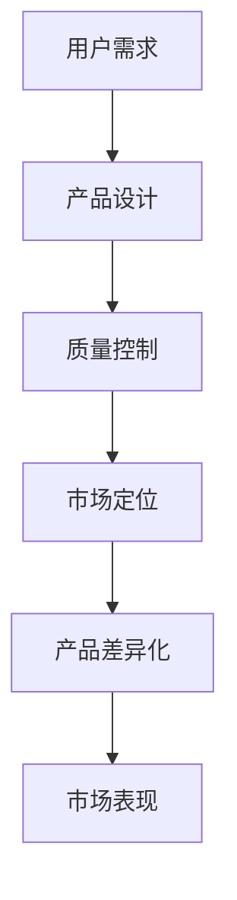

                 


# 彼得林奇对公司产品差异化的看法

**关键词**：彼得·林奇、产品差异化、投资策略、竞争优势、企业战略、数学模型

**摘要**：本文探讨了彼得·林奇对产品差异化在公司投资和管理中的重要性。通过分析其核心观点、差异化类型、数学模型和系统架构，结合实际案例，详细阐述了如何通过产品差异化提升企业竞争力和投资价值。

---

# 第一部分：彼得·林奇的背景与投资理念

## 第1章：彼得·林奇的背景与投资哲学

### 1.1 彼得·林奇的基本信息
彼得·林奇（Peter Lynch）是美国著名的职业棒球运动员和投资家，以其独特的投资策略闻名。他不仅是波士顿红袜队的明星球员，还因在棒球和投资领域中的卓越表现而备受尊敬。

### 1.2 彼得·林奇的投资哲学
彼得·林奇在投资领域提出了许多独到的见解，强调长期投资和对公司基本面的深入分析。他主张投资者应关注公司的产品差异化能力，认为这是决定公司长期竞争力的关键因素。

### 1.3 产品差异化的核心观点
彼得·林奇认为，产品差异化是企业在市场中立足的关键。他提出，企业应通过不断创新和优化产品，以区别于竞争对手，从而在市场中占据优势地位。

---

# 第二部分：产品差异化的核心概念

## 第2章：产品差异化的定义与类型

### 2.1 产品差异化的定义
产品差异化是指企业通过提供独特的产品或服务，使其在市场中区别于竞争对手。这种差异可以是功能、质量、设计、品牌或价格等方面的独特性。

### 2.2 产品差异化的类型
产品差异化可以分为以下几种类型：
- **功能差异化**：通过产品的功能或技术优势区别于竞争对手。
- **质量差异化**：通过产品的质量或耐用性吸引消费者。
- **品牌差异化**：通过品牌形象和市场定位区别于竞争对手。
- **价格差异化**：通过价格策略（如高端定价或折扣）吸引不同客户群体。

### 2.3 产品差异化的实现机制
产品差异化的实现通常包括市场调研、产品设计、生产流程优化和市场营销等环节。企业需要从市场需求出发，结合自身优势，制定差异化策略。

---

# 第三部分：产品差异化的核心要素分析

## 第3章：产品差异化的核心要素

### 3.1 核心要素之一：产品质量
产品质量是产品差异化的基础。彼得·林奇强调，企业必须注重产品的质量和性能，确保产品能够满足消费者的需求。

### 3.2 核心要素之二：创新
创新是产品差异化的重要驱动力。彼得·林奇认为，企业应不断推出新产品或改进现有产品，以保持市场竞争力。

### 3.3 核心要素之三：市场定位
市场定位决定了产品差异化的目标客户群体。彼得·林奇主张企业应根据市场细分，选择适合自身优势的市场定位。

---

# 第四部分：产品差异化与竞争对手的对比分析

## 第4章：产品差异化与竞争对手的对比

### 4.1 竞争对手的产品分析方法
彼得·林奇提出，企业应通过分析竞争对手的产品，找出自身的差异化优势。这包括对竞争对手的产品功能、质量、价格和品牌等方面的深入研究。

### 4.2 产品差异化的核心竞争力对比
通过对比分析，企业可以明确自身产品的独特价值，进而制定更有针对性的差异化策略。

### 4.3 产品差异化与市场定位的关系
彼得·林奇认为，市场定位是产品差异化的重要组成部分。企业应根据自身优势和市场需求，选择合适的市场定位，从而在竞争中占据优势。

---

# 第五部分：产品差异化与企业战略的关系

## 第5章：产品差异化与企业战略

### 5.1 产品差异化战略的制定与实施
彼得·林奇强调，企业应将产品差异化作为长期战略的核心内容。制定差异化战略时，企业需要考虑市场需求、竞争对手情况和自身资源等因素。

### 5.2 产品差异化与企业长期发展的关系
产品差异化是企业长期发展的关键因素。彼得·林奇认为，只有通过不断的产品创新和差异化，企业才能在激烈的市场竞争中立于不败之地。

### 5.3 产品差异化在企业转型中的作用
在企业转型过程中，产品差异化是实现成功转型的重要推动力。彼得·林奇指出，企业应通过产品差异化，重新定位市场，提升竞争力。

---

# 第六部分：产品差异化的数学模型与算法分析

## 第6章：产品差异化的核心算法与数学模型

### 6.1 产品差异化分析的数学模型
我们可以使用多元回归分析模型，量化产品差异化的各项因素对市场表现的影响。模型如下：

$$ Y = \beta_0 + \beta_1 X_1 + \beta_2 X_2 + \beta_3 X_3 + \epsilon $$

其中，Y表示产品差异化的综合评分，X1、X2、X3分别表示质量、创新和市场定位三个因素，$\beta$表示回归系数，$\epsilon$为误差项。

### 6.2 产品差异化分析的Python代码实现

```python
import numpy as np
import pandas as pd
from sklearn.linear_model import LinearRegression

# 示例数据
data = {
    'Quality': [8, 7, 9, 6, 8],
    'Innovation': [7, 8, 6, 9, 7],
    'Market_Position': [6, 9, 8, 7, 5],
    'Score': [82, 85, 88, 81, 83]
}
df = pd.DataFrame(data)

# 模型训练
model = LinearRegression()
X = df[['Quality', 'Innovation', 'Market_Position']]
y = df['Score']
model.fit(X, y)

# 输出系数
print('回归系数:', model.coef_)
print('截距:', model.intercept_)
```

### 6.3 产品差异化分析的系统架构



---

# 第七部分：总结与最佳实践

## 第7章：总结与最佳实践

### 7.1 本章总结
彼得·林奇认为，产品差异化是企业在市场竞争中取得优势的关键。通过分析产品差异化的核心要素、竞争对手和市场定位，企业可以制定有效的差异化策略，提升竞争力和投资价值。

### 7.2 最佳实践
- **深入市场调研**：了解消费者需求和竞争对手的产品特点。
- **注重产品质量**：确保产品功能和性能优于竞争对手。
- **持续创新**：通过产品创新保持市场领先地位。
- **合理定价**：制定适合目标市场的价格策略。
- **强化品牌形象**：通过品牌营销提升产品差异化效果。

### 7.3 小结
通过彼得·林奇的产品差异化观点，企业可以在竞争激烈的市场中找到自己的定位，制定有效的战略，实现长期发展。

---

# 附录：拓展阅读

- 彼得·林奇的其他投资观点
- 产品差异化在不同行业的应用案例
- 相关学术文献推荐

---

通过以上结构和内容，我们可以系统地理解彼得·林奇对公司产品差异化的看法，并将其应用于实际的企业管理中。

