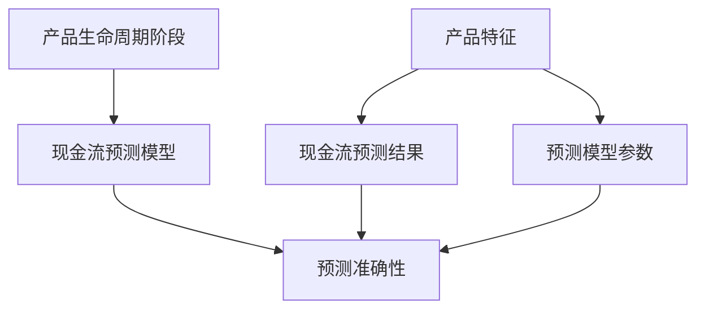

                 

# 彼得林奇对公司产品生命周期管理与现金流预测准确性的关系研究

## 关键词：产品生命周期管理、现金流预测、彼得林奇、预测准确性、算法原理、系统架构

## 摘要：本文系统研究了彼得林奇在产品生命周期管理与现金流预测准确性之间的关系，探讨了如何通过优化产品生命周期管理来提升现金流预测的准确性。文章从背景介绍、核心概念、算法原理、系统架构设计、项目实战等多个方面展开分析，结合实际案例，提出了提升现金流预测准确性的策略和方法，为企业的财务管理提供了新的视角和实践指导。

---

# 第一部分：产品生命周期管理与现金流预测的背景与概念

## 第1章：产品生命周期管理与现金流预测的背景介绍

### 1.1 问题背景

#### 1.1.1 企业产品生命周期管理的重要性
产品生命周期管理（Product Lifecycle Management, PLM）是企业在产品开发、生产、销售和退市等全生命周期中进行规划和管理的关键过程。有效的PLM能够帮助企业优化资源配置、降低生产成本、提高产品市场竞争力。在现代企业中，PLM不仅是产品设计和制造的支撑，更是企业战略决策的重要依据。

#### 1.1.2 现金流预测在企业财务管理中的地位
现金流预测是企业财务管理的核心内容之一，它通过对未来现金流的估算，帮助企业制定合理的资金计划、投资决策和风险管理策略。准确的现金流预测能够帮助企业避免资金链断裂的风险，提升企业的财务健康度和市场竞争力。

#### 1.1.3 产品生命周期与现金流预测的关联性
产品生命周期的不同阶段（如导入期、成长期、成熟期、衰退期）对现金流的影响具有显著差异。例如，在产品导入期，企业需要投入大量的研发和营销费用，现金流可能为负；而在成熟期，销售增长稳定，现金流趋于正向。因此，准确理解产品生命周期的特征，能够为现金流预测提供重要的业务背景信息，从而提高预测的准确性。

### 1.2 问题描述

#### 1.2.1 产品生命周期管理的核心要素
产品生命周期管理的核心要素包括产品战略、产品设计、生产计划、市场推广、客户反馈和退市策略等。这些要素相互关联，共同影响着产品的市场表现和企业的财务状况。

#### 1.2.2 现金流预测的准确性问题
现金流预测的准确性受到多种因素的影响，包括市场需求波动、成本变化、政策调整和宏观经济环境等。然而，企业内部的数据质量和预测模型的科学性也是决定预测准确性的重要因素。

#### 1.2.3 产品生命周期与现金流预测的关联性
产品生命周期的不同阶段对现金流的影响具有显著差异。例如，在产品导入期，企业需要投入大量的研发和营销费用，现金流可能为负；而在成熟期，销售增长稳定，现金流趋于正向。因此，准确理解产品生命周期的特征，能够为现金流预测提供重要的业务背景信息，从而提高预测的准确性。

### 1.3 问题解决思路

#### 1.3.1 研究目标的设定
本文旨在探讨产品生命周期管理与现金流预测准确性之间的关系，分析如何通过优化产品生命周期管理来提升现金流预测的准确性。

#### 1.3.2 研究方法的选择
本文采用定量分析与定性分析相结合的方法，通过建立数学模型和实际案例分析，探讨两者之间的关系。

#### 1.3.3 数据来源与处理方案
数据来源包括企业内部的历史销售数据、成本数据、产品生命周期数据等，以及外部的市场数据和宏观经济指标。数据处理包括数据清洗、特征提取和模型训练等步骤。

### 1.4 问题的边界与外延

#### 1.4.1 产品生命周期管理的边界
产品生命周期管理的边界包括产品战略、设计、生产、销售和退市等环节，但不包括企业的日常运营管理。

#### 1.4.2 现金流预测的边界
现金流预测的边界包括企业的经营性现金流、投资性现金流和筹资性现金流，但不包括非核心业务的现金流。

#### 1.4.3 两者关系的外延分析
产品生命周期管理与现金流预测准确性之间的关系不仅限于企业内部的管理活动，还受到外部市场环境和宏观经济因素的影响。

### 1.5 概念结构与核心要素

#### 1.5.1 产品生命周期模型
产品生命周期模型将产品分为四个阶段：导入期、成长期、成熟期和衰退期。每个阶段的特点和现金流表现不同。

#### 1.5.2 现金流预测模型
现金流预测模型包括时间序列模型、机器学习模型和统计模型等。不同模型适用于不同的业务场景和数据特征。

#### 1.5.3 两者的交互关系
产品生命周期的不同阶段对现金流的影响具有显著差异，因此，现金流预测需要根据产品的生命周期阶段进行动态调整。

### 1.6 本章小结
本章从背景介绍、问题描述、解决思路和边界分析四个方面，探讨了产品生命周期管理与现金流预测准确性之间的关系，为后续的分析奠定了基础。

---

## 第2章：核心概念与联系

### 2.1 产品生命周期管理的原理

#### 2.1.1 产品生命周期的阶段划分
产品生命周期可以分为导入期、成长期、成熟期和衰退期。每个阶段的特点和现金流表现不同。

#### 2.1.2 各阶段的特征与影响因素
- **导入期**：市场需求低，销售量小，成本高，现金流为负。
- **成长期**：销售量迅速增长，成本逐步下降，现金流逐渐转正。
- **成熟期**：销售量稳定，成本最低，现金流达到峰值。
- **衰退期**：销售量下降，成本上升，现金流转负。

#### 2.1.3 管理策略的制定与实施
企业需要根据不同阶段的特点，制定相应的管理策略，如加大研发投入、优化生产计划、加强市场推广等。

### 2.2 现金流预测的原理

#### 2.2.1 现金流预测的基本方法
- **定性预测**：基于市场分析和专家意见进行预测。
- **定量预测**：基于历史数据和统计模型进行预测。

#### 2.2.2 数据驱动的预测模型
- **时间序列分析**：基于历史数据进行预测。
- **机器学习模型**：利用特征工程和算法优化进行预测。

#### 2.2.3 业务驱动的预测模型
- **因果模型**：基于业务逻辑和关键驱动因素进行预测。

### 2.3 核心概念对比分析

#### 2.3.1 产品生命周期与现金流预测的属性特征对比

| 属性        | 产品生命周期         | 现金流预测         |
|-------------|----------------------|---------------------|
| 时间跨度    | 长期（数年）          | 短期到长期         |
| 数据类型    | 分类/阶段            | 数值型             |
| 变化趋势    | S型曲线             | 不规则波动         |
| 影响因素    | 市场需求、竞争、成本 | 销售、成本、政策等 |

#### 2.3.2 实体关系图（ER图）的Mermaid流程图

### 2.4 本章小结
本章通过对比分析，明确了产品生命周期管理与现金流预测准确性之间的关系，并通过实体关系图展示了两者之间的交互关系。

---

以上是文章的前两章内容，后续章节将按照目录大纲继续展开，包括现金流预测的算法原理、系统架构设计、项目实战等内容。

