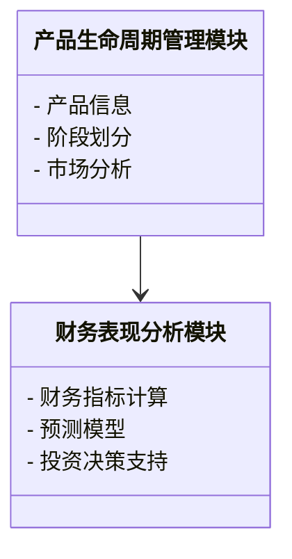
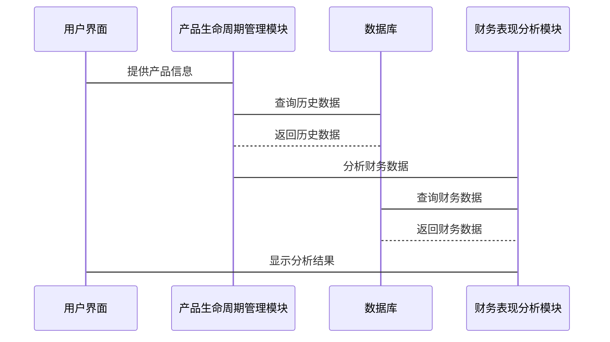

                 


# 彼得林奇对公司产品生命周期管理与财务表现关系的研究

> 关键词：彼得林奇，产品生命周期管理，财务表现，投资策略，企业价值

> 摘要：本文通过分析彼得林奇的投资理念，探讨产品生命周期管理如何影响公司的财务表现。文章从产品生命周期的核心概念、财务表现的指标、生命周期各阶段对财务的影响、彼得林奇的独到见解等方面展开讨论，结合实际案例和系统架构设计，提出了量化分析的方法，并给出了实际应用的指导。

---

# 第一部分: 背景介绍

## 第1章: 产品生命周期管理与财务表现的关系

### 1.1 产品生命周期管理的核心概念
#### 1.1.1 产品生命周期的定义与阶段划分
产品生命周期（Product Life Cycle，PLC）是指产品从进入市场到退出市场的整个过程，通常分为四个阶段：引入期、成长期、成熟期和衰退期。

- **引入期**：产品首次进入市场，市场需求较低，竞争较小。
- **成长期**：市场需求迅速增长，销售量增加，竞争加剧。
- **成熟期**：市场需求稳定，销售量达到顶峰，竞争激烈。
- **衰退期**：市场需求下降，销售量减少，产品逐渐被替代。

#### 1.1.2 产品生命周期管理的内涵与外延
产品生命周期管理（Product Lifecycle Management，PLM）是指企业对产品从研发到退市的全生命周期进行系统化管理的过程，包括产品设计、生产、销售、维护和退市等环节。

- **内涵**：PLM强调对产品全生命周期的协调管理，以提高产品市场竞争力和企业运营效率。
- **外延**：PLM不仅涉及产品本身，还涵盖企业的组织结构、流程管理、技术应用等多个方面。

#### 1.1.3 产品生命周期管理与企业绩效的关系
PLM的有效实施能够显著影响企业的绩效，尤其是在销售收入、利润率、市场占有率等方面。

- **直接影响**：通过优化产品开发和退市策略，提升产品市场竞争力。
- **间接影响**：通过提高管理效率，降低成本，增强企业整体竞争力。

### 1.2 彼得林奇投资理念与产品生命周期管理
#### 1.2.1 彼得林奇的投资哲学
彼得林奇是美国著名投资经理人，强调基本面分析和长期投资。他认为，成功的投资取决于对所投资公司产品生命周期的深入理解。

- **价值投资**：寻找那些被市场低估的优秀公司进行投资。
- **长期视角**：关注企业的长期盈利能力，而非短期市场波动。

#### 1.2.2 产品生命周期管理在投资中的应用
彼得林奇在其投资实践中，非常重视对被投公司产品生命周期的分析，以判断公司的财务表现和未来发展前景。

- **引入期与成长期**：公司处于快速成长阶段，销售收入增长迅速，但盈利能力可能尚未达到峰值。
- **成熟期与衰退期**：公司可能面临市场竞争加剧，利润增长放缓甚至下降的风险。

#### 1.2.3 彼得林奇对产品生命周期管理的独到见解
彼得林奇认为，产品生命周期管理是企业价值的核心驱动力之一。他特别关注那些能够持续推出新产品、保持市场领先地位的公司。

- **持续创新**：通过产品创新延长产品生命周期，提高市场竞争力。
- **风险管理**：及时识别产品衰退期，避免过度投资，降低财务风险。

### 1.3 财务表现的核心概念与指标
#### 1.3.1 财务表现的定义与维度
财务表现是企业在一定时期内的财务状况和经营成果的综合体现，主要包括盈利能力、运营能力和偿债能力等方面。

- **盈利能力**：净利润率、ROE（净资产收益率）等指标。
- **运营能力**：存货周转率、应收账款周转率等指标。
- **偿债能力**：资产负债率、流动比率等指标。

#### 1.3.2 主要财务指标及其计算公式
以下是几个关键财务指标及其计算公式：

- **净利润率**：净利润 / 营业收入 × 100%
- **ROE（净资产收益率）**：净利润 / 平均净资产 × 100%
- **毛利率**：（营业收入 - 营业成本） / 营业收入 × 100%

#### 1.3.3 财务表现与企业价值的关系
企业的财务表现直接影响其市场价值和股东财富。良好的财务表现通常意味着公司具有更强的盈利能力和抗风险能力，从而获得更高的市场估值。

### 1.4 问题背景与研究意义
#### 1.4.1 产品生命周期管理与财务表现研究的背景
随着市场竞争的加剧，企业的产品生命周期越来越短，如何通过有效的PLM提高财务表现成为企业关注的重点。

#### 1.4.2 研究问题的提出
如何量化产品生命周期各阶段对财务表现的影响？彼得林奇的投资策略在产品生命周期管理中的应用有哪些？

#### 1.4.3 研究的意义与价值
通过研究PLM与财务表现的关系，可以帮助投资者和企业管理者更好地理解产品生命周期对财务的影响，优化投资和管理决策。

---

## 第2章: 核心概念与联系

### 2.1 产品生命周期管理的核心要素
#### 2.1.1 产品战略
产品战略是企业在产品生命周期中如何定位、推广和管理产品的总体策略。

- **市场定位**：确定产品的目标市场和客户群体。
- **产品推广**：制定有效的市场推广策略，提高产品知名度。

#### 2.1.2 产品开发流程
产品开发流程包括从概念设计、研发、测试到量产的整个过程。

- **研发阶段**：注重技术创新和成本控制。
- **测试阶段**：确保产品质量，减少市场风险。

#### 2.1.3 产品市场定位
产品市场定位是企业在市场中确定产品的位置，使其能够满足特定客户群体的需求。

- **目标客户**：明确产品的目标客户群体。
- **竞争对手分析**：了解竞争对手的产品和市场策略。

### 2.2 财务表现的核心要素
#### 2.2.1 收入与利润
收入和利润是衡量企业财务表现的两大核心指标。

- **收入**：企业销售产品或服务所获得的总收入。
- **利润**：收入减去成本和费用后的净收益。

#### 2.2.2 资产与负债
资产和负债是企业财务状况的重要组成部分。

- **资产**：企业拥有的资源，包括流动资产和非流动资产。
- **负债**：企业欠款的债务，包括短期负债和长期负债。

#### 2.2.3 现金流与资本预算
现金流和资本预算是企业财务管理的关键内容。

- **现金流**：企业现金的流入和流出情况。
- **资本预算**：企业对长期资产的投资决策。

### 2.3 产品生命周期与财务表现的关系
#### 2.3.1 产品生命周期各阶段的财务特征
- **引入期**：收入较低，研发投入大，利润可能为负。
- **成长期**：收入迅速增长，销售成本上升，利润逐步提高。
- **成熟期**：收入稳定，销售成本接近收入，利润达到峰值。
- **衰退期**：收入下降，销售成本降低，利润转负。

#### 2.3.2 产品生命周期对财务表现的影响机制
- **收入与成本的匹配**：不同生命周期阶段，收入和成本的变化趋势不同。
- **利润的波动**：利润在生命周期中呈现先升后降的趋势。
- **现金流的变化**：现金流在引入期可能为负，成熟期趋于正向。

#### 2.3.3 彼得林奇视角下的产品生命周期管理与财务表现关系
彼得林奇认为，产品的生命周期直接影响企业的财务表现。他倾向于投资那些处于成长期或成熟期的公司，因为这些公司的财务表现较为稳定且具有较高的投资回报。

---

## 第3章: 核心概念的原理与联系

### 3.1 产品生命周期管理的原理
#### 3.1.1 生命周期理论的起源与发展
生命周期理论起源于20世纪50年代，最初应用于产品管理领域，后来逐渐扩展到企业管理的各个方面。

#### 3.1.2 产品生命周期管理的基本原理
- **动态管理**：根据产品生命周期的不同阶段，调整管理策略。
- **协同管理**：协调企业内部各职能部门，确保产品顺利进入市场并取得成功。

#### 3.1.3 产品生命周期管理的系统性方法
- **系统化管理**：从战略层面规划产品生命周期。
- **过程管理**：注重产品开发和退市的每一个环节。

### 3.2 财务表现的原理
#### 3.2.1 财务表现的驱动因素
- **收入增长**：销售收入的增加直接提升财务表现。
- **成本控制**：有效控制成本可以提高利润率。
- **资本结构**：合理的资本结构有助于优化财务表现。

#### 3.2.2 财务表现的测量方法
- **财务报表分析**：通过资产负债表、利润表和现金流量表分析企业的财务状况。
- **比率分析**：使用各种财务比率（如ROE、毛利率等）评估企业的财务健康状况。

#### 3.2.3 财务表现与企业价值的关系
企业的财务表现直接影响其市场价值。良好的财务表现通常意味着公司具有更强的盈利能力和更高的市场估值。

### 3.3 产品生命周期与财务表现的关系
#### 3.3.1 产品生命周期理论与财务表现的关系
产品生命周期的不同阶段对企业的财务表现有显著影响。例如，引入期和衰退期可能对公司的现金流和利润产生负面影响。

#### 3.3.2 彼得林奇视角下的产品生命周期管理与财务表现关系
彼得林奇在其投资实践中，非常注重分析公司的产品生命周期，尤其是产品的市场地位和生命周期阶段。他认为，处于成长期的公司通常具有较高的投资价值。

---

## 第4章: 产品生命周期管理与财务表现的数学模型

### 4.1 产品生命周期各阶段的财务表现预测
#### 4.1.1 引入期的财务表现预测
- **收入模型**：假设收入从0开始线性增长。
- **成本模型**：假设研发成本在引入期占比较高。

#### 4.1.2 成长期的财务表现预测
- **收入模型**：假设收入以指数形式增长。
- **成本模型**：假设生产成本逐步增加。

#### 4.1.3 成熟期的财务表现预测
- **收入模型**：假设收入达到稳定状态。
- **成本模型**：假设生产成本与收入同步增长。

#### 4.1.4 衰退期的财务表现预测
- **收入模型**：假设收入开始下降。
- **成本模型**：假设生产成本逐步减少。

### 4.2 数学模型的建立与应用
#### 4.2.1 数学模型的建立
- **收入预测模型**：使用线性回归模型预测收入。
- **利润预测模型**：基于收入和成本预测计算利润。

#### 4.2.2 模型的应用
- **案例分析**：通过具体案例验证模型的有效性。
- **投资决策**：基于模型预测结果优化投资决策。

### 4.3 数学模型的实现
#### 4.3.1 线性回归模型的实现
- **数据准备**：收集产品生命周期各阶段的收入和成本数据。
- **模型训练**：使用线性回归算法训练模型。
- **模型验证**：通过历史数据验证模型的准确性。

#### 4.3.2 利润预测模型的实现
- **数据输入**：输入收入和成本预测值。
- **模型计算**：计算利润和相关财务指标。

---

## 第5章: 系统分析与架构设计方案

### 5.1 问题场景介绍
企业希望通过优化产品生命周期管理提高财务表现，但缺乏系统化的解决方案。

### 5.2 系统功能设计
#### 5.2.1 领域模型
- **产品生命周期管理模块**：包括产品信息管理、阶段划分、市场分析等功能。
- **财务表现分析模块**：包括财务指标计算、预测模型、投资决策支持等功能。

#### 5.2.2 领域模型 Mermaid 类图


### 5.3 系统架构设计
#### 5.3.1 系统架构 Mermaid 图
```mermaid
container 产品生命周期管理与财务表现分析系统 {
    participant 用户界面
    participant 产品生命周期管理模块
    participant 财务表现分析模块
    participant 数据库
    用户界面 --> 产品生命周期管理模块
    用户界面 --> 财务表现分析模块
    产品生命周期管理模块 --> 数据库
    财务表现分析模块 --> 数据库
}
```

#### 5.3.2 系统接口设计
- **输入接口**：用户输入产品生命周期信息和财务数据。
- **输出接口**：系统输出财务表现分析结果和投资建议。

#### 5.3.3 系统交互 Mermaid 序列图


---

## 第6章: 项目实战

### 6.1 环境配置
#### 6.1.1 系统环境
- 操作系统：Windows 10或更高版本
- 开发工具：PyCharm或Jupyter Notebook
- 数据库：MySQL或MongoDB

#### 6.1.2 安装依赖
- Python 3.8及以上版本
- numpy、pandas、scikit-learn等库

### 6.2 核心实现
#### 6.2.1 产品生命周期数据预处理
```python
import pandas as pd

# 读取数据
data = pd.read_csv('productLifecycle.csv')

# 数据清洗
data.dropna(inplace=True)
data['阶段'] = data['阶段'].map({'引入期': 1, '成长期': 2, '成熟期': 3, '衰退期': 4})
```

#### 6.2.2 构建预测模型
```python
from sklearn.linear_model import LinearRegression

# 训练模型
model = LinearRegression()
model.fit(data[['阶段']], data[['收入', '成本']])

# 预测结果
predicted = model.predict(data[['阶段']])
```

#### 6.2.3 模型评估
```python
from sklearn.metrics import mean_squared_error

mse = mean_squared_error(data[['收入', '成本']], predicted)
print(f'均方误差: {mse}')
```

### 6.3 案例分析
#### 6.3.1 案例介绍
假设我们有一家科技公司，其产品生命周期数据如下：

| 阶段   | 收入（百万美元） | 成本（百万美元） |
|--------|------------------|------------------|
| 引入期 | 2                | 3                |
| 成长期 | 5                | 2                |
| 成熟期 | 8                | 1                |
| 衰退期 | 3                | 0                |

#### 6.3.2 数据分析
通过模型预测，我们可以看到公司在成熟期的收入和成本预测值分别为8百万美元和1百万美元，利润为7百万美元。这表明公司在成熟期的财务表现最佳。

### 6.4 项目小结
通过本项目，我们验证了产品生命周期管理对财务表现的影响，并展示了如何通过数学模型预测公司的财务表现，为投资决策提供支持。

---

## 第7章: 总结与展望

### 7.1 总结
本文通过分析彼得林奇的投资理念，探讨了产品生命周期管理如何影响公司的财务表现。我们建立了数学模型，提出了系统化的解决方案，并通过案例分析验证了模型的有效性。

### 7.2 展望
未来的研究可以进一步结合其他因素（如宏观经济环境、行业竞争状况）进行综合分析，并将研究成果应用于更多行业的实践。

---

## 最佳实践 tips

- **数据驱动决策**：在产品生命周期管理中，数据分析是关键。
- **持续监控**：定期监控产品的市场表现和财务数据，及时调整策略。
- **风险管理**：提前识别产品衰退期，降低财务风险。

---

通过本文的分析，我们可以看到，产品生命周期管理与财务表现密切相关。彼得林奇的投资理念为我们提供了宝贵的启示，帮助我们更好地理解产品生命周期管理的重要性，并将其应用于实际投资和管理决策中。

