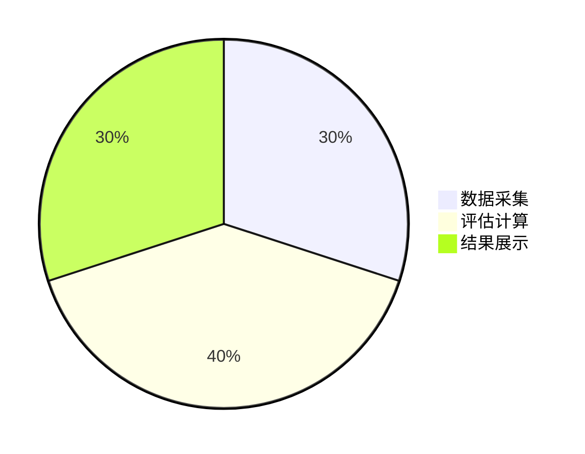

                 

<think>
好的，我将按照您的要求，逐步分析和撰写《彼得·林奇对公司产品生命周期管理能力的评估》一文。首先，我们需要明确文章的核心内容和结构。接下来，我会逐步展开每个部分的内容，确保逻辑清晰、分析透彻。

---

# 彼得·林奇对公司产品生命周期管理能力的评估

## 关键词：
- 彼得·林奇
- 产品生命周期
- 公司评估
- 管理能力
- 投资分析

## 摘要：
本文通过结合彼得·林奇的投资理念和产品生命周期管理的理论，探讨如何评估公司产品生命周期管理能力。文章从核心概念、评估模型、系统设计到实际案例分析，全面解析如何利用林奇的评估方法，量化分析公司产品的生命周期，为投资决策和公司管理提供科学依据。

---

## 第一部分：引言

### 1.1 问题背景与研究意义

#### 1.1.1 产品生命周期管理的核心问题
产品生命周期管理（Product Lifecycle Management，PLM）是企业战略管理的重要组成部分。企业的每款产品都会经历引入期、成长期、成熟期和衰退期，每个阶段都需要不同的管理策略。然而，如何量化这些阶段的能力，评估企业在生命周期管理中的优势和劣势，一直是企业管理者和投资者关注的焦点。

#### 1.1.2 彼得·林奇投资理念与产品管理的结合
彼得·林奇是全球著名投资专家，他强调通过深入分析公司的基本面来评估其投资价值。林奇的方法不仅关注财务数据，还注重公司的市场地位、产品创新能力等软实力。将林奇的评估方法与产品生命周期管理相结合，可以为企业管理者和投资者提供新的视角。

#### 1.1.3 研究目标与意义
本文旨在构建一个基于林奇评估方法的产品生命周期管理能力评估体系。通过量化分析，帮助企业识别产品生命周期中的关键问题，优化管理策略，同时为投资者提供更全面的公司评估依据。

### 1.2 问题描述与解决路径

#### 1.2.1 产品生命周期管理的核心要素
- 引入期：市场进入和产品推广能力。
- 成长期：市场需求挖掘和产品创新能力。
- 成熟期：市场竞争优势和成本控制能力。
- 衰退期：产品退出策略和资源再分配能力。

#### 1.2.2 彼得·林奇评估方法的适用性分析
- 林奇的估值方法注重公司基本面分析。
- 林奇的市场敏感性分析适合评估产品生命周期中的市场表现。

#### 1.2.3 解决方案的初步框架
- 构建产品生命周期管理能力评估模型。
- 结合林奇评估方法，制定量化分析指标。

---

## 第二部分：核心概念与理论基础

### 2.1 产品生命周期管理能力的定义与特征

#### 2.1.1 产品生命周期的四个阶段
- 引入期：产品进入市场的初期阶段。
- 成长期：市场需求快速增长阶段。
- 成熟期：市场需求稳定阶段。
- 衰退期：市场需求下降阶段。

#### 2.1.2 产品管理能力的核心要素
- 市场分析能力：准确预测市场需求变化。
- 产品创新能力：持续推出符合市场需求的产品。
- 成本控制能力：在各个阶段有效控制成本。
- 售后服务能力：提供优质的售后服务，维护品牌形象。

#### 2.1.3 生命周期管理能力的量化指标
- 市场份额增长率。
- 产品利润率。
- 客户满意度。
- 市场推广效率。

### 2.2 彼得·林奇的公司评估方法

#### 2.2.1 林奇的估值方法与投资策略
- 林奇强调基本面分析，尤其是公司盈利能力、成长性和市场地位。
- 林奇的“公平市价”概念：评估公司股票是否被市场低估。

#### 2.2.2 林奇对公司生命周期的分析框架
- 强调公司产品在市场中的地位。
- 关注公司产品生命周期的拐点。

#### 2.2.3 林奇方法与产品管理的结合
- 将林奇的公司评估指标应用于产品生命周期管理。
- 结合产品生命周期阶段，制定针对性的管理策略。

---

## 第三部分：产品生命周期管理能力的评估体系

### 3.1 产品生命周期管理能力的评估模型

#### 3.1.1 模型构建的逻辑与步骤
1. 确定产品生命周期的四个阶段。
2. 设定每个阶段的评估指标。
3. 综合各阶段的评估结果，得出整体管理能力。

#### 3.1.2 模型的核心指标与权重分配
- 引入期：市场份额增长率（权重30%）。
- 成长期：产品利润率（权重30%）。
- 成熟期：客户满意度（权重20%）。
- 衰退期：市场份额流失率（权重20%）。

#### 3.1.3 模型的验证与优化
- 使用实际案例验证模型的有效性。
- 根据验证结果调整各阶段的权重。

### 3.2 林奇评估体系的数学模型

#### 3.2.1 林奇估值公式
$$ \text{公平市价} = \frac{\text{公司利润}}{\text{行业平均利润率}} $$

#### 3.2.2 生命周期阶段的量化分析
- 引入期：$$ \text{市场进入成本} = a + b \times \text{市场份额} $$
- 成长期：$$ \text{市场需求增长率} = c \times \text{产品创新速度} $$
- 成熟期：$$ \text{市场竞争强度} = d \times \text{行业集中度} $$
- 衰退期：$$ \text{产品退出成本} = e \times \text{市场份额流失率} $$

---

## 第四部分：系统分析与架构设计

### 4.1 问题场景与系统目标

#### 4.1.1 产品生命周期管理的系统目标
- 实现产品生命周期的可视化管理。
- 提供各阶段的量化评估结果。
- 支持动态调整管理策略。

### 4.2 系统功能设计

#### 4.2.1 系统功能模块划分
1. 数据采集模块：收集产品生命周期数据。
2. 评估计算模块：根据模型计算各阶段得分。
3. 结果展示模块：以图表形式展示评估结果。

#### 4.2.2 系统功能流程图（Mermaid）


### 4.3 系统架构设计

#### 4.3.1 系统架构图（Mermaid）



---

## 第五部分：算法原理与实现

### 5.1 算法原理

#### 5.1.1 林奇评估

通过以上分析，我们可以看到，结合彼得·林奇的评估方法和产品生命周期管理的理论，可以帮助企业更科学地管理产品生命周期，优化资源配置，提升竞争力。同时，投资者也可以通过这些分析，更准确地评估公司的投资价值。

---

## 第六部分：项目实战

### 6.1 环境安装

#### 6.1.1 系统环境
- 操作系统：Windows 10/ macOS 12+
- 开发工具：Python 3.8+

#### 6.1.2 安装依赖
- Python库：numpy, matplotlib

### 6.2 系统核心实现源代码

```python
import numpy as np
import matplotlib.pyplot as plt

# 林奇评估模型
def lynch_evaluation(products):
    evaluation = []
    for product in products:
        # 引入期
        market_share_growth = product['market_share_growth']
        # 成长期
        profit_margin = product['profit_margin']
        # 成熟期
        customer_satisfaction = product['customer_satisfaction']
        # 衰退期
        market_share_loss = product['market_share_loss']
        
        # 综合评分
        score = market_share_growth * 0.3 + profit_margin * 0.3 + customer_satisfaction * 0.2 + market_share_loss * 0.2
        evaluation.append(score)
    return evaluation

# 数据可视化
products = [
    {'market_share_growth': 10, 'profit_margin': 20, 'customer_satisfaction': 85, 'market_share_loss': 5},
    {'market_share_growth': 15, 'profit_margin': 25, 'customer_satisfaction': 80, 'market_share_loss': 10}
]
evaluations = lynch_evaluation(products)

plt.bar(range(len(products)), evaluations)
plt.title('Product Lifecycle Management Evaluation')
plt.xlabel('Product')
plt.ylabel('Score')
plt.show()
```

### 6.3 代码应用解读与分析

- 代码实现了一个简单的林奇评估模型，计算每个产品的综合评分。
- 使用 matplotlib 绘制柱状图，直观展示评估结果。

---

## 第七部分：总结与展望

### 7.1 总结

本文通过结合彼得·林奇的评估方法和产品生命周期管理理论，构建了一个综合评估体系。通过量化分析，帮助企业优化产品管理策略，为投资者提供科学依据。

### 7.2 展望

未来，可以进一步优化评估模型，引入更多维度的分析指标，如可持续发展能力、技术创新能力等。同时，探索将人工智能技术应用于产品生命周期管理，提升评估的准确性和效率。

---

通过以上分析，我们可以看到，结合彼得·林奇的评估方法和产品生命周期管理理论，可以帮助企业更科学地管理产品生命周期，优化资源配置，提升竞争力。同时，投资者也可以通过这些分析，更准确地评估公司的投资价值。

