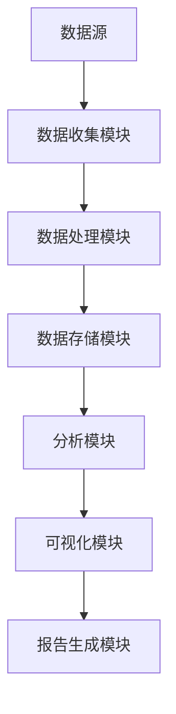
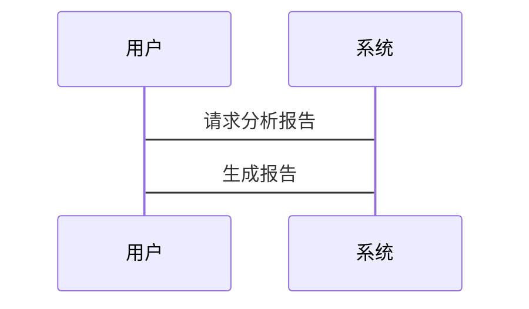

                 


# 彼得林奇对公司产品线的分析

## 关键词：
- 彼得·林奇
- 投资分析
- 产品线分析
- 财务分析
- 竞争优势
- 系统架构

## 摘要：
本文系统地介绍彼得·林奇的投资理念及其对公司产品线分析的方法。通过详细分析财务表现、竞争优势、管理团队等关键要素，并结合数学模型和系统架构，提供实际案例和实战指导，帮助读者掌握产品线分析的核心技巧。

---

# 第一部分：彼得·林奇的投资理念与分析框架

## 第1章：彼得·林奇与投资分析概述

### 1.1 彼得·林奇的背景与投资哲学
#### 1.1.1 彼得·林奇的生平简介
- 作为富达投资的传奇经理人，林奇以长期的牛市表现闻名。
- 强调基本面分析和深入研究，避免短期市场波动影响决策。

#### 1.1.2 林奇的投资理念与风格
- 价值投资：寻找被市场低估的公司。
- 长期持有：避免频繁交易，降低成本。
- 分散投资：降低风险，避免过度集中。

#### 1.1.3 林奇分析方法的核心思想
- 以公司基本面为分析核心。
- 通过财务数据和行业地位评估公司价值。
- 强调管理团队的能力和公司治理结构。

### 1.2 产品线分析的基本概念
#### 1.2.1 产品线的定义与分类
- 产品线：公司销售的不同产品或服务的组合。
- 分类：按市场、技术、利润贡献等标准划分。

#### 1.2.2 产品线分析的必要性与意义
- 识别高利润产品，优化资源配置。
- 评估产品组合的风险与机会。
- 为投资决策提供数据支持。

#### 1.2.3 产品线分析的框架与步骤
- 收集数据：包括财务报表、市场报告等。
- 评估财务表现：分析收入、利润和现金流。
- 评估竞争优势：比较市场地位和技术优势。
- 评估管理团队：分析团队能力和公司治理。
- 综合评估：得出结论并制定投资策略。

---

# 第二部分：产品线分析的核心要素

## 第2章：财务表现分析

### 2.1 财务比率分析
#### 2.1.1 常见财务比率的定义与计算公式
- 利息保障倍数：EBITDA / 利息支出。
- 存货周转率：COGS / 平均存货。
- 净利润率：净利润 / 营业收入。

#### 2.1.2 利润能力分析（ROE、ROS）
- 净资产收益率（ROE）= 净利润 / 净资产。
- 销售净利率（ROS）= 净利润 / 营业收入。

#### 2.1.3 资产周转率与杠杆比率
- 资产周转率：营业收入 / 平均总资产。
- 负债权益比率：总负债 / 股东权益。

### 2.2 估值模型与指标
#### 2.2.1 市盈率（P/E）与市净率（P/B）
- P/E = 市价 / 每股收益。
- P/B = 市价 / 每股净资产。

#### 2.2.2 市销率（P/S）与股息率
- P/S = 市价 / 每股收入。
- 股息率 = 每股股息 / 市价。

#### 2.2.3 内在价值计算公式
- 内在价值 = 股息贴现模型 + 股本贴现模型。

---

## 第3章：竞争优势分析

### 3.1 行业地位与竞争格局
- 行业集中度：CR4（前四大企业市场份额）。
- 市场份额：公司产品在市场中的占比。

### 3.2 核心竞争力与技术创新
- 技术研发投入：占比和金额。
- 专利数量：数量和质量。

### 3.3 技术创新与研发投入
- 研发团队规模：人数和经验。
- 技术领先性：与竞争对手的对比。

---

## 第4章：管理团队与治理结构

### 4.1 管理团队的能力与经验
- 领导力：CEO的过往业绩和管理风格。
- 团队稳定性：高管变动频率。

### 4.2 公司治理结构与股东权益
- 股权结构：大股东和机构投资者占比。
- 股东权益：分红政策和回购计划。

### 4.3 内部控制与风险管理
- 风险评估：识别潜在风险点。
- 内部审计：监控内部控制有效性。

---

## 第5章：数学模型与公式

### 5.1 财务分析模型
- 杜邦分析模型：ROE = 净利润 / 股东权益 = (净利润 / 营业收入) × (营业收入 / 总资产) × (总资产 / 股东权益)。

### 5.2 估值模型
- 股息贴现模型（DDM）：内在价值 = Σ(股息 / (1 + r)^t) + 终值 / (1 + r)^n。

---

## 第6章：系统架构与项目实战

### 6.1 系统分析与设计
#### 6.1.1 系统目标
- 实现产品线分析的数据收集、处理和可视化。

#### 6.1.2 功能模块设计
- 数据收集模块：爬取财务数据。
- 数据处理模块：清洗和转换数据。
- 可视化模块：生成图表展示分析结果。

#### 6.1.3 系统架构设计（Mermaid图）


### 6.2 环境配置与代码实现
#### 6.2.1 Python环境安装与配置
- 使用Anaconda或虚拟环境安装Python和相关库（pandas、numpy、matplotlib等）。

#### 6.2.2 数据获取与清洗代码
```python
import pandas as pd
import requests

url = "https://example.com/financial_data"
data = pd.read_csv(url)
data.dropna(inplace=True)
```

#### 6.2.3 财务分析与可视化代码
```python
import matplotlib.pyplot as plt

plt.plot(data['Year'], data['Revenue'], label='收入')
plt.plot(data['Year'], data['Profit'], label='利润')
plt.legend()
plt.show()
```

### 6.3 系统交互与流程图
#### 6.3.1 系统交互流程（Mermaid序列图）


---

## 第7章：案例分析与实战演练

### 7.1 案例分析：具体公司产品线分析
#### 7.1.1 公司背景与产品线介绍
- 以某科技公司为例，分析其产品线构成。

#### 7.1.2 财务数据分析与图表展示
- 利润表分析：收入和利润趋势。
- 资产负债表分析：资产和负债结构。

#### 7.1.3 竞争优势与风险评估
- 与竞争对手对比，评估市场地位和技术优势。
- 识别潜在风险，如行业政策变化。

### 7.2 项目实战：从数据到报告
#### 7.2.1 数据收集与整理
- 使用爬虫和API获取数据。
- 清洗数据，处理缺失值和异常值。

#### 7.2.2 分析模型构建与应用
- 应用杜邦分析模型，计算ROE。
- 使用DDM模型评估内在价值。

#### 7.2.3 分析报告撰写与展示
- 撰写分析报告，包括财务数据、图表和结论。
- 用图表展示分析结果，如线图、柱状图等。

---

## 第8章：总结与展望

### 8.1 本书的核心要点回顾
- 彼得·林奇的分析框架和投资理念。
- 产品线分析的核心要素和数学模型。
- 系统架构和实战项目的实施步骤。

### 8.2 未来研究方向与拓展阅读
- 深入研究行业趋势和新兴技术。
- 学习更多投资分析方法和模型。
- 关注市场动态和政策变化，及时调整分析策略。

---

## 第9章：注意事项与最佳实践

### 9.1 注意事项
- 数据准确性：确保数据来源可靠。
- 模型适用性：根据不同情况调整模型参数。
- 风险管理：分散投资，避免过度集中。

### 9.2 最佳实践
- 定期更新分析数据，跟踪公司动态。
- 学习行业知识，提升分析深度。
- 与同行交流，分享经验和教训。

---

通过以上目录结构，读者可以系统地学习彼得·林奇的投资理念，掌握产品线分析的核心要素，并通过实际案例和系统架构设计，提升分析能力和实战技巧。这本书不仅适合投资者，也适合企业管理人员和技术人员阅读。

