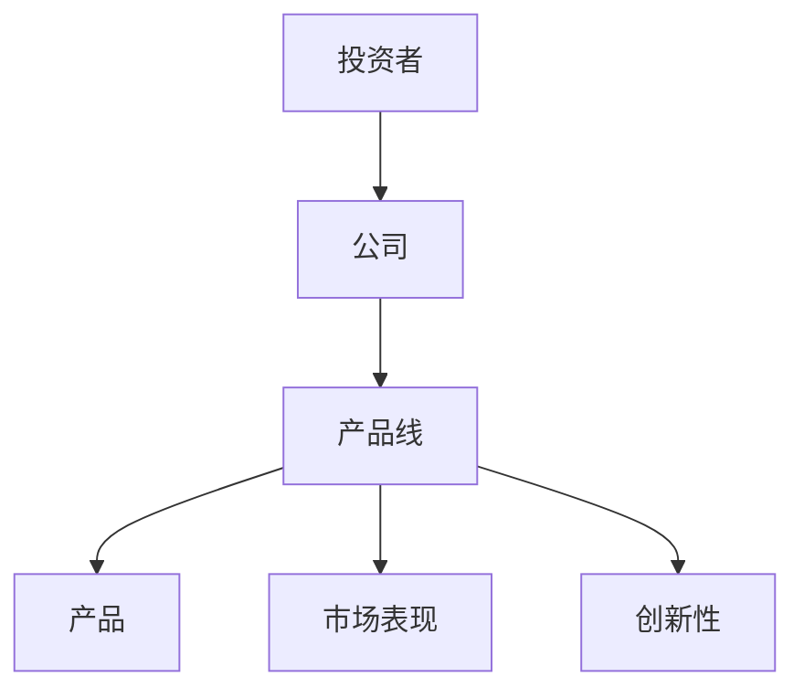
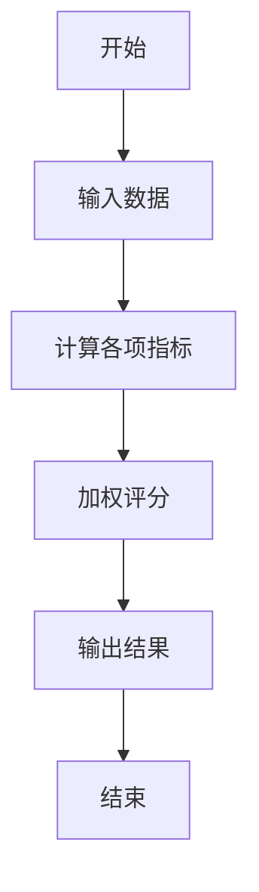

                 


# 彼得林奇对公司产品线的评估标准

## 关键词：彼得·林奇，产品线评估，投资标准，市场分析，技术博客

## 摘要：  
彼得·林奇作为投资界的传奇人物，以其独特的产品线评估标准闻名。本文深入探讨了这些标准的核心概念、算法原理、系统架构以及实际案例，帮助投资者和企业更好地理解和应用这些评估方法。

---

## 第一部分: 产品线评估的背景与核心概念

### 第1章: 问题背景与核心概念

#### 1.1 问题背景

- **投资者的挑战**：投资者在选择公司时，需评估其产品线的健康状况和市场前景。彼得·林奇强调产品线的多样性和创新性。
- **产品线的重要性**：产品线是公司收入和利润的主要来源，决定了公司的长期竞争力。
- **彼得·林奇的投资理念**：注重基本面分析，寻找具有强大产品线和竞争优势的公司。

#### 1.2 核心概念

- **产品线的定义与分类**：产品线是公司提供的产品和服务的组合，按用途、市场或技术分为不同类型。
- **产品线评估标准**：包括市场表现、创新性、多样性、竞争力和可持续性。
- **核心要素**：市场定位、产品生命周期、成本结构和竞争优势。

### 第2章: 产品线评估标准的构成与联系

#### 2.1 核心概念原理

- **产品线的生命周期模型**：产品从引入、成长到衰退，需动态评估其阶段。
- **市场适应性分析**：产品能否满足市场需求，适应市场变化。
- **创新性与多样性**：产品线是否具备创新性和多样性，以应对竞争和市场变化。

#### 2.2 标准对比分析

- **特征对比**：通过表格对比不同标准的优缺点，如加权评分法与动态调整模型。
- **优劣势分析**：加权评分法考虑各指标权重，动态调整模型更具灵活性。

#### 2.3 实体关系图



---

## 第二部分: 产品线评估标准的算法原理

### 第3章: 评估模型的构建与实现

#### 3.1 算法原理

- **加权评分系统**：将各指标按权重评分，总分反映产品线的综合价值。
- **动态调整模型**：根据市场变化调整权重，保持评估的准确性。

#### 3.2 算法流程图



#### 3.3 Python实现代码

```python
def assess_product_line(products, weights):
    scores = []
    for product in products:
        score = 0
        for i in range(len(weights)):
            score += product[i] * weights[i]
        scores.append(score)
    return scores

products = [[9, 8, 7], [6, 7, 8]]
weights = [0.4, 0.3, 0.3]
print(assess_product_line(products, weights))
```

#### 3.4 数学模型与公式

- **加权评分公式**：  
  $$ \text{总分} = \sum_{i=1}^{n} (w_i \times s_i) $$
  
- **动态调整公式**：  
  $$ \text{新权重} = \text{旧权重} \times \text{调整系数} $$

### 第4章: 评估系统的架构设计

#### 4.1 系统功能设计

- **功能模块**：数据输入、指标计算、权重调整、结果输出。
- **领域模型**：  
  ```mermaid
  classDiagram
    class 投资者 {
        公司
        产品线
    }
    class 公司 {
        产品
        市场表现
    }
    class 产品线 {
        创新性
        多样性
    }
  ```

#### 4.2 系统架构设计

- **架构图**：  
  ```mermaid
  graph TD
    A[投资者] --> B[评估系统]
    B --> C[数据处理层]
    C --> D[算法层]
    D --> E[结果层]
  ```

#### 4.3 系统接口设计

- **接口描述**：投资者输入数据，系统处理并返回评估结果。

#### 4.4 系统交互序列图

- **交互流程**：投资者请求评估，系统处理并返回结果。

---

## 第三部分: 项目实战

### 第5章: 产品线评估标准的实战应用

#### 5.1 环境安装

- **工具安装**：安装Python和相关库，如pandas和numpy。

#### 5.2 核心代码实现

```python
def assess_product_line(products, weights):
    scores = []
    for product in products:
        score = sum(product[i] * weights[i] for i in range(len(weights)))
        scores.append(score)
    return scores

# 示例数据
products = [
    [9, 8, 7],
    [6, 7, 8]
]
weights = [0.4, 0.3, 0.3]

# 评估结果
print(assess_product_line(products, weights))
```

#### 5.3 案例分析

- **公司案例**：分析某公司产品线，计算总分，评估市场竞争力。

---

## 第四部分: 总结与展望

### 第6章: 总结与最佳实践

#### 6.1 小结

- **核心内容回顾**：产品线评估的重要性，彼得·林奇的标准，算法实现。

#### 6.2 最佳实践

- **投资者建议**：定期评估产品线，关注创新和市场适应性。
- **企业建议**：优化产品组合，保持竞争力。

#### 6.3 注意事项

- **数据准确性**：确保输入数据的准确性，避免评估偏差。
- **模型局限性**：评估模型需结合实际情况，灵活调整。

#### 6.4 拓展阅读

- 推荐书籍和资源，深入学习产品线评估和投资策略。

---

## 结语

彼得·林奇的产品线评估标准为投资者和企业提供了重要的指导。通过系统的分析和实战应用，读者可以更好地理解和应用这些标准，提升投资决策的准确性。未来，随着市场的变化，评估标准也将不断优化，为企业和投资者创造更大的价值。

