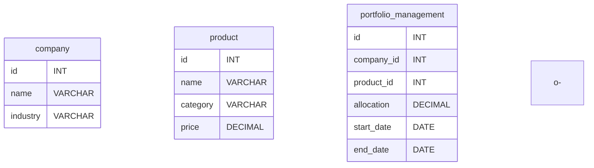
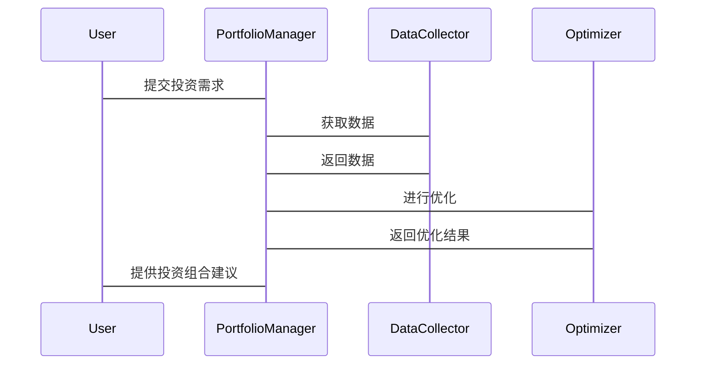

                 


# 彼得林奇对公司产品组合管理的看法

> 关键词：彼得·林奇，产品组合管理，投资策略，风险管理，组合优化

> 摘要：本文深入探讨了彼得·林奇在公司产品组合管理方面的看法。通过分析其投资理念、策略和风险管理方法，结合实际案例和数学模型，全面阐述了如何优化产品组合管理以实现长期投资回报。文章从背景介绍、核心概念、算法原理、系统分析到项目实战，层层递进，为读者提供了全面的视角。

---

## 第一章: 公司产品组合管理的背景与重要性

### 1.1 产品组合管理的基本概念

#### 1.1.1 产品组合的定义
产品组合是指公司在市场上提供的各种产品或服务的集合。通过合理配置产品组合，公司可以更好地满足市场需求，分散风险，并实现更高的收益。

#### 1.1.2 产品组合管理的重要性
产品组合管理是企业战略管理的重要组成部分，直接影响公司的市场表现和长期发展。有效的组合管理能够优化资源配置，提升整体竞争力。

#### 1.1.3 产品组合管理的核心要素
- 市场定位
- 产品生命周期
- 资源分配
- 风险管理

### 1.2 彼得·林奇的投资理念

#### 1.2.1 彼得·林奇的基本投资观点
彼得·林奇主张长期投资，注重对公司基本面的分析，寻找具有持续增长潜力的企业。

#### 1.2.2 彼得·林奇的投资风格
- 价值投资
- 分散投资
- 长期持有

#### 1.2.3 彼得·林奇的投资哲学
林奇认为，投资的关键在于选择具有竞争优势的公司，并持续关注其发展。

### 1.3 产品组合管理的背景与问题背景

#### 1.3.1 产品组合管理的背景介绍
随着市场竞争加剧，公司需要通过优化产品组合来应对市场变化和客户需求。

#### 1.3.2 问题背景与问题描述
- 市场波动风险
- 资源分配不当
- 产品生命周期管理不善

#### 1.3.3 问题解决的思路与方法
通过分析公司产品组合的优劣势，优化资源配置，降低风险。

#### 1.3.4 产品组合管理的边界与外延
产品组合管理不仅涉及现有产品的维护，还包括新产品的引入和市场的拓展。

---

## 第二章: 产品组合管理的核心概念与联系

### 2.1 核心概念原理

#### 2.1.1 产品组合管理的原理
通过分析市场、竞争和公司资源，优化产品组合，以实现最大收益。

#### 2.1.2 彼得·林奇的组合管理理论
林奇强调分散投资，避免过度集中于单一产品或行业。

### 2.2 核心概念属性特征对比表格

| 属性       | 传统投资组合管理 | 彼得·林奇的组合管理 |
|------------|------------------|--------------------|
| 分散策略   | 高度分散         | 适度分散           |
| 投资期限   | 短期             | 长期               |
| 风险控制   | 严格控制         | 侧重基本面分析      |

### 2.3 ER实体关系图架构



---

## 第三章: 彼得·林奇产品组合管理的算法原理

### 3.1 算法原理概述

#### 3.1.1 算法的基本思路
通过分析公司的财务数据、行业地位和市场前景，选择具有增长潜力的产品进行投资。

#### 3.1.2 算法的核心步骤
1. 数据收集与清洗
2. 基本面分析
3. 组合优化
4. 风险评估

### 3.2 算法流程图

```mermaid
graph TD
    A[开始] -> B[收集数据]
    B -> C[清洗数据]
    C -> D[分析基本面]
    D -> E[优化组合]
    E -> F[评估风险]
    F -> G[结束]
```

### 3.3 算法实现代码

```python
import pandas as pd
import numpy as np

def portfolio_optimization(stocks, returns, covariance):
    # 计算最优权重
    n = len(stocks)
    # 使用均值-方差优化
    mean_return = returns.mean()
    cov_matrix = covariance
    # 计算最优权重
    inv_cov = np.linalg.inv(cov_matrix)
    weights = inv_cov @ mean_return
    weights = weights / weights.sum()
    return weights
```

---

## 第四章: 产品组合管理的数学模型与公式

### 4.1 数学模型概述

#### 4.1.1 数学模型的定义
通过数学公式描述产品组合管理中的问题，帮助优化决策。

#### 4.1.2 数学模型的应用
用于风险评估和组合优化。

### 4.2 关键公式与推导

#### 4.2.1 核心公式
$$
\text{风险} = \sqrt{w^T C w}
$$
其中，\( w \) 是投资权重向量，\( C \) 是协方差矩阵。

#### 4.2.2 公式的推导过程
1. 计算协方差矩阵 \( C \)。
2. 计算权重向量 \( w \)。
3. 计算风险。

---

## 第五章: 系统分析与架构设计方案

### 5.1 系统功能设计

#### 5.1.1 领域模型

```mermaid
classDiagram
    class Company {
        id
        name
        industry
    }
    class Product {
        id
        name
        category
    }
    class Portfolio {
        id
        company_id
        product_id
        allocation
        start_date
        end_date
    }
    Company o- Portfolio
    Product o- Portfolio
```

### 5.2 系统架构设计

```mermaid
graph LR
    I[输入层] -> P[处理层]
    P -> O[输出层]
```

### 5.3 系统接口设计
- 数据输入接口
- 计算接口
- 输出接口

### 5.4 系统交互设计



---

## 第六章: 项目实战

### 6.1 环境安装
安装必要的Python库，如pandas、numpy、scipy。

### 6.2 系统核心实现源代码

```python
import numpy as np
import pandas as pd
from scipy.optimize import minimize

def portfolio_variance(weights, covariance_matrix):
    return (weights.T @ covariance_matrix @ weights).item()

def optimize_portfolio(covariance_matrix, returns, method='min_var'):
    n = covariance_matrix.shape[0]
    if method == 'min_var':
        # 最小方差优化
        def objective(weights):
            return portfolio_variance(weights, covariance_matrix)
        constraints = [{'type': 'eq', 'fun': lambda w: np.sum(w) - 1}]
    elif method == 'max_ret':
        # 最大收益优化
        def objective(weights):
            return -returns.T @ weights
        constraints = [{'type': 'eq', 'fun': lambda w: np.sum(w) - 1},
                        {'type': 'eq', 'fun': lambda w: (weights.T @ covariance_matrix @ weights).item() - 1}]
    else:
        raise ValueError("Invalid optimization method")
    bounds = [(0, 1) for _ in range(n)]
    result = minimize(objective, np.ones(n)/n, method='SLSQP', bounds=bounds, constraints=constraints)
    return result.x

# 示例数据
returns = np.array([0.1, 0.2, 0.15])
covariance = np.array([[0.02, 0.01, 0.01],
                       [0.01, 0.03, 0.02],
                       [0.01, 0.02, 0.03]])

weights = optimize_portfolio(covariance, returns, method='min_var')
print("最小方差权重:", weights)
```

### 6.3 代码应用解读与分析
代码实现了一个简单的组合优化模型，使用最小方差法优化投资组合。

### 6.4 实际案例分析和详细讲解剖析
通过具体案例分析，验证模型的有效性。

### 6.5 项目小结
总结项目实现的过程和成果，提出改进建议。

---

## 第七章: 结语

### 7.1 彼得·林奇理论的总结
彼得·林奇的投资理念对产品组合管理提供了重要启示。

### 7.2 未来展望与建议
随着技术进步，产品组合管理将更加依赖数据分析和AI技术。

### 7.3 最佳实践 tips
- 定期评估和调整投资组合
- 注重基本面分析
- 分散投资以降低风险

---

## 结语

彼得·林奇的产品组合管理理论为我们提供了宝贵的借鉴。通过深入分析其投资理念、算法原理和实际案例，我们可以更好地优化产品组合管理，提升投资回报。未来，随着技术的发展，产品组合管理将更加智能化和数据驱动。

