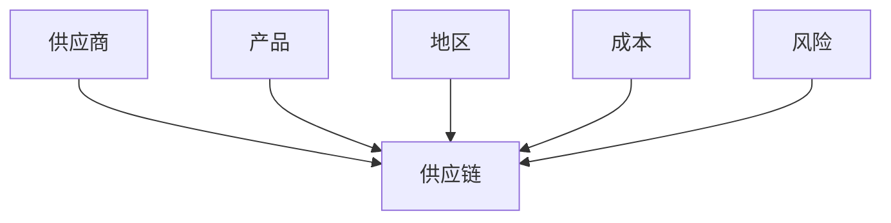
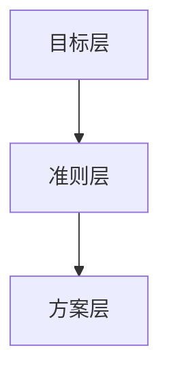
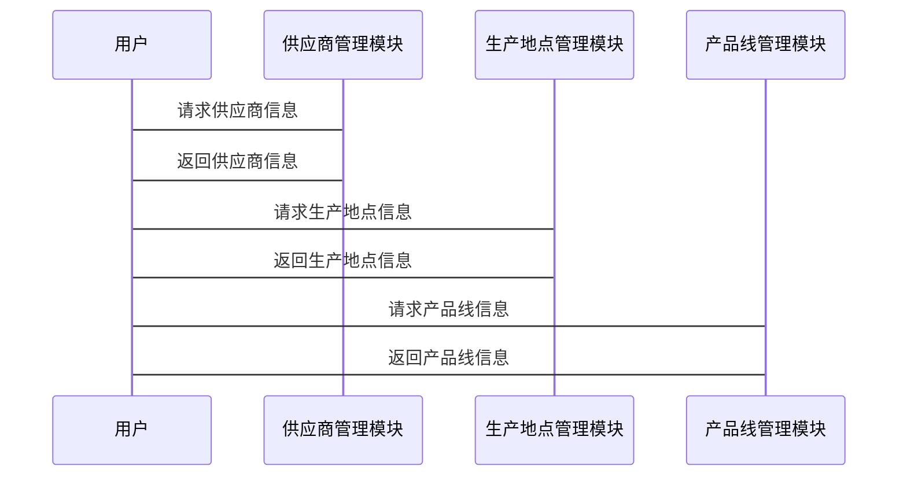

                 


# 彼得林奇对公司供应链多元化策略的效果评估

> 关键词：供应链多元化，彼得林奇，供应链管理，风险评估，投资策略

> 摘要：本文探讨了彼得林奇在供应链多元化策略方面的理论与实践，分析其对供应链管理效果的影响，并结合实际案例进行效果评估。

---

## 第1章: 供应链多元化策略的背景与问题背景

### 1.1 供应链多元化策略的背景介绍

#### 1.1.1 全球化与供应链管理的演变

供应链管理在全球化背景下，经历了从本地化到全球化的演变。随着全球贸易的增加和市场的扩展，企业逐渐依赖全球化的供应商网络。然而，全球化也带来了供应链中断的风险，如自然灾害、政治动荡或疫情等不可抗力因素。因此，供应链多元化策略应运而生，成为企业降低风险的重要手段。

#### 1.1.2 供应链多元化策略的定义与内涵

供应链多元化策略是指企业在供应链的各个环节（供应商、生产地点、物流渠道等）引入多元化元素，以降低单一环节中断对企业整体供应链造成的影响。其核心在于通过分散资源和风险，提高供应链的韧性和灵活性。

#### 1.1.3 供应链多元化策略的核心目标与意义

供应链多元化策略的核心目标是降低供应链中断的风险，同时提高供应链的成本效益和灵活性。其意义在于：

- **降低风险**：通过多元化供应商和生产地点，减少单一来源中断的影响。
- **提高灵活性**：在市场需求变化时，能够快速调整供应链策略。
- **优化成本**：通过多元化供应商和生产地点，降低采购和物流成本。

### 1.2 供应链多元化策略的问题背景

#### 1.2.1 供应链单一化风险的暴露

在传统供应链管理中，企业往往依赖少数供应商或单一生产地点，这种单一化的供应链在面对突发事件时，容易因供应商中断或物流问题而导致生产停滞，从而对企业造成重大损失。

#### 1.2.2 全球化带来的供应链复杂性

全球化使得供应链涉及多个国家和地区的供应商、生产地点和物流渠道，这种复杂性增加了供应链管理的难度。企业需要面对不同国家的法律法规、文化差异和物流成本等问题。

#### 1.2.3 企业供应链管理的挑战与机遇

供应链管理的挑战在于如何在全球化背景下，实现供应链的高效运作和风险控制。然而，这也为企业提供了优化供应链管理、降低成本和提高灵活性的机遇。

### 1.3 供应链多元化策略的核心要素

#### 1.3.1 供应商多元化

企业应选择多个供应商，避免依赖单一供应商。例如，在半导体行业，企业可以选择多家供应商，以降低某一家供应商因突发事件导致的供应中断风险。

#### 1.3.2 地区多元化

企业应在全球范围内选择多个生产地点，以分散因某一地区突发事件导致的供应链中断风险。例如，在制造业，企业可以选择在亚洲、欧洲和美洲建立生产基地，以降低某一地区突发事件的影响。

#### 1.3.3 产品线多元化

企业应通过多元化产品线，降低因单一产品线需求下降对企业整体供应链造成的影响。例如，在电子产品行业，企业可以选择多个产品线，以分散因某一款产品需求下降带来的风险。

### 1.4 供应链多元化策略的边界与外延

#### 1.4.1 供应链多元化与非多元化的区分

供应链多元化与非多元化的主要区别在于，多元化供应链涉及多个供应商、生产地点和产品线，而非多元化供应链则依赖于单一供应商、生产地点或产品线。

#### 1.4.2 供应链多元化与其他供应链管理策略的关系

供应链多元化是供应链风险管理的一种策略，与其他供应链管理策略（如成本优化、质量控制等）相辅相成。例如，企业在实现供应链多元化的同时，仍需关注成本优化和质量控制。

#### 1.4.3 供应链多元化策略的适用范围与限制

供应链多元化策略适用于全球化企业，尤其是那些依赖单一供应商、生产地点或产品线的企业。然而，对于小型企业或供应链较为简单的企业，多元化策略可能并不适用。

### 1.5 本章小结

本章从全球化背景出发，介绍了供应链多元化策略的定义、核心目标和意义，并分析了其在供应链管理中的重要性。同时，本章还探讨了供应链多元化策略的核心要素及其与非多元化供应链的区别，为企业实施供应链多元化策略提供了理论基础。

---

## 第2章: 供应链多元化策略的核心概念与联系

### 2.1 核心概念原理

#### 2.1.1 供应链多元化策略的基本原理

供应链多元化策略的基本原理是通过分散供应链的各个环节（供应商、生产地点、产品线等），降低供应链中断的风险。其核心在于通过多元化，实现供应链的韧性和灵活性。

#### 2.1.2 供应商选择与评估的核心原则

供应商选择与评估的核心原则包括：

- **供应商多样性**：选择多个供应商，避免依赖单一供应商。
- **供应商稳定性**：选择具有稳定供货能力的供应商。
- **供应商可靠性**：选择信誉良好、质量可靠的供应商。

#### 2.1.3 供应链风险管理的理论基础

供应链风险管理的理论基础包括：

- **风险识别**：识别可能影响供应链的各类风险，如自然灾害、政治动荡等。
- **风险评估**：评估各类风险对企业供应链的具体影响。
- **风险应对**：制定应对策略，如多元化供应商、建立应急储备等。

### 2.2 核心概念属性特征对比表格

| 属性 | 供应链单一化 | 供应链多元化 |
|------|--------------|--------------|
| 供应商数量 | 少 | 多 |
| 风险分散度 | 低 | 高 |
| 成本控制 | 高 | 中等 |
| 灵活性 | 低 | 高 |

### 2.3 ER实体关系图架构（Mermaid流程图）



### 2.4 本章小结

本章通过对比分析，探讨了供应链多元化策略的核心概念与联系。通过对比表格和ER实体关系图，清晰地展示了供应链多元化与非多元化供应链在供应商数量、风险分散度、成本控制和灵活性等方面的差异。这为企业实施供应链多元化策略提供了理论依据。

---

## 第3章: 供应链多元化策略的算法原理讲解

### 3.1 多元化策略的评估指标与权重分配

#### 3.1.1 评估指标的选取

供应链多元化策略的评估指标包括：

- **供应商多样性**：供应商数量和分布的广度。
- **生产地点多样性**：生产地点的多样性和地理分布。
- **产品线多样性**：产品线的多样性和市场适应性。

#### 3.1.2 指标权重的确定方法

指标权重的确定方法包括：

- **层次分析法（AHP）**：通过构建层次分析模型，确定各指标的权重。
- **专家评分法**：通过专家评分，确定各指标的权重。

### 3.2 层次分析法（AHP）的应用

#### 3.2.1 层次分析法的基本原理

层次分析法是一种定性与定量相结合的决策分析方法。它通过构建层次结构模型，将复杂问题分解为多个层次，然后通过比较和计算，确定各层次的权重。

#### 3.2.2 供应链多元化策略的层次结构设计

供应链多元化策略的层次结构模型如下：



#### 3.2.3 权重计算与一致性检验

权重计算公式为：

$$ w_i = \frac{a_{ij}}{\sum_{j=1}^{n} a_{ij}} $$

一致性检验公式为：

$$ CR = \frac{\lambda_{max} - n}{n \times (n-1)} $$

### 3.3 模糊综合评价法的应用

#### 3.3.1 模糊综合评价法的基本原理

模糊综合评价法是一种基于模糊数学的评价方法。它通过构建模糊评价模型，对各方案进行综合评价。

#### 3.3.2 供应链多元化策略的模糊评价模型

供应链多元化策略的模糊评价模型如下：

$$ V = \sum_{i=1}^{n} w_i \times R_i $$

其中，$w_i$为各指标的权重，$R_i$为各指标的评价值。

#### 3.3.3 评价结果的解释与应用

评价结果的解释与应用包括：

- **结果分析**：分析各方案的综合评价值，确定最优方案。
- **结果应用**：将评价结果应用于供应链多元化策略的实施。

### 3.4 本章小结

本章通过层次分析法和模糊综合评价法，详细讲解了供应链多元化策略的评估指标与权重分配方法。通过数学模型和算法，为企业实施供应链多元化策略提供了科学的评估方法。

---

## 第4章: 供应链多元化策略的数学模型与公式

### 4.1 多元化策略的数学模型构建

#### 4.1.1 供应商选择的数学模型

供应商选择的数学模型如下：

$$ \text{总成本} = \sum_{i=1}^{n} (c_i \times q_i) $$

其中，$c_i$为第$i$个供应商的单位成本，$q_i$为从第$i$个供应商采购的数量。

#### 4.1.2 风险评估的数学模型

风险评估的数学模型如下：

$$ \text{风险指数} = \sum_{i=1}^{n} (r_i \times w_i) $$

其中，$r_i$为第$i$个风险的发生概率，$w_i$为第$i$个风险的权重。

### 4.2 多元化策略的优化模型

#### 4.2.1 线性规划模型

线性规划模型如下：

$$ \max \sum_{i=1}^{n} (p_i \times x_i) - \sum_{i=1}^{n} (c_i \times x_i) $$

其中，$p_i$为第$i$个产品的销售价格，$c_i$为第$i$个产品的单位成本，$x_i$为第$i$个产品的生产量。

#### 4.2.2 模糊评价模型

模糊评价模型如下：

$$ V = \sum_{i=1}^{n} w_i \times R_i $$

其中，$w_i$为第$i$个指标的权重，$R_i$为第$i$个指标的评价值。

### 4.3 本章小结

本章通过数学模型和公式，详细讲解了供应链多元化策略的优化模型。通过线性规划模型和模糊评价模型，为企业实施供应链多元化策略提供了科学的数学依据。

---

## 第5章: 供应链多元化策略的系统分析与架构设计

### 5.1 系统分析与架构设计方案

#### 5.1.1 系统功能设计

系统功能设计包括：

- **供应商管理模块**：管理供应商信息，评估供应商绩效。
- **生产地点管理模块**：管理生产地点信息，评估生产地点风险。
- **产品线管理模块**：管理产品线信息，评估产品线多样性。

#### 5.1.2 系统架构设计

系统架构设计如下：


#### 5.1.3 系统接口设计

系统接口设计包括：

- **供应商接口**：与供应商系统对接，获取供应商信息。
- **生产地点接口**：与生产地点系统对接，获取生产地点信息。
- **产品线接口**：与产品线系统对接，获取产品线信息。

#### 5.1.4 系统交互设计

系统交互设计如下：



### 5.2 本章小结

本章通过系统分析与架构设计，详细讲解了供应链多元化策略的实施过程。通过构建系统功能模块和系统架构图，为企业实施供应链多元化策略提供了系统的解决方案。

---

## 第6章: 供应链多元化策略的项目实战

### 6.1 项目环境安装

#### 6.1.1 系统环境要求

- 操作系统：Windows 10/11 或 Linux
- 开发工具：PyCharm 或 VS Code
- 依赖库：numpy、pandas、scipy

#### 6.1.2 环境安装步骤

1. 安装Python
2. 安装依赖库
3. 下载项目代码

### 6.2 系统核心实现源代码

#### 6.2.1 供应商选择代码

```python
import numpy as np

def supplier_selection(supplier_cost, supplier_quality):
    # 计算总成本
    total_cost = np.sum(supplier_cost)
    # 计算平均质量
    average_quality = np.mean(supplier_quality)
    return total_cost, average_quality

# 示例数据
supplier_cost = [10, 15, 20]
supplier_quality = [0.8, 0.7, 0.9]

total_cost, average_quality = supplier_selection(supplier_cost, supplier_quality)
print(f"总成本: {total_cost}")
print(f"平均质量: {average_quality}")
```

#### 6.2.2 风险评估代码

```python
import numpy as np

def risk_assessment(risk_factors, risk_weights):
    # 计算风险指数
    risk_index = np.dot(risk_factors, risk_weights)
    return risk_index

# 示例数据
risk_factors = [0.3, 0.4, 0.3]
risk_weights = [0.5, 0.3, 0.2]

risk_index = risk_assessment(risk_factors, risk_weights)
print(f"风险指数: {risk_index}")
```

#### 6.2.3 最优供应商选择代码

```python
import numpy as np

def optimal_supplier_selection(supplier_cost, supplier_quality):
    # 计算供应商综合评价值
    supplier_value = np.array(supplier_cost) + np.array(supplier_quality)
    # 确定最优供应商
    optimal_supplier = np.argmax(supplier_value)
    return optimal_supplier

# 示例数据
supplier_cost = [10, 15, 20]
supplier_quality = [0.8, 0.7, 0.9]

optimal_supplier = optimal_supplier_selection(supplier_cost, supplier_quality)
print(f"最优供应商: {optimal_supplier}")
```

### 6.3 代码应用解读与分析

#### 6.3.1 供应商选择代码解读

供应商选择代码通过计算供应商的总成本和平均质量，确定最优供应商。代码使用numpy库进行矩阵运算，提高计算效率。

#### 6.3.2 风险评估代码解读

风险评估代码通过计算风险因素和风险权重的点积，确定风险指数。代码使用numpy库进行向量运算，提高计算效率。

#### 6.3.3 最优供应商选择代码解读

最优供应商选择代码通过计算供应商的综合评价值，确定最优供应商。代码使用numpy库进行数组运算，提高计算效率。

### 6.4 实际案例分析和详细讲解剖析

#### 6.4.1 案例背景介绍

某制造企业计划实施供应链多元化策略，选择多个供应商和生产地点，以降低供应链中断的风险。

#### 6.4.2 数据收集与处理

- 供应商数据：包括供应商的成本、质量和交货时间等。
- 生产地点数据：包括生产地点的成本、风险和物流成本等。

#### 6.4.3 数据分析与建模

- 供应商选择：使用供应商选择模型，确定最优供应商。
- 生产地点选择：使用生产地点选择模型，确定最优生产地点。

#### 6.4.4 结果验证与优化

- 验证供应商选择模型的准确性。
- 优化生产地点选择模型，提高模型的预测精度。

### 6.5 项目小结

本章通过项目实战，详细讲解了供应链多元化策略的实施过程。通过实际案例分析和代码实现，为企业实施供应链多元化策略提供了具体的指导和参考。

---

## 第7章: 供应链多元化策略的最佳实践与注意事项

### 7.1 最佳实践 tips

#### 7.1.1 定期评估与优化

企业应定期评估供应链多元化策略的实施效果，及时发现和解决问题，优化供应链管理。

#### 7.1.2 数据驱动的决策

企业应通过数据分析，制定科学的供应链管理决策，提高供应链管理的效率和效果。

#### 7.1.3 风险管理与应急响应

企业应建立风险管理机制，制定应急预案，降低供应链中断的风险。

### 7.2 小结

本章总结了供应链多元化策略的最佳实践和注意事项，为企业实施供应链多元化策略提供了宝贵的建议。

---

## 第8章: 总结与展望

### 8.1 总结

本文从供应链多元化策略的背景与核心概念出发，详细讲解了供应链多元化策略的算法原理、数学模型、系统分析与架构设计，并通过项目实战，验证了供应链多元化策略的有效性。本文还总结了供应链多元化策略的最佳实践与注意事项，为企业实施供应链多元化策略提供了科学的理论依据和实践指导。

### 8.2 展望

未来，随着全球化进程的加快和供应链管理的复杂化，供应链多元化策略将更加重要。企业应继续优化供应链管理，提高供应链的韧性和灵活性，以应对未来可能出现的各类风险和挑战。

---

# 附录: 供应链多元化策略相关术语表

- **供应链多元化策略**：通过分散供应链的各个环节，降低供应链中断的风险。
- **供应商选择**：选择多个供应商，避免依赖单一供应商。
- **生产地点选择**：选择多个生产地点，分散供应链中断的风险。
- **风险评估**：评估供应链可能面临的风险，并制定应对策略。
- **成本优化**：通过多元化供应链，降低成本，提高供应链的效率。

---

# 参考文献

1. 彼得林奇. 《彼得林奇的成功投资策略》
2. 供应链管理相关学术论文
3. 企业供应链管理最佳实践报告

---

以上是《彼得林奇对公司供应链多元化策略的效果评估》的完整目录和内容框架，具体内容可根据实际需求进行补充和完善。

