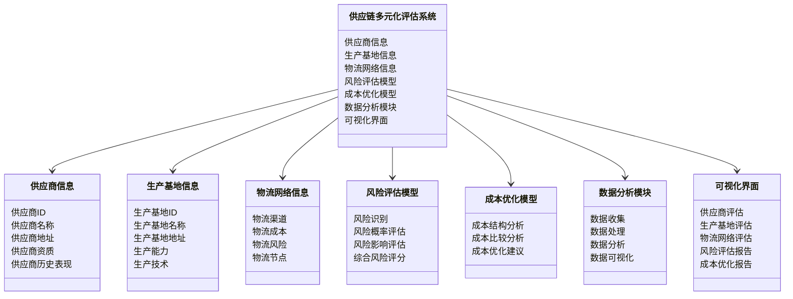
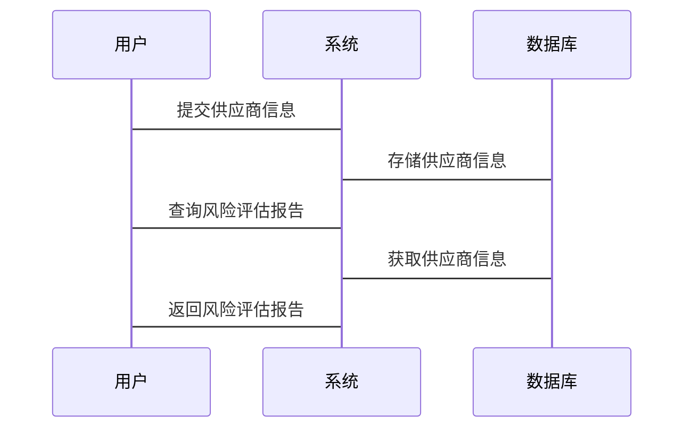

                 


# 彼得林奇对公司供应链多元化策略的评估

## 关键词：
彼得·林奇、供应链、多元化、供应链管理、风险评估、投资策略

## 摘要：
本文将探讨彼得·林奇的投资理念如何应用于供应链管理，特别是供应链多元化策略的评估。我们将从供应链管理的基本概念出发，分析多元化策略的核心要素和评估维度，结合彼得·林奇的评估框架，构建一个完整的评估系统，并通过实际案例分析，深入探讨供应链多元化策略的实现和优化方法。

---

# 第一部分: 供应链多元化策略概述

## 第1章: 供应链多元化策略的背景与重要性

### 1.1 供应链管理的基本概念

#### 1.1.1 供应链的定义与组成
供应链是围绕企业生产过程中的 **“流”** 和 **“链”** 而形成的网络系统。它包括从原材料采购、生产、物流、分销到最终消费者的各个环节。供应链的核心组成包括：
- **供应商**：提供原材料或零部件的企业。
- **生产环节**：企业的生产工厂或代工制造商。
- **物流网络**：负责运输和仓储的物流渠道。
- **分销渠道**：产品到达消费者的路径，包括经销商、零售商等。
- **消费者**：最终产品或服务的接收者。

供应链的 **“流”** 包括信息流、物流、资金流和价值流，这些流的协同运作决定了供应链的整体效率。

#### 1.1.2 供应链管理的核心目标
供应链管理的核心目标是实现 **“高效协同”**，具体包括：
- **成本控制**：通过优化采购、生产、物流等环节降低成本。
- **提高灵活性**：快速响应市场需求变化，调整供应链策略。
- **增强可靠性**：确保供应链各环节的稳定性和可持续性。
- **提升客户满意度**：通过高效交付和优质服务满足客户需求。

#### 1.1.3 供应链在企业运营中的地位
供应链是企业运营的核心支柱之一，它直接影响企业的 **成本、效率和风险**。一个高效的供应链能够帮助企业：
- 快速响应市场变化。
- 降低库存成本。
- 提高产品质量和交付速度。
- 应对供应链中断风险。

供应链管理的优劣直接关系到企业的竞争力和市场表现。

---

### 1.2 供应链多元化策略的定义与特点

#### 1.2.1 多元化供应链的定义
多元化供应链是指企业在供应链的各个环节（供应商、生产、物流、分销等）中采用 **多样化策略**，以降低风险、提高灵活性和竞争力。多元化供应链的核心思想是 **“不把所有鸡蛋放在一个篮子里”**，通过分散风险来增强供应链的稳定性。

#### 1.2.2 多元化供应链的优势与挑战
**优势：**
1. **降低风险**：多元化供应链能够分散供应商、生产地、物流渠道等单一环节的风险。例如，如果一个主要供应商出现问题，企业可以通过其他供应商继续生产。
2. **提高灵活性**：多元化供应链能够快速调整生产和分销策略，适应市场需求的变化。
3. **增强议价能力**：通过与多个供应商合作，企业可以提高议价能力，降低采购成本。
4. **优化成本结构**：通过多样化生产地和物流渠道，企业可以降低运输成本和关税。

**挑战：**
1. **管理复杂性**：多元化供应链需要协调多个供应商、生产基地和物流渠道，增加了管理的复杂性。
2. **成本增加**：多样化的供应链可能会增加协调成本和管理成本。
3. **协同问题**：不同供应商和合作伙伴之间的协同可能不够顺畅，导致效率下降。

#### 1.2.3 多元化供应链与传统供应链的区别
| **维度**       | **传统供应链**                          | **多元化供应链**                          |
|-----------------|----------------------------------------|------------------------------------------|
| 供应商结构     | 单一供应商或少量供应商                  | 多个供应商，涵盖不同地区和行业          |
| 灵活性         | 较低，适应市场变化能力有限              | 较高，能够快速调整生产和分销策略        |
| 成本控制       | 高，依赖单一供应商的成本优势            | 中等，通过多样化降低成本和分散风险      |
| 风险管理       | 高风险，依赖少数供应商或生产地          | 低风险，通过分散供应商和生产地降低风险  |
| 响应速度       | 较慢，供应链调整周期长                  | 较快，能够快速调整以应对市场变化        |

---

### 1.3 彼得·林奇与供应链多元化策略

#### 1.3.1 彼得·林奇的投资理念
彼得·林奇是美国著名投资经理人，以其在富达投资的长期成功而闻名。他的投资理念强调 **“深入研究”** 和 **“长期持有”**，尤其关注企业的基本面和管理层能力。林奇认为，成功的投资需要对企业的供应链、生产流程、成本结构等进行全面分析。

#### 1.3.2 供应链多元化在投资中的重要性
在供应链多元化策略中，彼得·林奇特别关注企业的 **供应商多元化** 和 **生产能力分散化**。他认为，一个依赖单一供应商或生产地的企业存在较高的供应链风险，容易因供应商问题或自然灾害导致生产中断，从而影响企业的盈利能力。

#### 1.3.3 彼得·林奇对供应链多元化策略的贡献
彼得·林奇在其投资实践中总结出一套供应链多元化策略的评估框架，主要包括：
1. **供应商评估**：分析供应商的财务状况、生产能力、地理位置和合作稳定性。
2. **供应链风险评估**：通过压力测试和情景分析，评估企业在供应链中断情况下的应对能力。
3. **成本与效益分析**：权衡多元化供应链的成本增加与风险降低之间的关系。

彼得·林奇的供应链多元化策略为企业管理者和投资者提供了重要的参考，尤其是在全球化背景下，企业如何通过供应链多元化来应对日益复杂的市场环境。

---

### 1.4 本章小结
本章从供应链管理的基本概念出发，详细介绍了供应链多元化策略的定义、优势和挑战，并结合彼得·林奇的投资理念，分析了供应链多元化在投资中的重要性。通过对比传统供应链与多元化供应链的特点，我们能够更好地理解多元化供应链的核心价值和实现路径。

---

# 第二部分: 供应链多元化策略的评估框架

## 第2章: 供应链多元化策略的核心要素

### 2.1 供应链多元化策略的组成

#### 2.1.1 供应商多元化
供应商多元化是供应链多元化策略的核心组成部分。企业可以通过以下方式实现供应商多元化：
1. **多供应商策略**：选择多个供应商，涵盖不同的地区和行业。
2. **供应商的地理分布**：选择不同国家或地区的供应商，降低区域风险。
3. **供应商的行业分布**：选择不同行业的供应商，避免因行业波动影响供应链稳定性。

#### 2.1.2 生产能力多元化
生产能力多元化是指企业在不同地区或不同生产基地分散生产任务，以降低生产中断风险。具体包括：
1. **多生产基地策略**：在不同地区建立多个生产基地，分散生产风险。
2. **生产技术多样性**：采用多种生产技术，提高生产灵活性。
3. **生产能力弹性**：根据市场需求调整生产能力，确保生产灵活性。

#### 2.1.3 物流网络多元化
物流网络多元化是指企业在物流渠道、运输方式和仓储布局上实现多样化。具体包括：
1. **多物流渠道**：采用多种物流方式，如公路、铁路、空运和海运。
2. **物流节点的分散布局**：在不同地区建立物流中心，降低运输成本和风险。
3. **物流合作伙伴多元化**：与多家物流公司合作，分散运输风险。

---

### 2.2 供应链多元化策略的评估维度

#### 2.2.1 供应商稳定性
供应商稳定性是评估供应链多元化策略的重要指标。企业可以通过以下方式评估供应商稳定性：
1. **供应商的历史表现**：分析供应商的交货准时率、产品质量和合作稳定性。
2. **供应商的财务状况**：评估供应商的财务健康状况，避免因供应商财务问题导致供应链中断。
3. **供应商的地理位置风险**：分析供应商所在地区的政治、经济和自然灾害风险。

#### 2.2.2 成本控制能力
成本控制能力是评估供应链多元化策略的另一个重要维度。企业可以通过以下方式评估成本控制能力：
1. **成本结构分析**：分析多元化供应链的成本结构，确保成本控制在合理范围内。
2. **成本比较分析**：将多元化供应链的成本与单一供应链的成本进行对比，评估成本增加的合理性。
3. **成本优化建议**：根据评估结果提出成本优化建议，进一步降低供应链成本。

#### 2.2.3 应急响应能力
应急响应能力是评估供应链多元化策略的重要指标。企业可以通过以下方式评估应急响应能力：
1. **应急计划制定**：制定详细的应急计划，明确在供应链中断情况下的应对措施。
2. **情景分析**：通过情景分析模拟供应链中断情况，评估企业的应急响应能力。
3. **应急演练**：定期进行应急演练，确保员工熟悉应急响应流程。

---

### 2.3 彼得·林奇的供应链多元化评估框架

#### 2.3.1 供应商选择标准
彼得·林奇的供应链多元化评估框架强调供应商的选择标准，具体包括：
1. **供应商的资质和能力**：供应商是否具备足够的生产能力、技术能力和财务能力。
2. **供应商的地理位置**：供应商是否分散在不同地区，降低区域风险。
3. **供应商的合作历史**：供应商是否与企业有长期合作历史，确保合作稳定性。

#### 2.3.2 供应链风险评估模型
彼得·林奇提出了一种供应链风险评估模型，用于评估企业在供应链中断情况下的应对能力。模型包括以下几个步骤：
1. **风险识别**：识别供应链中的潜在风险，如供应商违约、自然灾害等。
2. **风险量化**：通过概率和影响分析量化风险。
3. **风险应对策略**：制定应对措施，降低风险影响。

#### 2.3.3 供应链绩效评价指标
彼得·林奇的供应链绩效评价指标包括：
1. **供应链成本占比**：供应链成本占企业总成本的比例。
2. **供应链灵活性**：企业在市场变化中的快速调整能力。
3. **供应链稳定性**：供应链在面对中断情况下的恢复能力。

---

### 2.4 本章小结
本章详细分析了供应链多元化策略的核心要素，包括供应商多元化、生产能力多元化和物流网络多元化。同时，结合彼得·林奇的供应链多元化评估框架，提出了供应商选择标准、供应链风险评估模型和绩效评价指标。这些内容为企业实现供应链多元化提供了理论依据和实践指导。

---

# 第三部分: 供应链多元化策略的评估方法

## 第3章: 供应链多元化策略的定性分析

### 3.1 供应商多元化分析

#### 3.1.1 供应商的地理分布
供应商的地理分布是供应商多元化的重要指标。企业可以通过分析供应商的地理分布，评估供应链的区域风险。例如，如果大部分供应商集中在某个地区，企业可能面临该地区自然灾害或政策变化的风险。

#### 3.1.2 供应商的行业分布
供应商的行业分布是另一个重要的分析维度。企业可以通过分析供应商的行业分布，评估供应链的行业风险。例如，如果供应商主要集中在某个行业，企业可能面临该行业整体波动的风险。

#### 3.1.3 供应商的规模与资质
供应商的规模和资质是评估供应商稳定性的关键因素。企业可以通过分析供应商的财务状况、生产能力和技术能力，评估供应商的资质和合作潜力。

---

### 3.2 生产能力多元化分析

#### 3.2.1 生产基地的分布
生产基地的分布是生产能力多元化的重要指标。企业可以通过分析生产基地的分布，评估供应链的区域风险。例如，如果生产基地集中在某个地区，企业可能面临该地区自然灾害或政策变化的风险。

#### 3.2.2 生产技术的多样性
生产技术的多样性是生产能力多元化的重要体现。企业可以通过分析生产技术的多样性，评估供应链的灵活性和适应性。例如，采用多种生产技术可以提高生产效率和产品质量。

#### 3.2.3 生产能力的弹性
生产能力的弹性是生产能力多元化的重要指标。企业可以通过分析生产能力的弹性，评估供应链在市场需求变化情况下的调整能力。例如，弹性生产能力可以通过调整生产量来适应市场需求的变化。

---

### 3.3 物流网络多元化分析

#### 3.3.1 物流渠道的多样性
物流渠道的多样性是物流网络多元化的重要体现。企业可以通过分析物流渠道的多样性，评估供应链的运输风险。例如，采用多种物流方式可以降低运输中断的风险。

#### 3.3.2 物流成本的控制
物流成本的控制是物流网络多元化的重要目标。企业可以通过分析物流成本的结构和控制方法，评估供应链的成本效率。例如，通过优化物流网络布局可以降低物流成本。

#### 3.3.3 物流风险的评估
物流风险的评估是物流网络多元化的重要环节。企业可以通过分析物流风险的影响因素，评估供应链的运输风险。例如，通过情景分析可以模拟物流中断情况下的应对措施。

---

### 3.4 本章小结
本章从定性分析的角度，详细探讨了供应链多元化策略的供应商、生产和物流三个核心环节。通过分析供应商的地理分布、行业分布、规模与资质，生产能力的生产基地分布、技术多样性和弹性，以及物流网络的渠道多样性、成本控制和风险评估，企业可以全面评估供应链的多元化水平。

---

## 第4章: 供应链多元化策略的定量分析

### 4.1 供应链多元化策略的定量评估方法

#### 4.1.1 加权评分法
加权评分法是一种常用的定量评估方法。企业可以通过对供应商、生产基地、物流网络等进行评分，并根据各维度的重要性赋予不同的权重，计算出综合得分。例如：

$$
\text{综合得分} = \sum (\text{评分} \times \text{权重})
$$

#### 4.1.2 供应链风险评估模型
供应链风险评估模型可以通过概率和影响分析量化供应链中断的风险。具体步骤如下：
1. **风险识别**：识别潜在风险，如供应商违约、自然灾害等。
2. **风险概率评估**：评估每个风险发生的概率。
3. **风险影响评估**：评估每个风险对企业的影响程度。
4. **风险综合评估**：根据概率和影响计算综合风险评分。

#### 4.1.3 成本效益分析
成本效益分析是评估供应链多元化策略的重要方法。企业可以通过对比多元化供应链和单一供应链的成本和效益，评估多元化策略的可行性。例如：

$$
\text{成本效益比} = \frac{\text{多元化供应链成本}}{\text{单一供应链成本}}
$$

---

### 4.2 供应链多元化策略的数学模型

#### 4.2.1 供应链风险评估模型
供应链风险评估模型可以通过以下公式计算：

$$
R = \sum_{i=1}^{n} (\text{风险概率} \times \text{风险影响})
$$

其中，$R$ 表示综合风险评分，$n$ 表示风险因素的数量。

#### 4.2.2 成本优化模型
成本优化模型可以通过以下公式计算：

$$
\text{总成本} = \text{采购成本} + \text{物流成本} + \text{管理成本}
$$

企业可以通过优化各部分成本，降低供应链总成本。

---

### 4.3 本章小结
本章从定量分析的角度，探讨了供应链多元化策略的评估方法。通过加权评分法、供应链风险评估模型和成本效益分析，企业可以量化供应链多元化策略的优劣，并通过数学模型优化供应链管理。

---

# 第四部分: 供应链多元化策略的系统架构与实现

## 第5章: 系统架构与实现

### 5.1 问题场景介绍
供应链多元化策略的实现需要一个高效的系统支持。企业可以通过构建一个 **供应链多元化评估系统**，实现对供应商、生产基地、物流网络等的全面评估和优化。

---

### 5.2 系统功能设计

#### 5.2.1 领域模型类图
以下是一个供应链多元化评估系统的领域模型类图：



---

#### 5.2.2 系统架构设计

以下是一个供应链多元化评估系统的架构图：

```mermaid
graph TD
    A[供应链多元化评估系统] --> B[供应商信息模块]
    A --> C[生产基地信息模块]
    A --> D[物流网络信息模块]
    A --> E[风险评估模型模块]
    A --> F[成本优化模型模块]
    A --> G[数据分析模块]
    G --> H[数据可视化模块]
    A --> I[可视化界面]
    I --> B, C, D, E, F, G
```

---

#### 5.2.3 系统接口设计
系统接口设计包括以下几个方面：
1. **供应商信息接口**：供应商信息的录入、查询和修改。
2. **生产基地信息接口**：生产基地信息的录入、查询和修改。
3. **物流网络信息接口**：物流网络信息的录入、查询和修改。
4. **风险评估接口**：风险评估模型的参数设置和评估结果查询。
5. **成本优化接口**：成本优化模型的参数设置和优化结果查询。

---

#### 5.2.4 系统交互流程

以下是一个供应链多元化评估系统的交互流程图：



---

### 5.3 系统实现

#### 5.3.1 环境安装
供应链多元化评估系统的实现需要以下环境：
- **操作系统**：Windows/Mac/Linux
- **编程语言**：Python
- **开发工具**：PyCharm/VS Code
- **数据存储**：MySQL/MongoDB
- **数据可视化工具**：Matplotlib/Seaborn

---

#### 5.3.2 核心实现代码
以下是供应链多元化评估系统的部分核心代码示例：

```python
# 供应商信息类
class Supplier:
    def __init__(self, supplier_id, name, address,资质, history_performance):
        self.supplier_id = supplier_id
        self.name = name
        self.address = address
        self.资质 = 资质
        self.history_performance = history_performance

# 生产基地信息类
class ProductionBase:
    def __init__(self, base_id, name, address, capacity, technology):
        self.base_id = base_id
        self.name = name
        self.address = address
        self.capacity = capacity
        self.technology = technology

# 物流网络信息类
class Logistics:
    def __init__(self, channel, cost, risk, node):
        self.channel = channel
        self.cost = cost
        self.risk = risk
        self.node = node

# 风险评估模型类
class RiskAssessment:
    def __init__(self, risks):
        self.risks = risks

    def assess_risk(self):
        # 具体风险评估逻辑
        pass

# 成本优化模型类
class CostOptimization:
    def __init__(self, cost_structure):
        self.cost_structure = cost_structure

    def optimize_cost(self):
        # 具体成本优化逻辑
        pass
```

---

#### 5.3.3 代码实现解读
1. **供应商信息类**：用于存储和管理供应商信息，包括供应商ID、名称、地址、资质和历史表现。
2. **生产基地信息类**：用于存储和管理生产基地信息，包括生产基地ID、名称、地址、生产能力和技术。
3. **物流网络信息类**：用于存储和管理物流网络信息，包括物流渠道、成本、风险和节点。
4. **风险评估模型类**：用于评估供应链中断的风险，包括风险识别、概率评估和影响评估。
5. **成本优化模型类**：用于优化供应链成本，包括成本结构分析和优化建议。

---

### 5.4 本章小结
本章从系统架构与实现的角度，详细探讨了供应链多元化评估系统的构建。通过领域模型类图、系统架构图和交互流程图，我们能够清晰地理解系统的各个模块及其之间的关系。同时，通过Python代码实现，我们能够具体看到供应链多元化评估系统的实现过程。

---

# 第五部分: 项目实战

## 第6章: 项目实战与案例分析

### 6.1 案例分析

#### 6.1.1 项目背景
某高科技公司面临供应链中断的风险，其供应商和生产基地过于集中，导致供应链稳定性较差。为了降低风险，公司决定实施供应链多元化策略，优化供应商、生产基地和物流网络的布局。

---

#### 6.1.2 项目目标
1. **优化供应商布局**：选择多个供应商，分散在不同地区和行业。
2. **分散生产基地**：在不同地区建立生产基地，降低区域风险。
3. **优化物流网络**：采用多种物流方式，降低运输成本和风险。

---

#### 6.1.3 项目实施步骤
1. **供应商评估**：通过加权评分法选择多个供应商。
2. **生产基地布局**：在不同地区建立生产基地。
3. **物流网络优化**：采用多种物流方式，优化物流成本和风险。

---

#### 6.1.4 实施效果
1. **降低供应链风险**：通过多元化供应链，公司降低了供应链中断的风险。
2. **提高灵活性**：通过分散生产基地和物流网络，公司提高了应对市场需求变化的能力。
3. **优化成本结构**：通过优化物流网络，公司降低了物流成本。

---

### 6.2 项目总结

#### 6.2.1 项目小结
通过实施供应链多元化策略，公司成功降低了供应链风险，提高了供应链的灵活性和成本效率。

#### 6.2.2 项目经验总结
1. **供应商选择**：选择多个供应商，分散在不同地区和行业。
2. **生产基地布局**：在不同地区建立生产基地，降低区域风险。
3. **物流网络优化**：采用多种物流方式，优化物流成本和风险。

#### 6.2.3 项目后续计划
1. **持续优化供应链**：根据市场变化和供应链评估结果，持续优化供应链多元化策略。
2. **加强风险管理**：通过风险评估模型，持续监控供应链风险，制定应对措施。

---

### 6.3 本章小结
本章通过一个实际案例分析，详细探讨了供应链多元化策略的实施过程和效果。通过项目实战，我们能够更好地理解供应链多元化策略的实际应用和优化方法。

---

# 第六部分: 总结与展望

## 第7章: 总结与展望

### 7.1 总结
供应链多元化策略是企业在全球化背景下应对供应链风险的重要手段。通过彼得·林奇的供应链多元化评估框架，企业可以全面评估供应链的多元化水平，优化供应链管理。本文从理论分析、系统架构和项目实战三个角度，详细探讨了供应链多元化策略的实现和优化方法。

---

### 7.2 展望
随着全球化和供应链复杂化的加剧，供应链多元化策略的重要性将越来越突出。未来，企业可以通过以下方式进一步优化供应链多元化策略：
1. **智能化供应链管理**：利用人工智能和大数据技术，实现供应链的智能化管理。
2. **区块链技术应用**：通过区块链技术，实现供应链的透明化和可信化。
3. **绿色供应链管理**：在供应链多元化策略中融入绿色理念，推动可持续发展。

---

### 7.3 本章小结
本章总结了供应链多元化策略的核心内容，并展望了未来的发展方向。企业可以通过智能化、区块链和绿色供应链等技术手段，进一步优化供应链多元化策略，提升企业的竞争力和可持续发展能力。

---

# 附录

## 附录A: 供应链多元化策略的数学模型

### A.1 加权评分法
$$
\text{综合得分} = \sum_{i=1}^{n} (\text{评分}_i \times \text{权重}_i)
$$

### A.2 供应链风险评估模型
$$
R = \sum_{i=1}^{m} (\text{风险概率}_i \times \text{风险影响}_i)
$$

---

## 附录B: 供应链多元化策略的系统架构图
```mermaid
graph TD
    A[供应链多元化评估系统] --> B[供应商信息模块]
    A --> C[生产基地信息模块]
    A --> D[物流网络信息模块]
    A --> E[风险评估模型模块]
    A --> F[成本优化模型模块]
    A --> G[数据分析模块]
    G --> H[数据可视化模块]
    A --> I[可视化界面]
    I --> B, C, D, E, F, G
```

---

## 附录C: 项目实战代码示例
以下是供应链多元化评估系统的部分核心代码示例：

```python
# 供应商信息类
class Supplier:
    def __init__(self, supplier_id, name, address,资质, history_performance):
        self.supplier_id = supplier_id
        self.name = name
        self.address = address
        self.资质 = 资质
        self.history_performance = history_performance

# 风险评估模型类
class RiskAssessment:
    def __init__(self, risks):
        self.risks = risks

    def assess_risk(self):
        # 风险评估逻辑
        pass
```

---

# 参考文献

1. 彼得·林奇.《彼得·林奇的成功投资策略》
2. [供应链管理相关书籍]
3. [供应链多元化策略相关研究论文]

---

# 结束语

供应链多元化策略是企业在全球化背景下应对供应链风险的重要手段。通过彼得·林奇的供应链多元化评估框架，企业可以全面评估供应链的多元化水平，优化供应链管理。本文从理论分析、系统架构和项目实战三个角度，详细探讨了供应链多元化策略的实现和优化方法，为企业提供了一套完整的供应链多元化策略评估和优化方案。

