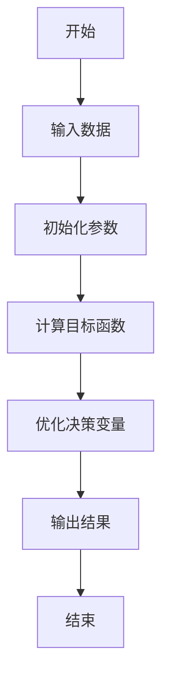
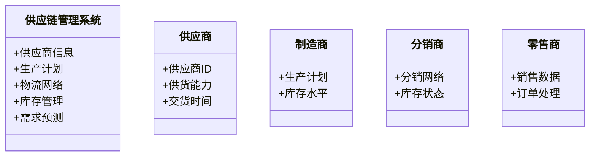
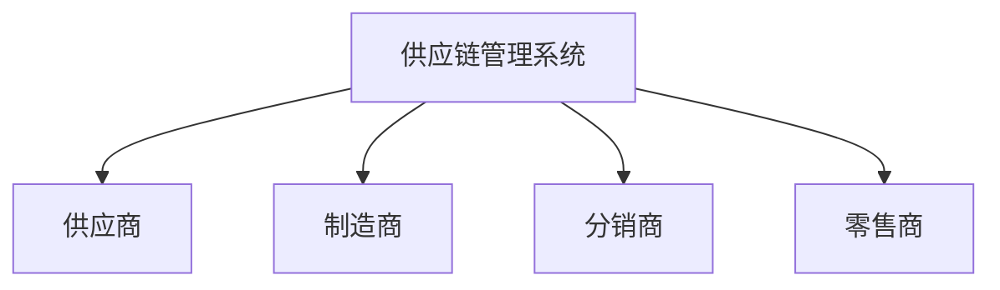
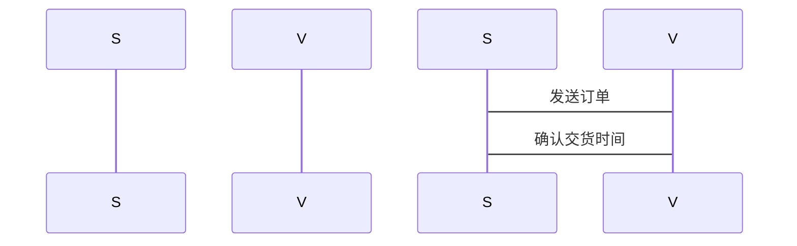

                 


# 彼得林奇对公司供应链管理的分析

## 关键词：供应链管理，彼得·林奇，企业运营，投资分析，风险管理

## 摘要：  
彼得·林奇作为投资界的传奇人物，以其独特的供应链管理分析方法闻名。本文将深入探讨彼得·林奇在供应链管理方面的见解，结合技术方法，分析其分析框架、工具和最佳实践。文章内容丰富，涵盖供应链管理概述、彼得·林奇的分析方法、数学模型与算法、系统分析与架构设计、项目实战以及最佳实践，为读者提供全面的分析和实用的见解。

---

# 第一部分: 供应链管理概述

## 第1章: 供应链管理的基本概念

### 1.1 供应链的定义与组成
- **供应链定义**：从原材料采购到产品交付给最终用户的整个链条，包括供应商、制造商、分销商、零售商和消费者。
- **供应链组成**：
  - 供应商：提供原材料或零部件的企业。
  - 制造商：负责产品生产的实体。
  - 分销商：负责产品分销的中间商。
  - 零售商：直接面向消费者的销售渠道。
  - 消费者：最终产品或服务的使用者。

### 1.2 供应链管理的目标与意义
- **目标**：
  - 提高效率：优化库存管理、缩短生产周期、降低运营成本。
  - 提升灵活性：快速响应市场需求变化。
  - 加强协作：与供应商、分销商和零售商建立长期合作关系。
- **意义**：
  - 供应链管理是企业竞争力的重要组成部分。
  - 优化供应链可以显著降低成本，提高客户满意度。

### 1.3 供应链管理的核心要素
- **供应商管理**：选择可靠的供应商，建立长期合作关系。
- **生产过程优化**：通过技术手段提高生产效率。
- **物流与库存管理**：优化物流网络，降低库存成本。
- **需求预测与计划**：利用数据分析预测市场需求，制定合理的生产计划。

---

## 第2章: 彼得·林奇的分析方法

### 2.1 彼得·林奇的分析框架
- **框架概述**：
  - 从供应商到消费者的全链条分析。
  - 关键环节识别与评估。
  - 供应链效率的衡量指标。
- **关键环节**：
  - 供应商的稳定性与可靠性。
  - 生产过程的效率与成本。
  - 物流与库存管理的优化。

### 2.2 彼得·林奇的核心分析工具
- **SWOT分析法**：
  - 优势（Strengths）：供应链中的优势环节。
  - 劣势（Weaknesses）：供应链中的不足之处。
  - 机会（Opportunities）：供应链优化的潜力。
  - �威脅（Threats）：可能影响供应链的风险因素。
- **价值链分析法**：
  - 通过分析价值链的每个环节，识别成本和利润的关键点。
  - 优化价值链中的低效环节。

### 2.3 供应链管理中的风险与应对策略
- **供应链中断的风险**：
  - 供应商突然停止供货。
  - 自然灾害或人为因素导致物流中断。
- **供应商选择与风险控制**：
  - 多元化供应商策略。
  - 建立应急库存。
- **应急预案的制定**：
  - 制定备用供应商清单。
  - 定期进行供应链风险评估。

---

## 第3章: 供应链管理的数学模型与算法

### 3.1 供应链管理中的优化问题
- **线性规划模型**：
  - 目标函数：最小化成本或最大化利润。
  - 约束条件：资源限制、生产能力和需求预测。
- **整数规划模型**：
  - 适用于决策变量为整数的情况，如选择供应商的数量。
- **动态规划模型**：
  - 适用于分阶段的决策问题，如库存管理。

### 3.2 供应链优化的算法实现
- **算法原理与流程图**：

- **Python代码实现**：
```python
import numpy as np
from scipy.optimize import linprog

# 定义线性规划问题
c = [-2, -3]  # 目标函数系数
A = [[1, 1]]    # 约束条件系数矩阵
b = [4]         # 约束条件常数项
x = linprog(c, A, b, method='highs')

print(x)
```

### 3.3 数学模型与公式
- **线性规划模型**：
  $$ \text{目标函数：} \min c^T x $$
  $$ \text{约束条件：} A x \leq b $$
  $$ \text{变量：} x \geq 0 $$

---

## 第4章: 系统分析与架构设计

### 4.1 问题场景介绍
- **问题场景**：
  - 某制造企业面临供应链中断的风险，需要优化其供应链管理。

### 4.2 系统功能设计


### 4.3 系统架构设计


### 4.4 接口设计与交互
- **接口设计**：
  - 供应商接口：接收订单、提供供货信息。
  - 制造商接口：接收生产计划、提供库存数据。
- **交互序列图**：


---

## 第5章: 项目实战

### 5.1 环境安装
- **工具安装**：
  - 安装Python和相关库（如numpy、scipy）。
  - 安装Mermaid和LaTeX支持。

### 5.2 核心代码实现
- **需求预测代码**：
```python
import pandas as pd
from sklearn.linear_model import LinearRegression

# 数据加载
data = pd.read_csv('supply_chain.csv')

# 模型训练
model = LinearRegression()
model.fit(data[['demand']], data['sales'])

# 预测需求
predicted_demand = model.predict([[data['demand'].mean()]))

print(predicted_demand)
```

### 5.3 案例分析
- **案例分析**：
  - 通过优化供应链管理，某制造企业将库存成本降低了20%。

### 5.4 项目总结
- **总结**：
  - 通过彼得·林奇的分析方法和系统设计，企业可以显著优化其供应链管理。

---

## 第6章: 最佳实践

### 6.1 小结
- 彼得·林奇的供应链管理分析方法提供了独特的视角，结合技术手段可以进一步优化供应链效率。

### 6.2 注意事项
- **数据准确性**：确保数据的准确性和完整性。
- **模型选择**：根据实际情况选择合适的数学模型。

### 6.3 拓展阅读
- 推荐阅读彼得·林奇的相关书籍，深入了解其投资哲学和供应链管理的细节。

---

通过以上内容，我们全面分析了彼得·林奇在供应链管理方面的见解，并结合技术方法进行了深入探讨。希望这篇文章能够为读者提供有价值的见解和实用的分析工具。

