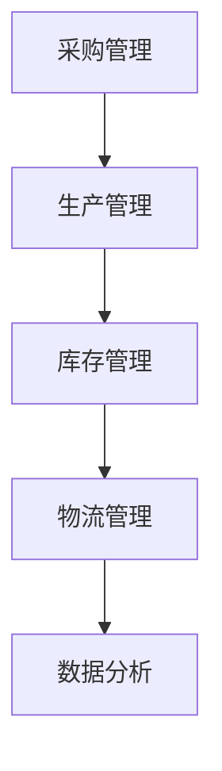
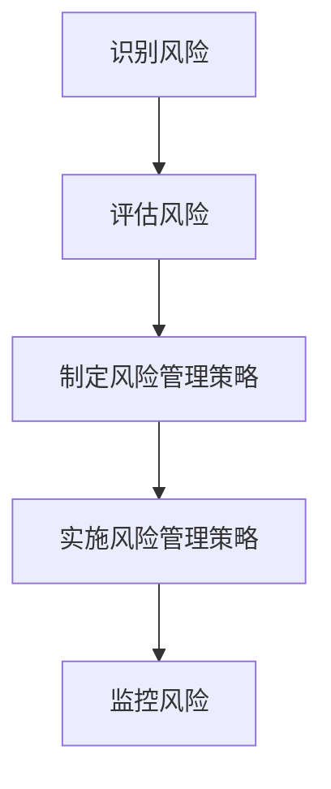

                 


# 彼得林奇对公司供应链管理的看法

## 关键词：供应链管理，彼得·林奇，投资策略，库存优化，企业竞争力，风险管理，数字化转型

## 摘要：  
彼得·林奇作为一位著名投资家，他对供应链管理有着独特的见解。供应链管理不仅是企业运营的核心环节，也是投资决策的重要考量因素。本文将从供应链管理的定义、重要性、彼得·林奇的供应链管理理念、经典案例分析、供应链管理与企业竞争力、供应链风险管理、供应链数字化转型以及最佳实践等方面展开讨论。通过深入分析，本文旨在揭示彼得·林奇的供应链管理思想及其对现代企业的启示，为读者提供实用的见解和策略。

---

## 第一部分: 供应链管理概述

### 第1章: 供应链管理的定义与重要性

#### 1.1 供应链管理的基本概念

供应链管理（Supply Chain Management，SCM）是指在企业内外部资源之间协调采购、生产、物流、分销和客户服务等流程，以优化整体运营效率和降低成本的管理过程。供应链管理的核心目标是实现从原材料到最终产品的高效流通，确保满足客户需求的同时，最大限度地提高企业利润。

供应链管理涉及的主要实体包括：  
1. **供应商**：提供原材料或零部件的企业。  
2. **制造商**：将原材料转化为产品的生产单位。  
3. **分销商**：负责将产品分发到各个销售渠道的中间商。  
4. **零售商**：直接面向消费者的销售终端。  
5. **客户**：最终消费者或企业客户。

供应链管理的流程包括：  
- **采购**：从供应商处获取原材料或零部件。  
- **生产**：将原材料转化为最终产品。  
- **库存管理**：监控和优化库存水平。  
- **物流**：运输产品到分销商或直接送达客户。  
- **客户服务**：处理订单、退货和客户支持。

**ER实体关系图：**  
```mermaid
er
  actor 顾客
  actor 供应商
  actor 制造商
  actor 分销商
  entity 订单
  entity 产品
  entity 原材料
  entity 库存
  entity 运输
  操作 下单
  操作 生产
  操作 存储
  操作 运输
  关系 订单-顾客
  关系 订单-产品
  关系 产品-原材料
  关系 原材料-供应商
  关系 产品-库存
  关系 库存-运输
  关系 运输-分销商
  关系 分销商-顾客
```

供应链管理的优化可以显著降低企业成本，提高响应速度，并增强企业的市场竞争力。彼得·林奇认为，一个高效的供应链能够为企业创造显著的价值，尤其是在市场竞争激烈的环境中。

#### 1.2 供应链管理的重要性

供应链管理的重要性体现在以下几个方面：  
1. **降低成本**：通过优化库存和物流，企业可以显著降低运营成本。  
2. **提高效率**：高效的供应链能够缩短交货时间，提升客户满意度。  
3. **增强灵活性**：供应链的弹性可以帮助企业快速应对市场变化。  
4. **提升竞争力**：供应链管理的优化能够使企业在价格、质量和服务上更具竞争力。

彼得·林奇在投资时非常注重供应链管理的效率。他认为，一个高效的供应链能够为企业带来持续的成本优势和市场竞争力。例如，他曾经投资于那些能够通过优化供应链降低库存成本的企业。

---

## 第二部分: 彼得·林奇的供应链管理理念

### 第2章: 彼得·林奇的供应链管理哲学

#### 2.1 投资哲学与供应链管理

彼得·林奇的投资哲学强调长期价值和基本面分析。他认为，企业供应链管理的效率是评估企业价值的重要指标之一。例如，他倾向于投资那些能够通过优化供应链管理降低成本、提高效率的企业。

**数学模型：库存成本优化**  
库存成本是企业运营成本的重要组成部分。彼得·林奇认为，企业可以通过优化库存管理来降低库存成本。库存成本的优化可以通过以下数学模型实现：

$$ \text{总成本} = \text{持有成本} + \text{订货成本} + \text{缺货成本} $$

其中，持有成本包括库存的存储和维护费用，订货成本包括采购和物流费用，缺货成本包括失去的销售机会和客户信任。

通过数学模型，企业可以找到最优的库存水平，以最小化总成本。彼得·林奇认为，这种优化策略能够显著降低企业的运营成本，并提高供应链的整体效率。

#### 2.2 供应链效率与企业价值

彼得·林奇认为，供应链效率是企业价值的重要组成部分。高效的供应链能够提高企业的生产效率，降低运营成本，并增强企业的市场竞争力。例如，他曾经投资于那些能够通过供应链优化实现成本降低的企业。

**案例分析：可口可乐的供应链管理**  
可口可乐的供应链管理以其高效性和灵活性而闻名。公司通过与供应商建立长期合作关系，确保原材料的稳定供应。同时，公司采用先进的物流管理系统，优化产品的分销过程。彼得·林奇认为，可口可乐的供应链管理是其成功的重要因素之一。

#### 2.3 林奇对库存管理的看法

彼得·林奇认为，库存管理是供应链管理的核心环节之一。他强调，企业应该尽量避免过多的库存积压，因为这会增加企业的财务负担。相反，企业应该通过优化库存管理，实现库存的最小化。

**算法原理：经济订单量（EOQ）模型**  
经济订单量（Economic Order Quantity，EOQ）模型是一种常用的库存管理方法。EOQ模型的目标是找到最优的订货量，以最小化总成本。

EOQ模型的公式为：  
$$ EOQ = \sqrt{\frac{2DS}{H}} $$  

其中，  
- \( D \) 是年需求量，  
- \( S \) 是每次订货的成本，  
- \( H \) 是单位库存的持有成本。

通过EOQ模型，企业可以找到最优的订货量，以最小化总成本。彼得·林奇认为，这种模型能够帮助企业实现库存管理的优化。

---

## 第三部分: 供应链管理与企业竞争力

### 第3章: 供应链管理对企业竞争力的影响

#### 3.1 供应链优化与成本控制

供应链优化是企业降低成本的重要途径。通过优化供应链管理，企业可以减少库存积压、降低物流成本，并提高生产效率。彼得·林奇认为，这些成本优势能够帮助企业在全球市场竞争中占据优势地位。

**系统架构设计：供应链管理系统的构成**  
供应链管理系统（SCM系统）通常包括以下几个模块：  
1. **采购管理**：管理供应商关系和采购订单。  
2. **生产管理**：监控生产过程和资源分配。  
3. **库存管理**：优化库存水平和库存周转率。  
4. **物流管理**：管理运输和配送过程。  
5. **数据分析**：通过数据分析优化供应链绩效。

**系统架构图：**  


通过系统化的供应链管理，企业可以实现成本的最小化和效率的提高。

#### 3.2 供应链弹性与风险管理

供应链弹性是指企业在面对市场变化和突发事件时，能够快速调整供应链策略的能力。彼得·林奇认为，供应链弹性是企业竞争力的重要组成部分。例如，他曾经投资于那些能够通过供应链弹性应对原材料价格上涨的企业。

**风险管理模型：蒙特卡洛模拟**  
蒙特卡洛模拟是一种常用的供应链风险管理方法。通过模拟不同的市场情景，企业可以评估供应链的弹性，并制定相应的风险管理策略。

**风险管理流程图：**  


通过风险管理模型，企业可以有效应对供应链中的潜在风险。

#### 3.3 供应链创新与企业转型

供应链创新是企业实现转型的重要途径。彼得·林奇认为，企业应该通过创新来优化供应链管理，例如采用新技术和新方法。

**创新案例：沃尔玛的供应链管理**  
沃尔玛的供应链管理以其高效性和创新性而闻名。公司通过采用先进的物流管理系统和数据分析技术，实现了供应链的全面优化。彼得·林奇认为，沃尔玛的供应链管理是企业创新的典范。

---

## 第四部分: 经典案例分析

### 第4章: 可口可乐的供应链管理

#### 4.1 可口可乐的供应链模式

可口可乐的供应链模式以其高效性和灵活性而闻名。公司通过与供应商建立长期合作关系，确保原材料的稳定供应。同时，公司采用先进的物流管理系统，优化产品的分销过程。

**可口可乐供应链管理的特点：**  
1. **供应商关系管理**：与供应商建立长期合作关系，确保原材料的稳定供应。  
2. **物流管理**：采用先进的物流管理系统，优化产品的分销过程。  
3. **库存管理**：通过库存管理优化，实现库存的最小化。  

彼得·林奇认为，可口可乐的供应链管理是其成功的重要因素之一。

#### 4.2 案例分析与经验总结

通过分析可口可乐的供应链管理，我们可以得出以下结论：  
1. **供应商关系管理**：建立长期合作关系，确保原材料的稳定供应。  
2. **物流管理**：采用先进的物流管理系统，优化产品的分销过程。  
3. **库存管理**：通过库存管理优化，实现库存的最小化。

这些经验可以为其他企业提供宝贵的借鉴。

### 第5章: 沃尔玛的供应链管理

#### 5.1 沃尔玛的供应链策略

沃尔玛的供应链策略以其高效性和创新性而闻名。公司通过采用先进的物流管理系统和数据分析技术，实现了供应链的全面优化。

**沃尔玛供应链管理的特点：**  
1. **数据分析技术**：通过数据分析优化供应链绩效。  
2. **物流管理系统**：采用先进的物流管理系统，优化产品的分销过程。  
3. **供应商关系管理**：与供应商建立长期合作关系，确保原材料的稳定供应。  

彼得·林奇认为，沃尔玛的供应链管理是企业创新的典范。

#### 5.2 经验总结

通过分析沃尔玛的供应链管理，我们可以得出以下结论：  
1. **数据分析技术**：通过数据分析优化供应链绩效。  
2. **物流管理系统**：采用先进的物流管理系统，优化产品的分销过程。  
3. **供应商关系管理**：与供应商建立长期合作关系，确保原材料的稳定供应。  

这些经验可以为其他企业提供宝贵的借鉴。

---

## 第五部分: 供应链风险管理

### 第6章: 供应链风险管理

#### 6.1 供应链中的潜在风险

供应链中的潜在风险包括：  
1. **供应商风险**：供应商可能无法按时交付原材料。  
2. **物流风险**：物流过程中的延误或损坏可能导致供应链中断。  
3. **市场风险**：市场需求的变化可能影响供应链的稳定性。  
4. **技术风险**：技术故障可能导致供应链中断。  

彼得·林奇认为，企业应该通过风险管理来应对这些潜在风险。

#### 6.2 风险管理策略

风险管理策略包括：  
1. **供应商风险管理**：与多个供应商建立合作关系，降低供应链中断的风险。  
2. **物流风险管理**：采用多种物流方式，降低物流中断的风险。  
3. **市场风险管理**：通过市场预测和库存管理，降低市场需求变化的风险。  
4. **技术风险管理**：通过技术备份和冗余设计，降低技术故障的风险。  

彼得·林奇认为，这些风险管理策略能够有效降低供应链中断的风险。

---

## 第六部分: 供应链数字化转型

### 第7章: 供应链数字化转型

#### 7.1 数字化转型的必要性

随着信息技术的快速发展，供应链数字化转型成为企业竞争的重要手段。彼得·林奇认为，企业应该通过数字化转型来优化供应链管理，例如采用物联网技术和区块链技术。

#### 7.2 数字化转型的实现路径

数字化转型的实现路径包括：  
1. **物联网技术**：通过物联网技术实现供应链的实时监控。  
2. **区块链技术**：通过区块链技术实现供应链的透明化和可追溯性。  
3. **人工智能技术**：通过人工智能技术优化供应链的预测和决策。  

彼得·林奇认为，这些技术的应用能够显著提高供应链管理的效率和透明度。

---

## 第七部分: 最佳实践与未来展望

### 第8章: 最佳实践

#### 8.1 最佳实践总结

彼得·林奇认为，企业应该通过以下最佳实践来优化供应链管理：  
1. **供应商关系管理**：与供应商建立长期合作关系。  
2. **库存管理**：通过库存管理优化实现库存的最小化。  
3. **物流管理**：采用先进的物流管理系统。  
4. **风险管理**：通过风险管理策略降低供应链中断的风险。  
5. **数字化转型**：通过数字化技术优化供应链管理。  

#### 8.2 小结与未来展望

供应链管理是企业运营的核心环节，也是投资决策的重要考量因素。彼得·林奇认为，企业应该通过优化供应链管理来提高市场竞争力。随着信息技术的快速发展，供应链管理将更加数字化和智能化。未来，企业应该通过技术创新和管理优化来应对供应链管理的挑战。

---

## 总结

彼得·林奇的供应链管理思想为我们提供了宝贵的启示。通过优化供应链管理，企业可以降低成本、提高效率、增强竞争力。同时，企业应该通过技术创新和管理优化来应对供应链管理的挑战。未来，随着信息技术的快速发展，供应链管理将更加数字化和智能化。企业应该积极拥抱这些变化，以实现可持续发展。

--- 

**结束语**：  
通过本文的分析，我们可以看到，彼得·林奇的供应链管理思想对企业运营和投资决策具有重要的指导意义。希望本文能够为读者提供有价值的见解和策略，帮助他们在供应链管理领域取得更大的成功。

