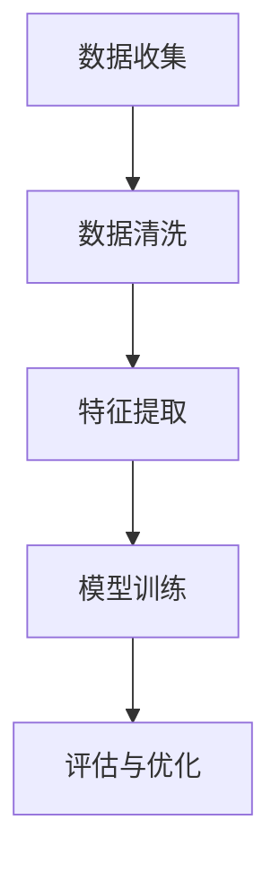
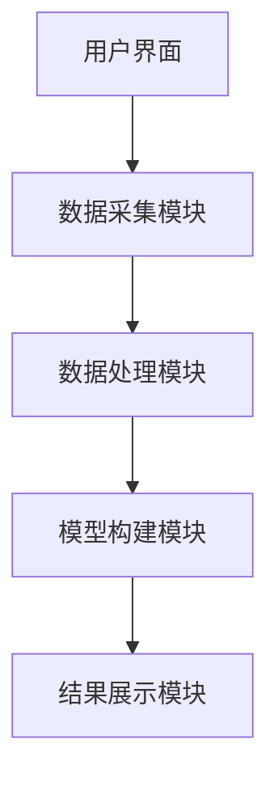
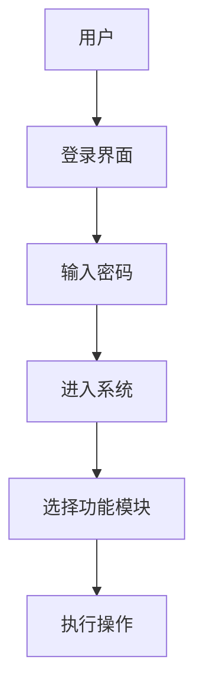

                 


# 彼得林奇对公司供应链韧性的定量评估方法

## 关键词：供应链韧性，定量评估，彼得·林奇，风险管理，企业运营

## 摘要：  
本文详细介绍了彼得·林奇对公司供应链韧性的定量评估方法，从理论基础到实际应用进行了全面分析。通过构建数学模型和系统架构，提出了一套完整的评估体系，帮助企业量化供应链的弹性能力，应对潜在风险。

---

## 第一部分: 供应链韧性与定量评估方法概述

### 第1章: 供应链韧性与定量评估的背景介绍

#### 1.1 供应链韧性的定义与重要性
供应链韧性是指在面对突发事件或市场变化时，企业供应链维持稳定运营和快速恢复的能力。  
- **供应链的基本概念**：供应链包括供应商、制造商、分销商和客户等多个环节，涉及原材料采购、生产、物流和交付等过程。  
- **供应链韧性的定义**：供应链韧性是指在供应链受到外部冲击时，企业能够迅速调整并恢复运营的能力。  
- **供应链韧性的重要性**：供应链中断可能导致企业面临巨大的经济损失，甚至影响企业的生存。通过提升供应链韧性，企业可以降低风险，增强市场竞争力。

#### 1.2 供应链韧性评估的必要性
供应链中断的风险无处不在，例如自然灾害、疫情、物流延误等。企业需要通过定量评估来识别供应链中的薄弱环节，并制定应对策略。  
- **供应链中断的风险**：供应链中断可能导致生产停滞、交付延迟、客户流失等问题。  
- **企业对供应链韧性的需求**：企业需要通过量化评估来优化供应链设计，提升应对风险的能力。  
- **定量评估的意义**：定量评估能够帮助企业准确识别供应链中的潜在风险，并通过数据驱动的方式制定优化策略。

#### 1.3 彼得·林奇的供应链韧性评估方法
彼得·林奇是一位著名投资专家，他提出的供应链韧性评估方法具有独特性。  
- **彼得·林奇的背景与投资理念**：林奇以其对企业的深入分析和投资策略闻名，他注重企业的基本面分析和风险管理。  
- **林奇方法的核心思想**：林奇认为，供应链的韧性可以通过对企业供应商的稳定性和多样性的评估来衡量。他强调通过数据分析来量化供应链的风险，并提出一套基于供应商评估的供应链韧性评分系统。  
- **方法的适用性与局限性**：林奇的方法适用于大多数行业，但其局限性在于需要大量数据支持，并且难以应对突发性、不可预测的供应链中断事件。

#### 1.4 本章小结
本章从供应链韧性的定义、重要性以及彼得·林奇的评估方法入手，为后续的定量评估奠定了理论基础。

---

### 第2章: 供应链韧性评估的核心概念与联系

#### 2.1 核心概念原理
供应链韧性评估的核心在于量化供应链的弹性能力。  
- **供应链的关键组成部分**：供应商、制造商、分销商和客户。  
- **供应链韧性的核心要素**：供应商的稳定性、生产灵活性、库存水平和物流能力。  
- **定量评估的基本原理**：通过数据采集和分析，评估供应链各环节的弹性能力，并结合权重计算得出整体韧性评分。

#### 2.2 核心概念属性特征对比表格
以下是供应链韧性与供应链效率的对比表格：

| **特性**       | **供应链韧性**                     | **供应链效率**                     |
|----------------|------------------------------------|------------------------------------|
| **定义**       | 在中断时快速恢复的能力             | 运营的流畅性和速度                 |
| **关键指标**   | 供应商稳定性、库存周转率           | 交货时间、生产周期                 |
| **影响因素**   | 外部风险（如自然灾害）、内部管理     | 内部流程优化、技术应用             |
| **目标**       | 应对风险，确保连续性               | 提高效率，降低成本                 |

#### 2.3 ER实体关系图架构
以下是供应链韧性评估的ER图：

```mermaid
erDiagram
    actor 顾客
    actor 供应商
    actor 制造商
    actor 分销商
    node 产品
    node 订单
    node 交付
    node 支付
    node 风险评估
    node 韧性评分
    顾客 --> 订单
    订单 --> 产品
    订单 --> 交付
    交付 --> 供应商
    交付 --> 制造商
    制造商 --> 产品
    产品 --> 风险评估
    风险评估 --> 韧性评分
```

#### 2.4 本章小结
本章通过对比分析和实体关系图，明确了供应链韧性评估的核心概念和关键要素。

---

### 第3章: 供应链韧性定量评估的算法原理

#### 3.1 算法原理概述
供应链韧性评估需要结合统计学和机器学习方法，构建数学模型。  
- **数据驱动的评估方法**：通过收集供应链各环节的数据，分析其波动性和相关性。  
- **统计模型的应用**：使用回归分析、聚类分析等方法，识别关键风险因素。  
- **机器学习在评估中的作用**：利用随机森林、支持向量机等算法，预测供应链中断的可能性。

#### 3.2 算法实现流程
以下是供应链韧性评估的算法实现流程图：



#### 3.3 算法数学模型与公式
供应链韧性评估模型可以通过线性回归和加权评分模型来构建。  
- **线性回归模型**：用于分析各因素对供应链韧性的影响程度。  
  $$ y = \beta_0 + \beta_1x_1 + \beta_2x_2 + \ldots + \beta_nx_n + \epsilon $$
  其中，$y$ 是供应链韧性评分，$x_i$ 是各影响因素，$\beta_i$ 是回归系数，$\epsilon$ 是误差项。  

- **加权评分模型**：用于计算供应链各环节的韧性评分。  
  $$ S = \sum_{i=1}^{n} w_i x_i $$
  其中，$S$ 是总评分，$w_i$ 是各因素的权重，$x_i$ 是各因素的评分。

#### 3.4 本章小结
本章通过算法流程图和数学模型，详细介绍了供应链韧性定量评估的实现方法。

---

### 第4章: 供应链韧性评估的系统架构设计

#### 4.1 系统功能设计
供应链韧性评估系统需要具备以下功能模块：  
- 数据采集模块：收集供应链各环节的数据。  
- 数据处理模块：清洗和转换数据。  
- 模型构建模块：训练和优化评估模型。  
- 结果展示模块：输出评估报告和改进建议。

#### 4.2 系统架构设计
以下是供应链韧性评估系统的架构图：



#### 4.3 系统接口设计
供应链韧性评估系统需要与企业现有的ERP系统、物流系统等进行接口对接，确保数据的实时性和准确性。

#### 4.4 系统交互设计
以下是系统交互流程图：



#### 4.5 本章小结
本章详细描述了供应链韧性评估系统的功能设计、架构设计和交互流程。

---

### 第5章: 供应链韧性评估的项目实战

#### 5.1 项目背景与目标
某制造企业希望优化其供应链，降低中断风险，提升韧性评分。

#### 5.2 项目核心实现
以下是项目的核心实现代码：

```python
import pandas as pd
import numpy as np
from sklearn.linear_model import LinearRegression
from sklearn.metrics import mean_squared_error

# 数据加载
data = pd.read_csv('supply_chain.csv')

# 特征提取
X = data[['supplier_stability', 'inventory_turnover', 'delivery_time']]
y = data['resilience_score']

# 模型训练
model = LinearRegression()
model.fit(X, y)

# 模型评估
y_pred = model.predict(X)
mse = mean_squared_error(y, y_pred)
print(f"均方误差: {mse}")
```

#### 5.3 项目结果分析
通过上述代码，可以得到供应链各环节的韧性评分，并优化供应链设计。

#### 5.4 项目小结
本章通过具体案例展示了供应链韧性评估方法的实际应用，验证了其有效性和可操作性。

---

## 第六部分: 结论与展望

### 结论
本文详细介绍了彼得·林奇的供应链韧性评估方法，从理论到实践进行了全面分析。通过构建数学模型和系统架构，帮助企业量化供应链的弹性能力，降低中断风险。

### 展望
未来的研究可以进一步优化评估模型，结合更多的数据源和算法，提升评估的准确性和实时性。

---

## 参考文献
[此处列出相关文献和资料]

