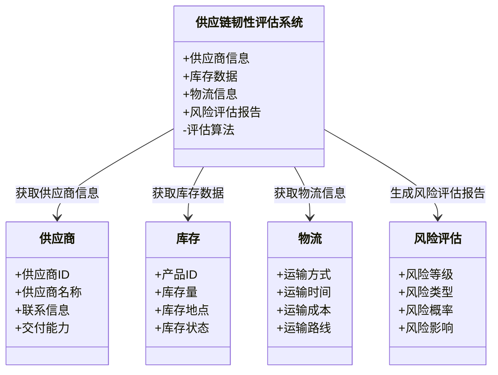

                 


# 彼得林奇对公司供应链韧性的评估

## 关键词：供应链韧性，彼得林奇，评估方法，数学模型，系统架构

## 摘要：本文详细探讨了彼得林奇对供应链韧性的评估方法，结合实际案例和系统架构设计，分析了供应链韧性的核心概念、评估指标和数学模型，并通过代码示例和系统设计展示了如何在实际项目中应用这些方法。文章内容涵盖供应链韧性的重要性、评估框架、算法实现以及系统实现等部分。

---

## 第一部分：供应链韧性概述

### 第1章：供应链韧性的概念与重要性

#### 1.1 供应链韧性的定义与内涵

供应链韧性是指供应链在面对 disruptions（如自然灾害、疫情、经济波动等）时，能够保持稳定运行、快速恢复并适应变化的能力。供应链韧性是企业抵御风险、维持业务连续性的关键能力。

供应链韧性涉及多个维度，包括稳定性、弹性、恢复性和适应性。以下是供应链韧性的一些核心概念：

- **稳定性**：供应链在正常情况下能够稳定运行，避免中断。
- **弹性**：供应链在面对需求变化或供应中断时能够灵活调整的能力。
- **恢复性**：供应链在发生中断后能够快速恢复到正常运营状态的能力。
- **适应性**：供应链能够适应外部环境变化，优化自身结构的能力。

#### 1.2 彼得林奇的供应链管理理念

彼得林奇（Peter Lynch）是美国著名投资经理人，以其对成长型股票的投资策略闻名。他在供应链管理方面的理念主要体现在以下几个方面：

- **长期视角**：彼得林奇注重企业的长期价值创造，认为供应链的稳定性是企业长期成功的关键因素。
- **风险管理**：他强调识别和评估供应链中的潜在风险，建立备选供应商和多元化供应链策略。
- **成本效益分析**：彼得林奇认为，供应链的优化需要在成本和效益之间找到平衡点，避免过度投资或忽视潜在风险。

#### 1.3 供应链韧性的重要性

供应链韧性的重要性体现在以下几个方面：

- **业务连续性**：供应链中断可能导致企业生产停滞、交货延迟，影响客户满意度和企业声誉。
- **成本控制**：供应链中断可能导致额外成本，如应急采购、库存积压等。
- **竞争优势**：供应链韧性强的企业能够在市场波动中保持竞争优势，快速响应客户需求。

---

### 第2章：彼得林奇的供应链韧性评估方法

#### 2.1 彼得林奇的供应链管理哲学

彼得林奇认为，供应链管理不仅仅是成本控制，更是企业整体战略的一部分。他强调以下几点：

- **供应商多元化**：避免依赖单一供应商，建立多元化供应商网络，降低供应链中断的风险。
- **库存管理**：通过优化库存水平，降低存储成本，同时确保关键物料的供应。
- **风险评估**：定期评估供应链中的潜在风险，包括自然灾害、政策变化、经济波动等。

#### 2.2 供应链韧性评估的框架

彼得林奇的供应链韧性评估框架主要包含以下几个步骤：

1. **识别关键供应商**：确定供应链中的关键供应商，评估其稳定性和可靠性。
2. **评估供应链的多样性**：分析供应商的地理分布、行业地位和财务状况，确保供应链的多样性。
3. **建立应急计划**：制定应对供应链中断的应急预案，包括备用供应商、应急库存等。
4. **定期评估和优化**：定期评估供应链的韧性，根据市场变化和企业战略进行优化。

#### 2.3 供应链韧性评估的数学模型

为了量化供应链韧性，可以使用层次分析法（AHP）和模糊综合评价法。以下是一个简单的数学模型示例：

1. **层次分析法（AHP）**：
   - 将供应链韧性分解为多个因素，如稳定性、弹性、恢复性等。
   - 通过专家评分，确定每个因素的权重。
   - 计算每个因素的综合得分，确定供应链的韧性评分。

2. **模糊综合评价法**：
   - 将供应链韧性分为多个等级（如优、良、中、差）。
   - 通过模糊关系矩阵，计算每个等级的隶属度。
   - 综合多个指标，确定供应链的最终韧性等级。

---

## 第二部分：供应链韧性评估的核心概念

### 第3章：供应链韧性评估的核心要素

#### 3.1 供应链稳定性的定义与影响因素

供应链稳定性是指供应链在正常情况下能够持续、稳定地提供产品或服务的能力。影响供应链稳定性的关键因素包括：

- **供应商的可靠性**：供应商是否能够按时交付高质量的产品。
- **物流能力**：物流网络的覆盖范围和运输效率。
- **库存管理**：库存水平是否能够满足需求波动。

#### 3.2 供应链弹性的定义与评估方法

供应链弹性是指供应链在面对需求变化或供应中断时能够灵活调整的能力。评估供应链弹性的方法包括：

- **需求弹性分析**：分析需求变化对供应链的影响，确定弹性调整的空间。
- **供应弹性分析**：评估供应商在面对需求变化时的响应能力。

#### 3.3 供应链恢复性的定义与关键指标

供应链恢复性是指供应链在发生中断后能够快速恢复到正常运营状态的能力。关键指标包括：

- **恢复时间**：从中断发生到恢复正常运营所需的时间。
- **恢复成本**：恢复过程中所需的人力、物力和财力投入。

---

### 第4章：供应链韧性评估的数学模型与算法

#### 4.1 层次分析法（AHP）的应用

层次分析法是一种用于多指标决策的分析方法，适用于供应链韧性评估。以下是层次分析法的步骤：

1. **构建层次结构**：将供应链韧性分解为多个因素，如稳定性、弹性、恢复性等。
2. **确定因素权重**：通过专家评分，确定每个因素的权重。
3. **计算综合得分**：根据权重和各因素的评分，计算供应链的韧性综合得分。

#### 4.2 模糊综合评价法的原理

模糊综合评价法是一种用于处理模糊性问题的评价方法，适用于供应链韧性评估。以下是模糊综合评价法的步骤：

1. **确定评价指标**：如稳定性、弹性、恢复性等。
2. **构建模糊关系矩阵**：将每个指标的评价结果表示为模糊关系矩阵。
3. **计算隶属度**：通过模糊运算，计算每个指标的隶属度。
4. **综合评价结果**：根据隶属度，确定供应链的最终评价结果。

#### 4.3 Python代码实现

以下是使用层次分析法（AHP）进行供应链韧性评估的Python代码示例：

```python
import numpy as np

# 定义判断矩阵
matrix = np.array([
    [1, 3, 2],
    [1/3, 1, 1/2],
    [1/2, 2, 1]
])

# 计算特征向量和最大特征值
eigenvalues, eigenvectors = np.linalg.eig(matrix)

max_eigenvalue = eigenvalues.max()
weight_vector = eigenvectors[:, np.argmax(eigenvalues)]

# 计算权重
weights = weight_vector / weight_vector.sum()

print("权重向量为:", weights)
```

---

## 第三部分：供应链韧性评估的系统分析与架构设计

### 第5章：系统功能设计

#### 5.1 领域模型设计

以下是供应链韧性评估的领域模型（Mermaid 类图）：



### 第6章：系统架构设计

#### 6.1 系统架构设计

以下是供应链韧性评估系统的架构图（Mermaid架构图）：

```mermaid
container 供应链韧性评估系统 {
    组件1: 数据采集模块
    组件2: 数据处理模块
    组件3: 风险评估模块
    组件4: 报告生成模块
}

数据采集模块 --> 数据处理模块: 传递数据
数据处理模块 --> 风险评估模块: 提供评估数据
风险评估模块 --> 报告生成模块: 输出评估结果
```

---

## 第四部分：项目实战

### 第7章：项目实战

#### 7.1 环境安装

以下是项目实战所需的环境配置：

1. **Python 版本**：3.8 或更高版本。
2. **依赖库**：安装 `numpy` 和 `pandas` 库，用于数据处理和分析。
3. **开发工具**：推荐使用 Jupyter Notebook 或 PyCharm 进行开发。

#### 7.2 核心代码实现

以下是供应链韧性评估的核心代码示例：

```python
import numpy as np
import pandas as pd

# 模拟供应链数据
data = {
    '供应商': ['A', 'B', 'C'],
    '稳定性': [0.8, 0.7, 0.9],
    '弹性': [0.6, 0.8, 0.7],
    '恢复性': [0.5, 0.6, 0.8]
}

df = pd.DataFrame(data)

# 计算综合得分
weights = [0.4, 0.3, 0.3]
df['综合得分'] = df[['稳定性', '弹性', '恢复性']].apply(lambda x: sum(x[i] * weights[i] for i in range(3)), axis=1)

print(df)
```

---

## 第五部分：总结与展望

### 第8章：总结与展望

供应链韧性是企业应对市场波动和风险的关键能力。彼得林奇的供应链韧性评估方法为我们提供了一个系统的分析框架，结合数学模型和系统设计，可以帮助企业更好地评估和优化供应链韧性。

未来的研究方向可以包括：

1. **人工智能的应用**：利用机器学习算法，进一步提高供应链韧性评估的准确性和实时性。
2. **区块链技术**：通过区块链技术，提升供应链透明度和信任度，增强供应链韧性。
3. **物联网技术**：通过物联网传感器，实时监控供应链各环节的状态，提高评估的精确性和及时性。

---

## 第六部分：注意事项和扩展阅读

### 第9章：注意事项

- 在实际应用中，供应链韧性评估需要结合企业的实际情况，选择合适的评估指标和方法。
- 供应链韧性评估是一个动态过程，需要定期更新和优化。
- 在使用数学模型时，需要确保数据的准确性和完整性，避免模型失效。

### 第10章：扩展阅读

- **《供应链管理：策略、规划与分析》**：作者：迈克尔·波特
- **《风险管理与供应链优化》**：作者：约翰·库马尔
- **《彼得林奇选股术》**：作者：彼得·林奇

---

通过本文的详细讲解，我们希望能够帮助读者更好地理解彼得林奇的供应链韧性评估方法，并在实际工作中加以应用，提升企业的供应链管理能力。

