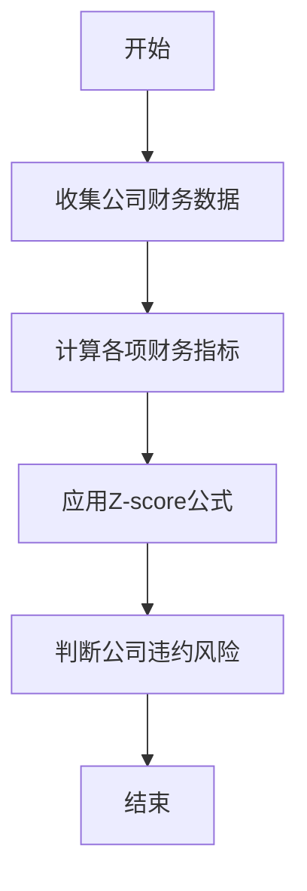
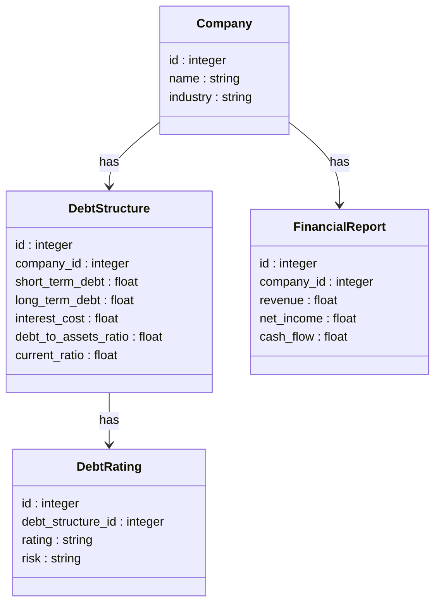
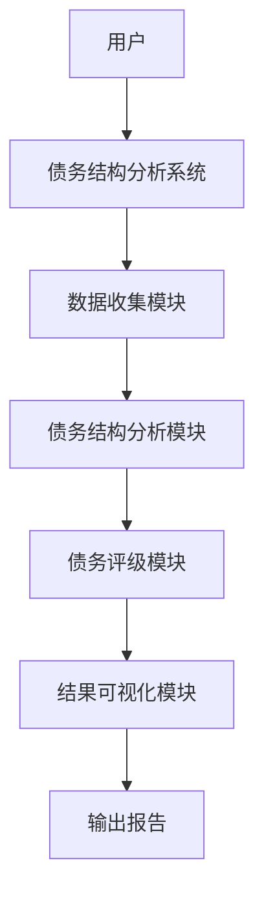
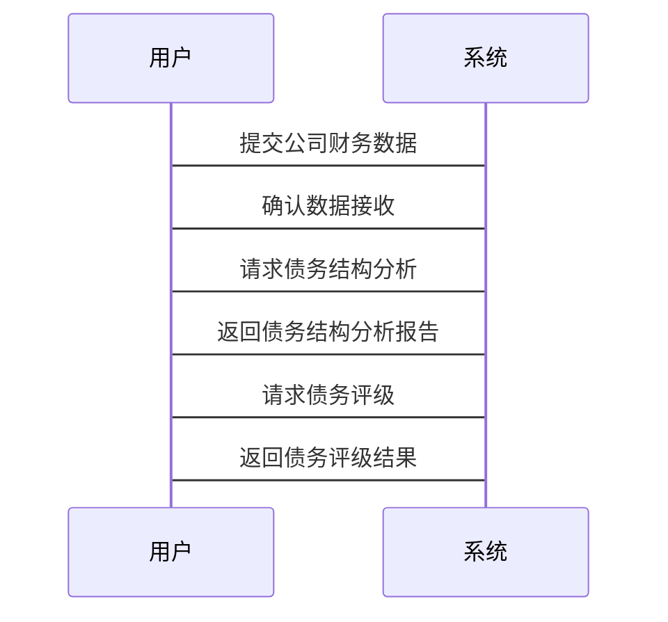

                 


# 彼得林奇对公司债务结构的分析

## 关键词：彼得·林奇，公司债务结构，财务分析，投资策略，风险管理

## 摘要：本文深入分析了彼得·林奇在公司债务结构分析中的独特见解和方法。通过结合财务报表分析、债务评级模型、系统架构设计等多维度内容，详细阐述了如何通过债务结构优化实现公司财务健康和投资价值提升。文章从债务结构的基本概念、核心概念、算法原理、系统架构设计、项目实战等多个维度展开，为投资者和公司管理者提供实用的分析工具和决策支持。

---

## 第一部分: 背景介绍

### 第1章: 公司债务结构的基本概念

#### 1.1 什么是公司债务结构

- **债务结构的定义**：公司债务结构是指公司所有债务的构成方式，包括债务的种类、规模、期限、利率等要素的组合。
- **债务结构的组成要素**：
  - 短期债务与长期债务
  - 无息债务与有息债务
  - 股权债务与债权债务
- **债务结构的重要性**：
  - 影响公司的财务健康
  - 影响投资者的决策
  - 影响债权人的权益

#### 1.2 公司债务结构的分类

- **短期债务与长期债务**：
  - 短期债务：一年内到期的债务，如应付账款、短期贷款等。
  - 长期债务：超过一年的债务，如长期债券、长期贷款等。
- **无息债务与有息债务**：
  - 无息债务：如应付账款、应付职工薪酬等，不需要支付利息。
  - 有息债务：如银行贷款、债券等，需要支付利息。
- **股权债务与债权债务**：
  - 股权债务：通过发行股票等方式筹集的资金，股东不承担偿债压力。
  - 债权债务：通过借款、发行债券等方式筹集的资金，债权人有权要求偿还。

#### 1.3 债务结构分析的意义

- **对公司的意义**：
  - 优化资本结构，降低财务风险。
  - 提高资金使用效率，降低成本。
- **对投资者的意义**：
  - 评估公司的财务健康状况。
  - 判断公司的偿债能力。
- **对债权人的意义**：
  - 确保债务的偿还能力。
  - 降低违约风险。

### 第2章: 彼得·林奇的债务结构分析方法

#### 2.1 彼得·林奇的债务结构分析背景

- **彼得·林奇的投资者背景**：
  - 美国著名基金经理，富达麦哲伦基金的传奇经理人。
  - 以基本面分析著称，注重对公司财务状况的深入研究。
- **彼得·林奇的债务结构分析理念**：
  - 债务结构是公司财务健康的重要组成部分。
  - 通过分析债务结构，评估公司的偿债能力和发展潜力。

#### 2.2 彼得·林奇债务结构分析的核心要素

- **债务规模与公司资产的匹配**：
  - 债务规模是否与公司资产规模相匹配。
  - 过高的债务可能导致公司财务负担过重。
- **债务期限与公司现金流的匹配**：
  - 短期债务需要有足够的短期现金流支持。
  - 长期债务需要有足够的长期现金流支持。
- **债务成本与公司盈利能力的匹配**：
  - 债务成本过高可能侵蚀公司利润。
  - 盈利能力弱的公司难以承担高成本的债务。

#### 2.3 彼得·林奇债务结构分析的步骤

- **收集公司财务数据**：
  - 获取公司的资产负债表、利润表、现金流量表等财务报表。
- **分析债务结构的合理性**：
  - 评估债务规模是否合理。
  - 评估债务期限是否匹配现金流。
- **评估债务结构的风险**：
  - 通过财务比率分析，评估公司的偿债能力。
  - 结合行业标准，判断债务结构是否合理。

---

## 第二部分: 核心概念与联系

### 第3章: 债务结构与财务报表的关系

#### 3.1 资产负债表与债务结构

- **资产负债表的基本结构**：
  - 资产 = 负债 + 所有者权益。
- **债务在资产负债表中的体现**：
  - 短期负债：如应付账款、短期贷款。
  - 长期负债：如长期债券、长期贷款。
- **债务结构对资产负债表的影响**：
  - 过高的短期负债可能导致流动性风险。
  - 过高的长期负债可能导致资本结构不合理。

#### 3.2 利润表与债务结构

- **利润表的基本结构**：
  - 收入 - 成本 = 毛利润。
  - 毛利润 - 费用 = 净利润。
- **债务利息对利润的影响**：
  - 高额的债务利息会侵蚀净利润。
  - 利息支出过大会影响公司的盈利能力。
- **债务结构对利润表的影响**：
  - 合理的债务结构可以降低利息支出。
  - 过高的债务利息可能使公司陷入亏损。

#### 3.3 现金流量表与债务结构

- **现金流量表的基本结构**：
  - 经营活动现金流、投资活动现金流、筹资活动现金流。
- **债务偿还对现金流的影响**：
  - 短期债务的偿还依赖于经营活动现金流。
  - 长期债务的偿还依赖于投资活动现金流。
- **债务结构对现金流的影响**：
  - 合理的债务结构可以平衡现金流。
  - 过高的短期债务可能导致现金流压力过大。

### 第4章: 债务结构分析的核心概念

#### 4.1 债务结构分析的核心要素

| 核心要素 | 定义 | 重要性 |
|----------|------|--------|
| 债务规模 | 公司总债务的金额 | 过高的债务可能导致财务负担过重 |
| 债务期限 | 债务的偿还期限 | 短期债务需要有足够的短期现金流支持 |
| 债务成本 | 债务的利率水平 | 高成本债务可能侵蚀公司利润 |

#### 4.2 债务结构分析的数学模型

- **Z-score模型**：
  - 用于预测公司违约概率。
  - 公式：Z = 1.2*(X2) + 1.4*(X3) + 3.3*(X4) + 0.6*(X5) + 1.0*(X6)
  - 其中，X2 = (流动资产/流动负债)，X3 = (流动资产/(流动资产+负债总额))，X4 = (息税折旧摊销前利润/总负债)，X5 = (市值/总负债)，X6 = (收盘价/每股账面价值)。

#### 4.3 债务结构分析的ER实体关系图

```mermaid
erDiagram
    company {
        key id : integer
        name : string
        industry : string
    }
    debt_structure {
        key id : integer
        company_id : integer
        short_term_debt : float
        long_term_debt : float
        interest_cost : float
        debt_to_assets_ratio : float
        current_ratio : float
    }
    financial_report {
        key id : integer
        company_id : integer
        revenue : float
        net_income : float
        cash_flow : float
    }
    debt_rating {
        key id : integer
        debt_structure_id : integer
        rating : string
        risk : string
    }
    company --> debt_structure : has
    company --> financial_report : has
    debt_structure --> debt_rating : has
```

---

## 第三部分: 算法原理讲解

### 第5章: 债务评级模型的算法原理

#### 5.1 Z-score模型的算法流程



#### 5.2 Z-score模型的Python实现

```python
def calculate_z_score(company_data):
    # 公司数据：包含流动资产、流动负债、总负债、息税折旧摊销前利润、市值、每股账面价值
   流动资产 = company_data['流动资产']
    流动负债 = company_data['流动负债']
    总负债 = company_data['总负债']
    息税折旧摊销前利润 = company_data['息税折旧摊销前利润']
    市值 = company_data['市值']
    每股账面价值 = company_data['每股账面价值']
    
    x2 = 流动资产 / 流动负债
    x3 = 流动资产 / (流动资产 + 总负债)
    x4 = 息税折旧摊销前利润 / 总负债
    x5 = 市值 / 总负债
    x6 = 市值 /每股账面价值
    
    z_score = 1.2 * x2 + 1.4 * x3 + 3.3 * x4 + 0.6 * x5 + 1.0 * x6
    return z_score
```

#### 5.3 Z-score模型的数学公式

$$ Z = 1.2X_2 + 1.4X_3 + 3.3X_4 + 0.6X_5 + 1.0X_6 $$

其中：
$$ X_2 = \frac{\text{流动资产}}{\text{流动负债}} $$
$$ X_3 = \frac{\text{流动资产}}{\text{流动资产} + \text{总负债}} $$
$$ X_4 = \frac{\text{息税折旧摊销前利润}}{\text{总负债}} $$
$$ X_5 = \frac{\text{市值}}{\text{总负债}} $$
$$ X_6 = \frac{\text{市值}}{\text{每股账面价值}} $$

---

## 第四部分: 系统分析与架构设计

### 第6章: 系统架构设计

#### 6.1 问题场景介绍

- 系统目标：构建一个基于彼得·林奇债务结构分析方法的债务结构分析系统。
- 问题描述：如何通过系统化的方法，对企业债务结构进行分析，评估债务风险，优化资本结构。

#### 6.2 系统功能设计



#### 6.3 系统架构设计



#### 6.4 系统接口设计

- 输入接口：
  - 公司基本信息接口
  - 财务报表数据接口
- 输出接口：
  - 债务结构分析报告
  - 债务评级结果

#### 6.5 系统交互流程



---

## 第五部分: 项目实战

### 第7章: 项目实战

#### 7.1 环境安装

- 安装Python环境
- 安装Pandas、NumPy、Matplotlib等库

#### 7.2 核心实现代码

```python
import pandas as pd
import numpy as np

def analyze_debt_structure(company_data):
    # 计算各项财务指标
   流动资产 = company_data['流动资产']
    流动负债 = company_data['流动负债']
    总负债 = company_data['总负债']
    息税折旧摊销前利润 = company_data['息税折旧摊销前利润']
    市值 = company_data['市值']
    每股账面价值 = company_data['每股账面价值']
    
    # 计算Z-score
    x2 = 流动资产 / 流动负债
    x3 = 流动资产 / (流动资产 + 总负债)
    x4 = 息税折旧摊销前利润 / 总负债
    x5 = 市值 / 总负债
    x6 = 市值 /每股账面价值
    
    z_score = 1.2 * x2 + 1.4 * x3 + 3.3 * x4 + 0.6 * x5 + 1.0 * x6
    
    # 判断违约风险
    if z_score < 1.81:
        rating = "高风险"
    elif 1.81 <= z_score < 2.6:
        rating = "中风险"
    else:
        rating = "低风险"
    
    return rating
```

#### 7.3 代码应用解读与分析

- **输入数据**：
  ```python
  company_data = {
      '流动资产': 1000,
      '流动负债': 500,
      '总负债': 1500,
      '息税折旧摊销前利润': 500,
      '市值': 10000,
      '每股账面价值': 10
  }
  ```
- **计算结果**：
  ```python
  rating = analyze_debt_structure(company_data)
  print(rating)  # 输出：低风险
  ```

#### 7.4 案例分析

- **案例背景**：
  某制造公司，流动资产为1000万元，流动负债为500万元，总负债为1500万元，息税折旧摊销前利润为500万元，市值为1亿元，每股账面价值为10元。
- **分析结果**：
  Z-score = 1.2*(1000/500) + 1.4*(1000/(1000+1500)) + 3.3*(500/1500) + 0.6*(10000/1500) + 1.0*(10000/10) = 2.4 + 1.4 + 1.1 + 4 + 10 = 18.9
  由于Z-score = 18.9 > 2.6，评级为低风险。

#### 7.5 项目小结

- **系统优势**：
  - 自动化分析债务结构。
  - 提供直观的债务评级结果。
- **应用价值**：
  - 为投资者提供决策支持。
  - 帮助公司优化资本结构。

---

## 第六部分: 总结

### 第8章: 总结

#### 8.1 最佳实践 tips

- **小结**：
  - 彼得·林奇的债务结构分析方法为我们提供了重要的分析工具。
  - 合理的债务结构是公司财务健康的重要组成部分。
- **注意事项**：
  - 债务结构分析需要结合公司实际情况。
  - 需要综合考虑财务指标和行业背景。
- **拓展阅读**：
  - 推荐阅读彼得·林奇的《彼得·林奇的投资哲学》。
  - 推荐学习财务分析相关的书籍和课程。

#### 8.2 项目总结

- **项目目标**：
  - 实现基于彼得·林奇债务结构分析方法的债务结构分析系统。
  - 提供债务结构分析和评级的工具。
- **项目成果**：
  - 开发了债务结构分析模块。
  - 实现了债务评级功能。
- **项目意义**：
  - 为投资者和公司管理者提供实用的分析工具。
  - 降低债务风险，优化资本结构。

---

## 结语

通过本文的详细分析，我们了解了彼得·林奇在公司债务结构分析中的独特见解和方法。从理论到实践，我们逐步构建了一个完整的债务结构分析系统，并通过实际案例展示了系统的应用价值。希望本文能为投资者和公司管理者提供有价值的参考和指导。

