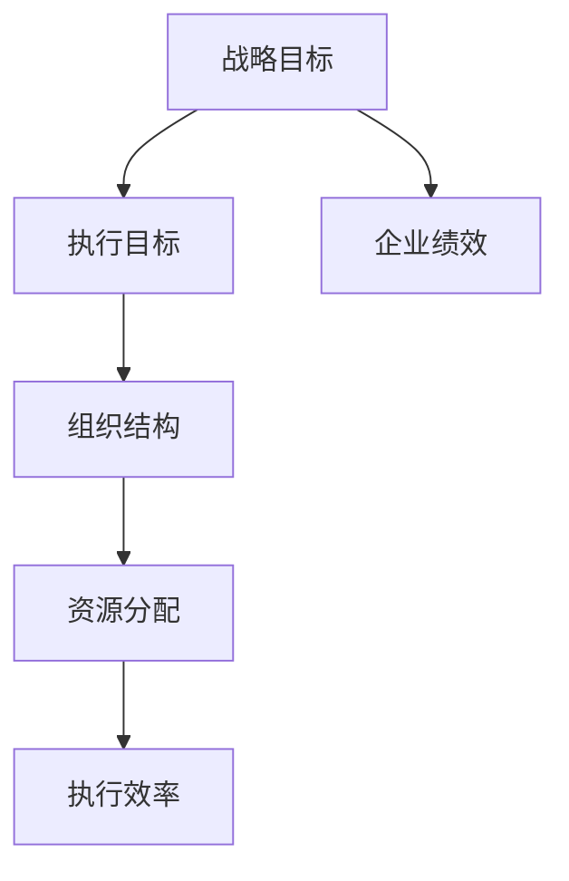
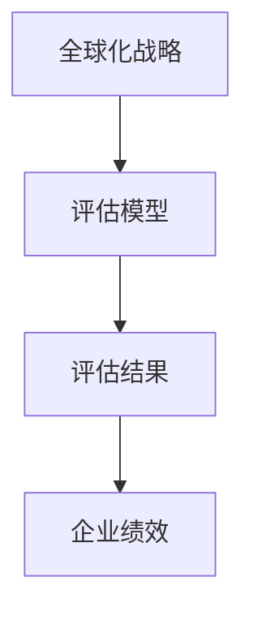

                 


# 彼得林奇对公司全球化战略执行力的评估

## 关键词：彼得林奇，全球化战略，执行力，战略评估，投资哲学

## 摘要：本文从彼得·林奇的投资哲学出发，系统分析了全球化战略执行力的核心要素、评估模型及实现方法。通过层次分析法和决策树模型，结合实际案例，深入探讨了如何评估和优化企业的全球化战略执行力。

---

# 第一部分: 全球化战略执行力的背景与核心概念

# 第1章: 全球化战略执行力的背景介绍

## 1.1 全球化战略的背景与现状

### 1.1.1 全球化战略的定义与特点

全球化战略是指企业在全球范围内配置资源、拓展市场和优化运营的策略。其特点包括：

- **跨国性**：涉及多个国家和地区的市场。
- **复杂性**：需要考虑文化、法律和经济差异。
- **协同性**：资源整合和协同效应是关键。

### 1.1.2 当前全球化战略的核心问题

- **市场风险**：全球经济波动对企业的影响。
- **资源配置**：如何在全球范围内优化资源配置。
- **文化差异**：不同地区的文化对企业运营的影响。

### 1.1.3 彼得林奇视角下的全球化战略评估

彼得·林奇认为，全球化战略的成功不仅取决于战略本身，还取决于执行力。他强调以下几点：

- **战略的可执行性**：战略必须能够在实际操作中落地。
- **管理层的承诺**：高层管理者必须全力支持全球化战略。
- **风险控制**：全球化带来的风险必须可控。

## 1.2 全球化战略执行力的定义与内涵

### 1.2.1 全球化战略执行力的定义

全球化战略执行力是指企业在实现全球化战略目标过程中，将战略转化为具体行动的能力。它包括组织结构、资源配置、风险管理等多个方面。

### 1.2.2 执行力的核心要素

- **战略目标**：明确的全球化目标。
- **组织结构**：高效的组织架构。
- **资源分配**：合理的资源分配。
- **风险管理**：有效的风险控制。

### 1.2.3 全球化战略与执行力的辩证关系

全球化战略是目标，执行力是实现目标的手段。两者的结合决定了全球化战略的最终成败。

## 1.3 全球化战略执行力的核心要素

### 1.3.1 战略目标的明确性

- 战略目标必须清晰，否则难以执行。
- 目标应具体、可衡量、可实现。

### 1.3.2 组织结构的合理性

- 组织结构应支持全球化战略的实施。
- 需要跨部门协作和高效的沟通机制。

### 1.3.3 资源分配的效率性

- 资源分配应与战略目标一致。
- 需要动态调整资源以适应变化。

### 1.3.4 风险管理的有效性

- 风险管理是全球化战略执行中的关键环节。
- 需要建立完善的风控体系。

## 1.4 全球化战略执行力与企业绩效的关系

### 1.4.1 执行力对企业绩效的影响

- 高效的执行力能够提升企业的市场竞争力。
- 执行力差可能导致战略目标无法实现，影响企业绩效。

### 1.4.2 彼得林奇的评估标准

彼得·林奇认为，评估全球化战略执行力的关键指标包括：

- **战略目标的实现程度**。
- **组织结构的灵活性**。
- **资源分配的合理性**。
- **风险管理的有效性**。

### 1.4.3 全球化战略执行中的关键成功因素

- **领导力**：高层领导的承诺和指导。
- **组织文化**：支持全球化战略的文化氛围。
- **员工能力**：员工的全球化视野和能力。

## 1.5 本章小结

全球化战略执行力是实现企业全球化目标的关键因素。本章从背景、定义、核心要素等方面进行了详细分析，并提出了彼得·林奇的评估标准。

---

# 第二部分: 全球化战略执行力的核心概念与联系

# 第2章: 全球化战略执行力的核心概念

## 2.1 全球化战略执行力的理论基础

### 2.1.1 战略管理理论

- 企业战略管理理论为全球化战略提供了理论支持。
- 强调战略的制定和执行是企业成功的关键。

### 2.1.2 执行力理论

- 执行力理论强调将战略转化为具体行动的能力。
- 强调组织结构、资源配置和风险管理的重要性。

### 2.1.3 彼得林奇的投资哲学

- 彼得林奇的投资哲学强调基本面分析和长期投资。
- 他认为，企业的全球化战略执行力是投资决策的重要依据。

## 2.2 核心概念的属性特征对比

### 2.2.1 战略目标与执行目标的对比

| 战略目标       | 执行目标       |
|----------------|----------------|
| 长期目标       | 短期目标       |
| 战略层面       | 操作层面       |
| 战略规划       | 任务分解       |
| 需要资源支持   | 需要具体操作   |

### 2.2.2 组织结构与执行结构的对比

| 组织结构       | 执行结构       |
|----------------|----------------|
| 管理层级       | 执行层级       |
| 战略规划       | 操作规划       |
| 资源分配       | 资源使用       |
| 风险管理       | 风险控制       |

### 2.2.3 资源分配与执行效率的对比

| 资源分配       | 执行效率       |
|----------------|----------------|
| 资源分配的合理性 | 执行过程的效率性 |
| 资源分配的公平性 | 执行结果的可测性 |
| 资源分配的动态性 | 执行过程的可控性 |

## 2.3 全球化战略执行力的ER实体关系图



---

# 第三部分: 全球化战略执行力的评估模型与算法

# 第3章: 全球化战略执行力的评估模型

## 3.1 评估模型的原理与方法

### 3.1.1 层次分析法（AHP）的应用

层次分析法是一种定性和定量相结合的决策分析方法。其步骤如下：

1. 构建层次结构。
2. 确定各层次的权重。
3. 计算综合得分。

### 3.1.2 决策树模型的构建

决策树是一种用于分类和预测的树状结构。其步骤如下：

1. 收集数据。
2. 确定决策节点。
3. 构建决策树。
4. 剪枝优化。

### 3.1.3 彼得林奇评估法的核心步骤

1. **明确评估目标**：确定评估的核心要素。
2. **收集数据**：收集与全球化战略执行相关的数据。
3. **分析数据**：分析数据，找出关键问题。
4. **制定改进措施**：根据分析结果，制定改进措施。

## 3.2 评估模型的数学公式

### 3.2.1 层次分析法的权重计算公式

层次分析法的权重计算公式如下：

$$ A = \frac{\lambda_{\text{max}} - n}{n(n-1)} \cdot \text{CI} $$

其中：
- $\lambda_{\text{max}}$：最大特征值。
- $n$：比较矩阵的阶数。
- $\text{CI}$：一致性指标。

### 3.2.2 综合得分公式

综合得分公式如下：

$$ S = \sum_{i=1}^{n} w_i \cdot x_i $$

其中：
- $w_i$：第$i$个因素的权重。
- $x_i$：第$i$个因素的得分。

## 3.3 评估模型的实现代码

### 3.3.1 层次分析法的实现

```python
import numpy as np

def calculate_weight(matrix):
    n = len(matrix)
    eigenvectors = np.linalg.eig(matrix)
    weights = eigenvectors[1] / np.sum(eigenvectors[1])
    return weights

matrix = [
    [1, 3, 2],
    [1/3, 1, 1/2],
    [1/2, 2, 1]
]
weights = calculate_weight(matrix)
print("权重向量为:", weights)
```

### 3.3.2 决策树模型的实现

```python
from sklearn.tree import DecisionTreeClassifier

# 假设我们有一个分类问题
X = [[2, 3],
     [5, 5],
     [3, 4],
     [8, 9],
     [2, 2]]
y = [0, 0, 1, 1, 0]

# 训练决策树模型
model = DecisionTreeClassifier()
model.fit(X, y)

# 预测新样本
new_sample = [[4, 5]]
print("预测结果为:", model.predict(new_sample))
```

## 3.4 评估模型的实现流程

### 3.4.1 层次分析法的实现流程

1. 构建比较矩阵。
2. 计算特征值和特征向量。
3. 计算一致性指标。
4. 确定权重向量。
5. 计算综合得分。

### 3.4.2 决策树模型的实现流程

1. 收集数据。
2. 确定决策节点。
3. 构建决策树。
4. 剪枝优化。
5. 预测结果。

---

# 第四部分: 全球化战略执行力的系统分析与架构设计

# 第4章: 全球化战略执行力的系统分析与架构设计

## 4.1 系统分析

### 4.1.1 问题场景介绍

在全球化战略执行过程中，企业可能面临以下问题：

- **市场风险**：全球经济波动对企业的影响。
- **资源配置**：如何在全球范围内优化资源配置。
- **文化差异**：不同地区的文化对企业运营的影响。

### 4.1.2 项目介绍

本项目旨在通过系统分析和架构设计，优化企业的全球化战略执行力。

## 4.2 系统架构设计

### 4.2.1 系统功能设计

#### 4.2.1.1 领域模型


### 4.2.2 系统架构设计



### 4.2.3 系统接口设计

- 输入接口：全球化战略目标、组织结构、资源配置、风险管理。
- 输出接口：评估结果、企业绩效。

### 4.2.4 系统交互设计

```mermaid
sequenceDiagram
    actor 用户
    system 全球化战略评估系统
    用户 -> 全球化战略评估系统: 提交全球化战略目标
    全球化战略评估系统 -> 用户: 返回评估结果
```

---

# 第五部分: 全球化战略执行力的项目实战

# 第5章: 全球化战略执行力的项目实战

## 5.1 项目环境安装

### 5.1.1 安装Python和相关库

```bash
pip install numpy scikit-learn
```

## 5.2 系统核心实现

### 5.2.1 实现代码

```python
import numpy as np
from sklearn.tree import DecisionTreeClassifier

def calculate_weight(matrix):
    n = len(matrix)
    eigenvectors = np.linalg.eig(matrix)
    weights = eigenvectors[1] / np.sum(eigenvectors[1])
    return weights

matrix = [
    [1, 3, 2],
    [1/3, 1, 1/2],
    [1/2, 2, 1]
]

weights = calculate_weight(matrix)
print("权重向量为:", weights)

# 决策树模型实现
X = [[2, 3], [5, 5], [3, 4], [8, 9], [2, 2]]
y = [0, 0, 1, 1, 0]

model = DecisionTreeClassifier()
model.fit(X, y)

new_sample = [[4, 5]]
print("预测结果为:", model.predict(new_sample))
```

### 5.2.2 代码应用解读与分析

- **权重计算**：层次分析法用于计算各因素的权重。
- **决策树模型**：用于分类和预测。

## 5.3 实际案例分析

### 5.3.1 案例背景

假设某跨国公司在全球范围内实施全球化战略，需要评估其执行力。

### 5.3.2 数据收集与分析

收集数据，构建比较矩阵，计算权重，构建决策树模型，进行预测。

## 5.4 项目小结

通过本项目，我们可以看到，全球化战略执行力的评估需要结合理论和实践，利用层次分析法和决策树模型进行综合分析。

---

# 第六部分: 全球化战略执行力的最佳实践

# 第6章: 全球化战略执行力的最佳实践

## 6.1 小结

全球化战略执行力是企业全球化成功的关键因素。本章从理论、方法、系统设计和项目实战等方面进行了详细分析。

## 6.2 注意事项

- **数据质量**：数据的准确性和完整性。
- **模型选择**：根据实际情况选择合适的模型。
- **风险管理**：全球化战略执行中的风险管理至关重要。

## 6.3 拓展阅读

- 《彼得·林奇的投资哲学》
- 《全球化战略管理》
- 《决策树模型的应用》

---

# 结语

全球化战略执行力是企业在全球化竞争中取得成功的关键。通过彼得·林奇的投资哲学和系统的评估方法，我们可以更好地评估和优化企业的全球化战略执行力。希望本文能够为企业的全球化战略执行提供有价值的参考和指导。

