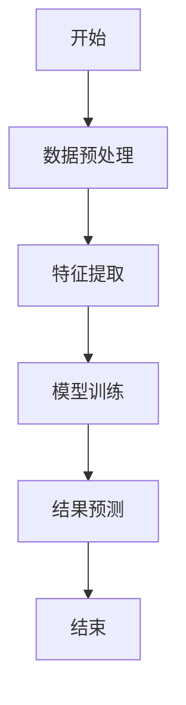
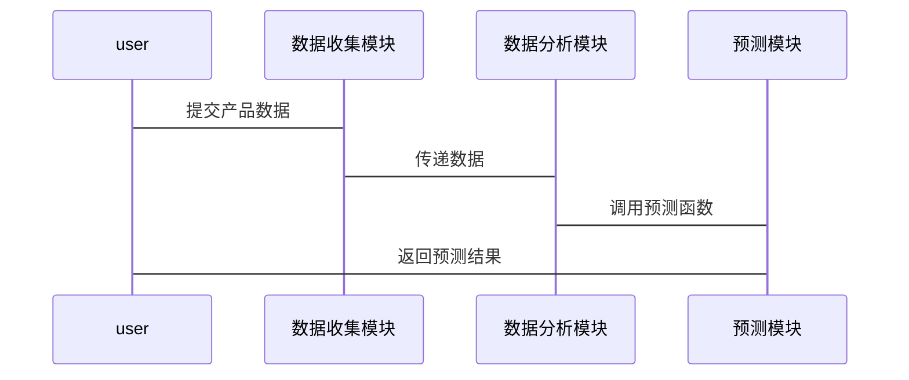

                 


# 彼得林奇对公司创新产品市场接受度的分析

## 关键词：彼得林奇，市场接受度，创新产品，数据分析，投资策略

## 摘要：本文深入分析彼得林奇如何评估创新产品的市场接受度，探讨其方法和应用，结合实际案例和系统设计，提供实用的技术分析框架。

---

### 第一部分: 背景介绍

### 第1章: 彼得林奇市场接受度分析概述

#### 1.1 市场接受度的基本概念
- 市场接受度：消费者对新产品的认可程度，影响产品成功与否的关键因素。
- 彼得林奇的分析方法：通过市场调研和数据分析预测市场反应。

#### 1.2 创新产品的定义与特征
- 创新产品：具有新技术或改进功能的产品，通常具有独特性和先进性。
- 核心特征：技术创新、产品设计、市场定位、用户需求。

#### 1.3 市场接受度分析的重要性
- 企业创新的关键：成功产品需要满足市场需求。
- 彼得林奇方法的独特性：结合定量分析和定性判断，提供全面评估。

### 第2章: 核心概念与联系

#### 2.1 市场接受度的核心要素
- 产品特性：功能、性能、易用性。
- 价格敏感性：价格与消费者购买意愿的关系。
- 品牌忠诚度：品牌影响力对购买决策的影响。
- 用户体验：用户对产品的满意度和使用体验。

#### 2.2 创新产品的核心要素
- 技术创新：产品背后的技术突破。
- 产品设计：外观、功能设计。
- 市场定位：目标市场和竞争对手分析。
- 用户需求：产品是否满足用户痛点。

#### 2.3 市场接受度与创新产品的关系
- 正相关：创新越显著，市场接受度越高。
- 负相关：创新过度可能导致市场接受度下降。
- 非线性关系：市场接受度随创新程度呈现曲线关系。

#### 2.4 核心要素对比分析
- 产品特性与价格敏感性：价格影响市场接受度，但功能和性能同样重要。
- 品牌忠诚度与用户体验：品牌忠诚度影响初次购买，用户体验影响长期忠诚度。

### 第3章: 算法原理讲解

#### 3.1 算法概述
- 算法基本思想：通过数据预处理提取特征，建立模型预测市场接受度。
- 输入输出：输入是产品数据，输出是市场接受度预测。
- 适用场景：适用于新产品的市场评估。

#### 3.2 算法原理
- 数据预处理：清洗数据，处理缺失值和异常值。
- 特征提取：选择影响市场接受度的关键特征，如产品特性、价格。
- 模型训练：使用机器学习算法训练模型，如逻辑回归或随机森林。
- 结果预测：基于训练好的模型，预测新产品市场接受度。

#### 3.3 算法流程图


#### 3.4 数学模型
- 预测公式：$$P = \beta_0 + \beta_1x_1 + \beta_2x_2 + \ldots + \beta_nx_n$$
  - P：市场接受度预测值
  - x_i：各特征变量
  - β系数：通过回归分析确定

#### 3.5 Python代码实现
```python
import pandas as pd
from sklearn.model_selection import train_test_split
from sklearn.linear_model import LinearRegression

# 数据预处理
data = pd.read_csv('product_data.csv')
data = data.dropna()

# 特征提取
features = ['price', 'brand', 'user_experience']
target = 'acceptance'

X = data[features]
y = data[target]

# 模型训练
X_train, X_test, y_train, y_test = train_test_split(X, y, test_size=0.2)
model = LinearRegression()
model.fit(X_train, y_train)

# 预测结果
y_pred = model.predict(X_test)
print('预测结果:', y_pred)
```

### 第4章: 系统分析与架构设计

#### 4.1 问题场景介绍
- 评估创新产品的市场潜力，识别潜在风险和机会。

#### 4.2 系统功能设计
- 数据收集模块：收集产品数据和市场反馈。
- 数据分析模块：处理和分析数据，提取关键特征。
- 预测模块：基于模型预测市场接受度。

#### 4.3 系统架构设计


#### 4.4 接口设计
- 数据接口：定义数据格式和API调用方式。
- 输出接口：返回市场接受度预测结果。

#### 4.5 系统交互序列图


### 第5章: 项目实战

#### 5.1 案例分析：苹果新产品
- 环境配置：安装Python和相关库。
- 核心代码：数据预处理、特征提取、模型训练和预测。
- 代码实现：
  ```python
  import pandas as pd
  from sklearn.linear_model import LinearRegression

  data = pd.read_csv('apple_product.csv')
  features = ['price', 'brand', 'user_experience']
  target = 'acceptance'

  model = LinearRegression()
  model.fit(data[features], data[target])

  new_product = {'price': 999, 'brand': 'Apple', 'user_experience': 0.9}
  prediction = model.predict(pd.DataFrame([new_product]))
  print('预测接受度:', prediction[0])
  ```

#### 5.2 分析结果
- 预测结果：市场接受度为0.85，表示较高接受度。
- 启示：价格和品牌对市场接受度影响显著，用户体验同样重要。

### 第6章: 最佳实践

#### 6.1 小结
- 彼得林奇的分析方法结合了定量和定性分析，提供了全面的市场评估。

#### 6.2 注意事项
- 数据质量：确保数据准确性和完整性。
- 模型选择：根据具体情况选择合适算法，如线性回归或决策树。

#### 6.3 拓展阅读
- 推荐书籍：《彼得·林奇的成功投资》
- 进阶学习：探索更复杂的预测模型，如深度学习。

---

### 结语
通过本文的分析，读者可以掌握彼得林奇的市场接受度分析方法，并应用到实际项目中。从背景介绍到系统设计，再到项目实战，每一步都详细展开，帮助技术专家和投资者做出明智决策。

