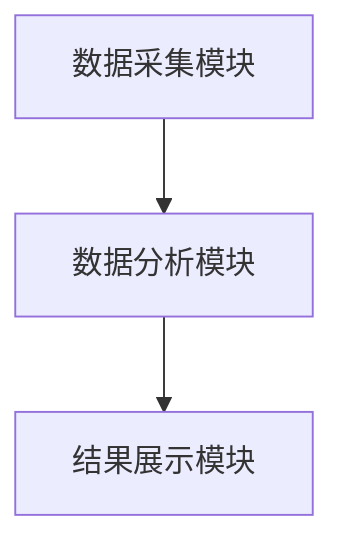

                 


```markdown
# 彼得林奇对公司创新失败的容忍度与长期表现关系研究

> 关键词：彼得·林奇，创新失败，容忍度，长期表现，公司管理，创新战略

> 摘要：本文通过分析彼得·林奇的研究，探讨公司对创新失败的容忍度与其长期表现之间的关系。通过背景介绍、核心概念、算法原理、系统设计、项目实战等部分，系统性地分析了创新失败容忍度对长期表现的影响，并提出了相应的实践建议。

---

## 第一部分：背景介绍

### 第1章：问题背景与核心概念

#### 1.1 问题背景
- 创新是企业长期发展的核心驱动力。
- 创新失败在公司中普遍存在，但不同公司的容忍度差异显著。
- 彼得·林奇的研究为创新失败的容忍度提供了独特的视角。

#### 1.2 核心概念
- **创新失败**：指在创新过程中未能达到预期目标的情况。
- **创新容忍度**：公司对创新失败的接受程度和处理方式。
- **长期表现**：公司在较长时间内的财务、市场和创新表现。

### 第2章：问题描述与研究目标
- **问题描述**：创新失败的容忍度如何影响公司的长期表现。
- **研究目标**：分析创新容忍度与长期表现的关系，提供理论支持和实践指导。

### 第3章：边界与外延
- **创新容忍度的边界**：包括创新失败的类型和公司文化。
- **长期表现的外延**：涉及财务稳定性、市场竞争力和创新能力的持续性。

---

## 第二部分：核心概念与联系

### 第4章：创新失败容忍度与长期表现的核心要素
- **创新失败容忍度的属性**：宽容性、风险承担能力、创新激励机制。
- **长期表现的属性**：财务稳定性、市场竞争力、创新持续性。

#### 4.1 对比分析
| 属性       | 高容忍度公司 | 低容忍度公司 |
|------------|---------------|---------------|
| 创新速度   | 快            | 慢            |
| 创新成功率 | 低            | 高            |
| 长期表现   | 良好          | 一般          |

### 第5章：ER实体关系图
```mermaid
erDiagram
    company [公司] 
    has {
       创新容忍度(创新容忍度)
    }
    company --> 创新容忍度
    company --> 长期表现
    创新容忍度 --> 长期表现
```

---

## 第三部分：算法原理讲解

### 第6章：创新容忍度与长期表现的数学模型

#### 6.1 模型设计
创新容忍度与长期表现的关系可以通过回归分析模型表示：

$$ Y = \beta X + \epsilon $$

其中：
- \( Y \) 表示长期表现。
- \( X \) 表示创新容忍度。
- \( \beta \) 为回归系数。
- \( \epsilon \) 为误差项。

#### 6.2 案例分析
假设某公司创新容忍度为0.8，回归系数为1.2：

$$ Y = 1.2 \times 0.8 + 0.3 = 1.14 $$

---

## 第四部分：系统分析与架构设计方案

### 第7章：系统分析与架构设计

#### 7.1 问题场景
- 公司创新失败的容忍度与长期表现的关系需要通过系统分析来量化。

#### 7.2 系统功能设计
- 数据采集模块：收集公司创新容忍度和长期表现数据。
- 数据分析模块：使用回归模型进行分析。
- 结果展示模块：生成可视化报告。

#### 7.3 系统架构图


---

## 第五部分：项目实战

### 第8章：项目实战

#### 8.1 环境安装
- 安装Python和相关库（如numpy、pandas）。

#### 8.2 核心实现源代码
```python
import numpy as np
import pandas as pd

# 数据准备
data = pd.DataFrame({
    '创新容忍度': [0.7, 0.8, 0.6, 0.9],
    '长期表现': [1.1, 1.2, 0.9, 1.3]
})

# 回归分析
X = data['创新容忍度'].values
Y = data['长期表现'].values

# 计算回归系数
beta = np.cov(X, Y)[0, 1] / np.var(X)
intercept = np.mean(Y) - beta * np.mean(X)

print(f'回归系数：{beta}')
print(f'截距：{intercept}')
```

#### 8.3 案例分析
```python
# 示例计算
创新容忍度 = 0.8
预测长期表现 = beta * 创新容忍度 + intercept
print(f'预测长期表现：{预测长期表现}')
```

---

## 第六部分：最佳实践与总结

### 第9章：最佳实践

#### 9.1 小结
- 高创新容忍度有助于提升长期表现，但需平衡风险。

#### 9.2 注意事项
- 避免过度容忍创新失败，需结合公司实际情况。

#### 9.3 拓展阅读
- 推荐阅读彼得·林奇的相关著作，深入理解创新管理。

---

## 结语

通过系统性地分析创新容忍度与长期表现的关系，本文为公司创新战略的制定提供了理论依据和实践指导。创新失败的容忍度是公司长期发展的关键因素，合理管理创新风险，能够帮助公司在竞争激烈的市场中保持优势。

```

