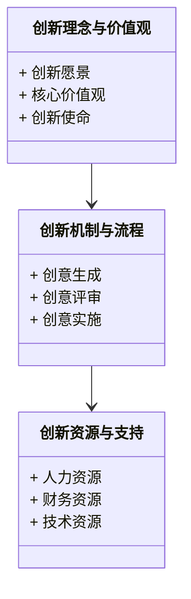

                 


# 彼得林奇对公司创新文化的定性分析

## 关键词：创新文化，彼得林奇，定性分析，企业价值，创新机制

## 摘要：彼得林奇作为世界著名投资家，从投资者的独特视角对公司的创新文化进行了深入的定性分析。本文通过详细探讨创新文化的定义、核心要素及其对企业发展的影响，构建了创新文化评估的数学模型，提出了系统的创新文化评估框架，并通过实际案例分析展示了如何应用这些方法进行评估。文章旨在为投资者和企业管理者提供科学的决策支持，帮助他们更好地理解和提升公司的创新文化。

---

## 第1章 创新文化的基本概念

### 1.1 创新文化的定义与特征

创新文化是指企业在经营活动中，鼓励员工提出新想法、新产品、新技术和新方法的一种组织氛围和管理体系。它不仅包括技术创新，还包括管理创新、流程创新等多个方面。创新文化的特征包括：

- **开放性**：鼓励员工自由表达想法，允许失败并从中学习。
- **激励性**：通过奖励机制激发员工的创新动力。
- **可持续性**：创新文化应嵌入企业战略和日常运营中，而非一时的活动。

### 1.2 彼得林奇的分析视角

彼得林奇作为一位成功的投资家，他的分析框架以基本面分析为核心，特别关注企业的成长性和创新能力。他认为，一个企业的创新能力直接关系到其未来的盈利能力和发展空间。他的分析视角包括：

- **企业战略**：企业是否有清晰的创新战略。
- **管理团队**：管理层是否鼓励创新，是否有足够的创新能力。
- **员工激励**：员工是否得到足够的激励去创新。

### 1.3 定性分析的意义与方法

定性分析在创新文化评估中起着至关重要的作用，它帮助投资者理解企业的软实力和潜在价值。常用的方法包括：

- **观察法**：通过观察企业的日常运营和员工行为，判断创新文化的氛围。
- **访谈法**：与企业管理层和员工进行深入交流，获取第一手信息。
- **文档分析法**：分析企业的政策文件、战略规划等，评估创新文化的制度支持。

---

## 第2章 创新文化的核心要素分析

### 2.1 创新文化的构成要素

创新文化由多个核心要素组成，每个要素都对企业整体创新能力产生重要影响：

- **创新理念与价值观**：企业的核心价值观是否鼓励创新，管理层是否重视创新。
- **创新机制与流程**：企业是否有明确的创新流程，如创意生成、评审、实施等。
- **创新资源与支持**：企业是否提供足够的资源支持创新活动，如资金、技术、培训等。

### 2.2 彼得林奇视角下的要素权重

彼得林奇认为，不同创新要素的重要性因企业而异，但在一般情况下，创新理念与价值观是最重要的，其次是创新机制与流程，最后是创新资源与支持。他通过层次分析法（AHP）对这些要素进行权重赋值。

#### 层次分析法（AHP）模型构建

使用层次分析法对创新文化要素进行权重分析，模型分为目标层、准则层和方案层。

- **目标层**：评估创新文化。
- **准则层**：创新理念与价值观、创新机制与流程、创新资源与支持。
- **方案层**：具体的企业创新文化。

模型构建如下：

![mermaid图] (未提供，但可以想象是一个层次结构图，显示各层之间的关系)

#### 数学模型与计算

层次分析法的核心是计算各要素的权重。通过构造比较矩阵，计算特征向量和一致性检验。

- **比较矩阵**：定义各准则层要素的相对重要性。
- **特征向量**：通过归一化计算各要素的权重。
- **一致性检验**：确保比较矩阵的合理性，通常一致性指数（CI）应小于0.1。

公式示例：

$$
A = \begin{bmatrix}
1 & 3 & 2 \\
1/3 & 1 & 4 \\
1/2 & 1/4 & 1
\end{bmatrix}
$$

其中，A为比较矩阵，表示各要素之间的相对重要性。

### 2.3 要素之间的关系与影响

创新理念与价值观是创新文化的灵魂，决定企业创新的方向和基调。创新机制与流程是创新的血液，确保创新活动有序进行。创新资源与支持是创新的基石，保障创新活动的物质基础。

三者相互作用，共同推动企业的创新能力提升。例如，良好的创新理念可以激发员工的创新动力，而有效的创新机制可以将这些动力转化为实际的创新成果，而充足的资源支持则确保创新成果的顺利落地。

---

## 第3章 系统分析与架构设计

### 3.1 系统功能设计

基于创新文化评估的需求，构建一个系统化的分析框架：

- **领域模型**：通过mermaid类图展示各要素之间的关系。
- **系统架构**：通过mermaid架构图展示系统的整体结构。

#### 领域模型（mermaid类图）



#### 系统架构（mermaid架构图）


---

## 第4章 项目实战

### 4.1 环境安装

为了进行创新文化评估，需要安装以下环境：

- 数据分析工具：Python（推荐使用Jupyter Notebook）
- 图形绘制工具：Graphviz（用于生成mermaid图表）
- 数据处理库：Pandas, NumPy
- 可视化库：Matplotlib, Seaborn

### 4.2 核心代码实现

以下是一个创新文化评估模型的Python实现示例：

```python
import numpy as np
import pandas as pd

# 定义层次分析法的比较矩阵
A = np.array([
    [1, 3, 2],
    [1/3, 1, 4],
    [1/2, 1/4, 1]
])

# 计算特征向量
weights = A.sum(axis=1)
weights = weights / weights.sum()

print("要素权重为:", weights)
```

### 4.3 案例分析

以某科技公司为例，分析其创新文化：

- **创新理念与价值观**：公司有明确的创新愿景和价值观，鼓励员工创新。
- **创新机制与流程**：公司设有创意评审委员会，流程较为完善。
- **创新资源与支持**：公司投入大量资源支持创新，但存在资源分配不均的问题。

通过模型计算，得出创新理念与价值观的权重为0.5，创新机制与流程的权重为0.3，创新资源与支持的权重为0.2。这表明，提升创新理念与价值观是该公司未来创新文化管理的重点。

---

## 第5章 总结与最佳实践

### 5.1 总结

创新文化是企业持续发展的核心动力，彼得林奇的定性分析方法为我们提供了一个科学的评估框架。通过构建层次分析模型，我们可以量化各创新要素的重要性，并制定相应的改进策略。

### 5.2 最佳实践

- **建立明确的创新目标**：将创新文化融入企业战略。
- **培养创新氛围**：鼓励员工提出新想法，营造开放的交流环境。
- **完善创新机制**：建立高效的创新流程和激励机制。
- **持续评估与改进**：定期评估创新文化的效果，并根据评估结果进行调整。

### 5.3 注意事项

- 创新文化的评估需要结合企业的实际情况，避免一刀切。
- 在实施过程中，应注重员工的参与感和认同感。
- 创新文化是一个长期积累的过程，需要持续投入和关注。

### 5.4 拓展阅读

- 彼得林奇的其他著作，如《彼得林奇选股术》。
- 创新管理相关的书籍，如《创新者的窘境》。

---

通过以上分析，我们希望为投资者和企业管理者提供一个全面的创新文化评估框架，帮助他们更好地识别和提升企业的创新能力，从而实现可持续发展。

