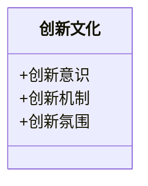

                 


# 彼得林奇对公司创新文化的看法

## 关键词：彼得林奇、创新文化、企业文化、管理理念、创新管理

## 摘要：本文探讨彼得林奇如何从投资角度看待公司创新文化，分析创新文化的核心要素、创新与企业绩效的关系，以及如何在企业中培养创新文化。结合实际案例，本文为管理者提供实用的建议。

---

## 第1章：创新文化的背景介绍

### 1.1 创新文化的定义与重要性

#### 1.1.1 创新文化的内涵
创新文化是一种鼓励员工创新、适应变化、勇于尝试的企业文化。它强调开放性、协作性和创造性，是企业持续发展的关键。

#### 1.1.2 创新文化的核心要素
- **创新意识**：员工主动发现问题并寻求解决方案。
- **创新机制**：企业建立的鼓励创新的制度和流程。
- **创新氛围**：企业营造的包容失败、鼓励尝试的文化氛围。

#### 1.1.3 创新与企业绩效的关系
创新是企业保持竞争力的关键，能带来新产品、服务和流程优化，进而提升绩效。

---

## 第2章：彼得林奇的创新理念

### 2.1 彼得林奇的创新观

#### 2.1.1 彼得林奇对创新的定义
彼得林奇认为，创新是企业在市场中保持竞争优势的核心，不仅是产品，还包括管理和战略。

#### 2.1.2 创新文化的核心观点
彼得林奇强调，创新文化应鼓励员工在安全的环境中尝试新想法，容忍失败，同时建立明确的目标和激励机制。

---

## 第3章：创新文化的核心概念与联系

### 3.1 创新文化的核心要素分析

#### 3.1.1 创新意识
员工应具备主动识别问题和提出解决方案的能力，是创新的起点。

#### 3.1.2 创新机制
企业需建立创新流程，包括提案、评估、实施和反馈机制，确保创新落地。

#### 3.1.3 创新氛围
企业应营造支持创新的环境，鼓励员工提出新想法，降低失败的顾虑。

---

## 第4章：创新文化的核心原理

### 4.1 创新文化的驱动因素

#### 4.1.1 领导层支持
领导层的重视和投入是创新文化成功的关键。

#### 4.1.2 员工激励
有效的激励机制能激发员工的创新热情。

#### 4.1.3 资源支持
企业需提供必要的资源，如资金、时间和培训，支持创新项目。

---

## 第5章：创新文化的实现机制

### 5.1 创新文化的核心要素对企业的具体影响

#### 5.1.1 创新意识的影响
提升员工的问题解决能力，促进企业内部优化。

#### 5.1.2 创新机制的作用
确保创新项目的有效实施和推广，避免资源浪费。

#### 5.1.3 创新氛围的效果
营造开放的文化，增强员工归属感和创造力。

---

## 第6章：创新文化的核心概念属性特征对比

### 6.1 创新文化与传统管理的对比

#### 6.1.1 创新文化与传统管理的异同点
- **相同点**：都需要明确的目标和高效的执行。
- **不同点**：创新文化强调灵活性和员工参与，传统管理更注重层级和控制。

---

## 第7章：创新文化与企业绩效的对比

### 7.1 创新文化对企业绩效的影响

#### 7.1.1 创新文化促进企业绩效提升的具体路径
- 提升产品和服务质量。
- 增强市场竞争力。
- 优化运营效率。

---

## 第8章：创新文化的ER实体关系图

### 8.1 创新文化的核心实体

#### 8.1.1 创新文化的主要实体分析
- 创新意识、创新机制、创新氛围。

#### 8.1.2 实体之间的关系
- 创新意识驱动创新机制，创新机制支持创新氛围的形成。

---

## 第9章：创新文化的算法原理讲解

### 9.1 算法原理的数学模型和公式

#### 9.1.1 创新文化对企业绩效的线性回归模型
$$绩效 = \beta_0 + \beta_1 \times 创新文化 + \epsilon$$

---

## 第10章：系统分析与架构设计方案

### 10.1 创新文化在企业中的应用场景

#### 10.1.1 系统功能设计（领域模型）


---

## 第11章：项目实战

### 11.1 环境安装与核心实现源代码

#### 11.1.1 环境安装
安装必要的数据分析工具和编程语言。

#### 11.1.2 核心实现源代码
```python
import pandas as pd
import numpy as np

# 假设data是一个包含创新文化和绩效数据的数据框
data = pd.DataFrame({
    '创新文化': [85, 90, 78, 82],
    '绩效': [90, 85, 75, 80]
})

# 使用线性回归模型进行分析
from sklearn.linear_model import LinearRegression
model = LinearRegression()
model.fit(data[['创新文化']], data['绩效'])
print('回归系数:', model.coef_)
print('回归截距:', model.intercept_)
```

---

## 第12章：总结与建议

### 12.1 总结
彼得林奇的创新理念强调领导层的支持、员工的激励和创新机制的建立，是企业成功的关键。

### 12.2 最佳实践 tips
- 领导层应积极支持创新。
- 建立明确的创新目标和激励机制。
- 营造开放、包容的企业文化。

---

## 第13章：拓展阅读

- 彼得林奇的其他管理理念。
- 创新文化的经典书籍推荐。

---

通过以上章节的详细分析，我们可以全面理解彼得林奇对创新文化的看法，并将其应用于实际的企业管理中，以促进企业的持续发展。

