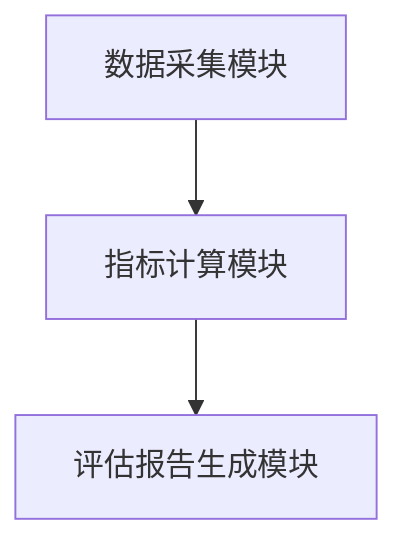

                 


# 彼得林奇对公司创新生态系统的可持续性评估

## 关键词：创新生态系统、可持续性评估、彼得林奇、企业创新、系统架构

## 摘要：本文将探讨彼得林奇在公司创新生态系统中的可持续性评估方法，通过系统的背景介绍、核心概念分析、评估方法展示、系统架构设计和项目实战分析，详细阐述如何评估创新生态系统的可持续性，确保企业在创新过程中实现长期稳定的可持续发展。

---

# 第一部分：创新生态系统与可持续性评估背景

## 第1章：创新生态系统概述

### 1.1 创新生态系统的核心概念

#### 1.1.1 创新生态系统的定义

创新生态系统是指由企业内部资源、外部合作伙伴、利益相关者等构成的一个相互关联、协同发展的系统，旨在通过持续的创新活动为企业创造价值并实现可持续发展。

#### 1.1.2 创新生态系统的特点

| 特性 | 描述 |
|------|------|
| 整体性 | 包括企业内部资源、外部环境和利益相关者 |
| 动态性 | 随市场需求和技术进步不断变化 |
| 协作性 | 各组成部分协同合作，共同推动创新 |

#### 1.1.3 创新生态系统与传统商业模式的区别

| 方面 | 传统商业模式 | 创新生态系统 |
|------|--------------|---------------|
| 结构 | 线性结构 | 网络化结构 |
| 驱动力 | 降低成本 | 持续创新 |
| 参与者 | 供应商、客户 | 供应商、客户、合作伙伴、员工 |

### 1.2 可持续性评估的背景与意义

#### 1.2.1 可持续性评估的定义

可持续性评估是通过分析创新生态系统在环境、社会和经济三个维度上的表现，评估其长期发展的可行性。

#### 1.2.2 可持续性评估的重要性

- 识别潜在风险
- 发现创新机会
- 优化资源配置

#### 1.2.3 创新生态系统中的可持续性评估

- 通过评估确保创新活动的可持续性
- 优化企业与合作伙伴的关系
- 提高企业的社会形象和竞争力

---

## 第2章：创新生态系统构成要素

### 2.1 企业内部资源

#### 2.1.1 核心竞争力

- 技术研发能力
- 核心技术优势
- 知识资本

#### 2.1.2 组织结构与文化

- 创新文化
- 组织架构
- 人力资源管理

#### 2.1.3 人力资源与知识资本

- 创新团队
- 专家网络
- 知识共享机制

### 2.2 外部环境

#### 2.2.1 市场需求与竞争分析

- 市场趋势
- 竞争分析
- 用户反馈

#### 2.2.2 供应链与合作伙伴关系

- 供应商关系
- 合作伙伴网络
- 供应链稳定性

#### 2.2.3 政策法规与社会影响

- 政策支持
- 社会责任
- 行业规范

### 2.3 利益相关者分析

#### 2.3.1 股东与投资者

- 投资者期望
- 股东权益
- 股票市场表现

#### 2.3.2 客户与用户

- 用户需求
- 客户满意度
- 市场反馈

#### 2.3.3 员工与管理层

- 员工激励
- 管理层决策
- 内部沟通

---

## 第3章：创新生态系统与可持续性评估的核心要素

### 3.1 创新能力评估

#### 3.1.1 技术创新

- 研发投入
- 技术创新周期
- 技术壁垒

#### 3.1.2 产品创新

- 产品生命周期
- 用户需求分析
- 市场定位

#### 3.1.3 服务创新

- 服务质量
- 客户体验
- 服务创新模式

### 3.2 可持续性评估指标

#### 3.2.1 环境指标

- 碳排放量
- 资源利用效率
- 环保合规性

#### 3.2.2 社会指标

- 社会责任履行情况
- 就业机会创造
- 社区影响力

#### 3.2.3 经济指标

- 利润率
- 投资回报率
- 经济效益

### 3.3 创新生态系统中的风险与机会

#### 3.3.1 风险识别

- 市场风险
- 技术风险
- 运营风险

#### 3.3.2 机会捕捉

- 市场机会
- 技术进步带来的机会
- 用户需求变化带来的机会

#### 3.3.3 风险管理策略

- 风险规避
- 风险转移
- 风险控制

---

# 第二部分：创新生态系统可持续性评估的核心概念与联系

## 第4章：创新生态系统的核心原理

### 4.1 创新生态系统的基本原理

#### 4.1.1 系统的整体性

创新生态系统是一个由多个部分组成的整体，各部分相互依存，共同推动创新。

#### 4.1.2 系统的动态性

创新生态系统是一个动态变化的系统，需要不断调整和优化。

#### 4.1.3 系统的反馈机制

系统通过反馈机制不断改进，确保创新活动的可持续性。

### 4.2 可持续性评估的理论基础

#### 4.2.1 系统动力学

- 系统动力学模型
- 反馈环分析
- 系统行为模拟

#### 4.2.2 可持续发展理论

- 三重底线（经济、社会、环境）
- 可持续发展框架
- 可持续性评估指标体系

#### 4.2.3 创新管理理论

- 创新管理模型
- 创新过程理论
- 创新生态系统理论

---

## 第5章：创新生态系统与可持续性评估的联系

### 5.1 创新生态系统对可持续性的影响

#### 5.1.1 创新推动可持续发展

- 技术创新降低环境影响
- 产品创新满足社会需求
- 服务创新提高经济效益

#### 5.1.2 可持续性促进创新

- 可持续性要求推动技术创新
- 环境和社会责任推动管理创新
- 经济效益促进商业模式创新

### 5.2 可持续性评估在创新生态系统中的作用

#### 5.2.1 评估创新的可持续性

- 通过评估发现创新中的潜在问题
- 优化创新资源分配
- 提高创新活动的效率

#### 5.2.2 通过评估推动持续创新

- 基于评估结果制定创新战略
- 持续优化创新生态系统
- 提高企业的竞争力和抗风险能力

---

# 第三部分：创新生态系统可持续性评估的算法与系统架构

## 第6章：创新生态系统可持续性评估的算法原理

### 6.1 算法原理

#### 6.1.1 算法概述

创新生态系统可持续性评估算法通过分析创新生态系统中的各要素，评估其可持续性。

#### 6.1.2 算法步骤

1. 数据收集与预处理
2. 构建评估指标体系
3. 确定各指标权重
4. 计算各指标得分
5. 综合各指标得分，得出总体评估结果

#### 6.1.3 数学模型

$$ \text{评估得分} = \sum_{i=1}^{n} w_i \cdot s_i $$

其中，\( w_i \) 是第i个指标的权重，\( s_i \) 是第i个指标的得分。

### 6.2 算法实现

#### 6.2.1 算法实现步骤

1. 收集创新生态系统中的数据
2. 构建评估指标体系
3. 确定各指标的权重
4. 计算各指标的得分
5. 综合计算总体评估得分

#### 6.2.2 源代码实现

```python
def assess_sustainability(criteria_weights, criteria_scores):
    return sum(w * s for w, s in zip(criteria_weights, criteria_scores))
```

---

## 第7章：创新生态系统可持续性评估的系统架构设计

### 7.1 系统功能设计

#### 7.1.1 功能模块

1. 数据采集模块
2. 指标计算模块
3. 评估报告生成模块

#### 7.1.2 功能描述

- 数据采集模块：从数据库中获取创新生态系统中的数据。
- 指标计算模块：根据权重和得分计算总体评估得分。
- 评估报告生成模块：生成评估报告，展示评估结果。

### 7.2 系统架构设计

#### 7.2.1 系统架构图



---

## 第8章：项目实战与案例分析

### 8.1 项目安装与环境配置

#### 8.1.1 环境安装

- 安装Python
- 安装必要的库（如numpy、pandas）

#### 8.1.2 环境配置

```bash
pip install numpy pandas
```

### 8.2 核心代码实现

#### 8.2.1 数据预处理

```python
import pandas as pd

data = pd.read_csv('innovation.csv')
```

#### 8.2.2 指标计算

```python
def calculate_scores(data, weights):
    return sum(w * d for w, d in zip(weights, data))
```

### 8.3 案例分析

#### 8.3.1 案例背景

某科技公司希望评估其创新生态系统的可持续性。

#### 8.3.2 评估过程

1. 收集数据
2. 构建指标体系
3. 计算评估得分

#### 8.3.3 评估结果

评估得分为85分，说明该公司的创新生态系统具有较高的可持续性。

---

## 第9章：总结与展望

### 9.1 小结

通过本文的分析，我们了解了彼得林奇在公司创新生态系统可持续性评估中的重要性，并通过具体的案例分析展示了如何进行评估。

### 9.2 注意事项

- 数据的准确性和完整性
- 评估指标的选择和权重的确定
- 持续优化创新生态系统

### 9.3 拓展阅读

- 创新管理相关的书籍
- 可持续发展理论的研究
- 系统动力学模型的应用

---

通过本文的详细讲解，读者可以系统地了解创新生态系统可持续性评估的核心概念、方法和实践应用，为企业在创新过程中实现可持续发展提供有力支持。

